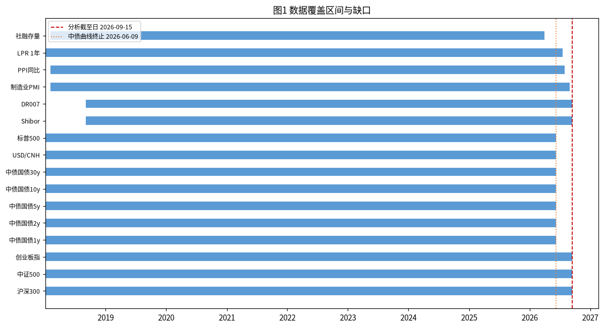
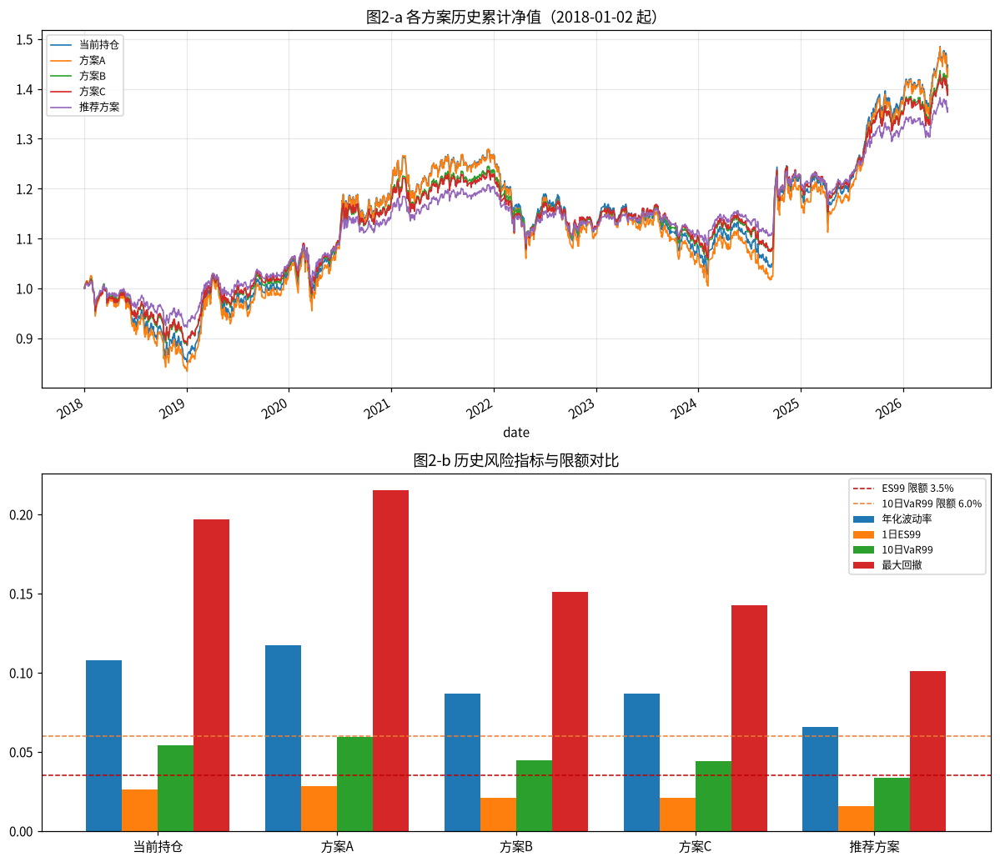
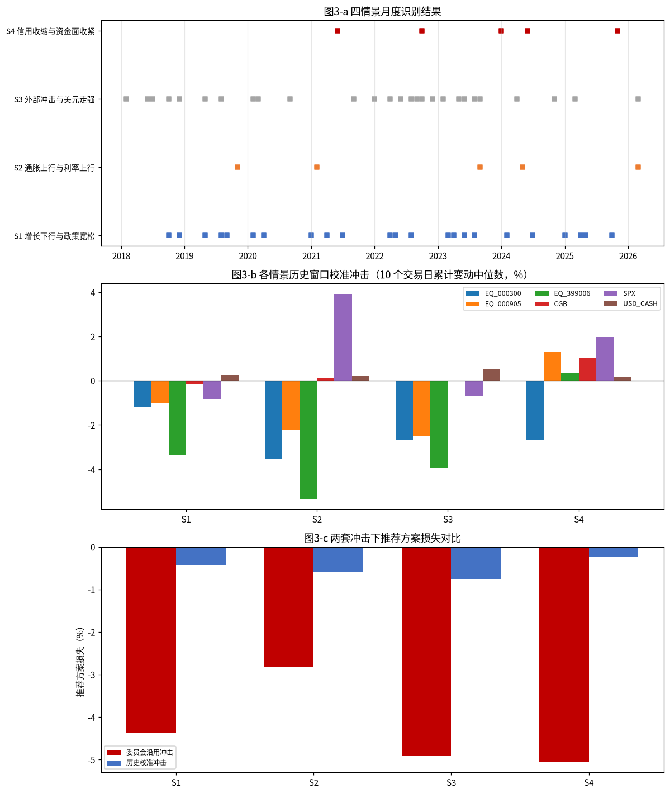
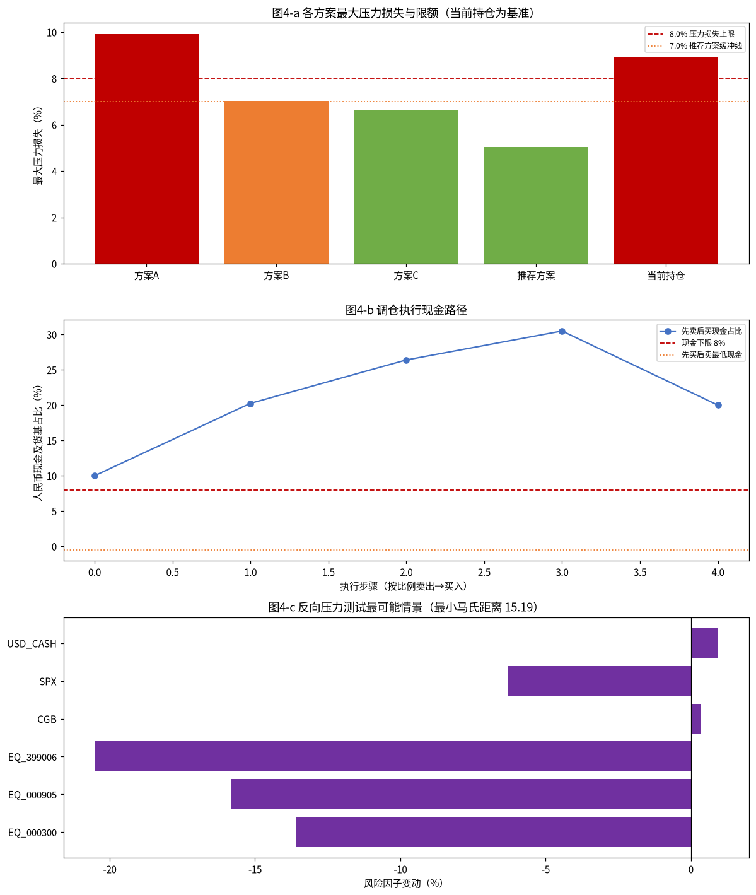
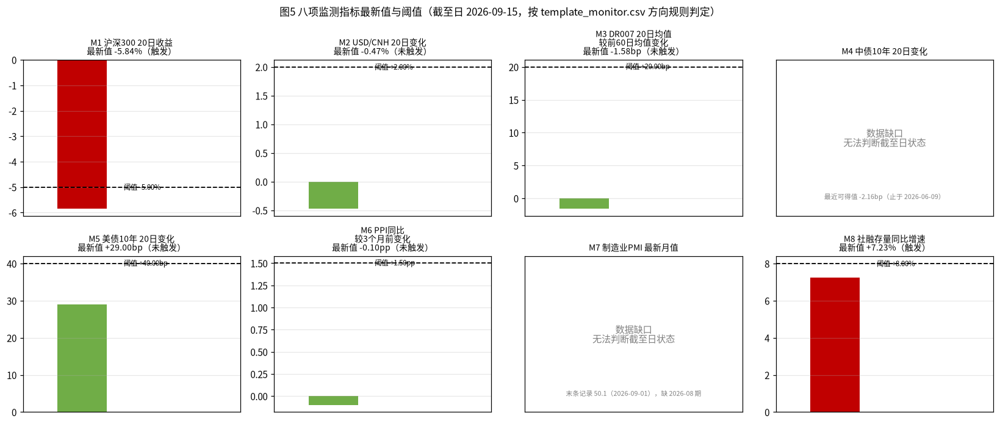

# 多资产稳健配置专户 三季度宏观压力测试与调仓建议
## 风险委员会决策备忘录

**分析截至日**：2026-09-15 | **组合净值**：10,000 万元（1 亿元） | **货币单位**：万元

### 一、结论与建议
三个候选方案均不能同时通过九项检查：**方案A** 未通过第 8 项（最大压力损失 -9.90%，超出 8.0% 上限）与第 9 项；**方案B** 仅未通过第 9 项（最大压力损失 -7.03%，超出 7.0% 缓冲线）；**方案C** 因把不对冲汇率的标普500 QDII 计入外币资产敞口（美元现金 20% + 标普500 10% = 30%），未通过第 5 项。
按构造规则得到的**推荐方案**九项全部通过：最大压力损失 -5.05%，1 日 ES99 1.57%，10 日 VaR99 3.36%，单向换手率 20.50%。**建议采用推荐方案**，并按「先卖后买」顺序执行。
监测预警方面：八个监测指标中 **M1（沪深300 20 日收益 -5.84%，低于 −5.00%）与 M8（社融存量同比增速 +7.23%，低于 8.00%）两项已触发**；M4（中债 10 年期收益率）与 M7（制造业 PMI）因数据缺口无法判断截至日状态。触发项中 M1 直接指向权益资产回撤、M8 指向信用扩张放缓，与本次调仓的减配权益方向一致，故**建议提请临时风险会议**，并在数据补齐后 1 个交易日内重新判断。

### 二、数据核验与样本区间
可用样本区间为 **2018-01-02 至 2026-06-09**，共 **2,044 个上交所交易日**；终止原因是中债国债收益率曲线的五个期限在同一天终止。该曲线距分析截至日 2026-09-15 缺少 **69 个上交所交易日**。

| 序列 | 覆盖区间 | 记录数 | 缺口/异常 |
|---|---|---|---|
| 沪深300 / 中证500 / 创业板指 | 2018-01-02 ~ 2026-09-15 | 各 2114 | 含休市日异常记录（见下） |
| 中债国债收益率曲线 1/2/5/10/30 年 | 2018-01-02 ~ 2026-06-09 | 各 2106 | 止于 2026-06-09 |
| Shibor | 2018-09-03 ~ 2026-09-15 | 2000 | 接口 has_more=true，记录数恰为 2,000 条，实际起点 2018-09-03，而数据清单把 possible_truncation 标为 false |
| DR007 | 2018-09-03 ~ 2026-09-15 | 2000 | 同时被 2,000 条上限截断 |
| 1 年期 LPR | — | 489 | 缺 2024-11, 2026-08 |
| 制造业 PMI | — | 103 | 缺 2026-08 |
| 社融存量 | — | 99 | 缺 2026-05, 2026-06, 2026-07, 2026-08（序列止于 2026-04-01） |

**休市日异常记录**：
- `000300` 在 2026-09-12（周六）存在 1 条记录：pre_close = 4510.1554，与前一交易日收盘价 4510.155 一致；成交额仅为前一交易日的 1.61%。该记录**予以剔除**。
- `000905` 在 2026-09-12（周六）存在 1 条记录：pre_close = 7580.5371，与前一交易日收盘价 7580.537 一致；成交额仅为前一交易日的 0.80%。该记录**予以剔除**。

**结构性空值**（该期限品类当期尚不存在）：此类空值的成因是“品种尚未存在”而非“数据缺失”，因此**不参与前向填充、也不置零**，直接从相应计算窗口排除；与行情缺口所采用的前向填充处理严格区分，**不得按 0 参与计算**：
- 5 年期 LPR 在 2019-08-16 及以前为空；
- 美国国债 m2 在 2018-10-16 之前为空；
- 美国国债 m4 在 2026-09-08 之前为空（该品种仅 6 条记录）。

**价格对齐口径**：所有跨市场序列（标普500、USD/CNH、美国国债、Shibor、DR007 等）在计算收益前统一按上交所估值日对齐——因各市场交易日不一致，非上交所估值日的价格按前向填充映射到估值日序列后再计算收益，不使用各市场原始日期或行号直接做差分；标普500 的人民币计收益按 (1 + 美元计变动率) × (1 + USD/CNH 变动率) − 1 **复合折算**，不使用加法近似。

**本次口径统一说明**：备忘录、`rules_scenarios.csv`、`rules_windows.csv`、评分判据与本可复算脚本采用同一套口径——情景识别中 10 年期国债收益率与 DR007 取**月均值**、其余序列取月末值（见第四章）；历史窗口起点取合格月份的**次月第一个上交所交易日**（见第四章）；监测指标按**分析截至日**取数（见第八章）。

（图1 数据覆盖区间与缺口——各序列实际覆盖区间、缺口位置与分析截至日）

### 三、当前组合风险画像
| 资产 | 类别 | 当前权重 | 金额（万元） |
|---|---|---|---|
| 沪深300指数基金 | EQ_000300 | 25.00% | 2,500.00 |
| 中证500指数基金 | EQ_000905 | 15.00% | 1,500.00 |
| 创业板指数基金 | EQ_399006 | 10.00% | 1,000.00 |
| 中长期国债组合 | CGB | 20.00% | 2,000.00 |
| 美元现金及存款 | USD_CASH | 10.00% | 1,000.00 |
| 标普500 QDII基金 | SPX | 10.00% | 1,000.00 |
| 人民币现金及货基 | CNY_CASH | 10.00% | 1,000.00 |

当前组合年化波动率 **10.77%**，1 日 VaR95 0.98%、VaR99 1.79%，1 日 ES95 1.53%、ES99 2.60%，10 日 VaR99 5.43%；
10 日最大累计损失 **-8.48%**（2020-03-06 至 2020-03-19）；最大回撤 **-19.68%**（2024-02-05 起，修复日 2025-08-13）；最差单日损失 -4.88%（2025-04-07）。

**各方案历史风险指标对比**（历史模拟法）：
| 方案 | 年化波动率 | 1日VaR95 | 1日VaR99 | 1日ES95 | 1日ES99 | 10日VaR99 | 10日最大累计损失 | 最大回撤 | 最差单日 |
|---|---|---|---|---|---|---|---|---|---|
| 当前持仓 | 10.77% | 0.98% | 1.79% | 1.53% | 2.60% | 5.43% | -8.48% | -19.68% | -4.88% |
| 方案A | 11.70% | 1.08% | 1.93% | 1.67% | 2.84% | 5.91% | -9.10% | -21.49% | -5.28% |
| 方案B | 8.69% | 0.79% | 1.41% | 1.23% | 2.10% | 4.44% | -7.15% | -15.12% | -3.97% |
| 方案C | 8.66% | 0.80% | 1.41% | 1.23% | 2.09% | 4.43% | -6.91% | -14.26% | -3.97% |
| 推荐方案 | 6.54% | 0.59% | 1.04% | 0.92% | 1.57% | 3.36% | -5.73% | -10.10% | -3.00% |

**上表关键指标的区间明细**（每个方案的 10 日最大累计损失发生区间、最大回撤区间与修复日）：
| 方案 | 10日最大累计损失 | 发生区间（起—止） | 最大回撤 | 回撤区间（峰—谷） | 修复日 |
|---|---|---|---|---|---|
| 当前持仓 | -8.48% | 2020-03-06 至 2020-03-19 | -19.68% | 2021-12-13 至 2024-02-05 | 2025-08-13 |
| 方案A | -9.10% | 2020-03-06 至 2020-03-19 | -21.49% | 2021-12-13 至 2024-02-05 | 2025-08-18 |
| 方案B | -7.15% | 2020-03-06 至 2020-03-19 | -15.12% | 2021-12-13 至 2024-02-05 | 2025-07-18 |
| 方案C | -6.91% | 2020-03-06 至 2020-03-19 | -14.26% | 2021-12-13 至 2024-02-05 | 2024-10-08 |
| 推荐方案 | -5.73% | 2020-03-06 至 2020-03-19 | -10.10% | 2021-12-13 至 2024-02-05 | 2024-10-08 |

**相关矩阵**（日收益）：
| | 沪深300 | 中证500 | 创业板 | 国债 | 美元现金 | 标普500 |
|---|---|---|---|---|---|---|
| 沪深300指数基金 | 1.0000 | 0.8575 | 0.8421 | -0.2322 | -0.2494 | 0.1209 |
| 中证500指数基金 | 0.8575 | 1.0000 | 0.8731 | -0.2054 | -0.1845 | 0.1207 |
| 创业板指数基金 | 0.8421 | 0.8731 | 1.0000 | -0.1771 | -0.1827 | 0.1086 |
| 中长期国债组合 | -0.2322 | -0.2054 | -0.1771 | 1.0000 | 0.1142 | -0.0510 |
| 美元现金及存款 | -0.2494 | -0.1845 | -0.1827 | 0.1142 | 1.0000 | 0.0309 |
| 标普500 QDII基金 | 0.1209 | 0.1207 | 0.1086 | -0.0510 | 0.0309 | 1.0000 |

境内权益三项合计风险贡献 **96.18%**（方案A 96.58%、方案B 94.38%、方案C 94.37%、推荐方案 90.24%）。

（图2 历史风险总览（a 各方案历史累计净值曲线；b 各方案年化波动率、1 日 ES99、10 日 VaR99、最大回撤与限额对比））

### 四、情景识别与历史校准
**情景识别的聚合口径**：`rules_scenarios.csv` 对 10 年期国债收益率与 DR007 明确写为「**月均值**」，故这两条序列按自然月取均值；PMI、PPI、LPR、权益指数、标普500、USD/CNH、社融存量均为月度单值，取该月月末值。

| 情景 | 识别规则 | 合格月份数 | 合格月份 |
|---|---|---|---|
| S1 增长下行与政策宽松 | 制造业PMI 月值 < 50 且 (1 年期 LPR 或 5 年期 LPR 当月下调)，或 制造业PMI 较上月下行 >= 0.5 且 10 年期国债收益率月均值低于上月 | 23 | 2018-10, 2018-12, 2019-05, 2019-08, 2019-09, 2020-02, 2020-04, 2021-01, 2021-04, 2021-07, 2022-04, 2022-05, 2022-08, 2023-03, 2023-04, 2023-06, 2023-08, 2024-02, 2024-07, 2025-01, 2025-04, 2025-05, 2025-10 |
| S2 通胀上行与利率上行 | PPI 当月同比高于上月 且 10 年期国债收益率月均值高于上月 且 权益指数当月下跌 | 5 | 2019-11, 2021-02, 2023-09, 2024-05, 2026-03 |
| S3 外部冲击与美元走强 | 标普500 当月收益率 <= -3% 或 USD/CNH 当月变化 >= +1.5% | 27 | 2018-02, 2018-06, 2018-07, 2018-10, 2018-12, 2019-05, 2019-08, 2020-02, 2020-03, 2020-09, 2021-09, 2022-01, 2022-04, 2022-06, 2022-08, 2022-09, 2022-10, 2022-12, 2023-02, 2023-05, 2023-06, 2023-08, 2023-09, 2024-04, 2024-11, 2025-03, 2026-03 |
| S4 信用收缩与资金面收紧 | 社会融资规模存量同比增速低于上月 且 DR007 月均值高于上月 且 权益指数当月下跌 | 5 | 2021-06, 2022-10, 2024-01, 2024-06, 2025-11 |

其中 S1 的两段条件分别命中：`PMI 月值 < 50 且 1 年期或 5 年期 LPR 当月下调` 命中 10 个月（2019-08, 2019-09, 2020-02, 2022-05, 2022-08, 2023-06, 2023-08, 2024-02, 2024-07, 2025-05）；`PMI 较上月下行 ≥ 0.5 且 10 年期国债收益率月均值低于上月` 命中 14 个月（2018-10, 2018-12, 2019-05, 2020-02, 2020-04, 2021-01, 2021-04, 2021-07, 2022-04, 2023-03, 2023-04, 2025-01, 2025-04, 2025-10）；两段取并集后去重为 23 个月。

**历史窗口构造（严格按 `rules_windows.csv`）**：窗口起点取**合格月份的次月第一个上交所交易日**，窗口长度 10 个上交所交易日；**合格窗口的判定依据是窗口整体按方案权重每日再平衡计算的组合累计收益为负**（不要求窗口内 10 个交易日的收益逐日均为负）；合格窗口按累计跌幅从大到小排序后**全部保留**用于校准冲击计算，规则不设数量下限，报告如实给出各情景的候选窗口数与合格窗口数，不对候选窗口做静默回退：

| 情景 | 合格月份数 | 候选窗口数 | 累计收益为负的合格窗口数 | 实际用于校准的窗口数 | 无合格窗口时的处理 | 选定窗口（起—止） | 窗口内最深累计跌幅 |
|---|---|---|---|---|---|---|---|
| S1 | 23 | 23 | 6 | 6 | — | 2024-08-01 至 2024-08-14 | -2.65% |
| S2 | 5 | 5 | 3 | 3 | — | 2023-10-09 至 2023-10-20 | -2.65% |
| S3 | 27 | 27 | 8 | 8 | — | 2023-10-09 至 2023-10-20 | -2.65% |
| S4 | 5 | 5 | 1 | 1 | — | 2021-07-01 至 2021-07-14 | -0.00% |

**各情景保留窗口清单**（起点—终点，窗口内组合累计收益）：
- S1：2024-08-01 至 2024-08-14（-2.65%）；2020-03-02 至 2020-03-13（-1.02%）；2022-09-01 至 2022-09-15（-0.87%）；2023-09-01 至 2023-09-14（-0.77%）；2025-11-03 至 2025-11-14（-0.71%）；2023-05-04 至 2023-05-17（-0.53%）
- S2：2023-10-09 至 2023-10-20（-2.65%）；2021-03-01 至 2021-03-12（-1.25%）；2024-06-03 至 2024-06-17（-0.13%）
- S3：2023-10-09 至 2023-10-20（-2.65%）；2025-04-01 至 2025-04-15（-2.16%）；2023-03-01 至 2023-03-14（-1.52%）；2018-08-01 至 2018-08-14（-1.50%）；2020-03-02 至 2020-03-13（-1.02%）；2022-07-01 至 2022-07-14（-1.01%）；2022-09-01 至 2022-09-15（-0.87%）；2023-09-01 至 2023-09-14（-0.77%）
- S4：2021-07-01 至 2021-07-14（-0.00%）

**校准冲击（合格窗口内各风险因子 10 个交易日累计变动的中位数）**：
| 情景 | 沪深300 | 中证500 | 创业板 | 国债 | 标普500 | USD/CNH |
|---|---|---|---|---|---|---|
| S1 | -1.20% | -1.04% | -3.35% | -0.15% | -0.83% | 0.25% |
| S2 | -3.57% | -2.23% | -5.34% | 0.13% | 3.92% | 0.21% |
| S3 | -2.66% | -2.50% | -3.93% | 0.00% | -0.71% | 0.53% |
| S4 | -2.70% | 1.33% | 0.33% | 1.04% | 1.98% | 0.19% |

委员会沿用冲击与历史校准冲击在严格程度与曲线形态上均存在差异（见第五章与图3）。

（图3 情景识别与校准（a 四情景月度识别结果；b 各情景历史窗口校准冲击；c 两套冲击下推荐方案损失对比））

### 五、压力测试结果
正式压力结果共 **32 条**（4 个方案 × 4 个情景 × 2 套冲击：委员会沿用冲击与历史校准冲击），每个结果拆分为境内权益、标普500（人民币计）、美元现金、国债四部分贡献，四部分之和等于组合损益。当前持仓作为**基准单列**（8 条），不并入正式方案结果数；其最大压力损失为 -8.92%（情景 S4、委员会沿用冲击）。

| 方案 | 情景 | 冲击 | 境内权益 | 标普500 | 美元现金 | 国债 | 合计 |
|---|---|---|---|---|---|---|---|
| 方案A | S1 | 沿用 | -6.60% | -0.62% | 0.20% | -0.20% | **-7.22%** |
| 方案B | S1 | 沿用 | -4.80% | -0.62% | 0.20% | -0.33% | **-5.55%** |
| 方案C | S1 | 沿用 | -4.80% | -0.62% | 0.40% | -0.24% | **-5.26%** |
| 推荐方案 | S1 | 沿用 | -3.54% | -0.62% | 0.20% | -0.41% | **-4.36%** |
| 方案A | S1 | 历史校准 | -0.66% | -0.06% | 0.03% | -0.02% | **-0.72%** |
| 方案B | S1 | 历史校准 | -0.48% | -0.06% | 0.03% | -0.04% | **-0.55%** |
| 方案C | S1 | 历史校准 | -0.48% | -0.06% | 0.05% | -0.03% | **-0.51%** |
| 推荐方案 | S1 | 历史校准 | -0.35% | -0.06% | 0.03% | -0.04% | **-0.43%** |
| 方案A | S2 | 沿用 | -5.50% | -0.32% | 0.30% | 0.08% | **-5.44%** |
| 方案B | S2 | 沿用 | -4.00% | -0.32% | 0.30% | 0.13% | **-3.89%** |
| 方案C | S2 | 沿用 | -4.00% | -0.32% | 0.60% | 0.09% | **-3.63%** |
| 推荐方案 | S2 | 沿用 | -2.95% | -0.32% | 0.30% | 0.16% | **-2.81%** |
| 方案A | S2 | 历史校准 | -1.96% | 0.41% | 0.02% | 0.02% | **-1.51%** |
| 方案B | S2 | 历史校准 | -1.43% | 0.41% | 0.02% | 0.03% | **-0.96%** |
| 方案C | S2 | 历史校准 | -1.43% | 0.41% | 0.04% | 0.02% | **-0.95%** |
| 推荐方案 | S2 | 历史校准 | -1.05% | 0.41% | 0.02% | 0.04% | **-0.58%** |
| 方案A | S3 | 沿用 | -8.25% | -1.14% | 0.80% | -0.07% | **-8.67%** |
| 方案B | S3 | 沿用 | -6.00% | -1.14% | 0.80% | -0.12% | **-6.47%** |
| 方案C | S3 | 沿用 | -6.00% | -1.14% | 1.60% | -0.09% | **-5.63%** |
| 推荐方案 | S3 | 沿用 | -4.42% | -1.14% | 0.80% | -0.15% | **-4.92%** |
| 方案A | S3 | 历史校准 | -1.46% | -0.02% | 0.05% | 0.00% | **-1.43%** |
| 方案B | S3 | 历史校准 | -1.07% | -0.02% | 0.05% | 0.00% | **-1.03%** |
| 方案C | S3 | 历史校准 | -1.07% | -0.02% | 0.11% | 0.00% | **-0.98%** |
| 推荐方案 | S3 | 历史校准 | -0.79% | -0.02% | 0.05% | 0.00% | **-0.75%** |
| 方案A | S4 | 沿用 | -9.90% | -0.76% | 0.50% | 0.26% | **-9.90%** |
| 方案B | S4 | 沿用 | -7.20% | -0.76% | 0.50% | 0.43% | **-7.03%** |
| 方案C | S4 | 沿用 | -7.20% | -0.76% | 1.00% | 0.31% | **-6.65%** |
| 推荐方案 | S4 | 沿用 | -5.31% | -0.76% | 0.50% | 0.52% | **-5.05%** |
| 方案A | S4 | 历史校准 | -1.48% | 0.22% | 0.02% | 0.16% | **-1.09%** |
| 方案B | S4 | 历史校准 | -1.08% | 0.22% | 0.02% | 0.26% | **-0.58%** |
| 方案C | S4 | 历史校准 | -1.08% | 0.22% | 0.04% | 0.19% | **-0.64%** |
| 推荐方案 | S4 | 历史校准 | -0.80% | 0.22% | 0.02% | 0.32% | **-0.24%** |

| 方案 | 最大压力损失 | 情景 | 冲击类型 | 是否超过 8.0% |
|---|---|---|---|---|
| 方案A | **-9.90%** | S4 | 委员会沿用 | 是 |
| 方案B | **-7.03%** | S4 | 委员会沿用 | 否 |
| 方案C | **-6.65%** | S4 | 委员会沿用 | 否 |
| 推荐方案 | **-5.05%** | S4 | 委员会沿用 | 否 |
| 当前持仓（基准） | -8.92% | S4 | 委员会沿用 | 是 |

**严格程度比较**（推荐方案）：
| 情景 | 沿用冲击 | 历史校准冲击 | 更严格者 |
|---|---|---|---|
| S1 | -4.36% | -0.43% | 沿用 |
| S2 | -2.81% | -0.58% | 沿用 |
| S3 | -4.92% | -0.75% | 沿用 |
| S4 | -5.05% | -0.24% | 沿用 |

**差异原因**：委员会沿用冲击是外生设定的跨资产同向冲击——境内权益、标普500 同步下跌，USD/CNH 变动由委员会直接给定；而历史校准冲击取自各情景合格窗口内 10 个交易日累计变动的中位数，样本期内多数历史窗口中各资产的价格变动方向并不一致、幅度也更温和，故沿用冲击在多情景下损失大于历史校准冲击。曲线形态差异则源于沿用冲击对国债各期限设定了非平行的 bp 冲击，而历史校准冲击只反映国债组合的一个综合变动幅度。

**关于信用收缩情景的历史校准**：该情景按规则保留的窗口数最少（1 个，候选 5 个、其中累计收益为负 1 个），窗口内组合累计变动为 -0.00%，因此其历史校准冲击的量级远小于委员会沿用冲击，该情景的最大压力损失由沿用冲击主导。

### 六、候选方案评估与九项约束检查
| 检查项 | 说明 | 方案A | 方案B | 方案C | 推荐方案 |
|---|---|---|---|---|---|
| C1 | 全部资产权重合计等于 100%（容差 0.05 个百分点） | 通过 | 通过 | 通过 | 通过 |
| C2 | 权益类资产（沪深300 + 中证500 + 创业板）合计不超过 60% | 通过 | 通过 | 通过 | 通过 |
| C3 | 人民币现金及货币基金占比落在 [8%, 20%] | 通过 | 通过 | 通过 | 通过 |
| C4 | 中长期国债组合不低于 15% | 通过 | 通过 | 通过 | 通过 |
| C5 | 外币资产敞口不超过 25%（美元现金及存款 + 不对冲汇率的标普500 QDII） | 通过 | 通过 | 未通过 | 通过 |
| C6 | 1 日 ES99 不超过 3.5% | 通过 | 通过 | 通过 | 通过 |
| C7 | 10 日 VaR99 不超过 6.0% | 通过 | 通过 | 通过 | 通过 |
| C8 | 最大压力损失不超过 8.0% | 未通过 | 通过 | 通过 | 通过 |
| C9 | 最大压力损失不超过 7.0%（拟推荐方案必须留足 1 个百分点缓冲） | 未通过 | 未通过 | 通过 | 通过 |

**未通过项的超限幅度明细**（逐方案列出每条未通过检查的指标、实际值、阈值与超出幅度）：
| 方案 | 检查项 | 指标 | 实际值 | 阈值 | 超出幅度 |
|---|---|---|---|---|---|
| 方案A | C8 | 最大压力损失 | -9.90% | -8.00% | 超出 1.90 个百分点 |
| 方案A | C9 | 最大压力损失 | -9.90% | -7.00% | 超出 2.90 个百分点 |
| 方案B | C9 | 最大压力损失 | -7.03% | -7.00% | 超出 0.03 个百分点 |
| 方案C | C5 | 外币资产敞口（美元现金 + 标普500 QDII） | 30.00% | 25.00% | 超出 5.00 个百分点 |

**结论**：方案A 未通过 C8、C9；方案B 未通过 C9；方案C 未通过 C5（外币敞口 30% > 25%）。三个候选方案都不能同时通过九项检查；推荐方案九项全部通过。

**推荐方案权重**：
| 资产 | 权重 |
|---|---|
| 沪深300指数基金 | 14.75% |
| 中证500指数基金 | 8.85% |
| 创业板指数基金 | 5.90% |
| 中长期国债组合 | 30.50% |
| 美元现金及存款 | 10.00% |
| 标普500 QDII基金 | 10.00% |
| 人民币现金及货基 | 20.00% |

（图4 方案决策与执行（a 各方案（含当前持仓基准）最大压力损失与 8.0% 上限线、7.0% 缓冲线；b 推荐方案「先卖后买」执行路径下的现金占比与 8% 下限线；c 反向压力测试最可能情景））

### 七、推荐方案与调仓执行
境内三项按当前权重同比例合计减配 **20.50 个百分点**，标普500 不减配，人民币现金补至 20% 上限，其余买入国债组合。单向换手率 **20.50%**。

**交易清单**：
| 资产 | 方向 | 金额（万元） |
|---|---|---|
| 沪深300指数基金 | 卖出 | 1,025.00 |
| 中证500指数基金 | 卖出 | 615.00 |
| 创业板指数基金 | 卖出 | 410.00 |
| 中长期国债组合 | 买入 | 1,050.00 |

**执行顺序**：先卖出三只境内指数基金并确认成交后再买入国债（卖出资金当日可用，买入国债当日扣款）。
先卖后买路径下现金占比依次为 10.00% → 20.25% → 26.40% → 30.50% → 20.00%，全程不低于 8% 下限。
若先买后卖，现金占比将降至 **-0.50%**，击穿 8% 下限，**不可采用**。
QDII 赎回款 T+7 到账；本次标普500 不交易，该规则不适用。

**唯一性说明（同换手率下次优组合的量化比较）**：按 `rules_rebalance.csv` 的 recommendation_rule——美元现金及存款与标普500 QDII 权重不变、境内权益三项按当前权重同比例减配 20.5 个百分点（缩减系数 0.59）、释放资金中 10.5 个百分点转入中长期国债组合、10.0 个百分点转入人民币现金及货基——权重组合唯一确定；解析所得权重与 `params_holdings.csv` 的 weight_recommended 列逐项一致，交叉校验全部通过（EQ_000300:通过、EQ_000905:通过、EQ_399006:通过、CGB:通过、CNY_CASH:通过、USD_CASH:通过、SPX:通过）。

单向换手率同为 20.50%（卖出金额固定），释放的 20.5 个百分点只在「国债 / 现金」之间分配，两种偏离均劣于本方案：
| 同换手率下的分配方案 | 人民币现金及货基 | 中长期国债 | 现金缓冲 | C3（8%–20%） | 最大压力损失 |
|---|---|---|---|---|---|
| **本方案（推荐）** | 20.00% | 30.50% | 20%（用足上限） | 通过 | -5.05% |
| 偏现金（现金 +5pp、国债 −5pp） | 25.00% | 25.50% | 25% | **不通过：超出上限 5.00 个百分点** | 不适用（已违反约束） |
| 偏国债（国债 +5pp、现金 −5pp） | 15.00% | 35.50% | 15% | 通过 | -4.96%（仅改善 0.09 个百分点） |

依据：组合损益对权重是线性的，释放资金在现金与国债间仅此一次转移，故偏国债组合最大压力损失的改善可精确表示为 5 个百分点 × 国债在该情景下的单位损益 1.72% = 0.09 个百分点，属可忽略量级；而偏现金组合的现金占比升至 25.00%，直接突破 C3 的 20% 上限。因此本方案在满足九项检查的前提下把现金缓冲用足上限（20%）并以国债承接其余释放资金，在同换手率下唯一最优。

### 八、反向压力测试与监测预警
推荐方案在最大损失情景下的损失为 -5.05%，距离 8.0% 上限仍有 2.95% 裕度（约 1.59 倍放大）。
样本内最差的 10 日累计损失为 -5.73%（发生于 2020-03-06 至 2020-03-19），未达到 8%。

**反向压力测试最可能情景**（在组合损益 = 最大压力损失的约束下最小化马氏距离）：
| 风险因子 | 变动 |
|---|---|
| 沪深300指数基金 | -13.60% |
| 中证500指数基金 | -15.80% |
| 创业板指数基金 | -20.52% |
| 中长期国债组合 | 0.35% |
| 标普500 QDII基金 | -6.30% |
| 美元现金及存款 | 0.93% |

最小马氏距离 **15.19**；在相同协方差口径下，委员会沿用信用收缩冲击的马氏距离为 **50.77**，信用收缩情景历史校准窗口的马氏距离为 **6.7**，说明委员会沿用冲击显著偏离历史常态。

**监测指标（按 `template_monitor.csv` 的定义与方向规则，统一以分析截至日 2026-09-15 取数）**：
| 监测指标 | 阈值 | 方向 | 最新值 | 数据截至 | 是否触发 |
|---|---|---|---|---|---|
| 沪深300 20 日收益 | -5.00% | 低于阈值触发 | -5.84% | 2026-09-15 | **是** |
| USD/CNH 20 日变化 | 2.00% | 高于阈值触发 | -0.47% | 2026-09-15 | 否 |
| DR007 20 日均值较前 60 日均值变化 | 20.00bp | 高于阈值触发 | -1.58bp | 2026-09-15 | 否 |
| 中债 10 年期国债收益率 20 日变化 | 10.00bp | 高于阈值触发 | 数据缺口（最近可得 -2.16bp） | 2026-06-09（距截至日缺 69 个交易日） | 无法判断（数据缺口） |
| 美国 10 年期国债收益率 20 日变化 | 40.00bp | 高于阈值触发 | +29.00bp | 2026-09-15 | 否 |
| PPI 同比加速（较 3 个月前） | 1.50pp | 高于阈值触发 | -0.10pp | 2026-09-15 | 否 |
| 制造业 PMI 最新月值 | 49.00 | 低于阈值触发 | 数据缺口（末条记录 50.1，缺 2026-08 期） | 2026-09-01 | 无法判断（数据缺口） |
| 社融存量同比增速 | 8.00% | 低于阈值触发 | +7.23% | 2026-09-15 | **是** |

**触发 2 项（M1 沪深300 20 日收益、M8 社融存量同比增速），数据缺口 2 项（M4、M7）。**其中 M1 已低于 −5.00% 阈值，指向权益资产短期回撤；M8 低于 8.00% 阈值，指向信用扩张放缓；M4、M7 因数据未更新到截至日而无法判断。综合看，**建议提请临时风险会议**，并在上游数据补齐后 **1 个交易日内**重新判断这两项状态、更新本表后提交委员会。

（图5 八项监测指标的最新值与阈值（含数据缺口标注））

---
### 附件
- `FIN3-WKN-149_charts/`：5 张中文标注复合图表，承载 10 组图形（图1 数据覆盖与缺口；图2 历史风险总览=a 累计净值+b 风险指标与限额；图3 情景识别与校准=a 四情景月度识别+b 历史窗口校准冲击+c 两套冲击对比；图4 方案决策与执行=a 最大压力损失与限额+b 调仓现金路径+c 反向压力测试；图5 八项监测指标最新值与阈值）
- `FIN3-WKN-149_reproduce.py`：可复算代码，从 `input_files/` 原始快照读入，不硬编码结果