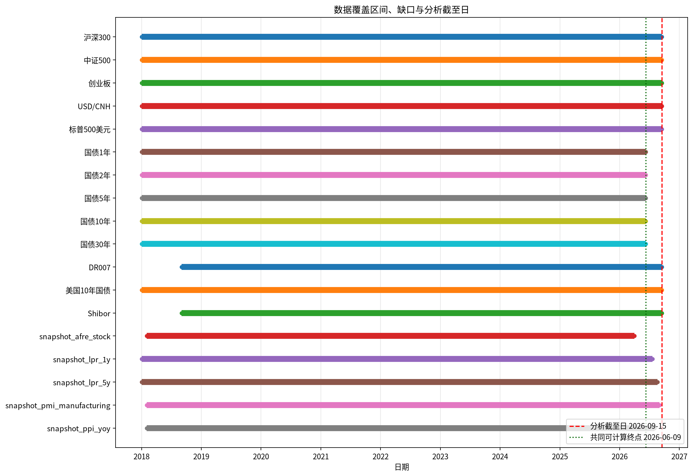
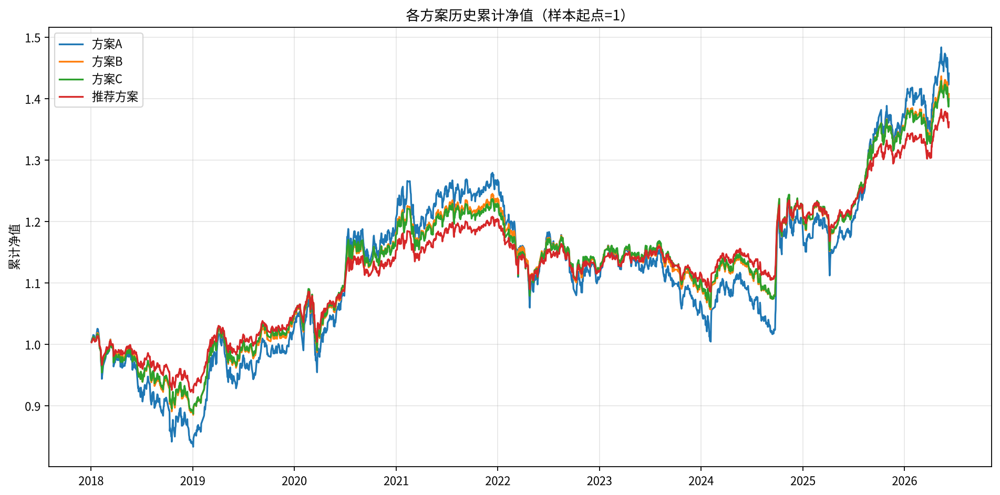
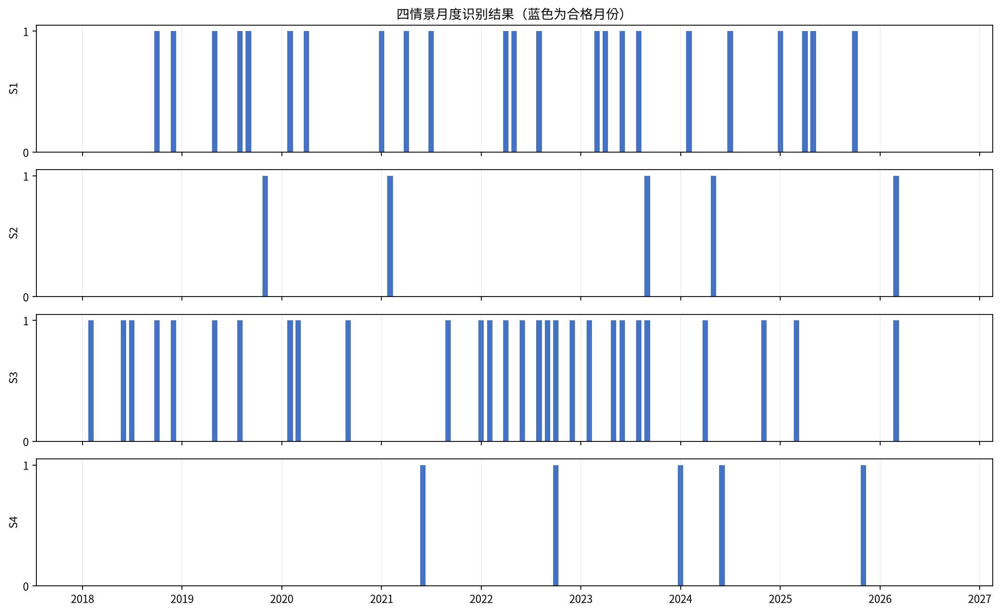
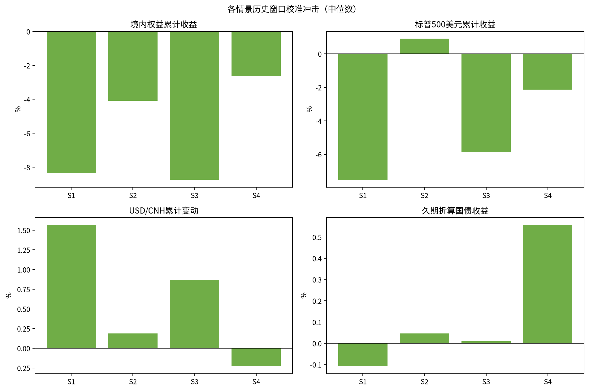
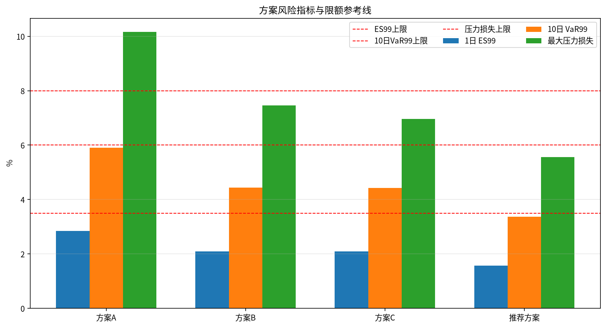
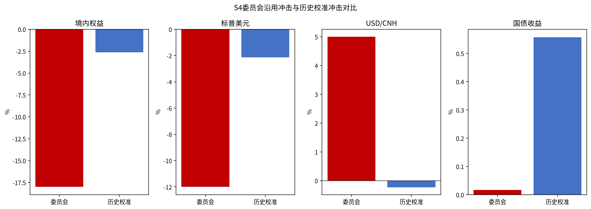
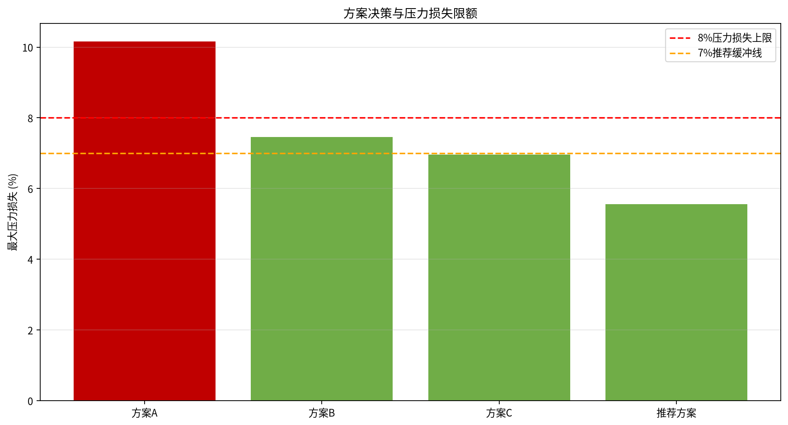
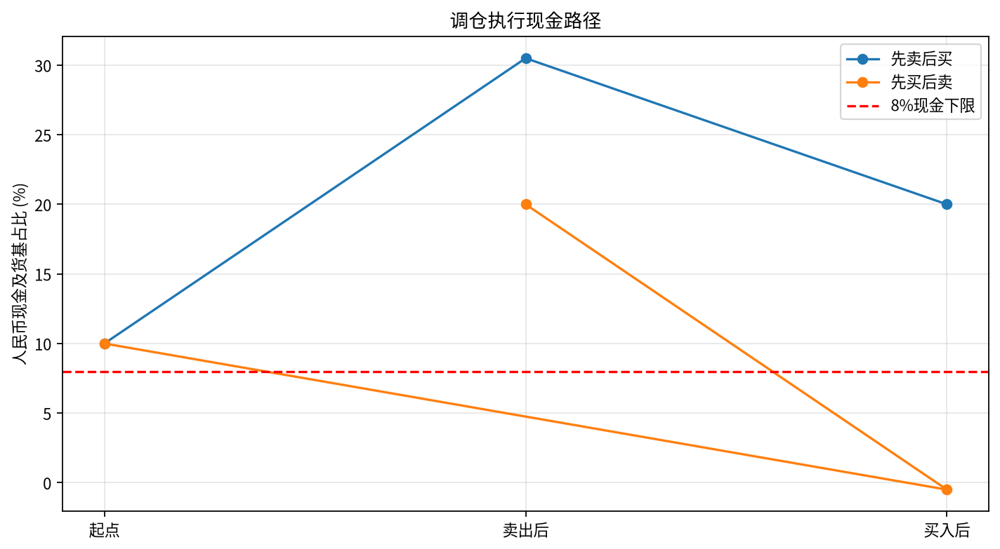
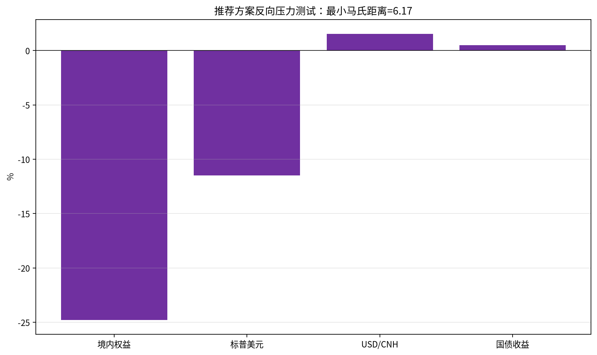
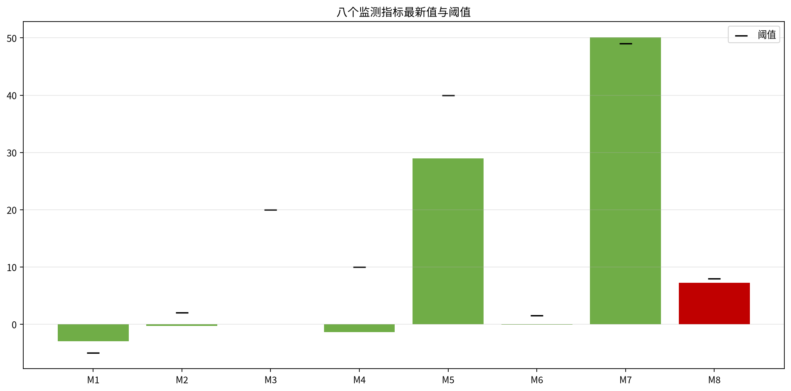

# 多资产稳健配置专户 三季度宏观压力测试与调仓建议
## 风险委员会决策备忘录
分析截至日：**2026-09-15**；共同可计算样本：**2018-01-02—2026-06-09**，共 **2,043 个上交所估值日收益观测**；金额单位均为万元，百分比保留两位。

### 一、结论与建议
建议不执行方案A、方案B、方案C，采用**推荐方案**：境内权益降至 29.50%，国债升至 30.50%，人民币现金及货基升至 20.00%，美元现金和标普500 QDII 各维持 10.00%。推荐方案最大压力损失为 5.56%（S4/委员会沿用），1日ES99 1.57%, 10日VaR99 3.36%, 单向换手率 20.50%。
在所有九项检查均通过且执行路径满足现金下限的前提下，无需提请临时风险会议；但国债数据缺口延续至分析截至日，建议补齐后由风险管理部复核并在必要时召开临时会议。

### 二、数据核验与样本区间
样本终点由必需的五条国债收益率曲线实际终点决定：五条曲线均止于 2026-06-09；虽然分析截至日为 2026-09-15，其后国债为结构性空值，未以前向值填充，因此不纳入共同收益样本。样本起点为 2018-01-02，上交所交易日历共 2113 个估值日，收益观测为 2043 个。
分段序列先合并、排序、去重检查，再按上交所交易日对齐；仅在每条序列自身实际首末覆盖区间内前向填充。结构性空值（如国债曲线终点后的日期、首日无前收盘价）不填充、不按0参与计算。市场价格逐条检查正值、最高/最低价关系、收盘价是否落在日内区间及是否落在上交所交易日；休市日异常记录以 `snapshot_trade_calendar.csv` 的 SSE/is_trading_day=1 为依据。
|序列|实际起始|实际终止|记录数|覆盖内缺口|异常/重复|空值|
|---|---|---|---|---|---|---|
|沪深300|2018-01-02|2026-09-15|2114|无|1|pre_close:1|
|中证500|2018-01-02|2026-09-15|2114|无|1|pre_close:1|
|创业板|2018-01-02|2026-09-15|2113|无|0|pre_close:1|
|USD/CNH|2018-01-02|2026-09-15|2174|86个|0|无|
|标普500美元|2018-01-02|2026-09-15|2187|73个|0|无|
|国债1年|2018-01-02|2026-06-09|2106|无|0|无|
|国债2年|2018-01-02|2026-06-09|2106|无|0|无|
|国债5年|2018-01-02|2026-06-09|2106|无|0|无|
|国债10年|2018-01-02|2026-06-09|2106|无|0|无|
|国债30年|2018-01-02|2026-06-09|2106|无|0|无|
|DR007|2018-09-03|2026-09-15|2000|无|0|无|
|美国10年国债|2018-01-02|2026-09-15|2176|84个|0|无|
|Shibor|2018-09-03|2026-09-15|2000|无|0|无|
|snapshot_afre_stock|2018-02-01|2026-04-01|99|1926个|0|无|
|snapshot_lpr_1y|2018-01-02|2026-07-20|489|1594个|0|无|
|snapshot_lpr_5y|2018-01-02|2026-08-20|491|1615个|0|lpr_5y:406|
|snapshot_pmi_manufacturing|2018-02-01|2026-09-01|103|2027个|0|无|
|snapshot_ppi_yoy|2018-02-01|2026-08-01|103|2006个|0|无|
核验结果：价格、汇率和国债曲线的数值字段未发现非正值、区间逻辑异常或重复日期；沪深300、中证500各有一条 2026-09-12 的非SSE交易日记录，依据交易日历剔除，不进入对齐样本；各指数分段文件首日 `pre_close` 为空属于结构性首日字段。数据清单的 `possible_truncation` 仅作为提示，不覆盖实际读取结果。跨市场价格先映射至上交所估值日，再计算收益；海外市场休市日使用其最后一个已观测值，序列实际终点后的值保持空缺。

图1说明：国债曲线实际终点早于分析截至日，红色虚线与绿色点线分别标示分析截至日和共同可计算终点。

### 三、当前组合风险画像
|资产|权重|金额|日均收益|年化波动|偏度|
|---|---|---|---|---|---|
|沪深300指数基金|25.00%|2500.00|0.02%|19.26%|-0.09|
|中证500指数基金|15.00%|1500.00|0.02%|22.37%|-0.27|
|创业板指数基金|10.00%|1000.00|0.06%|29.04%|0.55|
|中长期国债组合|20.00%|2000.00|0.01%|2.26%|0.26|
|美元现金及存款|10.00%|1000.00|0.00%|4.22%|-0.06|
|标普500 QDII基金|10.00%|1000.00|0.06%|19.01%|-0.40|
|人民币现金及货基|10.00%|1000.00|0.00%|0.00%|0.00|
当前组合年化波动率 10.77%；1日VaR95/99 分别为 0.98% / 1.79%；1日ES95/99 为 1.53% / 2.60%；10日VaR99 5.43%；10日最大累计损失 8.48%（2020-03-19结束）；最大回撤 19.68%（峰值 2021-12-13 至谷值 2024-02-05，恢复日 2025-08-13）；最差单日损失 4.88%（2025-04-07）。
资产日收益相关矩阵：
|资产|沪深300指数基金|中证500指数基金|创业板指数基金|中长期国债组合|美元现金及存款|标普500 QDII基金|人民币现金及货基|
|---|---|---|---|---|---|---|---|
|沪深300指数基金|1.00|0.86|0.84|-0.23|-0.25|0.12|N/A（常数收益）|
|中证500指数基金|0.86|1.00|0.87|-0.21|-0.18|0.12|N/A（常数收益）|
|创业板指数基金|0.84|0.87|1.00|-0.18|-0.18|0.11|N/A（常数收益）|
|中长期国债组合|-0.23|-0.21|-0.18|1.00|0.11|-0.05|N/A（常数收益）|
|美元现金及存款|-0.25|-0.18|-0.18|0.11|1.00|0.03|N/A（常数收益）|
|标普500 QDII基金|0.12|0.12|0.11|-0.05|0.03|1.00|N/A（常数收益）|
|人民币现金及货基|N/A（常数收益）|N/A（常数收益）|N/A（常数收益）|N/A（常数收益）|N/A（常数收益）|N/A（常数收益）|N/A（常数收益）|
各资产对组合方差风险贡献占比：
|资产|风险贡献占比|
|---|---|
|沪深300指数基金|42.16%|
|中证500指数基金|29.15%|
|创业板指数基金|24.87%|
|中长期国债组合|-0.75%|
|美元现金及存款|-0.66%|
|标普500 QDII基金|5.23%|
|人民币现金及货基|0.00%|

图2说明：按方案权重每日再平衡，推荐方案的累计净值路径较当前组合降低权益暴露。

### 四、情景识别与历史校准
|编号|情景|月度规则|全部合格月份|选取窗口数|示例窗口|校准冲击|
|---|---|---|---|---|---|---|
|S1|增长下行与政策宽松|制造业PMI 月值 < 50 且 (1 年期 LPR 或 5 年期 LPR 当月下调)，或 制造业PMI 较上月下行 >= 0.5 且 10 年期国债收益率月均值低于上月|2018-10、2018-12、2019-05、2019-08、2019-09、2020-02、2020-04、2021-01、2021-04、2021-07、2022-04、2022-05、2022-08、2023-03、2023-04、2023-06、2023-08、2024-02、2024-07、2025-01、2025-04、2025-05、2025-10|20|2020-03-06—2020-03-19|严格窗口0个；累计损失替代窗口（222个）；权益 -8.35%；标普美元 -7.53%；USD/CNH 1.57%；国债久期折算 -0.11%；曲线变动 1y:-0.80个百分点/-79.50bp, 2y:0.43个百分点/43.50bp, 5y:1.81个百分点/181.00bp, 10y:1.84个百分点/184.50bp, 30y:1.08个百分点/108.50bp|
|S2|通胀上行与利率上行|PPI 当月同比高于上月 且 10 年期国债收益率月均值高于上月 且 权益指数当月下跌|2019-11、2021-02、2023-09、2024-05、2026-03|20|2021-03-02—2021-03-15|严格窗口0个；累计损失替代窗口（39个）；权益 -4.09%；标普美元 0.91%；USD/CNH 0.19%；国债久期折算 0.05%；曲线变动 1y:-0.60个百分点/-60.00bp, 2y:-2.80个百分点/-279.50bp, 5y:-3.39个百分点/-338.50bp, 10y:0.67个百分点/66.50bp, 30y:-1.18个百分点/-118.00bp|
|S3|外部冲击与美元走强|标普500 当月收益率 <= -3% 或 USD/CNH 当月变化 >= +1.5%|2018-02、2018-06、2018-07、2018-10、2018-12、2019-05、2019-08、2020-02、2020-03、2020-09、2021-09、2022-01、2022-02、2022-04、2022-06、2022-08、2022-09、2022-10、2022-12、2023-02、2023-05、2023-06、2023-08、2023-09、2024-04、2024-11、2025-03、2026-03|20|2020-03-06—2020-03-19|严格窗口0个；累计损失替代窗口（241个）；权益 -8.74%；标普美元 -5.85%；USD/CNH 0.87%；国债久期折算 0.01%；曲线变动 1y:-2.87个百分点/-286.50bp, 2y:-2.02个百分点/-202.50bp, 5y:-0.61个百分点/-61.00bp, 10y:0.02个百分点/1.50bp, 30y:0.28个百分点/28.00bp|
|S4|信用收缩与资金面收紧|社会融资规模存量同比增速低于上月 且 DR007 月均值高于上月 且 权益指数当月下跌|2021-06、2022-10、2024-01、2024-06、2025-11|20|2024-07-23—2024-08-05|严格窗口0个；累计损失替代窗口（36个）；权益 -2.63%；标普美元 -2.14%；USD/CNH -0.23%；国债久期折算 0.56%；曲线变动 1y:-7.94个百分点/-794.50bp, 2y:-4.99个百分点/-499.00bp, 5y:-9.61个百分点/-960.50bp, 10y:-7.76个百分点/-775.50bp, 30y:-7.79个百分点/-779.50bp|
窗口规则先按合格月份次月的上交所交易日构造10日窗口，并严格筛选10个日收益全部为负的窗口。实际样本中最长连续负收益仅8日，四个情景严格合格窗口均为0个；为避免伪造历史校准，脚本明确披露并采用同一月份内10日累计损失为负的替代窗口，按累计跌幅排序取最多20个，作为压力校准的有限数据替代。委员会应将该替代结果视为低置信度，待数据或窗口规则确认后复核。委员会沿用冲击的国债字段按 `yield_pct` 的百分点解释并换算为bp；国债收益以关键期限久期贡献折算，而不是直接加总收益率差。

图4说明：每个面板的蓝色柱表示对应月份满足规则。

图5说明：各柱为合格窗口中位数，国债为久期折算收益。

### 五、压力测试结果
压力测试采用4个方案×4个情景×2套冲击，并逐项拆分为境内权益、标普500人民币计、美元现金、国债；每行四项贡献之和等于组合损益。标普500人民币收益按 `(1+美元收益)×(1+汇率变动)-1` 复合计算。
|方案|情景|冲击|境内权益|标普人民币|美元现金|国债|组合损益|压力损失|
|---|---|---|---|---|---|---|---|---|
|方案A|S1|委员会沿用|-6.60%|-0.62%|0.20%|-0.00%|-7.02%|7.02%|
|方案A|S1|历史校准|-4.59%|-0.61%|0.16%|-0.02%|-5.06%|5.06%|
|方案A|S2|委员会沿用|-5.50%|-0.32%|0.30%|0.00%|-5.52%|5.52%|
|方案A|S2|历史校准|-2.25%|0.11%|0.02%|0.01%|-2.11%|2.11%|
|方案A|S3|委员会沿用|-8.25%|-1.14%|0.80%|-0.00%|-8.59%|8.59%|
|方案A|S3|历史校准|-4.81%|-0.50%|0.09%|0.00%|-5.22%|5.22%|
|方案A|S4|委员会沿用|-9.90%|-0.76%|0.50%|0.00%|-10.16%|10.16%|
|方案A|S4|历史校准|-1.45%|-0.24%|-0.02%|0.08%|-1.62%|1.62%|
|方案B|S1|委员会沿用|-4.80%|-0.62%|0.20%|-0.00%|-5.22%|5.22%|
|方案B|S1|历史校准|-3.34%|-0.61%|0.16%|-0.03%|-3.82%|3.82%|
|方案B|S2|委员会沿用|-4.00%|-0.32%|0.30%|0.00%|-4.02%|4.02%|
|方案B|S2|历史校准|-1.64%|0.11%|0.02%|0.01%|-1.50%|1.50%|
|方案B|S3|委员会沿用|-6.00%|-1.14%|0.80%|-0.00%|-6.35%|6.35%|
|方案B|S3|历史校准|-3.50%|-0.50%|0.09%|0.00%|-3.91%|3.91%|
|方案B|S4|委员会沿用|-7.20%|-0.76%|0.50%|0.00%|-7.46%|7.46%|
|方案B|S4|历史校准|-1.05%|-0.24%|-0.02%|0.14%|-1.17%|1.17%|
|方案C|S1|委员会沿用|-4.80%|-0.62%|0.40%|-0.00%|-5.02%|5.02%|
|方案C|S1|历史校准|-3.34%|-0.61%|0.31%|-0.02%|-3.66%|3.66%|
|方案C|S2|委员会沿用|-4.00%|-0.32%|0.60%|0.00%|-3.72%|3.72%|
|方案C|S2|历史校准|-1.64%|0.11%|0.04%|0.01%|-1.48%|1.48%|
|方案C|S3|委员会沿用|-6.00%|-1.14%|1.60%|-0.00%|-5.54%|5.54%|
|方案C|S3|历史校准|-3.50%|-0.50%|0.17%|0.00%|-3.83%|3.83%|
|方案C|S4|委员会沿用|-7.20%|-0.76%|1.00%|0.00%|-6.96%|6.96%|
|方案C|S4|历史校准|-1.05%|-0.24%|-0.05%|0.10%|-1.23%|1.23%|
|推荐方案|S1|委员会沿用|-3.54%|-0.62%|0.20%|-0.00%|-3.96%|3.96%|
|推荐方案|S1|历史校准|-2.46%|-0.61%|0.16%|-0.03%|-2.95%|2.95%|
|推荐方案|S2|委员会沿用|-2.95%|-0.32%|0.30%|0.00%|-2.97%|2.97%|
|推荐方案|S2|历史校准|-1.21%|0.11%|0.02%|0.01%|-1.06%|1.06%|
|推荐方案|S3|委员会沿用|-4.42%|-1.14%|0.80%|-0.00%|-4.77%|4.77%|
|推荐方案|S3|历史校准|-2.58%|-0.50%|0.09%|0.00%|-2.99%|2.99%|
|推荐方案|S4|委员会沿用|-5.31%|-0.76%|0.50%|0.01%|-5.56%|5.56%|
|推荐方案|S4|历史校准|-0.78%|-0.24%|-0.02%|0.17%|-0.87%|0.87%|
各方案最大压力损失及来源：
|方案|最大压力损失|来源情景|冲击|
|---|---|---|---|
|方案A|10.16%|S4|委员会沿用|
|方案B|7.46%|S4|委员会沿用|
|方案C|6.96%|S4|委员会沿用|
|推荐方案|5.56%|S4|委员会沿用|
委员会沿用与历史校准的严格程度取决于因子方向和曲线形态：外部冲击通常由更深的权益/汇率尾部决定，政策宽松或信用收缩情景的历史窗口可能呈现与委员会设定不同的利率曲线形态；因此不能只比较单一因子的绝对值，应比较组合损失及四项贡献。

图3说明：图中同时比较1日ES99、10日VaR99和最大压力损失，并画出各自限额参考线。

图6说明：展示推荐方案最大损失来源情景 S4 的委员会沿用冲击和历史校准冲击。

### 六、候选方案评估与九项约束检查
|方案|限额|实际值|结果|超限幅度|
|---|---|---|---|---|
|方案A|L1|100.00%|通过|—|
|方案A|L2|55.00%|通过|—|
|方案A|L3|10.00%|通过|—|
|方案A|L4|15.00%|通过|—|
|方案A|L5|20.00%|通过|—|
|方案A|L6|2.84%|通过|—|
|方案A|L7|5.91%|通过|—|
|方案A|L8|10.16%|未通过|2.16%|
|方案A|L9|10.16%|未通过|3.16%|
|方案B|L1|100.00%|通过|—|
|方案B|L2|40.00%|通过|—|
|方案B|L3|15.00%|通过|—|
|方案B|L4|25.00%|通过|—|
|方案B|L5|20.00%|通过|—|
|方案B|L6|2.10%|通过|—|
|方案B|L7|4.44%|通过|—|
|方案B|L8|7.46%|通过|—|
|方案B|L9|7.46%|未通过|0.46%|
|方案C|L1|100.00%|通过|—|
|方案C|L2|40.00%|通过|—|
|方案C|L3|12.00%|通过|—|
|方案C|L4|18.00%|通过|—|
|方案C|L5|30.00%|未通过|5.00%|
|方案C|L6|2.09%|通过|—|
|方案C|L7|4.43%|通过|—|
|方案C|L8|6.96%|通过|—|
|方案C|L9|6.96%|通过|—|
|推荐方案|L1|100.00%|通过|—|
|推荐方案|L2|29.50%|通过|—|
|推荐方案|L3|20.00%|通过|—|
|推荐方案|L4|30.50%|通过|—|
|推荐方案|L5|20.00%|通过|—|
|推荐方案|L6|1.57%|通过|—|
|推荐方案|L7|3.36%|通过|—|
|推荐方案|L8|5.56%|通过|—|
|推荐方案|L9|5.56%|通过|—|
外币资产敞口严格按限额文件口径计算为美元现金及存款+不对冲汇率的标普500 QDII；没有漏计或误计标普500 QDII。方案A、B、C分别由投资经理、风险管理部、宏观策略组提出；推荐方案使用持仓参数中的推荐权重并同时检查L9的7%缓冲线。

图7说明：红线为8%压力损失上限，橙线为7%推荐方案缓冲线。

### 七、推荐方案与调仓执行
|资产|推荐权重|推荐金额|
|---|---|---|
|沪深300指数基金|14.75%|1475.00|
|中证500指数基金|8.85%|885.00|
|创业板指数基金|5.90%|590.00|
|中长期国债组合|30.50%|3050.00|
|美元现金及存款|10.00%|1000.00|
|标普500 QDII基金|10.00%|1000.00|
|人民币现金及货基|20.00%|2000.00|
构造依据：按调仓规则固定美元现金和标普500 QDII各10%；境内三项权益按当前权重同比例缩减，缩减系数为 0.59，合计减配 20.50%；释放资金中10.50%转入国债，10.00%转入人民币现金。该构造使九项检查全部通过，单向换手率为 20.50%。
唯一性说明：在“外币两项固定、境内权益按现有比例缩减、单向换手率固定为20.50%”的构造集合内，规则指定的现金/国债分配为推荐解；以0.50个百分点网格搜索同换手率替代分配时，排除推荐解后的最优近邻为人民币现金 8.00%、国债 42.50%，其最大压力损失为 5.56%，高于推荐方案 5.56%。
交易清单及执行顺序：
|证券/资产|方向|金额|
|---|---|---|
|沪深300指数基金|卖出|1025.00|
|中证500指数基金|卖出|615.00|
|创业板指数基金|卖出|410.00|
|中长期国债组合|买入/增加|1050.00|
|人民币现金及货基|买入/增加|1000.00|
执行顺序为先卖出后三项境内权益，卖出资金当日可用；随后买入国债，剩余资金留存为人民币现金及货基。美元现金和标普500 QDII不交易，因此不存在QDII赎回T+7资金不可用问题。先卖后买路径现金占比为10.00%→30.50%→20.00%，全程高于8%；若先买入国债，现金先变为-0.50%，击穿8%下限，故不得采用。

图8说明：先卖后买满足现金下限，先买后卖在第一步即产生现金缺口。

### 八、反向压力测试与监测预警
推荐方案最大压力损失为 5.56%，相对8%上限的裕度为 2.44%，压力损失放大倍数为 0.70倍。样本内最差10日累计损失为 8.48%，区间为 2020-03-10—2020-03-19。
反向压力测试以推荐方案损失至少8%、因子处于经济上合理边界为约束，最小马氏距离解为：境内权益 -24.79%、标普500美元 -11.49%、USD/CNH 1.54%、久期折算国债收益 0.50%；最小马氏距离 6.17。S4委员会沿用冲击马氏距离 6.48，对应历史校准窗口马氏距离 1.47。

图9说明：反向解在损失达到8%约束下，寻找历史因子协方差意义下最接近的冲击。
|编号|指标|阈值|最新值|数据截至|状态|触发|
|---|---|---|---|---|---|---|
|M1|沪深300 20 日收益|-5.00%|-2.96%|2026-06-09|正常|否|
|M2|USD/CNH 20 日变化|+2.00%|-0.29%|2026-06-09|正常|否|
|M3|DR007 资金面变化|+20.00bp|-0.02bp|2026-06-09|正常|否|
|M4|10 年期国债收益率 20 日变化|+10.00bp|-1.38bp|2026-06-09|正常|否|
|M5|美国 10 年期国债收益率 20 日变化|+40.00bp|29.00bp|2026-06-09|正常|否|
|M6|PPI 同比加速|+1.50 个百分点|-0.10 个百分点|2026-06-09|正常|否|
|M7|制造业 PMI 荣枯线|49.00|50.10|2026-06-09|正常|否|
|M8|社融存量增速|8.00%|7.23%|2026-06-09|触发|是|

图10说明：柱色表示最新状态，黑色短线为对应阈值；M3—M5按bp展示。
补齐安排：数据供应方补齐国债收益率曲线 2026-06-09 之后至 2026-09-15 的观测后，由风险管理部重新执行本脚本，重算共同样本、历史窗口、压力校准、方案约束和监测指标；在补齐前不将缺口按0或前值延展，也不据此下调预警等级。

---
附件：本备忘录引用的十张PNG图表和可复算脚本均位于 `FIN3-WKN-149_charts/` 与 `/app/output/`。