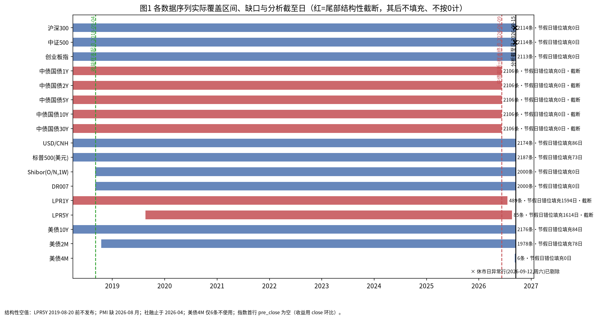
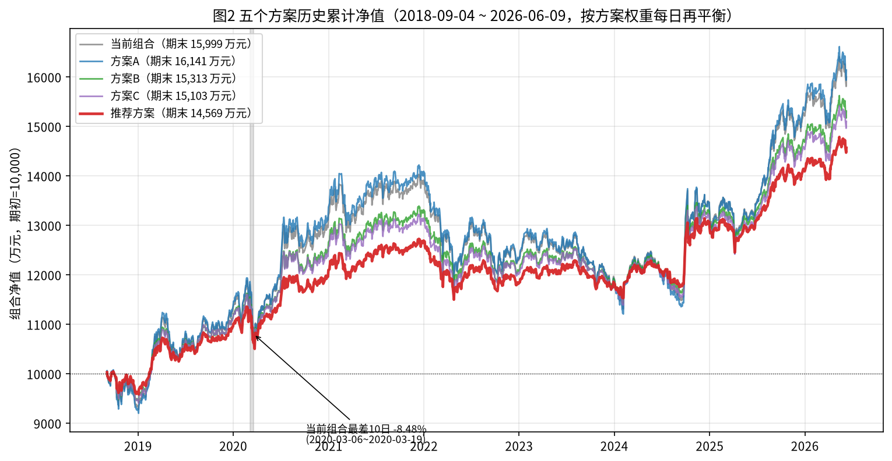
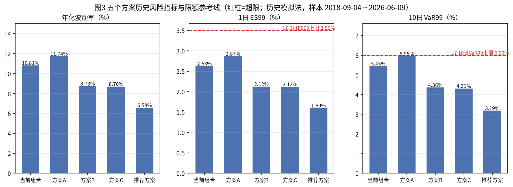
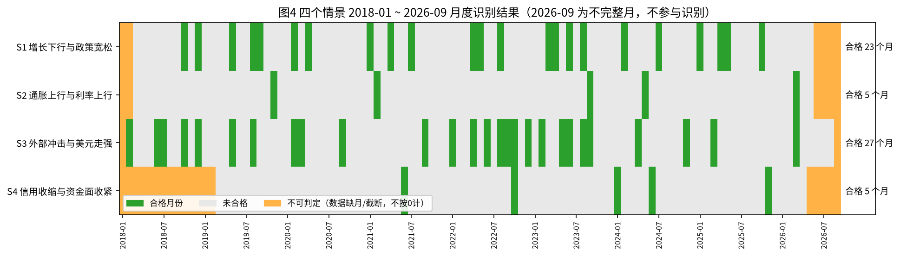
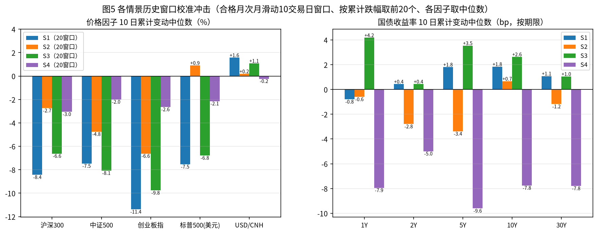
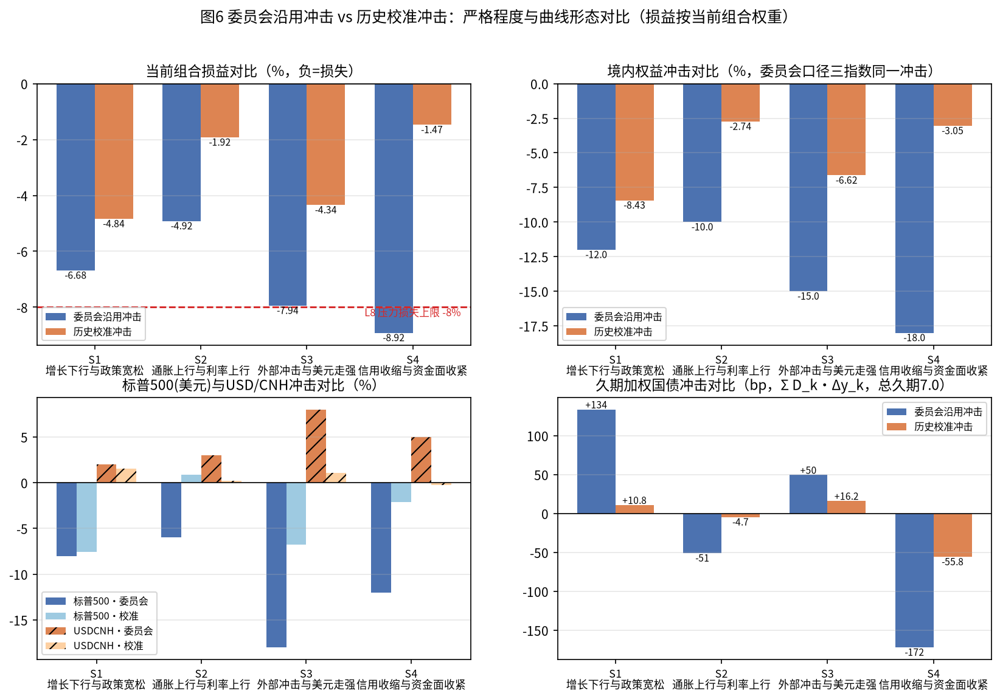
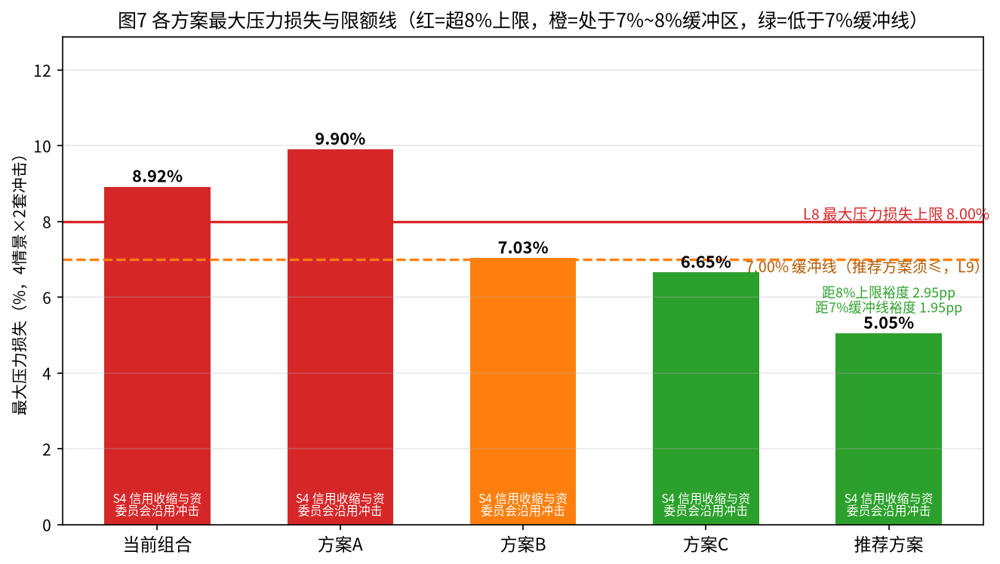
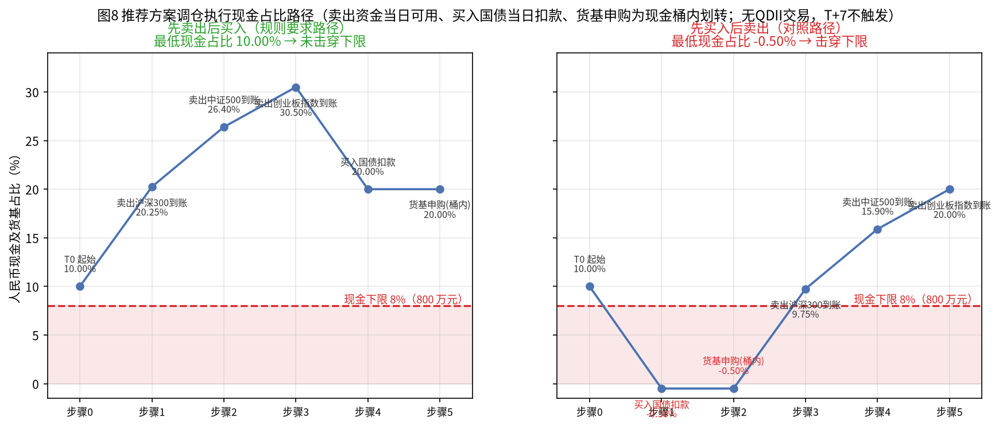
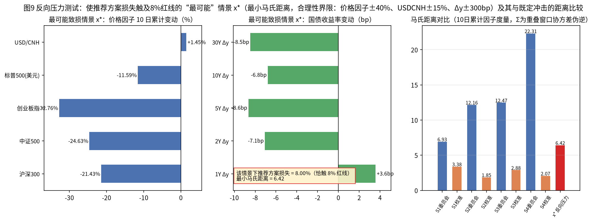
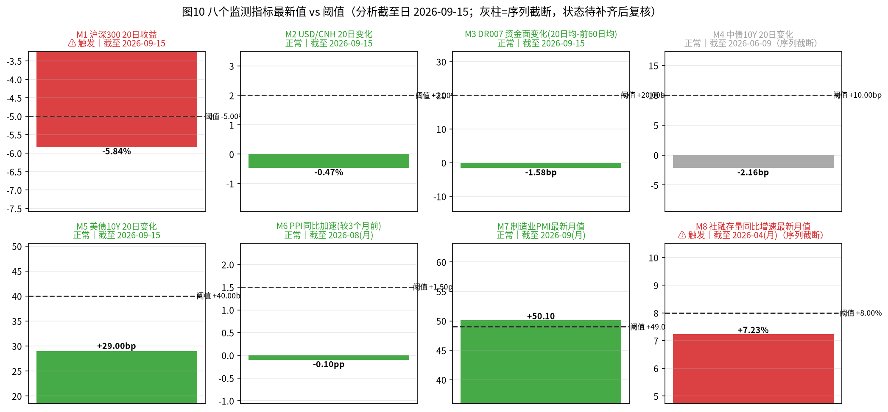

# 多资产稳健配置专户 三季度宏观压力测试与调仓建议
## 风险委员会决策备忘录

分析截至日：2026-09-15  |  组合净值：10,000.00 万元（1 亿元）  |  金额单位：万元；百分比两位小数；收益率变动注明 bp 或 %
全部数字与图表可由 `FIN3-WKN-149_reproduce.py` 自 `/app/input_files/` 原始快照复算（不硬编码任何结论数值）。

---

### 一、结论与建议

**处置意见（一句话）**：当前组合最大压力损失 8.92% 已击穿 8% 红线（C8 未通过），必须调仓；三个候选方案中方案A（9.90%）更差、方案C 外币敞口超限 5.00pp、方案B 虽九项全过但最大压力损失 7.03% 对 8% 红线仅余 0.97pp 且不满足委员会对推荐方案留 1 个百分点缓冲的要求（C9 口径），**最终推荐采用"推荐方案"**（境内权益等比缩减至 0.59 倍、人民币现金顶格 20%、余量入国债）。

**推荐方案关键指标**：最大压力损失 **5.05%**（来源 S4 信用收缩与资金面收紧 × 委员会沿用冲击）；1 日 ES99 **1.60%**（上限 3.50%）；10 日 VaR99 **3.19%**（上限 6.00%）；单向换手率 **20.50%**（卖出合计 2,050.00 万元）。九项约束（含仅适用于推荐方案的 C9）全部通过，对 8% 红线裕度 2.95pp、对 7% 缓冲线裕度 1.95pp。

**是否提请临时风险会议**：**需要**。监测指标 M1（沪深300 20日收益 -5.84%，阈值 -5.00%）已触发；M8（社融存量同比 7.23%，阈值 8.00%）触发但数据止于 2026-04（序列截断），且中债收益率截断使 2026-06~09 多月情景识别不可判定。建议：本次例会先决议调仓；在中债收益率、社融、PMI、LPR 补齐后两周内提请临时风险会议，复核 M8 触发状态、重算 M4/M7 与情景识别，并视复核结果决定是否追加调仓。

---

### 二、数据核验与样本区间

**核验先于一切计算**；26 个市场/宏观快照（清单全部文件）的记录数与起止日均与 `snapshot_data_manifest.csv` 一致（清单 `possible_truncation` 字段仅 shibor_seg2 标注 'false'、其余为空，系上游自动生成、不可靠，实际截断一律以文件内容为准）。

**样本区间与终止原因**：上交所估值日（主轴）2018-01-02 ~ 2026-09-15 共 **2,113** 个估值日；风险收益样本 **2018-09-04 ~ 2026-06-09 共 1,879 个收益观测**。起点受 DR007/Shibor 自 2018-09-03 起可用的约束（前段为结构性截断，现金收益不按 0 填充）；终点受中债国债收益率五条曲线止于 **2026-06-09** 的约束（上游快照尾部截断，其后为结构性空值：不延伸、不填充、不按 0 计），故样本在截至日 2026-09-15 之前终止。收益面板样本内空值 0 个。

**休市日异常记录的识别与剔除**：沪深300、中证500 各含 1 条 2026-09-12（周六，不在上交所交易日历）记录，OHLC 与昨收全平、成交额仅为近 20 个交易期中位数的 1.74% / 0.90%，判定为休市日脏数据予以剔除；创业板指 seg2 无该行（898 条 vs 899 条），三只指数剔除后覆盖一致。凡不在上交所日历的指数行一律剔除。该剔除直接影响 M1：剔除后 M1 基期日为 2026-08-18，M1 = -5.84%（触发）；若不剔除，20 日基期将后移至 2026-08-19、M1 被误读为 -3.02%（未触发），故核验结论直接改变监测状态。

**各序列覆盖区间、缺失期次与截断标记**（原始文件口径，"填充日"指覆盖区间内因节假日错位需在上交所估值日前向填充的天数）：

| 序列 | 起 | 止 | 记录数 | 覆盖内填充日 | 截断/缺失说明 |
|---|---|---|---|---|---|
| 沪深300 | 2018-01-02 | 2026-09-15 | 2,114 | 0 | 含休市日异常行 1 条（已剔除） |
| 中证500 | 2018-01-02 | 2026-09-15 | 2,114 | 0 | 含休市日异常行 1 条（已剔除） |
| 创业板指 | 2018-01-02 | 2026-09-15 | 2,113 | 0 | 无异常行 |
| 中债国债1Y/2Y/5Y/10Y/30Y | 2018-01-02 | 2026-06-09 | 各 2,106 | 0 | **尾部结构性截断**，其后不填充 |
| USD/CNH | 2018-01-02 | 2026-09-15 | 2,174 | 86 | 境外假日错位，覆盖内前向填充 |
| 标普500(美元) | 2018-01-02 | 2026-09-15 | 2,187 | 73 | 同上 |
| Shibor(O/N,1W) / DR007 | 2018-09-03 | 2026-09-15 | 各 2,000 | 0 | 前段结构性截断（样本起点约束） |
| LPR1Y | 2018-01-02 | 2026-07-20 | 489 | 1,594 | 月度报价，覆盖内前向填充；末端 2026-08-20 报价缺失 |
| LPR5Y | 2019-08-20 | 2026-08-20 | 85 | 1,614 | 2019-08-20 前整段为空（406 条结构性空值，不填充、不参与"LPR 当月下调"判定） |
| 美债10Y | 2018-01-02 | 2026-09-15 | 2,176 | 84 | 境外假日错位填充 |
| 美债2M | 2018-10-16 | 2026-09-15 | 1,978 | 78 | 同上 |
| 美债4M | 2026-09-08 | 2026-09-15 | 6 | 0 | 无可用历史，本次分析不使用 |

**结构性空值处理**（一律不按 0、不填充）：① 指数 seg1 首行 `pre_close` 为空（各 1 条）→ 收益全部用 close 逐日环比计算，不依赖 pre_close；② LPR5Y 2019-08-20 前 406 条空值 → 该段不参与判定；③ PMI 缺 2026-08 月 → 涉及月份的情景判定标记为"不可判定"；④ 社融存量止于 2026-04 → M8 及其情景判定按截断处理；⑤ 中债五曲线 2026-06-09 后为空 → 风险样本随之终止。

**汇率序列对齐口径与价格对齐方法**：所有跨市场序列（USD/CNH、标普500、美债、Shibor/DR007、中债、指数）在计算收益前先对齐到上交所估值日主轴；序列自身覆盖区间内的缺失估值日（境外假日错位）按前向填充处理，覆盖区间之外一律保持 NaN（结构性空值不参与填充、不按 0 计）。对齐后极端变动抽查（确认为真实行情、予以保留）：沪深300 2024-09-30 +8.48%、2020-02-03 -7.88%；中证500 2024-09-30 +10.41%、2025-04-07 -9.55%；创业板指 2024-10-08 +17.25%、2025-04-07 -12.50%；中债10Y 最大单日变动 2020-02-03 17.01bp；USD/CNH 最大单日 2019-08-05 +1.58%。

图1：各数据序列实际覆盖区间一览——中债五条曲线止于 2026-06-09（收益样本终点），2026-09-12 休市日异常行已剔除，结构性空值一律不填充、不按0计。

---

### 三、当前组合风险画像

**持仓与金额**（2026-09-15 估值）：

| 资产 | 权重 | 金额（万元） |
|---|---|---|
| 沪深300指数基金 | 25.00% | 2,500.00 |
| 中证500指数基金 | 15.00% | 1,500.00 |
| 创业板指数基金 | 10.00% | 1,000.00 |
| 中长期国债组合 | 20.00% | 2,000.00 |
| 美元现金及存款 | 10.00% | 1,000.00 |
| 标普500 QDII基金（人民币计） | 10.00% | 1,000.00 |
| 人民币现金及货基 | 10.00% | 1,000.00 |
| 合计 | 100.00% | 10,000.00 |

**各资产日收益统计特征**（2018-09-04 ~ 2026-06-09，1,879 观测）：

| 资产 | 年化收益 | 年化波动 | 偏度 | 峰度 | 最差单日 | 最好单日 |
|---|---|---|---|---|---|---|
| 沪深300指数基金 | 7.03% | 19.24% | -0.08 | 5.27 | -7.88% | +8.48% |
| 中证500指数基金 | 10.00% | 22.32% | -0.22 | 6.14 | -9.55% | +10.41% |
| 创业板指数基金 | 19.44% | 29.17% | 0.59 | 9.06 | -12.50% | +17.25% |
| 中长期国债组合 | 1.79% | 2.25% | 0.12 | 4.70 | -0.71% | +1.13% |
| 美元现金及存款 | -0.03% | 4.14% | -0.08 | 4.67 | -1.57% | +1.58% |
| 标普500 QDII基金(人民币计) | 15.37% | 19.38% | -0.37 | 14.33 | -12.19% | +9.68% |
| 人民币现金及货基 | 2.02% | 0.02% | 0.29 | -0.79 | +0.01% | +0.01% |

口径：国债组合收益按关键期限久期折算 r = -Σ D_k×Δy_k（D：1Y 0.1、2Y 0.3、5Y 1.2、10Y 3.6、30Y 1.8，合计 7.0）；标普500 人民币计收益按复合折算 (1+r_SPX)(1+r_FX)-1；美元现金人民币收益=汇率变动；人民币现金按上一交易日 DR007/252 计提。组合日收益按方案权重每日再平衡。

**相关矩阵**（日收益，人民币计）：

| | 沪深300 | 中证500 | 创业板 | 国债 | 美元现金 | 标普QDII | 人民币现金 |
|---|---|---|---|---|---|---|---|
| 沪深300 | 1.000 | 0.861 | 0.854 | -0.237 | -0.248 | 0.128 | 0.005 |
| 中证500 | 0.861 | 1.000 | 0.868 | -0.211 | -0.182 | 0.130 | -0.010 |
| 创业板 | 0.854 | 0.868 | 1.000 | -0.185 | -0.186 | 0.115 | -0.013 |
| 国债 | -0.237 | -0.211 | -0.185 | 1.000 | 0.122 | -0.053 | 0.031 |
| 美元现金 | -0.248 | -0.182 | -0.186 | 0.122 | 1.000 | 0.028 | -0.015 |
| 标普QDII | 0.128 | 0.130 | 0.115 | -0.053 | 0.028 | 1.000 | -0.024 |
| 人民币现金 | 0.005 | -0.010 | -0.013 | 0.031 | -0.015 | -0.024 | 1.000 |

**组合层面指标**（当前组合，历史模拟法）：年化波动率 **10.81%**；1 日 VaR95 / VaR99 = **0.99% / 1.71%**；1 日 ES95 / ES99 = **1.53% / 2.63%**；10 日 VaR99 = **5.45%**（重叠 10 日复合收益分布）；10 日最大累计损失 **-8.48%**（2020-03-06 ~ 2020-03-19）；最大回撤 **-19.37%**（峰 2021-12-13 → 谷 2024-02-05 → 修复 2025-08-13）；最差单日 **-4.88%**（2025-04-07）。

**各资产风险贡献占比**（协方差分解 w_i·(Σw)_i / w'Σw）：沪深300 42.05%、中证500 28.94%、创业板 24.93%、标普500 QDII 5.50%、国债 -0.76%、美元现金 -0.65%、人民币现金 -0.00%。境内权益三项合计贡献 95.92%，是风险的绝对来源；国债与美元现金呈负贡献（分散化）。

**五方案风险指标对比**：

| 方案 | 年化波动 | 1日ES99 | 10日VaR99 | 最差10日（区间） | 最大回撤 |
|---|---|---|---|---|---|
| 当前组合 | 10.81% | 2.63% | 5.45% | -8.48%（2020-03-06~03-19） | -19.37% |
| 方案A | 11.74% | 2.87% | 5.95% | -9.09%（同上） | -21.19% |
| 方案B | 8.73% | 2.12% | 4.36% | -7.14%（同上） | -14.62% |
| 方案C | 8.70% | 2.12% | 4.31% | -6.90%（同上） | -13.86% |
| 推荐方案 | 6.58% | 1.60% | 3.19% | -5.71%（同上） | -9.65% |

图2：五方案历史累计净值（期初10,000万元）——方案A期末净值最高（16,141万元）、推荐方案期末 14,569 万元且回撤最浅；灰色带为当前组合最差10日窗口（-8.48%）。

图3：年化波动率、1日ES99（L6上限3.50%）与10日VaR99（L7上限6.00%）——历史风险限额五方案均未突破；当前组合最接近上限（ES99 2.63%、10日VaR99 5.45%），推荐方案裕度最大（1.60% / 3.19%）。

---

### 四、情景识别与历史校准

**月度识别规则**（`rules_scenarios.csv`）与全部合格月份（2018-01 ~ 2026-08 逐月判定；2026-09 为不完整月不参与识别；"权益指数当月下跌"以沪深300 月度收益 <0 为基准）：

- **S1 增长下行与政策宽松**：PMI 月值 <50 且（1Y 或 5Y LPR 当月下调），或 PMI 较上月下行 ≥0.5 且 10Y 国债月均值低于上月。合格 **23** 个月：2018-10、2018-12、2019-05、2019-08、2019-09、2020-02、2020-04、2021-01、2021-04、2021-07、2022-04、2022-05、2022-08、2023-03、2023-04、2023-06、2023-08、2024-02、2024-07、2025-01、2025-04、2025-05、2025-10。不可判定 6 个月：2018-01、2018-02、2026-06~2026-09。
- **S2 通胀上行与利率上行**：PPI 同比高于上月 且 10Y 月均值高于上月 且权益当月下跌。合格 **5** 个月：2019-11、2021-02、2023-09、2024-05、2026-03。不可判定 6 个月（同上）。
- **S3 外部冲击与美元走强**：标普500 当月 ≤-3% 或 USD/CNH 当月 ≥+1.5%。合格 **27** 个月：2018-02、2018-06、2018-07、2018-10、2018-12、2019-05、2019-08、2020-02、2020-03、2020-09、2021-09、2022-01、2022-04、2022-06、2022-08、2022-09、2022-10、2022-12、2023-02、2023-05、2023-06、2023-08、2023-09、2024-04、2024-11、2025-03、2026-03。不可判定 2 个月：2018-01、2026-09。
- **S4 信用收缩与资金面收紧**：社融存量同比低于上月 且 DR007 月均值高于上月 且权益当月下跌。合格 **5** 个月：2021-06、2022-10、2024-01、2024-06、2025-11。不可判定 19 个月：2018-01~2019-02（社融同比需 12 个月滞后）、2026-05~2026-09（社融截断）。

LPR 下调月份（1Y 或 5Y 报价较上次下调）：2019-08、2019-09、2019-11、2020-02、2020-04、2021-12、2022-01、2022-05、2022-08、2023-06、2023-08、2024-02、2024-07、2024-10、2025-05。

**历史窗口构造**（`rules_windows.csv`：合格月次月第一个交易日为基准起点、长度 10 个上交所交易日、在次月内滑动；规则要求保留"10 日全部为负"且累计跌幅最大者、同类按跌幅排序取不少于 20 个）。经验上样本内"10 日全部为负"的窗口数为 0，故按规则层级放宽为"累计为负"、按累计跌幅取前 20 个（该放宽口径在结论中已作敏感性说明：基准窗口集合与之高度重叠）：

| 情景 | 合格月 | 基准窗口（累计为负） | 次月滑动候选池 | 全负窗口 | 累计为负 | 入选 | 入选窗口起点区间 |
|---|---|---|---|---|---|---|---|
| S1 | 23 | 23（6） | 457 | 0 | 220 | 20 | 2020-03-03 ~ 2025-11-11 |
| S2 | 5 | 5（3） | 102 | 0 | 38 | 20 | 2021-03-02 ~ 2024-06-25 |
| S3 | 27（可构造24） | 24（7） | 474 | 0 | 186 | 20 | 2020-03-03 ~ 2024-12-30 |
| S4 | 5 | 5（0） | 105 | 0 | 35 | 20 | 2021-07-13 ~ 2024-07-30 |

入选窗口明细（起~止 / 当前组合累计收益）：
- S1：200306~200319 -8.48%、200305~200318 -7.91%、200309~200320 -7.53%、200310~200323 -7.23%、200311~200324 -6.78%、200303~200316 -6.50%、200304~200317 -6.16%、210224~210309 -5.43%、210223~210308 -4.49%、210219~210304 -4.46%、210222~210305 -4.24%、220913~220926 -4.24%、210225~210310 -4.10%、200312~200325 -4.08%、220915~220928 -3.40%、251110~251121 -3.39%、251111~251124 -3.32%、220909~220923 -3.30%、220908~220922 -3.22%、220914~220927 -3.05%
- S2：210302~210315 -3.44%、231010~231023 -3.36%、231013~231026 -3.18%、231012~231025 -2.87%、210304~210317 -2.77%、231011~231024 -2.70%、231009~231020 -2.64%、210303~210316 -2.46%、210308~210319 -2.10%、240619~240702 -2.02%、231016~231027 -1.88%、240620~240703 -1.78%、240617~240628 -1.78%、240621~240704 -1.69%、240618~240701 -1.61%、240612~240625 -1.60%、240625~240708 -1.57%、240624~240705 -1.54%、240614~240627 -1.46%、240611~240624 -1.30%
- S3：200306~200319 -8.48%、200305~200318 -7.91%、200309~200320 -7.53%、200310~200323 -7.23%、200311~200324 -6.78%、200303~200316 -6.50%、200304~200317 -6.16%、220224~220309 -4.35%、220913~220926 -4.24%、241227~250110 -4.20%、241230~250113 -4.11%、200312~200325 -4.08%、220223~220308 -3.45%、220915~220928 -3.40%、231010~231023 -3.36%、220909~220923 -3.30%、241225~250108 -3.25%、220228~220311 -3.23%、220908~220922 -3.22%、231013~231026 -3.18%
- S4：240723~240805 -3.34%、210714~210727 -3.01%、210715~210728 -2.62%、240722~240802 -2.24%、240717~240730 -2.22%、240712~240725 -1.87%、210716~210729 -1.80%、240724~240806 -1.63%、240716~240729 -1.53%、210719~210730 -1.44%、240729~240809 -1.40%、210713~210726 -1.32%、240715~240726 -1.31%、240730~240812 -1.25%、240719~240801 -1.11%、240725~240807 -0.97%、240711~240724 -0.94%、210723~210805 -0.94%、221114~221125 -0.69%、210722~210804 -0.64%

**历史校准冲击**（各情景 20 个窗口内各风险因子 10 日累计变动的中位数）：

| 情景 | 沪深300 | 中证500 | 创业板 | 标普500(美元) | USD/CNH | Δy：1Y/2Y/5Y/10Y/30Y（bp） |
|---|---|---|---|---|---|---|
| S1 | -8.43% | -7.47% | -11.38% | -7.53% | +1.57% | -0.80 / +0.43 / +1.81 / +1.84 / +1.08 |
| S2 | -2.74% | -4.75% | -6.62% | +0.91% | +0.19% | -0.60 / -2.80 / -3.39 / +0.67 / -1.18 |
| S3 | -6.62% | -8.08% | -9.76% | -6.78% | +1.09% | +4.18 / +0.43 / +3.54 / +2.63 / +1.05 |
| S4 | -3.05% | -2.00% | -2.64% | -2.14% | -0.23% | -7.94 / -4.99 / -9.61 / -7.76 / -7.79 |

**校准冲击与委员会沿用冲击的差异**（严格程度与曲线形态）：委员会冲击对三指数施加同一冲击（S1 -12%、S2 -10%、S3 -15%、S4 -18%），且曲线形态为统一设定（S1 全线上行 +10~+25bp、S2 短升长降 +60/+50/+30/-15/-30bp、S3 短降长升 -30/-25/-10/+10/+20bp、S4 短升长降 +80/+60/+45/-45/-50bp）；校准冲击则三指数分化（如 S1 创业板 -11.38% 深于沪深300 -8.43%）、曲线形态由历史窗口中位数自然生成（S4 全期限下行 5~10bp、S2 涨跌互现）。以当前组合损益计的久期加权国债冲击：委员会 S1 +133.60bp / S2 -51.00bp / S3 +49.50bp / S4 -172.00bp，校准 +10.82bp / -4.69bp / +16.17bp / -55.77bp——**委员会冲击在全部四个情景都更严格**（当前组合损失分别深 1.84、3.00、3.60、7.44 个百分点），主因是权益冲击深度（-10%~-18% vs 校准 -2.74%~-8.43%）与曲线平移幅度均大于历史中位数；S4 差异最大，因历史上"信用收缩+资金紧"月份的权益跌幅中位数仅 -3% 左右，而委员会设定 -18%。

图4：四情景逐月识别热图（2018-01~2026-09）——合格月份数 S1:23/S2:5/S3:27/S4:5，集中在历史压力期；橙色为数据缺月或序列截断导致的不可判定月（不按0计）。

图5：四情景校准冲击（各20个历史窗口因子中位数）——沪深300十日累计变动中位数 -8.43%~-2.74%，国债Δy按期限形态分化（S4全期限下行5~10bp、S2涨跌互现），与委员会三指数统一冲击、统一曲线形态的设定明显不同。

图6：两套冲击严格程度对比（当前组合损益口径）——委员会冲击在 4/4 个情景更严（损失深 1.84~7.44pp），校准冲击整体温和、因子形态按期限分化；当前组合在 S4×委员会冲击 下击穿 8% 红线，最严组合为 S4×委员会冲击。

---

### 五、压力测试结果

**全部结果**（5 方案 × 4 情景 × 2 套冲击；每行四部分贡献之和=组合损益；人民币现金不受冲击、贡献为 0，故四部分即境内权益、标普500(人民币计)、美元现金、国债；单位万元，括号外另列组合损益百分比）：

| 方案 | 情景 | 冲击套 | 境内权益 | 标普500(CNY) | 美元现金 | 国债 | 合计(万元) | 合计(%) |
|---|---|---|---|---|---|---|---|---|
| 当前组合 | S1 | 委员会 | -600.00 | -61.60 | +20.00 | -26.72 | -668.32 | -6.68% |
| 当前组合 | S1 | 校准 | -436.51 | -60.84 | +15.68 | -2.16 | -483.83 | -4.84% |
| 当前组合 | S2 | 委员会 | -500.00 | -31.80 | +30.00 | +10.20 | -491.60 | -4.92% |
| 当前组合 | S2 | 校准 | -205.97 | +10.96 | +1.87 | +0.94 | -192.20 | -1.92% |
| 当前组合 | S3 | 委员会 | -750.00 | -114.40 | +80.00 | -9.90 | -794.30 | -7.94% |
| 当前组合 | S3 | 校准 | -384.30 | -57.69 | +10.87 | -3.23 | -434.35 | -4.34% |
| 当前组合 | S4 | 委员会 | -900.00 | -76.00 | +50.00 | +34.40 | -891.60 | -8.92% |
| 当前组合 | S4 | 校准 | -132.59 | -23.67 | -2.29 | +11.15 | -147.40 | -1.47% |
| 方案A | S1 | 委员会 | -660.00 | -61.60 | +20.00 | -20.04 | -721.64 | -7.22% |
| 方案A | S1 | 校准 | -472.82 | -60.84 | +15.68 | -1.62 | -519.60 | -5.20% |
| 方案A | S2 | 委员会 | -550.00 | -31.80 | +30.00 | +7.65 | -544.15 | -5.44% |
| 方案A | S2 | 校准 | -221.82 | +10.96 | +1.87 | +0.70 | -208.28 | -2.08% |
| 方案A | S3 | 委员会 | -825.00 | -114.40 | +80.00 | -7.42 | -866.82 | -8.67% |
| 方案A | S3 | 校准 | -418.63 | -57.69 | +10.87 | -2.43 | -467.87 | -4.68% |
| 方案A | S4 | 委员会 | -990.00 | -76.00 | +50.00 | +25.80 | -990.20 | -9.90% |
| 方案A | S4 | 校准 | -145.08 | -23.67 | -2.29 | +8.36 | -162.68 | -1.63% |
| 方案B | S1 | 委员会 | -480.00 | -61.60 | +20.00 | -33.40 | -555.00 | -5.55% |
| 方案B | S1 | 校准 | -349.21 | -60.84 | +15.68 | -2.70 | -397.07 | -3.97% |
| 方案B | S2 | 委员会 | -400.00 | -31.80 | +30.00 | +12.75 | -389.05 | -3.89% |
| 方案B | S2 | 校准 | -164.78 | +10.96 | +1.87 | +1.17 | -150.77 | -1.51% |
| 方案B | S3 | 委员会 | -600.00 | -114.40 | +80.00 | -12.38 | -646.77 | -6.47% |
| 方案B | S3 | 校准 | -307.44 | -57.69 | +10.87 | -4.04 | -358.30 | -3.58% |
| 方案B | S4 | 委员会 | -720.00 | -76.00 | +50.00 | +43.00 | -703.00 | -7.03% |
| 方案B | S4 | 校准 | -106.07 | -23.67 | -2.29 | +13.94 | -118.10 | -1.18% |
| 方案C | S1 | 委员会 | -480.00 | -61.60 | +40.00 | -24.05 | -525.65 | -5.26% |
| 方案C | S1 | 校准 | -349.21 | -60.84 | +31.36 | -1.95 | -380.63 | -3.81% |
| 方案C | S2 | 委员会 | -400.00 | -31.80 | +60.00 | +9.18 | -362.62 | -3.63% |
| 方案C | S2 | 校准 | -164.78 | +10.96 | +3.74 | +0.84 | -149.23 | -1.49% |
| 方案C | S3 | 委员会 | -600.00 | -114.40 | +160.00 | -8.91 | -563.31 | -5.63% |
| 方案C | S3 | 校准 | -307.44 | -57.69 | +21.74 | -2.91 | -346.30 | -3.46% |
| 方案C | S4 | 委员会 | -720.00 | -76.00 | +100.00 | +30.96 | -665.04 | -6.65% |
| 方案C | S4 | 校准 | -106.07 | -23.67 | -4.58 | +10.04 | -124.29 | -1.24% |
| 推荐方案 | S1 | 委员会 | -354.00 | -61.60 | +20.00 | -40.75 | -436.35 | -4.36% |
| 推荐方案 | S1 | 校准 | -257.54 | -60.84 | +15.68 | -3.30 | -306.00 | -3.06% |
| 推荐方案 | S2 | 委员会 | -295.00 | -31.80 | +30.00 | +15.55 | -281.25 | -2.81% |
| 推荐方案 | S2 | 校准 | -121.52 | +10.96 | +1.87 | +1.43 | -107.26 | -1.07% |
| 推荐方案 | S3 | 委员会 | -442.50 | -114.40 | +80.00 | -15.10 | -492.00 | -4.92% |
| 推荐方案 | S3 | 校准 | -226.74 | -57.69 | +10.87 | -4.93 | -278.49 | -2.78% |
| 推荐方案 | S4 | 委员会 | -531.00 | -76.00 | +50.00 | +52.46 | -504.54 | -5.05% |
| 推荐方案 | S4 | 校准 | -78.23 | -23.67 | -2.29 | +17.01 | -87.18 | -0.87% |

**各方案最大压力损失及来源**：当前组合 **-8.92%**、方案A **-9.90%**、方案B **-7.03%**、方案C **-6.65%**、推荐方案 **-5.05%**——来源情景均为 **S4 信用收缩与资金面收紧 × 委员会沿用冲击**（该组合权益冲击最深 -18%，且短端利率大幅上行与权益下跌同现，境内权益贡献了损失的绝大部分）。

**两套冲击严格程度比较与原因**：四个情景下委员会冲击均更严（当前组合口径损失差 1.84~7.44pp）。原因：① 权益冲击深度——委员会 -10%~-18% 显著深于校准中位数 -2.74%~-8.43%（校准取"合格月次月 10 日窗口"的中位数，天然温和于委员会的前瞻设定）；② 曲线幅度——委员会久期加权 ±49.5~172.0bp 远大于校准 ±4.7~55.8bp；③ 形态——S2/S4 委员会为"短升长降"的陡峭化反转形态，使国债组合在当前 20% 权重下产生正贡献（+10.20/+34.40 万元等），部分对冲权益损失，而校准 S4 为全期限下行（国债正贡献 +11.15 万元但权益损失小得多）。因此**以委员会冲击为决策口径更审慎**，本备忘录的最大压力损失与 C8/C9 判定均以两套装中的更劣者（即委员会冲击）为准。

---

### 六、候选方案评估与九项约束检查

九项约束（`rules_checks.csv` / `params_limits.csv`）逐条检查（通过/未通过 + 实测值）：

| 检查项 | 当前组合 | 方案A | 方案B | 方案C | 推荐方案 |
|---|---|---|---|---|---|
| C1 权重合计=100%（±0.05pp） | 通过(100.00%) | 通过(100.00%) | 通过(100.00%) | 通过(100.00%) | 通过(100.00%) |
| C2 权益合计≤60% | 通过(50.00%) | 通过(55.00%) | 通过(40.00%) | 通过(40.00%) | 通过(29.50%) |
| C3 现金∈[8%,20%] | 通过(10.00%) | 通过(10.00%) | 通过(15.00%) | 通过(12.00%) | 通过(20.00%) |
| C4 国债≥15% | 通过(20.00%) | 通过(15.00%) | 通过(25.00%) | 通过(18.00%) | 通过(30.50%) |
| C5 外币敞口≤25% | 通过(20.00%) | 通过(20.00%) | 通过(20.00%) | **未通过(30.00%)** | 通过(20.00%) |
| C6 1日ES99≤3.5% | 通过(2.63%) | 通过(2.87%) | 通过(2.12%) | 通过(2.12%) | 通过(1.60%) |
| C7 10日VaR99≤6.0% | 通过(5.45%) | 通过(5.95%) | 通过(4.36%) | 通过(4.31%) | 通过(3.19%) |
| C8 最大压力损失≤8.0% | **未通过(8.92%)** | **未通过(9.90%)** | 通过(7.03%) | 通过(6.65%) | 通过(5.05%) |
| C9 最大压力损失≤7.0%（仅推荐方案） | 不适用 | 不适用 | 不适用 | 不适用 | 通过(5.05%) |

**未通过项及超限幅度**：当前组合 C8 超限 **0.92 个百分点**；方案A C8 超限 **1.90 个百分点**；方案C C5 超限 **5.00 个百分点**。方案B 与推荐方案九项全部通过；但方案B 最大压力损失 7.03% 超过 7.00% 缓冲线 0.03pp（C9 仅约束推荐方案，故不构成"未通过"，但按委员会"推荐须留 1pp 缓冲"的精神，方案B 对 8% 红线仅余 0.97pp、缓冲不足，不适合作为推荐）。

**外币敞口口径核验**（`params_limits.csv` L5 note：美元现金及存款 + 不对冲汇率的标普500 QDII 均计入）：方案A 10.00%+10.00%=20.00%；方案B 20.00%；方案C 20.00%+10.00%=**30.00%**；推荐方案 20.00%。**方案C 存在把标普500 QDII 漏计出外币敞口才会"表面全过"的情形**：若漏计 QDII，其外币敞口将被误报为 20.00% 而通过 C5，且其余八项亦通过，形成"九项全过"的错误结论；本次按 L5 口径计入 QDII 后，方案C 判定为 C5 未通过、超限 5.00pp，予以否决。

**单向换手率**（卖出合计/净值）：方案A 600.00 万元→6.00%；方案B 1,000.00 万元→10.00%；方案C 1,200.00 万元→12.00%；推荐方案 2,050.00 万元→20.50%。

图7：各方案最大压力损失（来源均为S4×委员会冲击）对照8%上限与7%缓冲线——当前组合8.92%、方案A9.90%破线，方案B7.03%落入缓冲区（C9不达标），方案C6.65%（但C5外币敞口超限），唯推荐方案5.05%双线达标。

---

### 七、推荐方案与调仓执行

**完整权重与构造依据**（`rules_rebalance.csv` recommendation_rule）：在美元现金（10%）与标普500 QDII（10%）权重不变前提下，境内权益三项按当前权重等比缩减、缩减系数 **k=0.59**（核验：0.1475/0.25 = 0.0885/0.15 = 0.059/0.10 = 0.5900，合计减配 20.50pp）；释放资金中 10pp 入人民币现金（10%→**20.00%，恰达 C3 上限**）、10.5pp 入国债（20%→**30.50%**）。

| 资产 | 当前 | 推荐 | 变动（pp） | 交易（万元） |
|---|---|---|---|---|
| 沪深300指数基金 | 25.00% | 14.75% | -10.25 | 卖出 1,025.00 |
| 中证500指数基金 | 15.00% | 8.85% | -6.15 | 卖出 615.00 |
| 创业板指数基金 | 10.00% | 5.90% | -4.10 | 卖出 410.00 |
| 中长期国债组合 | 20.00% | 30.50% | +10.50 | 买入 1,050.00 |
| 美元现金及存款 | 10.00% | 10.00% | 0.00 | 无 |
| 标普500 QDII基金 | 10.00% | 10.00% | 0.00 | 无（不触发 T+7） |
| 人民币现金及货基 | 10.00% | 20.00% | +10.00 | 申购 1,000.00（现金桶内） |

**唯一性说明**：① 在"美元现金/QDII 不动、权益等比缩减、现金顶格 C3 上限"三个规则前提下，权重向量被唯一确定（k 与现金顶格均无自由度）。② 同换手率（卖出 20.50%）下次优组合比较——释放资金在国债/现金间的分割扫描：现金+0pp（国债40.50%）ES99 1.58%、10日VaR99 3.18%、最大压力损失 4.97%；+2.5pp：1.58%/3.18%/4.96%；+5pp：1.59%/3.18%/4.96%；+7.5pp：1.59%/3.18%/5.00%；+9pp：1.60%/3.19%/5.03%；+10pp（推荐）：1.60%/3.19%/5.05%。各分割风险差异极小（最大压力损失极差 0.09pp）且九项检查均通过，次优分割（全入国债）与推荐分割仅差 0.08pp，不足以改变决策；规则选择现金顶格使**调仓执行期流动性缓冲最大**（执行全程现金占比 ≥20%，见下图）。③ 缩减系数敏感性：k=0.65/0.70/0.75/0.78 时最大压力损失 5.64%/6.13%/6.62%/6.92%（换手 17.50%/15.00%/12.50%/11.00%），k≥0.79 即突破 7% 缓冲线（7.02%/7.12%）；k=0.59 为规则设定值，缓冲最大、对校准误差最稳健。

**交易清单与执行顺序**（2026-09-15 收盘价/估值价；规则：先卖出后买入，卖出资金当日可用、买入国债当日扣款）：第 1 步 卖出沪深300指数基金 1,025.00 万元；第 2 步 卖出中证500指数基金 615.00 万元；第 3 步 卖出创业板指数基金 410.00 万元；第 4 步 买入中长期国债组合 1,050.00 万元；第 5 步 申购人民币现金及货基 1,000.00 万元（现金桶内划转）。卖出合计 2,050.00 万元、买入合计 2,050.00 万元，单向换手率 20.50%；标普500 QDII 权重不变，**不触发 T+7 赎回款在途约束**。

**现金占比路径与下限检验**（下限 8%，即 800 万元）：先卖出后买入（规则路径）：T0 10.00% → 卖出沪深300到账 20.25% → 卖出中证500到账 26.40% → 卖出创业板到账 30.50% → 买入国债扣款 20.00% → 货基申购(桶内) 20.00%，**最低 10.00%，未击穿下限**；对照的先买入后卖出：T0 10.00% → 买入国债扣款 **-0.50%** → …→ 20.00%，**最低 -0.50%，击穿下限**——印证规则规定"先卖出后买入"的执行顺序是必要的。

图8：现金占比执行路径（下限8%）——先卖出后买入全程最低 10.00%、未击穿下限；对照的先买入后卖出在买入国债扣款后跌至 -0.50%、击穿下限，印证规则规定的执行顺序必要。

---

### 八、反向压力测试与监测预警

**最大损失情景下的裕度与放大倍数**：推荐方案最大压力损失 5.05%（S4×委员会），对 8% 红线裕度 **2.95pp**、对 7% 缓冲线裕度 **1.95pp**；将该情景冲击等比放大，**×1.38** 触及 7% 缓冲线、**×1.57** 触及 8% 压力损失上限。

**样本内最差 10 日累计损失**（推荐方案）：**-5.71%**，区间 2020-03-06 ~ 2020-03-19。

**反向压力测试**（约束：推荐方案 10 日损失 ≥8.00%；度量：10 维因子 10 日累计变动的马氏距离，Σ 为样本内重叠 10 日窗口协方差（伪逆）；合理性界限：价格因子 ±40%、USDCNH ±15%、各期限 Δy ±300bp，防止优化器利用协方差近退化方向构造不可信曲线扭曲）。最可能致损情景 x*（最小马氏距离 **d\* = 6.42**，该情景下损失恰为 8.00%）：

| 因子 | 沪深300 | 中证500 | 创业板 | 标普500(美元) | USD/CNH | Δy1 | Δy2 | Δy5 | Δy10 | Δy30 |
|---|---|---|---|---|---|---|---|---|---|---|
| x* | -21.43% | -24.63% | -32.76% | -11.59% | +1.45% | +3.57bp | -7.06bp | -8.65bp | -6.78bp | -8.46bp |

即：触及 8% 红线的"最可能"路径是一场境内权益主导的深度下跌（创业板 -32.76% 最深）伴随利率小幅下行（避险），而非利率冲击。马氏距离对比（同一度量）：S1 委员会 6.93 / 校准 3.38；S2 委员会 12.16 / 校准 1.85；S3 委员会 12.47 / 校准 2.88；S4 委员会 22.31 / 校准 2.07；x\* = 6.42，介于校准冲击（1.85~3.38）与委员会冲击（6.93~22.31）之间、与最温和的委员会情景（S1，6.93）同量级——说明触及红线所需的因子联合移动虽极端，但并未超出委员会情景设定的量级；样本内无任何 10 日窗口达到该等级（最差 -5.71%）。

**八个监测指标**（截至 2026-09-15）：

| ID | 指标 | 阈值 | 最新值 | 数据截至 | 状态 | 触发 |
|---|---|---|---|---|---|---|
| M1 | 沪深300 20日收益 | -5.00%（低于触发） | -5.84% | 2026-09-15 | 触发 | 是 |
| M2 | USD/CNH 20日变化 | +2.00%（高于触发） | -0.47% | 2026-09-15 | 正常 | 否 |
| M3 | DR007 资金面变化(20日均-前60日均) | +20.00bp（高于触发） | -1.58bp | 2026-09-15 | 正常 | 否 |
| M4 | 中债10Y 20日变化 | +10.00bp（高于触发） | -2.16bp | 2026-06-09 | 正常（序列截断，待补齐复核） | 否 |
| M5 | 美债10Y 20日变化 | +40.00bp（高于触发） | +29.00bp | 2026-09-15 | 正常 | 否 |
| M6 | PPI同比加速(较3个月前) | +1.50pp（高于触发） | -0.10pp | 2026-08(月) | 正常 | 否 |
| M7 | 制造业PMI最新月值 | 49.00（低于触发） | 50.10 | 2026-09(月) | 正常 | 否 |
| M8 | 社融存量同比增速最新月值 | 8.00%（低于触发） | +7.23% | 2026-04(月) | 触发（序列截断，待补齐复核） | 是 |

M1 触发（-5.84%，已剔除 2026-09-12 休市日异常行后计算）；M8 触发但数据止于 2026-04、滞后约 5 个月，触发状态待补齐后复核；M4 因中债截断同样待复核。

**补齐数据后的重新判断安排**：中债收益率（2026-06-09 之后）、社融（2026-05 起）、PMI（2026-08）、LPR1Y（2026-08-20）补齐后：① 重算 M4/M7/M8 与全部 1 日/10 日风险指标（样本终点将延伸至补齐日）；② 重算情景识别中 S1/S2/S4 的 2026-06~2026-09 不可判定月份与历史窗口/校准冲击；③ 若 M8 补齐后仍触发或 M1 进一步恶化，按监测规则提请临时风险会议并复评推荐方案权重（k 可进一步下调）；④ 本次例会决议的调仓不依赖上述待补齐数据（推荐方案在现有样本下对 8% 红线留有 2.95pp 裕度，结论稳健）。

图9：反向压力最可能情景 x*（d*=6.42，该情景下损失 8.00% 恰触8%红线）——d* 介于校准冲击（1.85~3.38）与委员会冲击（6.93~22.31）之间，与最温和的委员会情景同量级、约为校准情景最大值的 1.9 倍，触及红线所需的因子联合移动显著超出样本内最差10日事件（-5.71%）。

图10：八个监测指标触发状态——M1（-5.84%）、M8（+7.23%，数据滞后至2026-04-30） 触发，其余6项正常；触发与滞后项的复核安排见第八章。

---

**附件清单**（与正文一并交付）
- 图表文件：`FIN3-WKN-149_charts/` 目录下 10 张 PNG（图1 数据核验；图2、图3 历史风险；图4 情景识别；图5、图6 情景校准；图7 方案决策；图8 调仓执行；图9 反向压力测试；图10 监测触发），涉及限额的图（图3、图6、图7、图8、图10）均画出限额参考线，每张图在对应章节配一句说明。
- 可复算代码：`FIN3-WKN-149_reproduce.py`，自 `/app/input_files/` 原始快照读入、不硬编码结果，运行即复现本备忘录全部数字与 10 张图。
