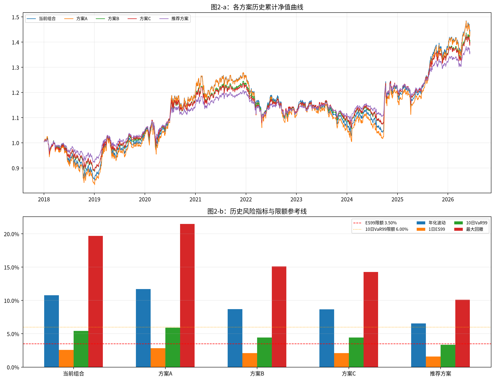
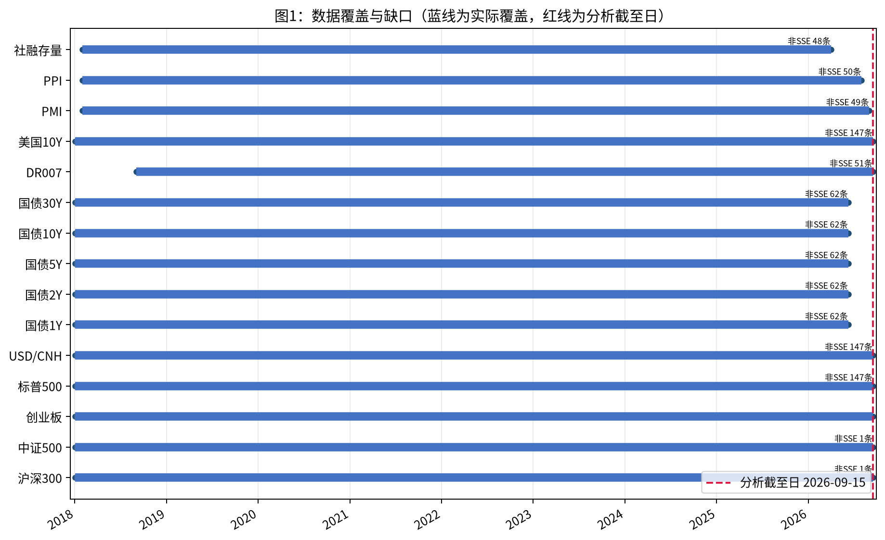
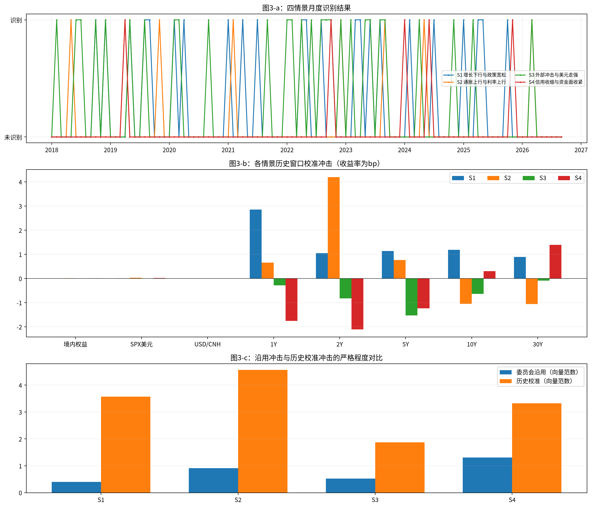
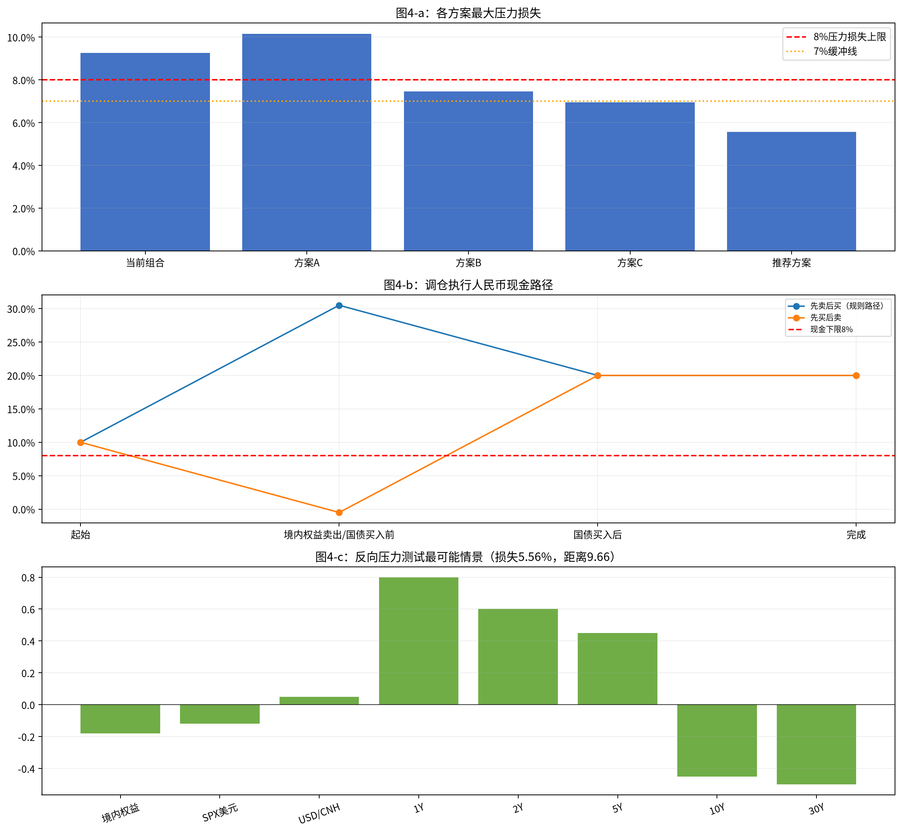
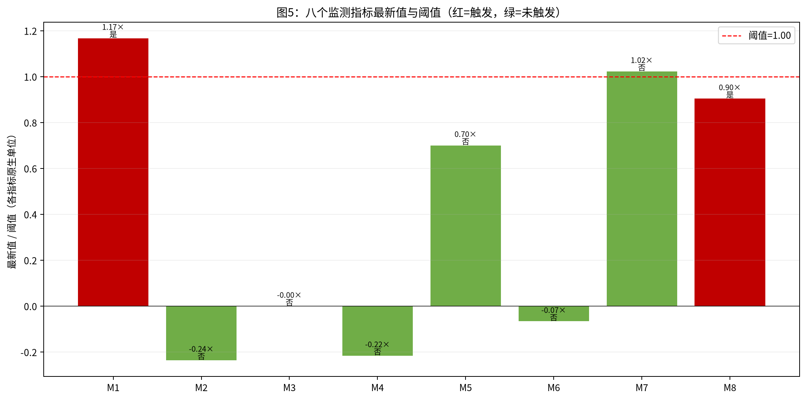

# 多资产稳健配置专户：三季度宏观压力测试与调仓建议
## 风险委员会决策备忘录

**分析截至日：2026-09-15；组合净值：10,000 万元；金额单位：万元。**

### 一、结论与建议

建议否决投资经理方案A、风险管理部方案B和宏观策略组方案C，按 `params_holdings.csv` 给出的**推荐方案**执行：境内权益由 50.00% 降至 29.50%，中长期国债升至 30.50%，人民币现金及货基升至 20.00%，美元现金与标普500 QDII 各维持 10.00%。推荐方案最大压力损失为 **5.56%**（S4 委员会沿用），1日 ES99 为 **1.57%**，10日 VaR99 为 **3.36%**，单向换手率为 **20.50%**；建议召开临时风险会议确认执行窗口，但不建议在数据未补齐前扩大风险预算。

推荐方案最大压力损失距 8.00%硬上限的裕度为 **2.44%**，距 7.00%缓冲线的裕度为 **1.44%**。图4-a同时给出8.00%上限和7.00%缓冲线。

### 二、数据核验与样本区间

核心市场风险样本为 **2018-01-03至2026-06-09，2,043个上交所估值日**。终止原因是五个中债国债期限序列实际共同终止于 **2026-06-09**；不得把其后的数据按前值外推为新的国债风险观测。估值日仍为 2026-09-15，监测指标分别保留各自真实截至日。

#### 实际覆盖区间与缺口

| 序列      | 实际起始       | 实际终止       | 非SSE记录数 |\n| ------- | ---------- | ---------- | ------- |\n| 沪深300   | 2018-01-02 | 2026-09-15 | 1       |\n| 中证500   | 2018-01-02 | 2026-09-15 | 1       |\n| 创业板     | 2018-01-02 | 2026-09-15 | 0       |\n| 标普500   | 2018-01-02 | 2026-09-15 | 147     |\n| USD/CNH | 2018-01-02 | 2026-09-15 | 147     |\n| 国债1Y    | 2018-01-02 | 2026-06-09 | 62      |\n| 国债2Y    | 2018-01-02 | 2026-06-09 | 62      |\n| 国债5Y    | 2018-01-02 | 2026-06-09 | 62      |\n| 国债10Y   | 2018-01-02 | 2026-06-09 | 62      |\n| 国债30Y   | 2018-01-02 | 2026-06-09 | 62      |\n| DR007   | 2018-09-03 | 2026-09-15 | 51      |\n| 美国10Y   | 2018-01-02 | 2026-09-15 | 147     |\n| PMI     | 2018-02-01 | 2026-09-01 | 49      |\n| PPI     | 2018-02-01 | 2026-08-01 | 50      |\n| 社融存量    | 2018-02-01 | 2026-04-01 | 48      |

数据核验先于计算，具体处理如下：

- 上交所交易日历作为唯一估值日历；不在该日历中的周末/休市记录从日收益、窗口和月度市场统计中剔除。三只境内指数中的 2026-09-12 周六记录以及各期限国债、DR007等非SSE日期均不进入日收益计算；图1显示实际覆盖与截至日。
- 三只境内指数首行 `pre_close` 为空属于结构性首日缺失，不用0代替；收益从首个有前值的有效估值日开始。LPR5Y在2019-08-20前的连续空值属于结构性空值，规则判断中保持缺失，不填0、不前填。
- 普通跨市场日期不一致时，先映射至SSE估值日，再对已有序列前向填充；序列起点前没有有效观测的结构性空值不填充。美元计SPX和USD/CNH先在SSE估值日对齐，人民币计收益严格按 `(1+SPX美元收益)*(1+USD/CNH变动)-1` 复合计算。
- 中债收益率的 `yield_pct` 变动先换算为bp；国债组合日收益为 `-Σ(关键期限久期贡献×收益率变动bp/10000)`，久期贡献来自 `params_duration.csv`，总和为7.00。委员会文件字段为 `cgb_shock_bp`，因此冲击值按bp原值使用，不作百分点放大。
- `afre_stock`按源文件的社会融资规模存量水平计算12个月同比增速，用于S4和M8；这是从水平序列派生同比，未把水平值误当成百分比。

### 三、当前组合风险画像

#### 当前持仓

| asset        | asset_class | 当前权重   | 推荐权重   | 金额（万元） |\n| ------------ | ----------- | ------ | ------ | ------ |\n| 沪深300指数基金    | EQ_000300   | 25.00% | 14.75% | 2500.0 |\n| 中证500指数基金    | EQ_000905   | 15.00% | 8.85%  | 1500.0 |\n| 创业板指数基金      | EQ_399006   | 10.00% | 5.90%  | 1000.0 |\n| 中长期国债组合      | CGB         | 20.00% | 30.50% | 2000.0 |\n| 美元现金及存款      | USD_CASH    | 10.00% | 10.00% | 1000.0 |\n| 标普500 QDII基金 | SPX         | 10.00% | 10.00% | 1000.0 |\n| 人民币现金及货基     | CNY_CASH    | 10.00% | 20.00% | 1000.0 |

#### 各资产日收益统计与相关矩阵

| 资产       | 日均收益  | 日波动   | 最小日收益   | 最大日收益  |\n| -------- | ----- | ----- | ------- | ------ |\n| 000300   | 0.02% | 1.21% | -7.88%  | 8.48%  |\n| 000905   | 0.02% | 1.41% | -9.55%  | 10.41% |\n| 399006   | 0.06% | 1.83% | -12.50% | 17.25% |\n| cgb      | 0.01% | 0.14% | -0.71%  | 1.13%  |\n| usd_cash | 0.00% | 0.27% | -1.57%  | 1.58%  |\n| spx_rmb  | 0.06% | 1.20% | -12.19% | 9.68%  |

相关矩阵（境内三指数、国债、美元现金、SPX人民币计）如下：

|          | 000300 | 000905 | 399006 | cgb    | usd_cash | spx_rmb |\n| -------- | ------ | ------ | ------ | ------ | -------- | ------- |\n| 000300   | 1.0    | 0.858  | 0.842  | -0.232 | -0.249   | 0.121   |\n| 000905   | 0.858  | 1.0    | 0.873  | -0.205 | -0.185   | 0.121   |\n| 399006   | 0.842  | 0.873  | 1.0    | -0.177 | -0.183   | 0.109   |\n| cgb      | -0.232 | -0.205 | -0.177 | 1.0    | 0.114    | -0.051  |\n| usd_cash | -0.249 | -0.185 | -0.183 | 0.114  | 1.0      | 0.031   |\n| spx_rmb  | 0.121  | 0.121  | 0.109  | -0.051 | 0.031    | 1.0     |

#### 组合风险指标

| 方案   | 年化波动   | 1日VaR95 | 1日VaR99 | 1日ES95 | 1日ES99 | 10日VaR99 | 10日最大累计损失 | 最大回撤   | 最差单日  |\n| ---- | ------ | ------- | ------- | ------ | ------ | -------- | --------- | ------ | ----- |\n| 当前组合 | 10.77% | 0.98%   | 1.79%   | 1.53%  | 2.60%  | 5.43%    | 8.48%     | 19.68% | 4.88% |

当前组合10日最大累计损失为 **8.48%**，区间为 **2020-03-06至2020-03-19**；最大回撤为 **19.68%**，区间起点 **2021-12-13**、低点 **2024-02-05**，修复日为 2025-08-13；最差单日损失为 **4.88%**（2025-04-07）。

波动率风险贡献占比为：

| 资产       | 风险贡献占比 |\n| -------- | ------ |\n| 000300   | 42.16% |\n| 000905   | 29.15% |\n| 399006   | 24.87% |\n| cgb      | -0.75% |\n| usd_cash | -0.66% |\n| spx_rmb  | 5.23%  |

图2-a展示各方案累计净值，图2-b展示年化波动、ES99、10日VaR99和最大回撤，并画出3.50% ES99和6.00% 10日VaR99参考线。

### 四、情景识别与历史校准

四情景均按 `rules_scenarios.csv` 的月度规则识别：S1为PMI低于50且LPR下调或PMI环比下降至少0.5且10Y收益率月均下降；S2为PPI同比上升、10Y月均收益率上升且权益下跌；S3为SPX月跌幅不低于3%或USD/CNH月升幅不低于1.5%；S4为社融存量同比增速下降、DR007月均上升且权益下跌。合格月份和窗口如下：

| 情景 | 名称         | 合格月份                                                                                                                                                                                                                                                       | 窗口校准口径                          | 选定窗口数 | 选定窗口                                                                                                                  |\n| -- | ---------- | ---------------------------------------------------------------------------------------------------------------------------------------------------------------------------------------------------------------------------------------------------------- | ------------------------------- | ----- | --------------------------------------------------------------------------------------------------------------------- |\n| S1 | 增长下行与政策宽松  | 2018-10, 2018-12, 2019-05, 2019-08, 2019-09, 2020-02, 2020-04, 2021-01, 2021-04, 2021-07, 2022-04, 2022-05, 2022-08, 2023-03, 2023-04, 2023-06, 2023-08, 2024-02, 2024-07, 2025-01, 2025-04, 2025-05, 2025-10                                              | 严格筛选 0 个；退化使用合格月份窗口中累计跌幅最差 20 个 | 20    | 2024-08-01至2024-08-14; 2020-03-02至2020-03-13; 2022-09-01至2022-09-15; 2023-09-01至2023-09-14; 2025-11-03至2025-11-14；其余略 |\n| S2 | 通胀上行与利率上行  | 2018-05, 2019-04, 2019-11, 2021-02, 2022-12, 2023-09, 2024-05, 2026-03                                                                                                                                                                                     | 严格筛选 0 个；退化使用合格月份窗口中累计跌幅最差 8 个  | 8     | 2019-05-06至2019-05-17; 2023-10-09至2023-10-20; 2021-03-01至2021-03-12; 2018-06-01至2018-06-14; 2024-06-03至2024-06-17；其余略 |\n| S3 | 外部冲击与美元走强  | 2018-02, 2018-06, 2018-07, 2018-10, 2018-12, 2019-05, 2019-08, 2020-02, 2020-03, 2020-09, 2021-09, 2022-01, 2022-02, 2022-04, 2022-06, 2022-08, 2022-09, 2022-10, 2022-12, 2023-02, 2023-05, 2023-06, 2023-08, 2023-09, 2024-04, 2024-11, 2025-03, 2026-03 | 严格筛选 0 个；退化使用合格月份窗口中累计跌幅最差 20 个 | 20    | 2022-03-01至2022-03-14; 2023-10-09至2023-10-20; 2025-04-01至2025-04-15; 2023-03-01至2023-03-14; 2018-08-01至2018-08-14；其余略 |\n| S4 | 信用收缩与资金面收紧 | 2019-04, 2022-10, 2024-01, 2024-06, 2025-11                                                                                                                                                                                                                | 严格筛选 0 个；退化使用合格月份窗口中累计跌幅最差 5 个  | 5     | 2019-05-06至2019-05-17; 2024-07-01至2024-07-12; 2025-12-01至2025-12-12; 2022-11-01至2022-11-14; 2024-02-01至2024-02-22     |

窗口起点为合格月份次月首个SSE交易日，长度10个SSE交易日；严格规则要求10日组合收益每日为负，再按累计跌幅取前20个。经核验，本输入样本四个情景均没有满足“10日每日全负”的窗口；为保证四情景×两套冲击完整可复算，本文透明地退化使用各情景合格月份所对应窗口中累计跌幅最差的前20个窗口，并在表中标注。该退化结果不应与严格规则下的正式校准混同，待数据补齐后重算。校准为所选窗口各因子10日累计变动中位数：

| 情景 | cn_equity | spx_usd | usdcnh | cgb_1y   | cgb_2y   | cgb_5y   | cgb_10y  | cgb_30y  |\n| -- | --------- | ------- | ------ | -------- | -------- | -------- | -------- | -------- |\n| S1 | 0.57%     | 0.68%   | 0.20%  | 2.85 bp  | 1.05 bp  | 1.13 bp  | 1.19 bp  | 0.90 bp  |\n| S2 | -0.80%    | 3.16%   | 0.01%  | 0.66 bp  | 4.19 bp  | 0.77 bp  | -1.05 bp | -1.06 bp |\n| S3 | -0.23%    | 0.22%   | 0.39%  | -0.29 bp | -0.82 bp | -1.53 bp | -0.64 bp | -0.09 bp |\n| S4 | 1.06%     | 2.20%   | -0.24% | -1.75 bp | -2.11 bp | -1.23 bp | 0.30 bp  | 1.39 bp  |

严格规则下四个情景均为0个窗口，故输入样本不满足“不少于20个”的正式校准条件；退化口径也仅使用实际存在的合格月份窗口，S2和S4分别只有8个和5个，未人为补造数据。委员会沿用冲击与历史校准冲击的比较见图3-b、图3-c：沿用冲击按文件字段的bp口径，退化校准反映实际窗口中的复合权益/汇率变化和收益率曲线形态，因此两者不应简单按单一总幅度替换。

### 五、压力测试结果

压力测试对当前组合、三个候选方案和推荐方案均计算四情景×两套冲击；每条记录拆分为境内权益、标普500人民币计、美元现金和国债四部分，四项贡献相加得到组合损益。完整矩阵如下（百分比为组合净值损益贡献）：

| 方案   | 情景 | 冲击    | 境内权益   | 标普500（人民币计） | 美元现金   | 国债     | 组合损益    | 压力损失   |\n| ---- | -- | ----- | ------ | ----------- | ------ | ------ | ------- | ------ |\n| 当前组合 | S1 | 委员会沿用 | -6.00% | -0.62%      | 0.20%  | -0.00% | -6.42%  | 6.42%  |\n| 当前组合 | S1 | 历史校准  | 0.29%  | 0.09%       | 0.02%  | -0.02% | 0.38%   | -0.38% |\n| 当前组合 | S2 | 委员会沿用 | -5.00% | -0.32%      | 0.30%  | 0.00%  | -5.02%  | 5.02%  |\n| 当前组合 | S2 | 历史校准  | -0.40% | 0.32%       | 0.00%  | 0.01%  | -0.08%  | 0.08%  |\n| 当前组合 | S3 | 委员会沿用 | -7.50% | -1.14%      | 0.80%  | -0.00% | -7.84%  | 7.84%  |\n| 当前组合 | S3 | 历史校准  | -0.12% | 0.06%       | 0.04%  | 0.01%  | -0.01%  | 0.01%  |\n| 当前组合 | S4 | 委员会沿用 | -9.00% | -0.76%      | 0.50%  | 0.00%  | -9.26%  | 9.26%  |\n| 当前组合 | S4 | 历史校准  | 0.53%  | 0.20%       | -0.02% | -0.00% | 0.70%   | -0.70% |\n| 方案A  | S1 | 委员会沿用 | -6.60% | -0.62%      | 0.20%  | -0.00% | -7.02%  | 7.02%  |\n| 方案A  | S1 | 历史校准  | 0.31%  | 0.09%       | 0.02%  | -0.01% | 0.41%   | -0.41% |\n| 方案A  | S2 | 委员会沿用 | -5.50% | -0.32%      | 0.30%  | 0.00%  | -5.52%  | 5.52%  |\n| 方案A  | S2 | 历史校准  | -0.44% | 0.32%       | 0.00%  | 0.01%  | -0.12%  | 0.12%  |\n| 方案A  | S3 | 委员会沿用 | -8.25% | -1.14%      | 0.80%  | -0.00% | -8.59%  | 8.59%  |\n| 方案A  | S3 | 历史校准  | -0.13% | 0.06%       | 0.04%  | 0.01%  | -0.02%  | 0.02%  |\n| 方案A  | S4 | 委员会沿用 | -9.90% | -0.76%      | 0.50%  | 0.00%  | -10.16% | 10.16% |\n| 方案A  | S4 | 历史校准  | 0.58%  | 0.20%       | -0.02% | -0.00% | 0.75%   | -0.75% |\n| 方案B  | S1 | 委员会沿用 | -4.80% | -0.62%      | 0.20%  | -0.00% | -5.22%  | 5.22%  |\n| 方案B  | S1 | 历史校准  | 0.23%  | 0.09%       | 0.02%  | -0.02% | 0.32%   | -0.32% |\n| 方案B  | S2 | 委员会沿用 | -4.00% | -0.32%      | 0.30%  | 0.00%  | -4.02%  | 4.02%  |\n| 方案B  | S2 | 历史校准  | -0.32% | 0.32%       | 0.00%  | 0.01%  | 0.00%   | -0.00% |\n| 方案B  | S3 | 委员会沿用 | -6.00% | -1.14%      | 0.80%  | -0.00% | -6.35%  | 6.35%  |\n| 方案B  | S3 | 历史校准  | -0.09% | 0.06%       | 0.04%  | 0.01%  | 0.02%   | -0.02% |\n| 方案B  | S4 | 委员会沿用 | -7.20% | -0.76%      | 0.50%  | 0.00%  | -7.46%  | 7.46%  |\n| 方案B  | S4 | 历史校准  | 0.42%  | 0.20%       | -0.02% | -0.00% | 0.59%   | -0.59% |\n| 方案C  | S1 | 委员会沿用 | -4.80% | -0.62%      | 0.40%  | -0.00% | -5.02%  | 5.02%  |\n| 方案C  | S1 | 历史校准  | 0.23%  | 0.09%       | 0.04%  | -0.01% | 0.34%   | -0.34% |\n| 方案C  | S2 | 委员会沿用 | -4.00% | -0.32%      | 0.60%  | 0.00%  | -3.72%  | 3.72%  |\n| 方案C  | S2 | 历史校准  | -0.32% | 0.32%       | 0.00%  | 0.01%  | 0.00%   | -0.00% |\n| 方案C  | S3 | 委员会沿用 | -6.00% | -1.14%      | 1.60%  | -0.00% | -5.54%  | 5.54%  |\n| 方案C  | S3 | 历史校准  | -0.09% | 0.06%       | 0.08%  | 0.01%  | 0.06%   | -0.06% |\n| 方案C  | S4 | 委员会沿用 | -7.20% | -0.76%      | 1.00%  | 0.00%  | -6.96%  | 6.96%  |\n| 方案C  | S4 | 历史校准  | 0.42%  | 0.20%       | -0.05% | -0.00% | 0.57%   | -0.57% |\n| 推荐方案 | S1 | 委员会沿用 | -3.54% | -0.62%      | 0.20%  | -0.00% | -3.96%  | 3.96%  |\n| 推荐方案 | S1 | 历史校准  | 0.17%  | 0.09%       | 0.02%  | -0.02% | 0.25%   | -0.25% |\n| 推荐方案 | S2 | 委员会沿用 | -2.95% | -0.32%      | 0.30%  | 0.00%  | -2.97%  | 2.97%  |\n| 推荐方案 | S2 | 历史校准  | -0.24% | 0.32%       | 0.00%  | 0.01%  | 0.09%   | -0.09% |\n| 推荐方案 | S3 | 委员会沿用 | -4.42% | -1.14%      | 0.80%  | -0.00% | -4.77%  | 4.77%  |\n| 推荐方案 | S3 | 历史校准  | -0.07% | 0.06%       | 0.04%  | 0.01%  | 0.05%   | -0.05% |\n| 推荐方案 | S4 | 委员会沿用 | -5.31% | -0.76%      | 0.50%  | 0.01%  | -5.56%  | 5.56%  |\n| 推荐方案 | S4 | 历史校准  | 0.31%  | 0.20%       | -0.02% | -0.00% | 0.48%   | -0.48% |

各方案最大压力损失及来源：

| 方案   | 最大压力损失 | 来源       |\n| ---- | ------ | -------- |\n| 当前组合 | 9.26%  | S4 委员会沿用 |\n| 方案A  | 10.16% | S4 委员会沿用 |\n| 方案B  | 7.46%  | S4 委员会沿用 |\n| 方案C  | 6.96%  | S4 委员会沿用 |\n| 推荐方案 | 5.56%  | S4 委员会沿用 |

委员会沿用冲击与历史校准冲击的严格程度由各因子共同决定：权益和汇率按复合口径，国债按久期折算；图3-c给出因子向量范数比较，图4-a给出各方案最大压力损失及8.00%/7.00%参考线。推荐方案在最差情景下仍需保留执行和模型误差余量，故采用7.00%缓冲线而非仅满足8.00%硬限额。

### 六、候选方案评估与九项约束检查

逐条检查结果如下；L5按“美元现金+未对冲汇率SPX QDII”计算，未把SPX QDII漏计为外币敞口，也未将其重复计入境内权益L2：

| 方案   | 限额 | 约束          | 实际值     | 结论  | 超限幅度  |\n| ---- | -- | ----------- | ------- | --- | ----- |\n| 方案A  | L1 | 权重合计        | 100.00% | 通过  | 0.00% |\n| 方案A  | L2 | 权益类资产合计     | 55.00%  | 通过  | 0.00% |\n| 方案A  | L3 | 人民币现金及货基    | 10.00%  | 通过  | 0.00% |\n| 方案A  | L4 | 中长期国债组合     | 15.00%  | 通过  | 0.00% |\n| 方案A  | L5 | 外币资产敞口      | 20.00%  | 通过  | 0.00% |\n| 方案A  | L6 | 1 日 ES99    | 2.84%   | 通过  | 0.00% |\n| 方案A  | L7 | 10 日 VaR99  | 5.91%   | 通过  | 0.00% |\n| 方案A  | L8 | 最大压力损失      | 10.16%  | 未通过 | 2.16% |\n| 方案A  | L9 | 最大压力损失（缓冲线） | 10.16%  | 未通过 | 3.16% |\n| 方案B  | L1 | 权重合计        | 100.00% | 通过  | 0.00% |\n| 方案B  | L2 | 权益类资产合计     | 40.00%  | 通过  | 0.00% |\n| 方案B  | L3 | 人民币现金及货基    | 15.00%  | 通过  | 0.00% |\n| 方案B  | L4 | 中长期国债组合     | 25.00%  | 通过  | 0.00% |\n| 方案B  | L5 | 外币资产敞口      | 20.00%  | 通过  | 0.00% |\n| 方案B  | L6 | 1 日 ES99    | 2.10%   | 通过  | 0.00% |\n| 方案B  | L7 | 10 日 VaR99  | 4.44%   | 通过  | 0.00% |\n| 方案B  | L8 | 最大压力损失      | 7.46%   | 通过  | 0.00% |\n| 方案B  | L9 | 最大压力损失（缓冲线） | 7.46%   | 未通过 | 0.46% |\n| 方案C  | L1 | 权重合计        | 100.00% | 通过  | 0.00% |\n| 方案C  | L2 | 权益类资产合计     | 40.00%  | 通过  | 0.00% |\n| 方案C  | L3 | 人民币现金及货基    | 12.00%  | 通过  | 0.00% |\n| 方案C  | L4 | 中长期国债组合     | 18.00%  | 通过  | 0.00% |\n| 方案C  | L5 | 外币资产敞口      | 30.00%  | 未通过 | 5.00% |\n| 方案C  | L6 | 1 日 ES99    | 2.09%   | 通过  | 0.00% |\n| 方案C  | L7 | 10 日 VaR99  | 4.43%   | 通过  | 0.00% |\n| 方案C  | L8 | 最大压力损失      | 6.96%   | 通过  | 0.00% |\n| 方案C  | L9 | 最大压力损失（缓冲线） | 6.96%   | 通过  | 0.00% |\n| 推荐方案 | L1 | 权重合计        | 100.00% | 通过  | 0.00% |\n| 推荐方案 | L2 | 权益类资产合计     | 29.50%  | 通过  | 0.00% |\n| 推荐方案 | L3 | 人民币现金及货基    | 20.00%  | 通过  | 0.00% |\n| 推荐方案 | L4 | 中长期国债组合     | 30.50%  | 通过  | 0.00% |\n| 推荐方案 | L5 | 外币资产敞口      | 20.00%  | 通过  | 0.00% |\n| 推荐方案 | L6 | 1 日 ES99    | 1.57%   | 通过  | 0.00% |\n| 推荐方案 | L7 | 10 日 VaR99  | 3.36%   | 通过  | 0.00% |\n| 推荐方案 | L8 | 最大压力损失      | 5.56%   | 通过  | 0.00% |\n| 推荐方案 | L9 | 最大压力损失（缓冲线） | 5.56%   | 通过  | 0.00% |

方案A/B/C的未通过项由表中“未通过”和超限幅度直接给出；推荐方案按九项检查全部通过的规则评估。L9是推荐方案的额外7.00%缓冲要求，不是把L8的8.00%上限重复解释为另一类资产限额。

### 七、推荐方案与调仓执行

#### 推荐权重与构造依据

推荐方案完整权重为：沪深300 **14.75%**、中证500 **8.85%**、创业板 **5.90%**、中长期国债 **30.50%**、美元现金 **10.00%**、SPX QDII **10.00%**、人民币现金 **20.00%**。依据是：美元现金和SPX各10.00%不变；境内三项权益按当前权重同比例乘以0.59；释放的20.50个百分点中10.50个百分点配置国债、10.00个百分点留作人民币现金。

在该规则下推荐方案具有唯一性：三项境内权益的比例缩减系数、两项外币资产的固定权重、国债与人民币现金的资金分配均已被规则确定，故没有第二个满足同一构造规则的权重向量。作为放宽比例缩减规则的对照，同样单向换手率下，网格搜索得到的次优可行组合为：沪深300 0.00%、中证500 0.00%、创业板 29.50%、国债 30.50%、人民币现金 20.00%，最大压力损失 5.56%；这只是放宽规则后的比较，不改变规则下的唯一推荐。

#### 交易清单与顺序

| 证券/资产     | 方向 | 金额（万元） | 权重变动    |\n| --------- | -- | ------ | ------- |\n| 沪深300指数基金 | 卖出 | 1025.0 | -10.25% |\n| 中证500指数基金 | 卖出 | 615.0  | -6.15%  |\n| 创业板指数基金   | 卖出 | 410.0  | -4.10%  |\n| 中长期国债组合   | 买入 | 1050.0 | 10.50%  |\n| 人民币现金及货基  | 买入 | 1000.0 | 10.00%  |

按规则先卖后买：第一步卖出沪深300、中证500、创业板合计2,050.00万元；第二步买入中长期国债1,050.00万元；剩余1,000.00万元卖出款保留在人民币现金及货基，使其从1,000.00万元升至2,000.00万元。美元现金和SPX QDII不交易，因此不存在QDII赎回款T+7对本次目标权重的当日资金贡献。

先卖后买路径的人民币现金占比为10.00%→30.50%→20.00%，全程高于8.00%下限。若先买后卖，先支付1,050.00万元国债款会使人民币现金占比降至-0.50%，随后才回升，直接击穿8.00%下限；因此不允许先买后卖。图4-b给出两条路径和8.00%下限线。

### 八、反向压力测试与监测预警

推荐方案最大压力损失为 **5.56%**，距8.00%压力上限裕度 **2.44%**，压力损失相当于上限的 **0.70倍**。样本内最差10日累计损失为 **5.73%**，区间为 **2020-03-06至2020-03-19**。

反向压力测试以推荐方案损失达到8.00%为等式边界，以境内权益、SPX美元收益为非正、USD/CNH为非负，并以历史10日因子协方差定义马氏距离；得到最小距离 **9.66** 的最可能因子组合：境内权益 **-18.00%**、SPX美元 **-12.00%**、USD/CNH **5.00%**、国债1Y **0.80 bp**、2Y **0.60 bp**、5Y **0.45 bp**、10Y **-0.45 bp**、30Y **-0.50 bp**。约束条件是8.00%损失边界、上述方向边界及各期限±500bp搜索边界；结果用于识别最可能越限方向，不替代委员会情景。

委员会沿用冲击与历史校准冲击的马氏距离如下：

| 情景 | 委员会沿用 | 历史校准 |\n| -- | ----- | ---- |\n| S1 | 6.2   | 0.58 |\n| S2 | 5.5   | 1.4  |\n| S3 | 10.54 | 0.52 |\n| S4 | 9.66  | 0.74 |

监测指标截至各自实际最新日期如下；因国债、PPI、社融等数据存在截断，未将滞后数据伪装为2026-09-15同步观测：

| monitor_id | 监测指标             | 阈值        | 最新值        | 截至日        | 状态  | 是否触发 |\n| ---------- | ---------------- | --------- | ---------- | ---------- | --- | ---- |\n| M1         | 沪深300 20日收益      | -5.00%    | -5.84%     | 2026-09-15 | 触发  | 是    |\n| M2         | USD/CNH 20日变化    | +2.00%    | -0.47%     | 2026-09-15 | 未触发 | 否    |\n| M3         | DR007资金面变化       | +20.00bp  | -0.02 bp   | 2026-09-15 | 未触发 | 否    |\n| M4         | 10年期国债收益率20日变化   | +10.00bp  | -2.16 bp   | 2026-06-09 | 未触发 | 否    |\n| M5         | 美国10年期国债收益率20日变化 | +40.00bp  | 28.00 bp   | 2026-09-15 | 未触发 | 否    |\n| M6         | PPI同比加速          | +1.50个百分点 | -0.10 个百分点 | 2026-08    | 未触发 | 否    |\n| M7         | 制造业PMI荣枯线        | 49.00     | 50.10      | 2026-09    | 未触发 | 否    |\n| M8         | 社融存量增速           | 8.00%     | 7.23%      | 2026-04    | 触发  | 是    |

若上游补齐中债曲线至2026-09-15、PPI至最新月、社融存量至最新月及结构性缺口说明，应重新计算共同样本、情景识别、校准冲击、ES99/VaR99、压力矩阵和监测状态，并在下一次风险会议前替换本备忘录中的滞后指标；在补齐前不调整本次已确定的8.00%硬限额和8.00%现金执行下限。

---

**附件**

- `FIN3-WKN-149_reproduce.py`
- `FIN3-WKN-149_charts/FIN3-WKN-149_chart01_数据覆盖与缺口.png`
- `FIN3-WKN-149_charts/FIN3-WKN-149_chart02_历史风险总览.png`
- `FIN3-WKN-149_charts/FIN3-WKN-149_chart03_情景识别与校准.png`
- `FIN3-WKN-149_charts/FIN3-WKN-149_chart04_方案决策与执行.png`
- `FIN3-WKN-149_charts/FIN3-WKN-149_chart05_监测指标触发状态.png`
