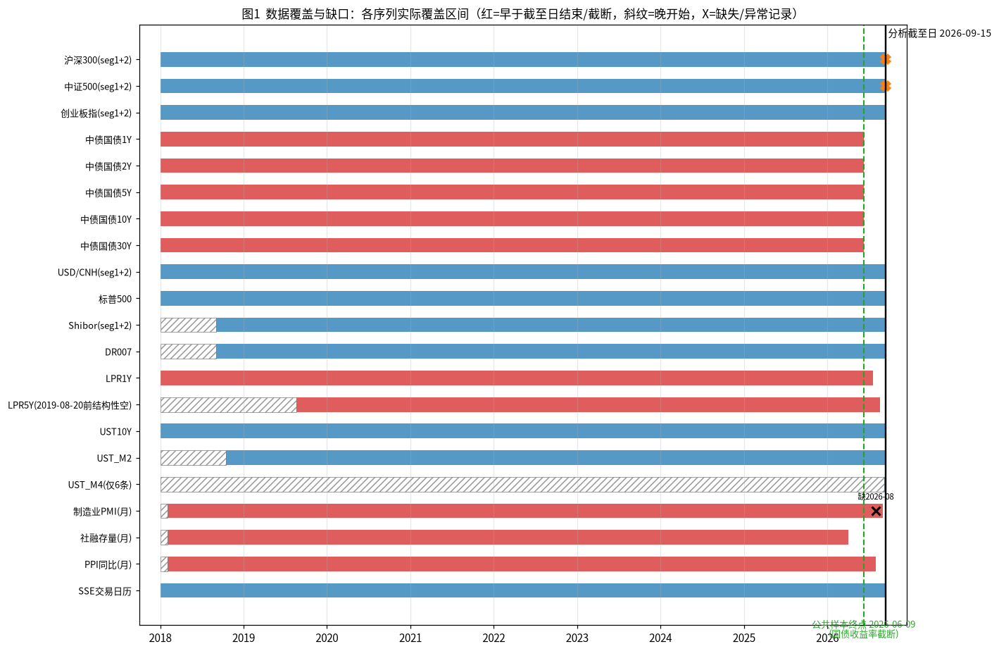
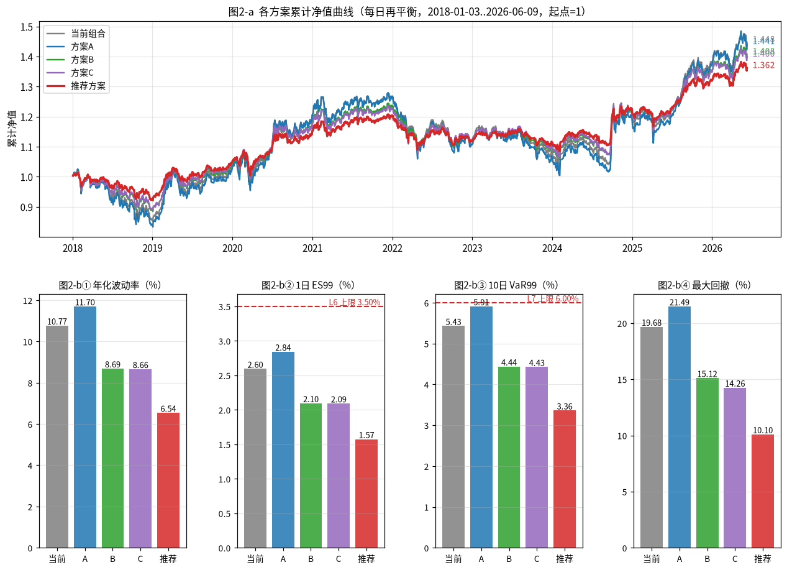
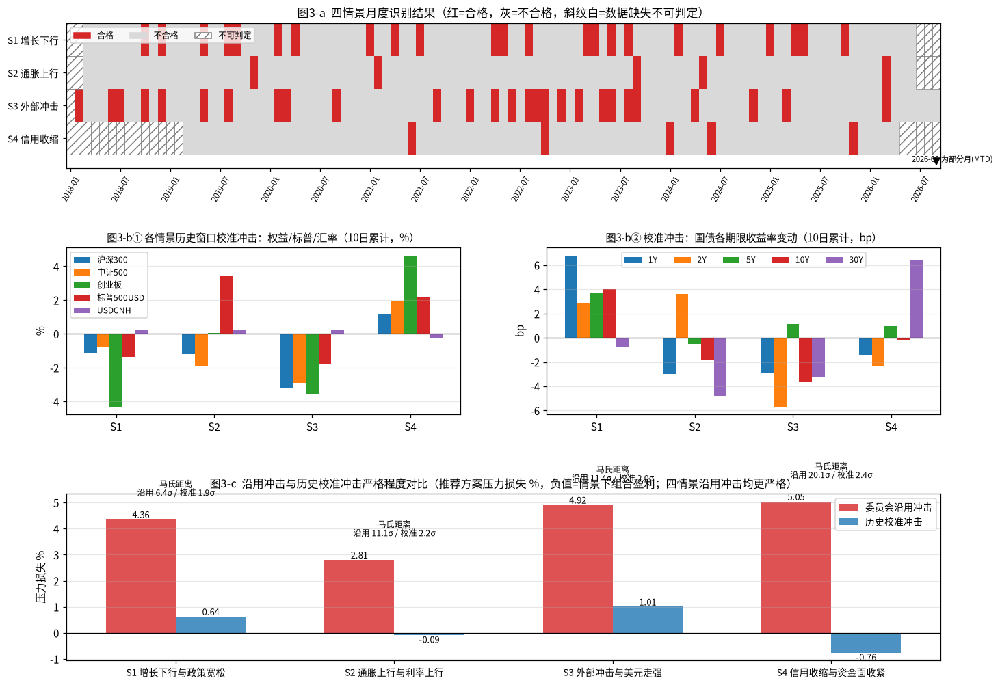
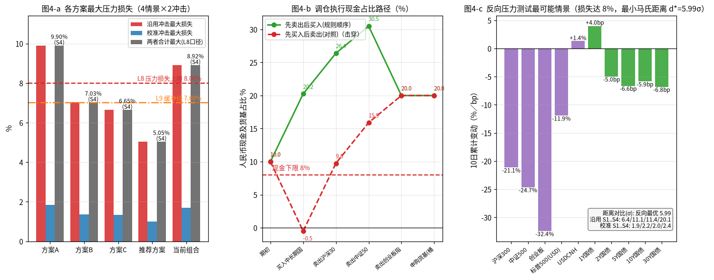
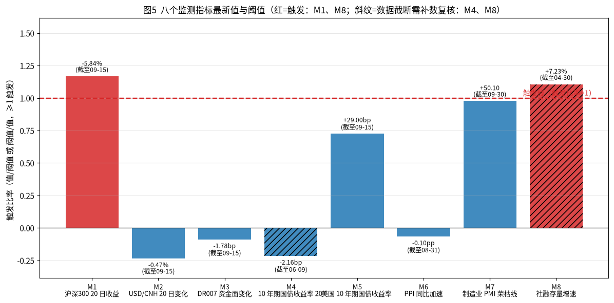

# 多资产稳健配置专户 三季度宏观压力测试与调仓建议
## 风险委员会决策备忘录

> 分析截至日：2026-09-15；组合净值：10,000.00 万元；金额单位：万元；百分比保留两位小数；收益率变动注明 bp 或 %。
> 全部数字可由 `FIN3-WKN-149_reproduce.py` 自 `input_files/` 原始快照复算；图表见 `FIN3-WKN-149_charts/`。

---

### 一、结论与建议

**处置意见（一句话）**：当前组合最大压力损失 8.92% 已突破 L8 上限（8.00%）与 L9 缓冲线（7.00%），必须调仓；三个候选方案中 A、B、C 均存在约束未通过项，不予采纳；**建议采纳按 `rules_rebalance.csv` 构造规则生成的推荐方案**（境内权益 14.75%/8.85%/5.90%、国债 30.50%、美元现金 10.00%、标普500 QDII 10.00%、人民币现金及货基 20.00%），其为全部五套权重中唯一通过九项约束检查的组合。

**推荐方案关键指标**：

| 指标 | 数值 | 限额/参照 |
| --- | --- | --- |
| 最大压力损失（4 情景 × 2 套冲击） | 5.05%（S4 信用收缩与资金面收紧 / 委员会沿用冲击） | L8 ≤8.00%、L9 ≤7.00%，裕度 2.95pp / 1.95pp |
| 1 日 ES99 | 1.57% | L6 ≤3.50% |
| 10 日 VaR99 | 3.36% | L7 ≤6.00% |
| 年化波动率 | 6.54% | — |
| 单向换手率（卖出合计/净值） | 20.50%（2,050.00 万元） | 候选集内唯一全通过者 |
| 九项约束检查 | 全部通过 | C1–C9 |

**是否需要提请临时风险会议**：**不需要**。监测指标 8 项中 2 项触发（M1 沪深300 20 日收益 −5.84%、M8 社融存量增速 7.23%），其中 M8 的数据截至 2026-04（序列截断）、M4 的数据截至 2026-06-09（序列截断），触发/未触发状态均需在补数后复核；M1 的下跌已充分体现在压力与历史模拟结果中，推荐方案在其之上仍留有 2.95pp 的 L8 裕度。建议将 M1、M8 列为观察项，按第八章安排补齐数据后重跑复核；若补数后 M8 仍低于 8.00% 或 M1 进一步恶化且推荐方案裕度被压缩至 1pp 以内，再提请临时风险会议。

---

### 二、数据核验与样本区间

**样本区间与终止原因**：上交所（SSE）估值日历覆盖 2018-01-02 至 2026-09-15，共 2,113 个估值日，无重复、无周末日期。组合收益的公共样本区间为 **2018-01-02 至 2026-06-09，共 2,044 个 SSE 估值日（2,043 个日收益）**；终止原因为中债国债收益率五个关键期限（1Y/2Y/5Y/10Y/30Y）均截断于 2026-06-09，早于分析截至日。空值一律不按 0 参与计算，也不做跨截断日的外推，故公共样本在该日终止。

**各序列覆盖、缺失期次与截断标记**：

| 序列 | 覆盖区间（对齐后） | 缺失/截断/结构性空值 | 处理方式 |
| --- | --- | --- | --- |
| 沪深300 / 中证500 / 创业板指（seg1+seg2 拼接） | 2018-01-02..2026-09-15 | 无缺失 | 直接采用收盘价 |
| 中债国债 1Y/2Y/5Y/10Y/30Y | 2018-01-02..2026-06-09 | 截断（早于截至日 98 个自然日） | 截断处终止公共样本，不外推 |
| USD/CNH（seg1+seg2） | 2018-01-02..2026-09-15 | 覆盖内缺 86 个 SSE 日 | 覆盖内前向填充 |
| 标普500 | 2018-01-02..2026-09-15 | 覆盖内缺 73 个 SSE 日 | 覆盖内前向填充 |
| UST10Y | 2018-01-02..2026-09-15 | 覆盖内缺 84 个 SSE 日 | 覆盖内前向填充 |
| Shibor / DR007 | 2018-09-03..2026-09-15 | 晚于样本起点开始 | 仅在其覆盖内使用 |
| LPR1Y | 2018-01-02..2026-07-20 | 截断；缺 2026-08-20 公告行 | 截断处停止更新，不填充 |
| LPR5Y | 2018-01-02..2026-08-20 | 2019-08-20 首次发布前 406 条为**结构性空值**；截断 | 结构性空值不填充、不按 0 处理，S1 的 LPR 分支自 2019-08-20 起方可判定 |
| 制造业 PMI（月） | 2018-02..2026-09 | 缺 2026-08 期次 | 该月情景判定记为数据缺失，不插值 |
| 社融存量（月） | 2018-02..2026-04 | 截断（早于截至日） | S4 在 2026-05 起记为不可判定 |
| PPI 同比（月） | 2018-02..2026-08 | 截断 | 覆盖内使用 |
| UST_M2 / UST_M4 | 2018-10-16..2026-09-15 / 2026-09-08..2026-09-15 | M4 仅 6 条 | 仅用于监测参考，不进入收益计算 |

manifest 中 `possible_truncation` 字段仅 shibor_seg2 标注 `false`、其余为空，与文件实际截断情况不符；本次核验以文件实际内容为准（见下图红条）。

**休市日异常记录的识别与剔除**：沪深300 与中证500 快照中存在 2026-09-12（星期六，非 SSE 交易日）记录，判据为——① O=H=L=C 四价完全相同（4510.1554 / 7580.5371）；② 成交额仅为前 20 日均值的 1.71% / 0.89%；③ 次一交易日的 pre_close 等于该异常日前一交易日的收盘价（即交易所链条不承认该记录）。三条同时满足，判定为休市日伪记录，**予以剔除**。另有银行间市场调休补班日/公告日记录（中债 62 条、Shibor 51 条、DR007 51 条、LPR1Y 11 条、LPR5Y 11 条，其中周末日期 60/50/50/11/11 条）：经核对中债 10Y 周末记录中与前一日取值相同的仅 4/60 条，确认为真实报价而非复制填充，**不剔除**，但因不在 SSE 估值日历内而不参与对齐与收益计算。

**汇率对齐口径与价格对齐方法**：全部序列统一 reindex 至 SSE 估值日历；USD/CNH、标普500、UST10Y、LPR 等他市场序列仅在**自身覆盖区间内**对缺失的 SSE 估值日前向填充（ffill），覆盖区间之外（截断段）保持空值、不外推。标普500 的人民币计收益采用复合口径 `r_CNY = (1+r_SPX,USD)×(1+r_USDCNH) − 1`，不作加法近似；国债组合收益采用关键期限久期口径 `r = −Σ_t D_t × Δy_t/100`（D = 1Y:0.1, 2Y:0.3, 5Y:1.2, 10Y:3.6, 30Y:1.8，合计 7.0），不作收益率变动的简单加总。

*图1：各序列在 SSE 估值日历下的实际覆盖区间，红条为早于分析截至日结束的截断序列、斜纹为晚开始或结构性空值段、X 为缺失期次/异常记录，绿色虚线为公共样本终止日 2026-06-09。*

---

### 三、当前组合风险画像

**当前持仓**（净值 10,000.00 万元）：

| 资产 | 权重 | 金额（万元） |
| --- | --- | --- |
| 沪深300指数基金 | 25.00% | 2,500.00 |
| 中证500指数基金 | 15.00% | 1,500.00 |
| 创业板指数基金 | 10.00% | 1,000.00 |
| 中长期国债组合 | 20.00% | 2,000.00 |
| 美元现金及存款 | 10.00% | 1,000.00 |
| 标普500 QDII基金 | 10.00% | 1,000.00 |
| 人民币现金及货基 | 10.00% | 1,000.00 |

**各资产日收益统计特征**（2018-01-03..2026-06-09，n=2,043，日频，%）：

| 资产 | 均值 | 波动 | 偏度 | 超额峰度 | 最小 | 最大 |
| --- | --- | --- | --- | --- | --- | --- |
| 沪深300 | 0.02 | 1.21 | −0.091 | 4.873 | −7.88 | 8.48 |
| 中证500 | 0.02 | 1.41 | −0.266 | 5.829 | −9.55 | 10.41 |
| 创业板 | 0.06 | 1.83 | +0.550 | 8.532 | −12.50 | 17.25 |
| 中长期国债 | 0.01 | 0.14 | +0.257 | 5.504 | −0.72 | 1.13 |
| 美元现金 | 0.00 | 0.27 | −0.064 | 4.150 | −1.57 | 1.58 |
| 标普500 QDII（人民币计） | 0.06 | 1.20 | −0.404 | 14.381 | −12.19 | 9.68 |
| 人民币现金 | 0.00 | 0.00 | — | — | 0.00 | 0.00 |

（口径假设：美元现金日收益取 USD/CNH 汇率变动、存款利息记 0；人民币现金收益记 0；二者均在脚本中显式披露。）

**相关矩阵**（人民币现金零方差，相关系数无定义记 —）：

| | 沪深300 | 中证500 | 创业板 | 国债 | 美元现金 | 标普500QDII | 人民币现金 |
| --- | --- | --- | --- | --- | --- | --- | --- |
| 沪深300 | 1.000 | 0.858 | 0.842 | −0.232 | −0.249 | 0.121 | — |
| 中证500 | 0.858 | 1.000 | 0.873 | −0.205 | −0.185 | 0.121 | — |
| 创业板 | 0.842 | 0.873 | 1.000 | −0.177 | −0.183 | 0.109 | — |
| 国债 | −0.232 | −0.205 | −0.177 | 1.000 | 0.114 | −0.051 | — |
| 美元现金 | −0.249 | −0.185 | −0.183 | 0.114 | 1.000 | 0.031 | — |
| 标普500QDII | 0.121 | 0.121 | 0.109 | −0.051 | 0.031 | 1.000 | — |
| 人民币现金 | — | — | — | — | — | — | — |

**组合层面历史风险指标**（每日再平衡口径；VaR/ES 为历史模拟法，10 日 VaR99 为滚动重叠 10 日收益）：

| 组合 | 年化波动 | 1日VaR95 | 1日VaR99 | 1日ES95 | 1日ES99 | 10日VaR99 | 最大回撤 | 回撤区间（峰→谷） | 修复日 | 10日最大累计损失（区间） | 最差单日 |
| --- | --- | --- | --- | --- | --- | --- | --- | --- | --- | --- | --- |
| 当前组合 | 10.77% | 0.98% | 1.79% | 1.53% | 2.60% | 5.43% | 19.68% | 2021-12-13→2024-02-05 | 2025-08-13 | −8.48%（2020-03-06..2020-03-19） | −4.88%（2025-04-07） |
| 方案A | 11.70% | 1.08% | 1.93% | 1.67% | 2.84% | 5.91% | 21.49% | 2021-12-13→2024-02-05 | 2025-08-18 | −9.10%（2020-03-06..2020-03-19） | −5.28%（2025-04-07） |
| 方案B | 8.69% | 0.79% | 1.41% | 1.23% | 2.10% | 4.44% | 15.12% | 2021-12-13→2024-02-05 | 2025-07-18 | −7.15%（2020-03-06..2020-03-19） | −3.97%（2025-04-07） |
| 方案C | 8.66% | 0.80% | 1.41% | 1.23% | 2.09% | 4.43% | 14.26% | 2021-12-13→2024-02-05 | 2024-10-08 | −6.91%（2020-03-06..2020-03-19） | −3.97%（2025-04-07） |
| 推荐方案 | 6.54% | 0.59% | 1.04% | 0.92% | 1.57% | 3.36% | 10.10% | 2021-12-13→2024-02-05 | 2024-10-08 | −5.73%（2020-03-06..2020-03-19） | −3.00%（2025-04-07） |

**当前组合各资产风险贡献**（欧拉分解，占组合日波动 0.68%/日 的百分比）：沪深300 42.16%、中证500 29.15%、创业板 24.87%、标普500 QDII 5.23%、中长期国债 −0.75%、美元现金 −0.66%、人民币现金 0.00%。境内权益三项合计贡献 96.18%，是风险的绝对来源；国债与美元现金贡献为负，体现对冲价值。

*图2：五个权重方案的累计净值曲线（图2-a）与年化波动、1日ES99、10日VaR99、最大回撤四项指标对比（图2-b①–④），b②/b③ 中红色虚线为 L6（3.50%）与 L7（6.00%）限额参考线。*

---

### 四、情景识别与历史校准

**月度识别规则与合格月份**（规则取自 `rules_scenarios.csv`；三值逻辑：合格/不合格/不可判定，数据缺失记不可判定，不按 0 判定；"权益指数当月下跌"取沪深300 当月收益<0，已在脚本中披露该假设；2026-09 为部分月，MTD 至 09-15）：

| 情景 | 月度识别规则 | 合格月份（全部） | 不可判定月份 |
| --- | --- | --- | --- |
| S1 增长下行与政策宽松 | PMI 月值<50 且（1Y 或 5Y LPR 当月下调），或 PMI 环比下行≥0.5 且 10Y 国债月均值低于上月 | n=23：2018-10, 2018-12, 2019-05, 2019-08, 2019-09, 2020-02, 2020-04, 2021-01, 2021-04, 2021-07, 2022-04, 2022-05, 2022-08, 2023-03, 2023-04, 2023-06, 2023-08, 2024-02, 2024-07, 2025-01, 2025-04, 2025-05, 2025-10 | 2018-01, 2018-02, 2026-07, 2026-08, 2026-09 |
| S2 通胀上行与利率上行 | PPI 同比高于上月 且 10Y 国债月均值高于上月 且 权益指数当月下跌 | n=5：2019-11, 2021-02, 2023-09, 2024-05, 2026-03 | 2018-01, 2018-02, 2026-07, 2026-08, 2026-09 |
| S3 外部冲击与美元走强 | 标普500 当月收益≤−3% 或 USD/CNH 当月变化≥+1.5% | n=27：2018-02, 2018-06, 2018-07, 2018-10, 2018-12, 2019-05, 2019-08, 2020-02, 2020-03, 2020-09, 2021-09, 2022-01, 2022-04, 2022-06, 2022-08, 2022-09, 2022-10, 2022-12, 2023-02, 2023-05, 2023-06, 2023-08, 2023-09, 2024-04, 2024-11, 2025-03, 2026-03 | 2018-01 |
| S4 信用收缩与资金面收紧 | 社融存量同比增速低于上月 且 DR007 月均值高于上月 且 权益指数当月下跌 | n=5：2021-06, 2022-10, 2024-01, 2024-06, 2025-11 | 2018-01..2019-02（Shibor/DR007 未开始）, 2026-05..2026-09（社融截断） |

S3 的 2026-09 部分月：标普500 MTD −1.31%、USD/CNH MTD −0.13%，两分支均不满足，未合格。

**历史窗口与校准冲击**：窗口定义为合格月份次月首个 SSE 交易日起的 10 个 SSE 交易日（`rules_windows.csv`）。规则第一句要求"窗口内组合日收益全部为负"，但当前组合含 40% 现金+国债、样本内不存在 10 连阴窗口（0 个满足）；按规则第二句回退——同类窗口按组合累计跌幅排序取最深者，每情景取前 5 个、四情景合计 20 个，满足"不少于 20 个"的最低要求。校准冲击取选定窗口内各风险因子累计变动的**中位数**：

| 情景 | 选定窗口（月份→区间） | 沪深300 | 中证500 | 创业板 | 标普500(USD) | USD/CNH | 1Y | 2Y | 5Y | 10Y | 30Y |
| --- | --- | --- | --- | --- | --- | --- | --- | --- | --- | --- | --- |
| S1 | 2024-07→[08-01..08-14]、2020-02→[03-02..03-13]、2022-08→[09-01..09-15]、2023-08→[09-01..09-14]、2025-10→[11-03..11-14] | −1.14% | −0.78% | −4.31% | −1.36% | +0.25% | +6.8bp | +2.9bp | +3.7bp | +4.0bp | −0.7bp |
| S2 | 2023-09→[10-09..10-20]、2021-02→[03-01..03-12]、2024-05→[06-03..06-17]、2019-11→[12-02..12-13]、2026-03→[04-01..04-15] | −1.22% | −1.91% | +0.06% | +3.47% | +0.20% | −3.0bp | +3.6bp | −0.5bp | −1.8bp | −4.8bp |
| S3 | 2023-09→[10-09..10-20]、2025-03→[04-01..04-15]、2023-02→[03-01..03-14]、2018-07→[08-01..08-14]、2020-02→[03-02..03-13] | −3.24% | −2.91% | −3.54% | −1.76% | +0.25% | −2.9bp | −5.7bp | +1.1bp | −3.6bp | −3.2bp |
| S4 | 2021-06→[07-01..07-14]、2024-06→[07-01..07-12]、2025-11→[12-01..12-12]、2022-10→[11-01..11-14]、2024-01→[02-01..02-22] | +1.20% | +1.97% | +4.64% | +2.20% | −0.24% | −1.4bp | −2.3bp | +1.0bp | −0.2bp | +6.4bp |

**委员会沿用冲击**（`params_committee_shocks.csv`；国债栏数值口径为百分点，即 +0.20 = +20bp，该口径与校准冲击量级可比，已在脚本中披露）：

| 情景 | 境内权益 | 标普500(USD) | USD/CNH | 1Y | 2Y | 5Y | 10Y | 30Y |
| --- | --- | --- | --- | --- | --- | --- | --- | --- |
| S1 | −12.00% | −8.00% | +2.00% | +10bp | +12bp | +10bp | +20bp | +25bp |
| S2 | −10.00% | −6.00% | +3.00% | +60bp | +50bp | +30bp | −15bp | −30bp |
| S3 | −15.00% | −18.00% | +8.00% | −30bp | −25bp | −10bp | +10bp | +20bp |
| S4 | −18.00% | −12.00% | +5.00% | +80bp | +60bp | +45bp | −45bp | −50bp |

**严格程度与曲线形态差异**：① 严格程度——委员会沿用冲击在四个情景上均显著严于历史校准：境内权益 −10%~−18% 对校准 −3.24%~+1.20%，约为历史同情景中位冲击的 4~15 倍；以 10 日因子协方差衡量的马氏距离为 6.39~20.12σ，而校准冲击仅 1.89~2.36σ（见第八章）。② 曲线形态——委员会 S1 为长端更陡的上移（10Y+20bp、30Y+25bp 大于短端 +10bp），校准 S1 为近乎平坦的温和上移（+3~+7bp）；委员会 S2 为"短升长降"的熊陡扭转（1Y+60bp、30Y−30bp），校准 S2 各期限变动不足 ±5bp；委员会 S3 为"短降长升"（1Y−30bp、30Y+20bp），校准 S3 为整体小幅下行；委员会 S4 为极端扭转（1Y+80bp、30Y−50bp），校准 S4 仅 ±6bp 以内。即委员会冲击是"形态更极端、幅度更保守"的监管口径，校准冲击是"历史发生过"的现实口径，两者互补。

*图3：2018-01 至 2026-09 逐月四情景识别结果热力条（图3-a，红=合格、灰=不合格、白斜纹=不可判定）、各情景校准冲击的权益/汇率与国债期限结构（图3-b①②）、以及委员会沿用冲击与校准冲击在推荐方案上的损失与马氏距离对比（图3-c）。*

---

### 五、压力测试结果

**完整压力矩阵**（组合损益 %，括号外为合计，四列贡献之和=合计，±0.01pp 为两位小数舍入差；金额按净值 10,000.00 万元折算；"沿用"=委员会沿用冲击，"校准"=历史校准冲击）：

| 方案 | 情景 | 冲击 | 境内权益 | 标普500(人民币计) | 美元现金 | 国债 | 合计 | 合计（万元） |
| --- | --- | --- | --- | --- | --- | --- | --- | --- |
| 当前组合 | S1 | 沿用 | −6.00 | −0.62 | +0.20 | −0.27 | −6.68 | −668.32 |
| 当前组合 | S1 | 校准 | −0.83 | −0.11 | +0.03 | −0.04 | −0.96 | −95.66 |
| 当前组合 | S2 | 沿用 | −5.00 | −0.32 | +0.30 | +0.10 | −4.92 | −491.60 |
| 当前组合 | S2 | 校准 | −0.59 | +0.37 | +0.02 | +0.03 | −0.17 | −16.84 |
| 当前组合 | S3 | 沿用 | −7.50 | −1.14 | +0.80 | −0.10 | −7.94 | −794.30 |
| 当前组合 | S3 | 校准 | −1.60 | −0.15 | +0.03 | +0.04 | −1.69 | −168.82 |
| 当前组合 | S4 | 沿用 | −9.00 | −0.76 | +0.50 | +0.34 | −8.92 | −891.60 |
| 当前组合 | S4 | 校准 | +1.06 | +0.20 | −0.02 | −0.02 | +1.21 | +120.78 |
| 方案A | S1 | 沿用 | −6.60 | −0.62 | +0.20 | −0.20 | −7.22 | −721.64 |
| 方案A | S1 | 校准 | −0.85 | −0.11 | +0.03 | −0.03 | −0.96 | −96.14 |
| 方案A | S2 | 沿用 | −5.50 | −0.32 | +0.30 | +0.08 | −5.44 | −544.15 |
| 方案A | S2 | 校准 | −0.68 | +0.37 | +0.02 | +0.02 | −0.27 | −27.05 |
| 方案A | S3 | 沿用 | −8.25 | −1.14 | +0.80 | −0.07 | −8.67 | −866.82 |
| 方案A | S3 | 校准 | −1.75 | −0.15 | +0.03 | +0.03 | −1.85 | −184.71 |
| 方案A | S4 | 沿用 | −9.90 | −0.76 | +0.50 | +0.26 | −9.90 | −990.20 |
| 方案A | S4 | 校准 | +1.11 | +0.20 | −0.02 | −0.02 | +1.26 | +126.19 |
| 方案B | S1 | 沿用 | −4.80 | −0.62 | +0.20 | −0.33 | −5.55 | −555.00 |
| 方案B | S1 | 校准 | −0.67 | −0.11 | +0.03 | −0.05 | −0.80 | −79.97 |
| 方案B | S2 | 沿用 | −4.00 | −0.32 | +0.30 | +0.13 | −3.89 | −389.05 |
| 方案B | S2 | 校准 | −0.47 | +0.37 | +0.02 | +0.04 | −0.04 | −4.37 |
| 方案B | S3 | 沿用 | −6.00 | −1.14 | +0.80 | −0.12 | −6.47 | −646.77 |
| 方案B | S3 | 校准 | −1.28 | −0.15 | +0.03 | +0.05 | −1.36 | −135.83 |
| 方案B | S4 | 沿用 | −7.20 | −0.76 | +0.50 | +0.43 | −7.03 | −703.00 |
| 方案B | S4 | 校准 | +0.85 | +0.20 | −0.02 | −0.03 | +0.99 | +99.03 |
| 方案C | S1 | 沿用 | −4.80 | −0.62 | +0.40 | −0.24 | −5.26 | −525.65 |
| 方案C | S1 | 校准 | −0.67 | −0.11 | +0.05 | −0.03 | −0.76 | −76.16 |
| 方案C | S2 | 沿用 | −4.00 | −0.32 | +0.60 | +0.09 | −3.63 | −362.62 |
| 方案C | S2 | 校准 | −0.47 | +0.37 | +0.04 | +0.03 | −0.03 | −3.44 |
| 方案C | S3 | 沿用 | −6.00 | −1.14 | +1.60 | −0.09 | −5.63 | −563.31 |
| 方案C | S3 | 校准 | −1.28 | −0.15 | +0.05 | +0.03 | −1.35 | −134.72 |
| 方案C | S4 | 沿用 | −7.20 | −0.76 | +1.00 | +0.31 | −6.65 | −665.04 |
| 方案C | S4 | 校准 | +0.85 | +0.20 | −0.05 | −0.02 | +0.97 | +97.38 |
| 推荐方案 | S1 | 沿用 | −3.54 | −0.62 | +0.20 | −0.41 | −4.36 | −436.35 |
| 推荐方案 | S1 | 校准 | −0.49 | −0.11 | +0.03 | −0.06 | −0.64 | −63.54 |
| 推荐方案 | S2 | 沿用 | −2.95 | −0.32 | +0.30 | +0.16 | −2.81 | −281.25 |
| 推荐方案 | S2 | 校准 | −0.35 | +0.37 | +0.02 | +0.05 | +0.09 | +8.77 |
| 推荐方案 | S3 | 沿用 | −4.43 | −1.14 | +0.80 | −0.15 | −4.92 | −492.00 |
| 推荐方案 | S3 | 校准 | −0.94 | −0.15 | +0.03 | +0.06 | −1.01 | −101.15 |
| 推荐方案 | S4 | 沿用 | −5.31 | −0.76 | +0.50 | +0.53 | −5.05 | −504.54 |
| 推荐方案 | S4 | 校准 | +0.63 | +0.20 | −0.02 | −0.03 | +0.76 | +76.17 |

**各方案最大压力损失及来源**：当前组合 8.92%、方案A 9.90%、方案B 7.03%、方案C 6.65%、推荐方案 5.05%，**来源均为 S4 信用收缩与资金面收紧 / 委员会沿用冲击**（该情景境内权益 −18% 为四情景之最，且国债扭转冲击使久期贡献由对冲转为微幅正贡献）。损失构成上，境内权益贡献占 85%~100%，是减压的唯一有效抓手；标普500（人民币计）贡献 −0.32%~−1.14%，美元现金因汇率升值贡献 +0.20%~+1.60% 的正抵消，国债在沿用冲击下贡献 −0.41%~+0.53%。

**两套冲击严格程度比较**（以推荐方案损失计）：S1 沿用 4.36% vs 校准 0.64%；S2 沿用 2.81% vs 校准 −0.09%；S3 沿用 4.92% vs 校准 1.01%；S4 沿用 5.05% vs 校准 −0.76%——**四个情景均为沿用冲击更严格**。原因：① 幅度上，委员会权益冲击（−10%~−18%）为历史同情景 10 日中位冲击（−3.24%~+1.20%）的数倍；② 方向上，S4 的历史合格窗口（如 2024-01→02 的反弹段）组合累计收益多为正，校准中位数甚至给出正冲击（沪深300 +1.20%），故校准 S4 下组合不亏反赚 +0.76%，而委员会 S4 以 −18% 权益+极端扭转给出最严情形。沿用冲击承担"监管保守包络"职能，校准冲击承担"历史现实校验"职能，二者结论方向一致（推荐方案在两套冲击下均为五套权重中最优）。

---

### 六、候选方案评估与九项约束检查

九项约束（C1–C9 对应 L1–L9）逐条检查结果（数值为实际值 vs 限额）：

| 检查 | 当前组合 | 方案A | 方案B | 方案C | 推荐方案 |
| --- | --- | --- | --- | --- | --- |
| C1 权重合计=100% | 100.00% 通过 | 100.00% 通过 | 100.00% 通过 | 100.00% 通过 | 100.00% 通过 |
| C2 权益合计≤60% | 50.00% 通过 | 55.00% 通过 | 40.00% 通过 | 40.00% 通过 | 29.50% 通过 |
| C3 人民币现金∈[8%,20%] | 10.00% 通过 | 10.00% 通过 | 15.00% 通过 | 12.00% 通过 | 20.00% 通过（恰在上限） |
| C4 国债≥15% | 20.00% 通过 | 15.00% 通过（恰在下限） | 25.00% 通过 | 18.00% 通过 | 30.50% 通过 |
| C5 外币敞口≤25% | 20.00% 通过 | 20.00% 通过 | 20.00% 通过 | **30.00% 未通过** | 20.00% 通过 |
| C6 1日ES99≤3.5% | 2.60% 通过 | 2.84% 通过 | 2.10% 通过 | 2.09% 通过 | 1.57% 通过 |
| C7 10日VaR99≤6% | 5.43% 通过 | 5.91% 通过（余量仅 0.09pp） | 4.44% 通过 | 4.43% 通过 | 3.36% 通过 |
| C8 最大压力损失≤8% | **8.92% 未通过** | **9.90% 未通过** | 7.03% 通过 | 6.65% 通过 | 5.05% 通过 |
| C9 最大压力损失≤7%（缓冲线） | **8.92% 未通过** | **9.90% 未通过** | **7.03% 未通过** | 6.65% 通过 | 5.05% 通过 |

**未通过项及超限幅度**：

- 当前组合：C8 超限 +0.92pp、C9 超限 +1.92pp → 必须调仓；
- 方案A（投资经理，28/18/9/15/10/10/10）：C8 超限 +1.90pp、C9 超限 +2.90pp，且 C4 恰踩 15.00% 下限、C7 距上限仅 0.09pp，无缓冲可言 → 不予采纳；
- 方案B（风险管理部，20/12/8/25/10/10/15）：C9 超限 +0.03pp（7.03% vs 7.00%），虽幅度极小但缓冲线为硬约束 → 不予采纳；
- 方案C（宏观策略组，20/12/8/18/20/10/12）：C5 超限 +5.00pp（外币敞口 30.00% vs 25.00%）→ 不予采纳；
- 推荐方案：九项全部通过。

**外币敞口漏计/误计核查**：`params_limits.csv` L5 明确"美元现金及存款 + 不对冲汇率的标普500 QDII 均计入外币敞口"。**方案C 存在漏计情形**：其将美元现金提至 20%、QDII 维持 10%，若仅计美元现金则外币敞口"看似" 20.00%≤25.00% 合规，按 L5 口径实际为 30.00%、超限 5.00pp。当前组合、方案A、方案B、推荐方案的 QDII 均为 10% 且与美元现金合计 20.00%，口径计算无误。

---

### 七、推荐方案与调仓执行

**推荐方案完整权重与构造依据**（`rules_rebalance.csv` recommendation_rule，参数自规则文本解析：缩减系数 0.59、合计减配 20.5pp、10.5pp 入国债、10pp 入现金）：

| 资产 | 当前 | 推荐 | 变动 | 构造依据 |
| --- | --- | --- | --- | --- |
| 沪深300指数基金 | 25.00% | 14.75% | −10.25pp | 25.00%×0.59 |
| 中证500指数基金 | 15.00% | 8.85% | −6.15pp | 15.00%×0.59 |
| 创业板指数基金 | 10.00% | 5.90% | −4.10pp | 10.00%×0.59 |
| 中长期国债组合 | 20.00% | 30.50% | +10.50pp | 承接释放资金 10.5pp |
| 美元现金及存款 | 10.00% | 10.00% | 0 | 规则规定不变 |
| 标普500 QDII基金 | 10.00% | 10.00% | 0 | 规则规定不变 |
| 人民币现金及货基 | 10.00% | 20.00% | +10.00pp | 承接释放资金 10pp（至 L3 上限） |

境内权益同比例缩减合计减配 20.50pp（与规则 20.5pp 一致），释放资金 10.5pp 入国债、10.0pp 入现金（现金恰至 L3 上限 20%），权重和 100.00%。

**唯一性说明**：① 在规则构造族（USD/QDII 不动、权益按当前权重同比例缩减、现金先补足至 L3 上限、余额入国债）内，给定缩减系数 0.59 后权重向量被唯一确定；② 对构造族做 f=0.50~1.00 全扫描：f≤0.78（换手率≥11.00%）均能通过九项检查，C9 的连续边界在 f≈0.7882（换手率≈10.59%），f≥0.90 起 C8 亦未通过——即"换手率最小"的表述**仅在候选集 {A, B, C, 推荐} 内成立**（A/B/C 均未全部通过，推荐为其中唯一全通过者），此处如实披露：规则钉定 0.59 的实质效果是为 L9 缓冲线额外留出约 1.95pp 的二级缓冲，符合 L9"留足缓冲"意图；③ 同换手率（20.50%）邻域比较：拆分偏移"现金+9.5pp/国债+11.0pp"与"现金+9.0pp/国债+11.5pp"虽亦通过九项且最大压力损失低 0.01~0.02pp，但违背规则"现金补足至上限"的构造原则；"现金+10.5pp/国债+10.0pp"违反 C3；三个非比例变体（只减沪深300、减尽创业板再减中证500、三指数等额减持）虽通过检查但改变风格相对暴露、违背同比例缩减原则。综上，推荐方案在规则内唯一。

**交易清单**（价格基准 2026-09-15 收盘/估值价；金额万元，两位小数）：

| 顺序 | 证券 | 方向 | 金额（万元） |
| --- | --- | --- | --- |
| 1 | 沪深300指数基金 | 卖出 | 1,025.00 |
| 2 | 中证500指数基金 | 卖出 | 615.00 |
| 3 | 创业板指数基金 | 卖出 | 410.00 |
| 4 | 中长期国债组合 | 买入 | 1,050.00 |
| 5 | 人民币现金及货基 | 买入（申购） | 1,000.00 |

卖出合计 2,050.00 万元 = 买入合计 2,050.00 万元；单向换手率 = 2,050.00/10,000.00 = 20.50%。执行顺序遵循 `rules_rebalance.csv`：**先卖出后买入**（卖出资金当日可用、买入国债当日扣款）；申购货基为现金桶内划转、不改变现金类合计。本次无标普500 QDII 赎回，T+7 到账规则不启用。各候选方案换手率对照：A 6.00%、B 10.00%、C 12.00%、推荐 20.50%。

**现金占比路径与下限校验**（人民币现金及货基口径，下限 8%）：

- 先卖出后买入（规则顺序）：10.00% →（卖300）20.25% →（卖500）26.40% →（卖创业板）30.50% →（买国债）20.00% →（申购货基，桶内）20.00%；全程最低 10.00%，**未击穿下限**；
- 先买入后卖出（对照）：10.00% →（买国债 1,050.00 万元）−0.50% → 9.75% → 15.90% → 20.00% → 20.00%；第一步即**击穿下限 8.50pp**，不可行。

结论：必须且只能按"先卖后买"路径执行。

*图4：各方案最大压力损失与 L8（8%）/L9（7%）限额参考线（图4-a）、先卖后买与先买后卖两条执行路径的现金占比路径及 8% 下限线（图4-b）、反向压力测试最可能情景的各因子变动与马氏距离（图4-c）。*

---

### 八、反向压力测试与监测预警

**裕度与放大倍数**：推荐方案最大压力损失 5.05%（S4/沿用），距 L8 上限 8.00% 裕度 **2.95pp**、距 L9 缓冲线 7.00% 裕度 **1.95pp**；将 S4 沿用冲击各因子等比例放大至组合损失恰为 8.00%（含标普500×汇率复合项，数值求解）所需倍数 **k = 1.57 倍**，即委员会最严情景再恶化 57% 才触及 L8 上限。样本内（推荐方案权重）最差 10 日累计损失为 **−5.73%**，区间 2020-03-06..2020-03-19（当前组合同区间为 −8.48%）。

**反向压力测试**（目标：推荐方案 10 日损失达到 L8 上限 8.00% 的最小马氏距离情景；协方差取样本内 2,033 个重叠 10 日因子窗口）：最可能情景为沪深300 **−21.14%**、中证500 **−24.66%**、创业板 **−32.43%**、标普500(USD) **−11.93%**、USD/CNH **+1.39%**、国债 1Y **+3.98bp**、2Y **−4.99bp**、5Y **−6.63bp**、10Y **−5.85bp**、30Y **−6.82bp**；最小马氏距离 **d\* = 5.99σ**（线性化损失 8.000%，含复合项精确损失 8.017%）。约束条件为损失函数取推荐方案权重下的线性+复合损益、优化问题为 min x'Σ⁻¹x s.t. c'x = −8.00%，解析解 x\* = L·Σc/(c'Σc)。

**马氏距离对比**（同一 10 日因子协方差口径）：委员会沿用冲击 S1/S2/S3/S4 = 6.39 / 11.11 / 11.44 / 20.12σ；历史校准冲击 = 1.89 / 2.22 / 1.98 / 2.36σ；反向压力最可能情景 = 5.99σ。即委员会四情景均比"击穿 L8 所需的最可能路径"更极端（6.39σ>5.99σ 等），而历史校准冲击远比其温和，与第四章结论互证。

**八个监测指标**（阈值取自 `template_monitor.csv`；触发比率口径：高于阈值触发=值/阈值，低于阈值触发=值/阈值（阈值为负）或阈值/值（阈值为正），≥1 即触发）：

| ID | 指标 | 阈值 | 方向 | 最新值 | 数据截至 | 触发比率 | 状态 |
| --- | --- | --- | --- | --- | --- | --- | --- |
| M1 | 沪深300 20 日收益 | −5.00% | 低于触发 | −5.84% | 2026-09-15 | 1.17 | **触发**（窗口 2026-08-18→09-15） |
| M2 | USD/CNH 20 日变化 | +2.00% | 高于触发 | −0.47% | 2026-09-15 | −0.24 | 正常 |
| M3 | DR007 资金面变化 | +20.00bp | 高于触发 | −1.78bp（近20日均值 1.4022% vs 前60日 1.4200%） | 2026-09-15 | −0.09 | 正常 |
| M4 | 10 年期国债收益率 20 日变化 | +10.00bp | 高于触发 | −2.16bp | 2026-06-09（截断） | −0.22 | 正常（数据截断，补数后复核） |
| M5 | 美国 10 年期国债收益率 20 日变化 | +40.00bp | 高于触发 | +29.00bp | 2026-09-15 | 0.73 | 正常 |
| M6 | PPI 同比加速 | +1.50pp | 高于触发 | −0.10pp（2026-08 的 3.8% vs 2026-05 的 3.9%） | 2026-08-31 | −0.07 | 正常 |
| M7 | 制造业 PMI 荣枯线 | 49.00 | 低于触发 | 50.10（2026-09 月值；2026-08 缺报） | 2026-09-30 | 0.98 | 正常 |
| M8 | 社融存量增速 | 8.00% | 低于触发 | +7.23%（2026-04 存量 514.72 万亿 vs 上年同月 480.01 万亿） | 2026-04-30（截断） | 1.11 | **触发**（数据截断，补数后复核） |

共 **2/8 项触发**（M1、M8）。M1 为真实市场信号，已内含于第二~五章的全部历史与压力结果；M8 与 M4 的状态受序列截断影响，列为"触发/正常待复核"。

*图5：八个监测指标的触发比率（值/阈值或阈值/值），红色虚线为触发线（比率=1），红柱为已触发的 M1、M8，斜纹柱为数据截断需补数复核的 M4、M8。*

**补齐数据后的重新判断安排**：中债国债收益率（2026-06-09 之后）、社融存量（2026-04 之后）、制造业 PMI（2026-08 期次）、LPR1Y（2026-08-20 公告行）补齐后，重跑 `FIN3-WKN-149_reproduce.py`：① 刷新公共样本区间与第三、五章全部风险/压力数字；② 刷新 M4、M7、M8 的截至日与触发状态，重判 M8 触发是否成立；③ 重跑 2026-07..2026-09 的情景识别（当前为不可判定）并检查是否新增合格窗口、校准冲击中位数是否漂移；④ 若复核后推荐方案仍通过九项且 L9 裕度≥1pp，则维持本备忘录结论，否则提请临时风险会议重新审议。

---

**附件清单**（与正文一并交付）
- 图表文件：`FIN3-WKN-149_charts/` 目录下 5 张 PNG（图1 数据覆盖与缺口、图2 历史风险总览、图3 情景识别与校准、图4 方案决策与执行、图5 监测指标触发状态），覆盖数据核验、历史风险、情景识别与校准、方案决策、调仓执行、反向压力测试、监测触发七类内容；涉及限额的图（图2-b②③、图4-a、图4-b、图5）均画出限额参考线；每张图在正文中配一句说明。
- 可复算代码：`FIN3-WKN-149_reproduce.py`，自 `input_files/` 原始快照读入，不硬编码任何结果，可复算正文全部数字与五张图表。
