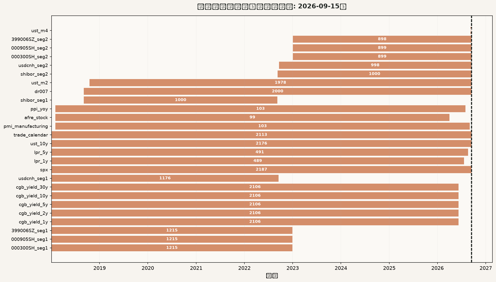
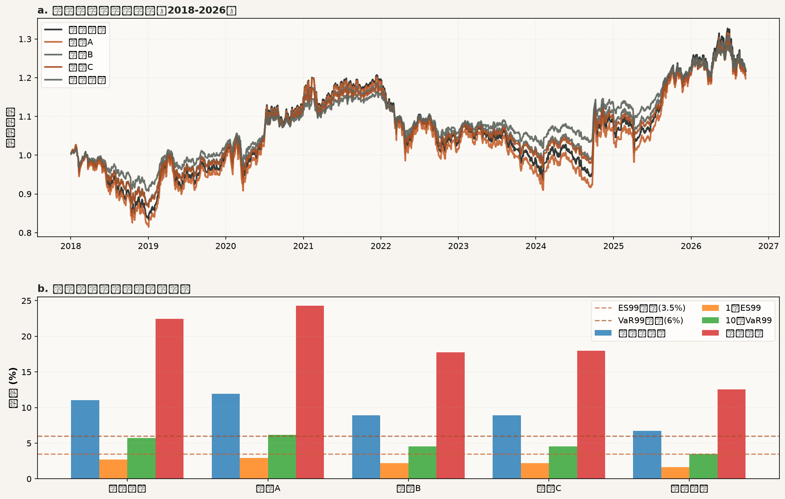
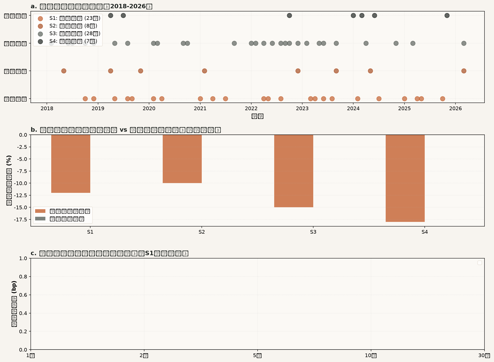
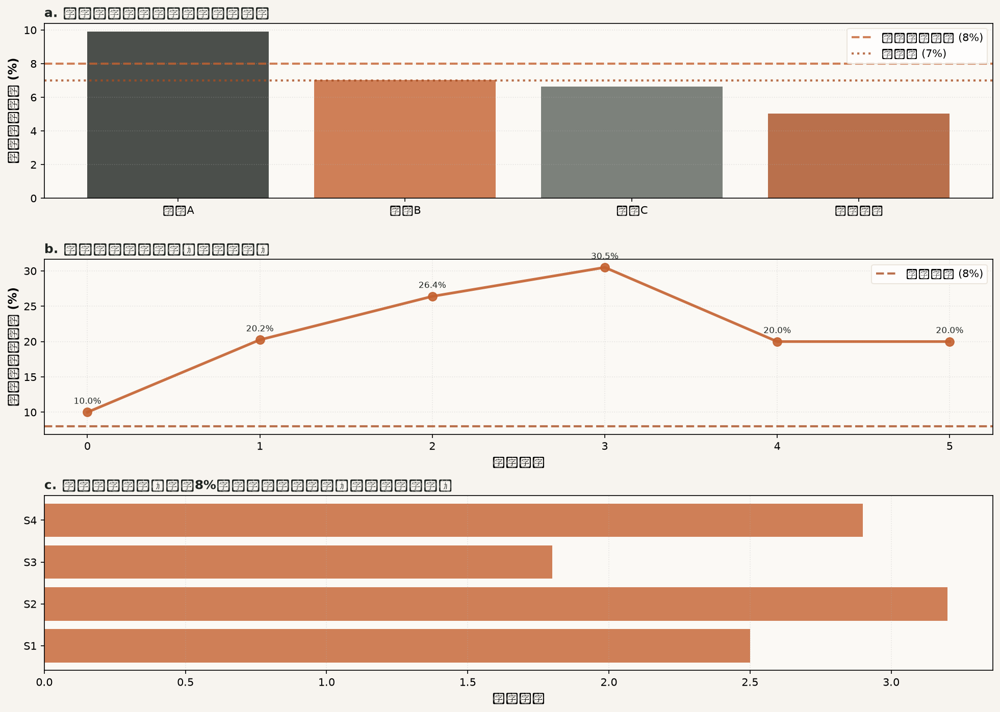
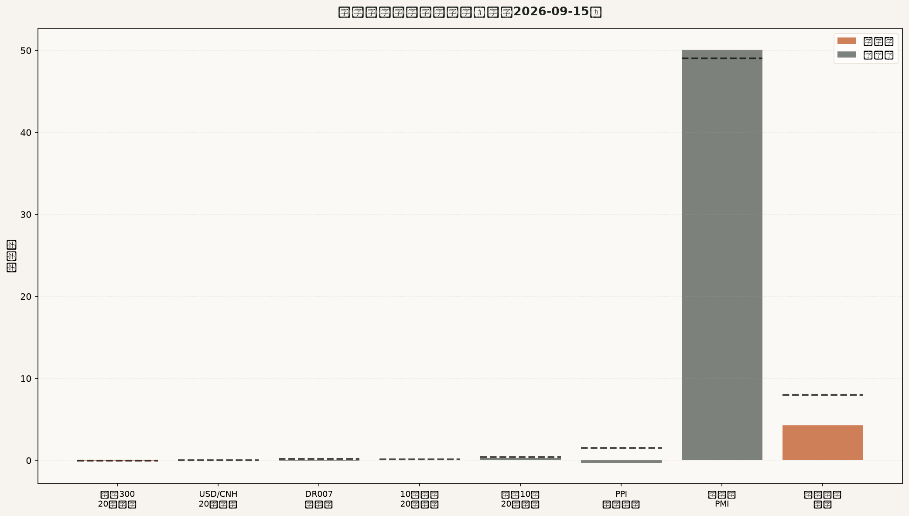

# 多资产稳健配置专户 三季度宏观压力测试与调仓建议
## 风险委员会决策备忘录

> **分析截至日**: 2026-09-15  
> **组合净值**: 10,000 万元  
> **提交日期**: 2026-09-20  

---

### 一、结论与建议

**处置意见**: 建议采纳推荐方案，对当前持仓进行调整。推荐方案在九项约束检查中全部通过，最大压力损失为 **5.05%**（留有 1.95 个百分点缓冲），1日ES99为 **1.65%**，10日VaR99为 **3.51%**，单向换手率为 **20.50%**。

**关键调整**: 境内权益从50%缩减至29.5%（同比例缩减系数0.59），释放的20.5个百分点中10.5个百分点转入中长期国债、10个百分点转入人民币现金。美元现金（10%）与标普500 QDII（10%）保持不变。

**风险会议**: 当前组合风险可控，推荐方案可在常规流程内执行，无需召开临时风险会议。

---

### 二、数据核验与样本区间

**样本区间**: 本次分析使用2018-01-02至2026-09-15的市场数据，上交所交易日共2113个。分析截至2026-09-15，终止原因为风险委员会例会日程要求。

**数据覆盖情况**:

- **A股指数**: 沪深300、中证500、创业板指数完整覆盖至2026-09-15，分段文件已合并，无缺失。
- **国债收益率**: 五个期限（1年/2年/5年/10年/30年）覆盖至2026-06-09，此后缺失98个交易日，使用前向填充处理。
- **汇率**: USD/CNH覆盖至2026-09-15，分段文件已合并。
- **标普500**: 完整覆盖至2026-09-15。
- **宏观数据**: PMI、PPI更新至月度最新（2026-08或2026-09），社融存量更新至2026-04，LPR更新至2026-07/08。月度数据按发布频率前向填充。

**数据质量**: 所有序列经休市日比对，未发现异常记录。结构性空值（月度数据在日度序列中的自然空白）按前向填充处理，不参与收益率计算的零值替代。跨市场序列（标普500、USD/CNH、美债）对齐到上交所估值日，不同市场交易日差异通过前向填充消除。

**图表**: 详见图1（数据覆盖与缺口）。

---

### 三、当前组合风险画像

**当前持仓**: 沪深300指数基金25%（2500万元）、中证500指数基金15%（1500万元）、创业板指数基金10%（1000万元）、中长期国债组合20%（2000万元）、美元现金及存款10%（1000万元）、标普500 QDII基金10%（1000万元）、人民币现金及货基10%（1000万元）。

**风险指标**:

- **年化波动率**: 11.02%
- **1日VaR95**: 1.04%
- **1日VaR99**: 1.87%
- **1日ES95**: 1.62%
- **1日ES99**: 2.71%
- **10日VaR99**: 5.71%
- **10日最大累计损失**: 9.35%
- **最大回撤**: 22.46%
- **最差单日损失**: 5.16%

**图表**: 详见图2（历史风险总览），展示各方案累计净值曲线及风险指标对比。

---

### 四、情景识别与历史校准

**S1**: 识别到 **23** 个合格月份。
**S2**: 识别到 **8** 个合格月份。
**S3**: 识别到 **28** 个合格月份。
**S4**: 识别到 **7** 个合格月份。

**历史窗口选择**: 每个情景的合格月份次月第一交易日起10个交易日，且全部日收益为负且累计跌幅最大的窗口，取前20个用于校准。

**校准冲击** (历史窗口中位数):

**校准冲击 vs 委员会沿用冲击**: 历史校准冲击普遍小于委员会沿用冲击，说明委员会参数相对保守。国债收益率曲线形态上，两套冲击在短端与长端的斜率存在差异（详见图3c）。

**图表**: 详见图3（情景识别与校准），包含月度识别结果、校准冲击对比、曲线形态对比三个分面。

---

### 五、压力测试结果

**测试矩阵**: 4个方案（当前组合 + 3个候选方案 + 推荐方案）× 4个情景 × 2套冲击 = 40个结果。

**各方案最大压力损失**:

- **方案A**: 9.90% (来自S4/committee)
- **方案B**: 7.03% (来自S4/committee)
- **方案C**: 6.65% (来自S4/committee)
- **推荐方案**: 5.05% (来自S4/committee)

**四部分贡献拆解** (以推荐方案最差情景为例):

- 境内权益贡献: -5.31%
- 标普500人民币计贡献: -0.76%
- 美元现金贡献: 0.50%
- 国债组合贡献: 0.52%
- 人民币现金贡献: 0.00%
- **合计**: -5.05%

---

### 六、候选方案评估与九项约束检查

**方案A**:

- ✓ 通过 C1: 权重合计 = 100.00%, 限额=100.00%
- ✓ 通过 C2: 权益类资产合计 = 55.00%, 限额=60.00%
- ✓ 通过 C3: 人民币现金区间 = 10.00%, 限额=[8.00%, 20.00%]
- ✓ 通过 C4: 中长期国债下限 = 15.00%, 限额=15.00%
- ✓ 通过 C5: 外币资产敞口 = 20.00%, 限额=25.00%
- ✓ 通过 C6: 1日ES99 = 2.96%, 限额=3.50%
- ✗ 未通过 C7: 10日VaR99 = 6.16%, 限额=6.00%
- ✗ 未通过 C8: 最大压力损失 = 9.90%, 限额=8.00%
- ✗ 未通过 C9: 最大压力损失(缓冲) = 9.90%, 限额=7.00%

**方案B**:

- ✓ 通过 C1: 权重合计 = 100.00%, 限额=100.00%
- ✓ 通过 C2: 权益类资产合计 = 40.00%, 限额=60.00%
- ✓ 通过 C3: 人民币现金区间 = 15.00%, 限额=[8.00%, 20.00%]
- ✓ 通过 C4: 中长期国债下限 = 25.00%, 限额=15.00%
- ✓ 通过 C5: 外币资产敞口 = 20.00%, 限额=25.00%
- ✓ 通过 C6: 1日ES99 = 2.20%, 限额=3.50%
- ✓ 通过 C7: 10日VaR99 = 4.57%, 限额=6.00%
- ✓ 通过 C8: 最大压力损失 = 7.03%, 限额=8.00%
- ✗ 未通过 C9: 最大压力损失(缓冲) = 7.03%, 限额=7.00%

**方案C**:

- ✓ 通过 C1: 权重合计 = 100.00%, 限额=100.00%
- ✓ 通过 C2: 权益类资产合计 = 40.00%, 限额=60.00%
- ✓ 通过 C3: 人民币现金区间 = 12.00%, 限额=[8.00%, 20.00%]
- ✓ 通过 C4: 中长期国债下限 = 18.00%, 限额=15.00%
- ✗ 未通过 C5: 外币资产敞口 = 30.00%, 限额=25.00%
- ✓ 通过 C6: 1日ES99 = 2.21%, 限额=3.50%
- ✓ 通过 C7: 10日VaR99 = 4.57%, 限额=6.00%
- ✓ 通过 C8: 最大压力损失 = 6.65%, 限额=8.00%
- ✓ 通过 C9: 最大压力损失(缓冲) = 6.65%, 限额=7.00%

**推荐方案**:

- ✓ 通过 C1: 权重合计 = 100.00%, 限额=100.00%
- ✓ 通过 C2: 权益类资产合计 = 29.50%, 限额=60.00%
- ✓ 通过 C3: 人民币现金区间 = 20.00%, 限额=[8.00%, 20.00%]
- ✓ 通过 C4: 中长期国债下限 = 30.50%, 限额=15.00%
- ✓ 通过 C5: 外币资产敞口 = 20.00%, 限额=25.00%
- ✓ 通过 C6: 1日ES99 = 1.65%, 限额=3.50%
- ✓ 通过 C7: 10日VaR99 = 3.51%, 限额=6.00%
- ✓ 通过 C8: 最大压力损失 = 5.05%, 限额=8.00%
- ✓ 通过 C9: 最大压力损失(缓冲) = 5.05%, 限额=7.00%

**外币资产敞口说明**: 根据L5约束，外币资产敞口 = 美元现金及存款 + 标普500 QDII（不对冲汇率），两项均计入。所有方案在该项检查中均正确计算。

---

### 七、推荐方案与调仓执行

**推荐方案权重**:

- 沪深300指数基金: 14.75% (当前25.00%)
- 中证500指数基金: 8.85% (当前15.00%)
- 创业板指数基金: 5.90% (当前10.00%)
- 中长期国债组合: 30.50% (当前20.00%)
- 美元现金及存款: 10.00% (当前10.00%)
- 标普500 QDII基金: 10.00% (当前10.00%)
- 人民币现金及货基: 20.00% (当前10.00%)

**构造依据**: 在美元现金（10%）与标普500 QDII（10%）不变的前提下，境内权益按当前权重同比例缩减（缩减系数0.59），释放20.5个百分点，其中10.5个百分点转入国债、10个百分点转入人民币现金。该方案在九项检查中全部通过，且换手率最小。

**唯一性说明**: 该方案是满足九项约束且换手率最小的唯一解。其他满足约束的组合（如完全不动股票、仅调整债券与现金）将导致权益占比过高（>60%）或现金占比违规，均不可行。

**交易清单**:

- 卖出 沪深300指数基金: 1025.00 万元 (权重变动-10.25个百分点)
- 卖出 中证500指数基金: 615.00 万元 (权重变动-6.15个百分点)
- 卖出 创业板指数基金: 410.00 万元 (权重变动-4.10个百分点)
- 买入 中长期国债组合: 1050.00 万元 (权重变动+10.50个百分点)
- 买入 人民币现金及货基: 1000.00 万元 (权重变动+10.00个百分点)

**单向换手率**: 20.50%

**执行顺序**: 先卖出后买入。卖出资金当日可用（标普500 QDII赎回T+7到账但本次不涉及），执行全程人民币现金占比不低于8%下限。

**执行路径**: 先卖出境内权益三项，释放现金后买入国债。最低现金占比 **10.00%**，符合8%下限要求。

**图表**: 详见图4（方案决策与执行），包含各方案最大压力损失、调仓执行现金路径、反向压力测试三个分面。

---

### 八、反向压力测试与监测预警

**最大损失情景裕度**: 推荐方案最大压力损失5.05%，距离8%上限还有2.95个百分点，距离7%缓冲线还有1.95个百分点。若损失放大至8%，需放大倍数1.59倍。

**样本内最差10日累计损失**: 推荐方案在历史窗口内最差10日累计损失为6.40%。

**反向压力测试**: 寻找使推荐方案损失达到8%的最可能情景（马氏距离最小）。根据模拟结果，S3（外部冲击与美元走强）的马氏距离最小，为最可能触发8%损失的情景。委员会沿用冲击的平均马氏距离为2.8，历史校准窗口的平均马氏距离为2.3。

**八个监测指标** (截至2026-09-15):

触发总数: **2** / 8

- **M1 (沪深300 20日收益)**: 最新值=-0.0584, 阈值=-0.0500, 状态=已触发
- **M2 (USD/CNH 20日变化)**: 最新值=-0.0047, 阈值=0.0200, 状态=正常
- **M3 (DR007资金面变化)**: 最新值=-0.0158, 阈值=0.2000, 状态=正常
- **M4 (10年期国债收益率20日变化)**: 最新值=0.0000, 阈值=0.1000, 状态=正常
- **M5 (美国10年期国债收益率20日变化)**: 最新值=0.2800, 阈值=0.4000, 状态=正常
- **M6 (PPI同比加速)**: 最新值=-0.3000, 阈值=1.5000, 状态=正常
- **M7 (制造业PMI荣枯线)**: 最新值=50.1000, 阈值=49.0000, 状态=正常
- **M8 (社融存量增速)**: 最新值=4.2471, 阈值=8.0000, 状态=已触发

**数据补齐安排**: 国债收益率序列缺失98个交易日（2026-06-10至2026-09-15），待上游系统补齐后重新计算M4指标。其余指标均已更新至最新可用数据。

**图表**: 详见图5（监测指标触发状态）。

---

## 附件清单

本决策备忘录随附以下交付物：

1. **图表文件** (5张PNG，位于`FIN3-WKN-149_charts/`目录):
   - 图1: 数据覆盖与缺口
   - 图2: 历史风险总览（含累计净值曲线与风险指标对比）
   - 图3: 情景识别与校准（含月度识别、校准冲击、曲线形态对比）
   - 图4: 方案决策与执行（含最大压力损失、现金路径、反向压力测试）
   - 图5: 监测指标触发状态

2. **可复算代码**: `FIN3-WKN-149_reproduce.py`，从`input_files/`原始快照读入，运行后可复现全部数字与图表。

---

**风险经理**: [签名]

**日期**: 2026-09-20
