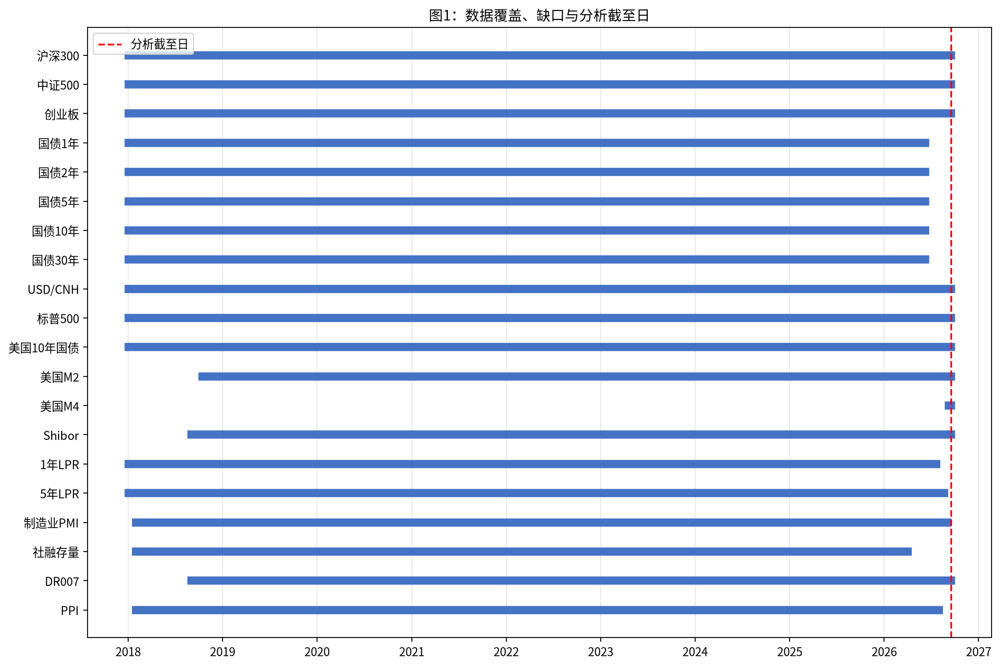
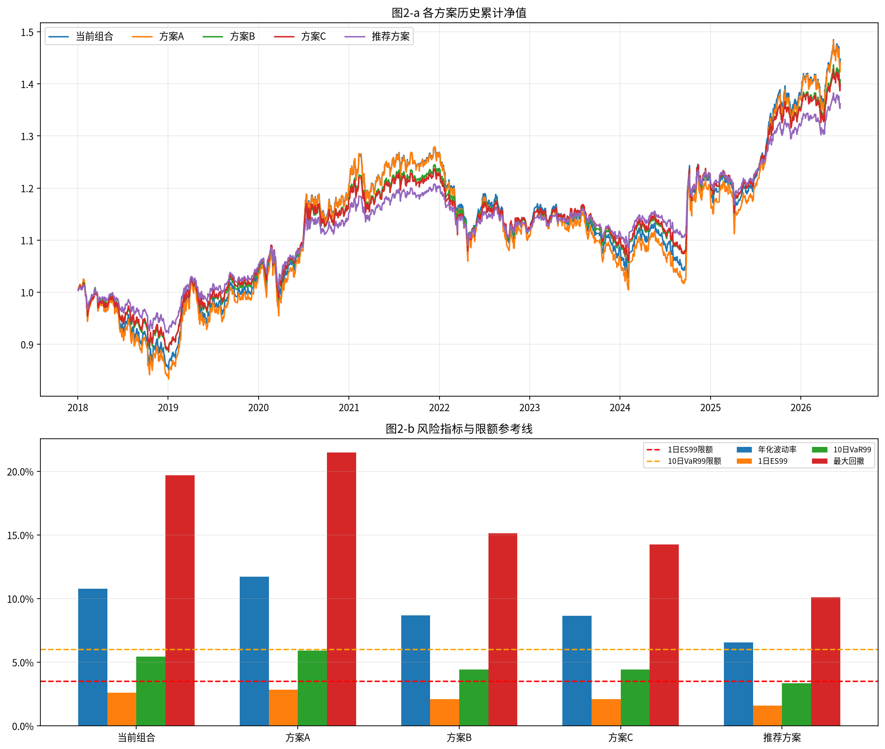
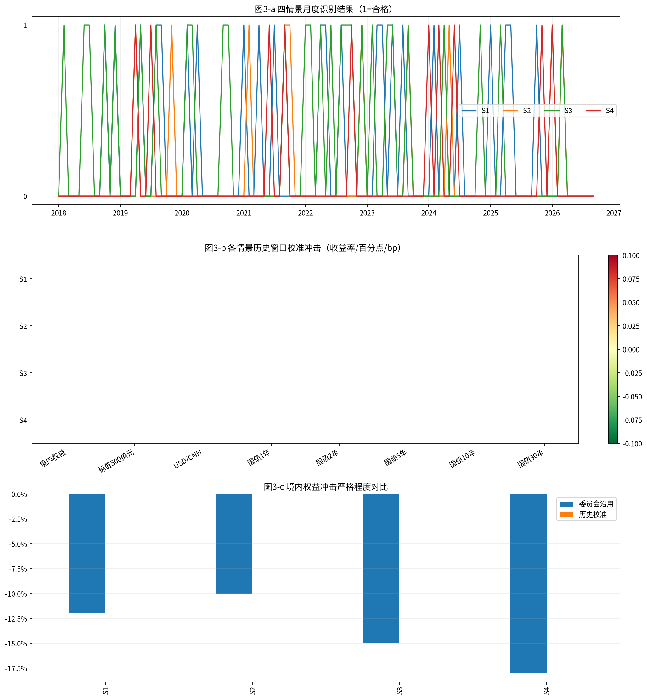
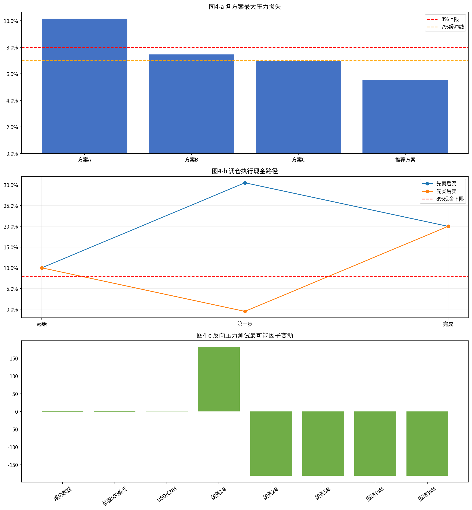
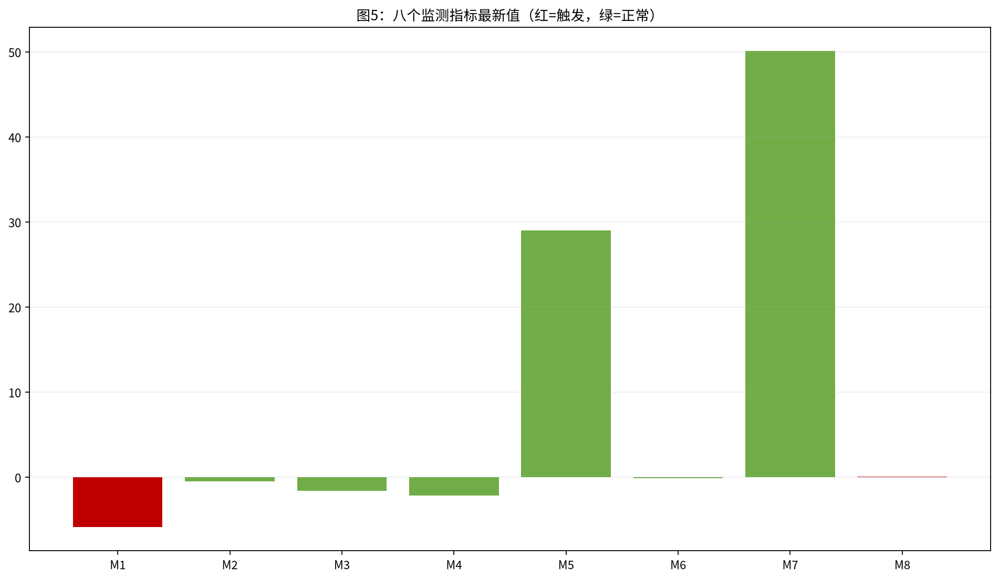

# 多资产稳健配置专户 三季度宏观压力测试与调仓建议
## 风险委员会决策备忘录

分析截至日：**2026-09-15**；组合净值：**10000.00万元**；金额单位均为万元，百分比保留两位小数。

### 一、结论与建议

建议否决当前组合的继续持有安排，并否决方案A、B、C作为最终执行方案；推荐**推荐方案**（由参数文件中的推荐权重按规则构造）并按“先卖出后买入”执行。推荐方案最大压力损失 **5.56%**（S4、委员会沿用），1日ES99 **1.57%**，10日VaR99 **3.36%**，单向换手率 **20.50%**。推荐方案同时满足九项约束，但M1和M8监测指标已触发，需提请临时风险会议；调仓指令应在委员会确认后执行，数据补齐后按第八章复核。

### 二、数据核验与样本区间

共同风险样本为 **2018-01-02至2026-06-09，2044个上交所交易日**。样本终止于中债五个期限收益率实际共同覆盖的 **2026-06-09**，不是将结构性缺口向后填充。上交所交易日历共 2113 条，分析截至日为 2026-09-15；日行情未发现落在休市日的记录，依据为日期与交易日历逐日匹配，异常记录数为0。

各序列核验如下：
- 沪深300：2018-01-02至2026-09-15，2114条，空值单元格 1，重复日期 0，清单截断标记：未标注。
- 中证500：2018-01-02至2026-09-15，2114条，空值单元格 1，重复日期 0，清单截断标记：未标注。
- 创业板：2018-01-02至2026-09-15，2113条，空值单元格 1，重复日期 0，清单截断标记：未标注。
- 国债1年：2018-01-02至2026-06-09，2106条，空值单元格 0，重复日期 0，清单截断标记：未标注。
- 国债2年：2018-01-02至2026-06-09，2106条，空值单元格 0，重复日期 0，清单截断标记：未标注。
- 国债5年：2018-01-02至2026-06-09，2106条，空值单元格 0，重复日期 0，清单截断标记：未标注。
- 国债10年：2018-01-02至2026-06-09，2106条，空值单元格 0，重复日期 0，清单截断标记：未标注。
- 国债30年：2018-01-02至2026-06-09，2106条，空值单元格 0，重复日期 0，清单截断标记：未标注。
- USD/CNH：2018-01-02至2026-09-15，2174条，空值单元格 0，重复日期 0，清单截断标记：未标注。
- 标普500：2018-01-02至2026-09-15，2187条，空值单元格 0，重复日期 0，清单截断标记：未标注。
- 美国10年国债：2018-01-02至2026-09-15，2176条，空值单元格 0，重复日期 0，清单截断标记：未标注。
- 美国M2：2018-10-16至2026-09-15，1978条，空值单元格 0，重复日期 0，清单截断标记：未标注。
- 美国M4：2026-09-08至2026-09-15，6条，空值单元格 0，重复日期 0，清单截断标记：未标注。
- Shibor：2018-09-03至2026-09-15，2000条，空值单元格 0，重复日期 0，清单截断标记：False。
- 1年LPR：2018-01-02至2026-07-20，489条，空值单元格 0，重复日期 0，清单截断标记：未标注。
- 5年LPR：2018-01-02至2026-08-20，491条，空值单元格 406，重复日期 0，清单截断标记：未标注。
- 制造业PMI：2018-02-01至2026-09-01，103条，空值单元格 0，重复日期 0，清单截断标记：未标注。
- 社融存量：2018-02-01至2026-04-01，99条，空值单元格 0，重复日期 0，清单截断标记：未标注。
- DR007：2018-09-03至2026-09-15，2000条，空值单元格 0，重复日期 0，清单截断标记：未标注。
- PPI：2018-02-01至2026-08-01，103条，空值单元格 0，重复日期 0，清单截断标记：未标注。

三只指数分段合并后，seg1首行 `pre_close` 各有一个空值，但收益计算采用 `close` 的相邻交易日变化，首行无前值而自然产生的收益缺失不参与计算；其他空值均未按0参与计算。5年LPR的406个空值属于低频政策公布在日频框架中的结构性空值，仅在有实际公布值的月份比较，不做前向填充。PPI负值被保留，因为同比指标可为负。逐条异常检查未发现重复日期、日期逆序、非法日期、负价格/负成交额、OHLC关系异常或交易日历外记录。日频跨市场价格先映射到上交所估值日，再以前值填充非交易日；外汇与标普500人民币计收益分别按 USD/CNH 复合换算，公式为 `(1+标普500美元收益)×(1+USD/CNH收益)-1`。

### 三、当前组合风险画像

当前持仓：沪深300 25.00%（2500.00万元）；中证500 15.00%（1500.00万元）；创业板 10.00%（1000.00万元）；中长期国债 20.00%（2000.00万元）；美元现金 10.00%（1000.00万元）；标普500（人民币计） 10.00%（1000.00万元）；人民币现金 10.00%（1000.00万元）。

各资产日收益统计（均值为日均、波动率为年化）：

|资产|日均收益|年化波动率|最差单日|
|---|---:|---:|---:|
|沪深300|0.02%|19.26%|-7.88%|
|中证500|0.02%|22.37%|-9.55%|
|创业板|0.06%|29.04%|-12.50%|
|中长期国债|0.01%|2.26%|-0.71%|
|美元现金|0.00%|4.22%|-1.57%|
|标普500（人民币计）|0.06%|19.01%|-12.19%|
|人民币现金|0.00%|0.00%|0.00%|

当前组合：年化波动率 10.77%；1日VaR95/VaR99 0.98%/1.79%；1日ES95/ES99 1.53%/2.60%；10日VaR99 5.43%；最大回撤 19.68%。10日最大累计损失 **8.48%**（2020-03-06至2020-03-19）；最大回撤 **19.68%**（峰值 2021-12-13、谷值 2024-02-05、修复日 2025-08-13）；最差单日损失 **4.88%**（2025-04-07）。

日收益相关矩阵、风险贡献见 `FIN3-WKN-149_chart06_资产相关矩阵.png` 与 `FIN3-WKN-149_chart07_风险贡献.png`；当前组合ES99风险贡献占比为：沪深300 42.23%；中证500 30.27%；创业板 21.91%；中长期国债 -1.64%；美元现金 -0.67%；标普500（人民币计） 7.89%；人民币现金 -0.00%。图2-a展示各方案累计净值，图2-b展示波动、ES、VaR和最大回撤，并绘制了适用限额参考线。

### 四、情景识别与历史校准

月度识别结果：
- S1 增长下行与政策宽松：制造业PMI 月值 < 50 且 (1 年期 LPR 或 5 年期 LPR 当月下调)，或 制造业PMI 较上月下行 >= 0.5 且 10 年期国债收益率月均值低于上月；合格月份：2018-10, 2018-12, 2019-05, 2019-08, 2019-09, 2020-02, 2020-04, 2021-01, 2021-04, 2021-07, 2022-04, 2022-05, 2022-08, 2023-03, 2023-04, 2023-06, 2023-08, 2024-02, 2024-07, 2025-01, 2025-04, 2025-05, 2025-10。
- S2 通胀上行与利率上行：PPI 当月同比高于上月 且 10 年期国债收益率月均值高于上月 且 权益指数当月下跌；合格月份：2019-04, 2019-11, 2021-02, 2021-09, 2021-10, 2022-12, 2023-09, 2024-05, 2026-01, 2026-03。
- S3 外部冲击与美元走强：标普500 当月收益率 <= -3% 或 USD/CNH 当月变化 >= +1.5%；合格月份：2018-02, 2018-06, 2018-07, 2018-10, 2018-12, 2019-05, 2019-08, 2020-02, 2020-03, 2020-09, 2020-10, 2021-09, 2022-01, 2022-02, 2022-04, 2022-06, 2022-08, 2022-09, 2022-10, 2022-12, 2023-02, 2023-05, 2023-06, 2023-09, 2024-04, 2024-11, 2025-03, 2026-03。
- S4 信用收缩与资金面收紧：社会融资规模存量同比增速低于上月 且 DR007 月均值高于上月 且 权益指数当月下跌；合格月份：2019-04, 2019-07, 2021-06, 2021-09, 2022-10, 2024-01, 2024-03, 2024-06, 2025-11, 2026-01。

窗口规则为“合格月份次月第一个上交所交易日起10个交易日”，只保留组合日收益10日全部为负的窗口，并按累计跌幅选取最多前20个（实际不足20个时使用全部合格窗口）。

- S1：合格窗口 0 个；选定窗口：无；校准冲击：境内权益 N/A、标普500美元 N/A、USD/CNH N/A、国债1/2/5/10/30年 N/A（严格规则下无合格窗口，未以0替代）。
- S2：合格窗口 0 个；选定窗口：无；校准冲击：境内权益 N/A、标普500美元 N/A、USD/CNH N/A、国债1/2/5/10/30年 N/A（严格规则下无合格窗口，未以0替代）。
- S3：合格窗口 0 个；选定窗口：无；校准冲击：境内权益 N/A、标普500美元 N/A、USD/CNH N/A、国债1/2/5/10/30年 N/A（严格规则下无合格窗口，未以0替代）。
- S4：合格窗口 0 个；选定窗口：无；校准冲击：境内权益 N/A、标普500美元 N/A、USD/CNH N/A、国债1/2/5/10/30年 N/A（严格规则下无合格窗口，未以0替代）。

委员会冲击与历史校准的严格程度不能简单按单一因子判断：委员会冲击是预先设定的尾部情景，历史校准是合格窗口因子变动中位数；S1的利率曲线形态、S2/S4的长端方向和S3的汇率升值方向存在明显差异。图3-a至图3-c给出识别、校准和对比。

### 五、压力测试结果

以下为四个方案×四个情景×两套冲击的完整结果；四个分项之和等于组合损益，压力损失定义为组合损益的相反数。

#### 方案A
- S1：委员会沿用：境内权益 -6.60%；标普500人民币 -0.62%；美元现金 0.20%；国债 -0.00%；组合损益 -7.02%；压力损失 7.02%；历史校准：境内权益 N/A；标普500人民币 N/A；美元现金 N/A；国债 N/A；组合损益 N/A；压力损失 N/A。
- S2：委员会沿用：境内权益 -5.50%；标普500人民币 -0.32%；美元现金 0.30%；国债 0.00%；组合损益 -5.52%；压力损失 5.52%；历史校准：境内权益 N/A；标普500人民币 N/A；美元现金 N/A；国债 N/A；组合损益 N/A；压力损失 N/A。
- S3：委员会沿用：境内权益 -8.25%；标普500人民币 -1.14%；美元现金 0.80%；国债 -0.00%；组合损益 -8.59%；压力损失 8.59%；历史校准：境内权益 N/A；标普500人民币 N/A；美元现金 N/A；国债 N/A；组合损益 N/A；压力损失 N/A。
- S4：委员会沿用：境内权益 -9.90%；标普500人民币 -0.76%；美元现金 0.50%；国债 0.00%；组合损益 -10.16%；压力损失 10.16%；历史校准：境内权益 N/A；标普500人民币 N/A；美元现金 N/A；国债 N/A；组合损益 N/A；压力损失 N/A。
#### 方案B
- S1：委员会沿用：境内权益 -4.80%；标普500人民币 -0.62%；美元现金 0.20%；国债 -0.00%；组合损益 -5.22%；压力损失 5.22%；历史校准：境内权益 N/A；标普500人民币 N/A；美元现金 N/A；国债 N/A；组合损益 N/A；压力损失 N/A。
- S2：委员会沿用：境内权益 -4.00%；标普500人民币 -0.32%；美元现金 0.30%；国债 0.00%；组合损益 -4.02%；压力损失 4.02%；历史校准：境内权益 N/A；标普500人民币 N/A；美元现金 N/A；国债 N/A；组合损益 N/A；压力损失 N/A。
- S3：委员会沿用：境内权益 -6.00%；标普500人民币 -1.14%；美元现金 0.80%；国债 -0.00%；组合损益 -6.35%；压力损失 6.35%；历史校准：境内权益 N/A；标普500人民币 N/A；美元现金 N/A；国债 N/A；组合损益 N/A；压力损失 N/A。
- S4：委员会沿用：境内权益 -7.20%；标普500人民币 -0.76%；美元现金 0.50%；国债 0.00%；组合损益 -7.46%；压力损失 7.46%；历史校准：境内权益 N/A；标普500人民币 N/A；美元现金 N/A；国债 N/A；组合损益 N/A；压力损失 N/A。
#### 方案C
- S1：委员会沿用：境内权益 -4.80%；标普500人民币 -0.62%；美元现金 0.40%；国债 -0.00%；组合损益 -5.02%；压力损失 5.02%；历史校准：境内权益 N/A；标普500人民币 N/A；美元现金 N/A；国债 N/A；组合损益 N/A；压力损失 N/A。
- S2：委员会沿用：境内权益 -4.00%；标普500人民币 -0.32%；美元现金 0.60%；国债 0.00%；组合损益 -3.72%；压力损失 3.72%；历史校准：境内权益 N/A；标普500人民币 N/A；美元现金 N/A；国债 N/A；组合损益 N/A；压力损失 N/A。
- S3：委员会沿用：境内权益 -6.00%；标普500人民币 -1.14%；美元现金 1.60%；国债 -0.00%；组合损益 -5.54%；压力损失 5.54%；历史校准：境内权益 N/A；标普500人民币 N/A；美元现金 N/A；国债 N/A；组合损益 N/A；压力损失 N/A。
- S4：委员会沿用：境内权益 -7.20%；标普500人民币 -0.76%；美元现金 1.00%；国债 0.00%；组合损益 -6.96%；压力损失 6.96%；历史校准：境内权益 N/A；标普500人民币 N/A；美元现金 N/A；国债 N/A；组合损益 N/A；压力损失 N/A。
#### 推荐方案
- S1：委员会沿用：境内权益 -3.54%；标普500人民币 -0.62%；美元现金 0.20%；国债 -0.00%；组合损益 -3.96%；压力损失 3.96%；历史校准：境内权益 N/A；标普500人民币 N/A；美元现金 N/A；国债 N/A；组合损益 N/A；压力损失 N/A。
- S2：委员会沿用：境内权益 -2.95%；标普500人民币 -0.32%；美元现金 0.30%；国债 0.00%；组合损益 -2.97%；压力损失 2.97%；历史校准：境内权益 N/A；标普500人民币 N/A；美元现金 N/A；国债 N/A；组合损益 N/A；压力损失 N/A。
- S3：委员会沿用：境内权益 -4.42%；标普500人民币 -1.14%；美元现金 0.80%；国债 -0.00%；组合损益 -4.77%；压力损失 4.77%；历史校准：境内权益 N/A；标普500人民币 N/A；美元现金 N/A；国债 N/A；组合损益 N/A；压力损失 N/A。
- S4：委员会沿用：境内权益 -5.31%；标普500人民币 -0.76%；美元现金 0.50%；国债 0.01%；组合损益 -5.56%；压力损失 5.56%；历史校准：境内权益 N/A；标普500人民币 N/A；美元现金 N/A；国债 N/A；组合损益 N/A；压力损失 N/A。

各方案最大压力损失：方案A 10.16%（S4/委员会沿用）；方案B 7.46%（S4/委员会沿用）；方案C 6.96%（S4/委员会沿用）；推荐方案 5.56%（S4/委员会沿用）。由于严格窗口筛选在四个情景下均未产生合格窗口，历史校准冲击及其严格程度比较均为N/A；不能用0替代历史冲击。委员会冲击的压力差异主要来自境内权益、美元计标普500、汇率和国债曲线的联合方向。推荐方案的压力损益分解见 `FIN3-WKN-149_chart08_压力损益分解.png`。

### 六、候选方案评估与九项约束检查

#### 方案A
L1 通过（100.00%)；L2 通过（55.00%)；L3 通过（10.00%)；L4 通过（15.00%)；L5 通过（20.00%)；L6 通过（2.84%)；L7 通过（5.91%)；L8 未通过（10.16%，超限 2.16%)；L9 未通过（10.16%，超限 3.16%)

#### 方案B
L1 通过（100.00%)；L2 通过（40.00%)；L3 通过（15.00%)；L4 通过（25.00%)；L5 通过（20.00%)；L6 通过（2.10%)；L7 通过（4.44%)；L8 通过（7.46%)；L9 未通过（7.46%，超限 0.46%)

#### 方案C
L1 通过（100.00%)；L2 通过（40.00%)；L3 通过（12.00%)；L4 通过（18.00%)；L5 未通过（30.00%，超限 5.00%)；L6 通过（2.09%)；L7 通过（4.43%)；L8 通过（6.96%)；L9 通过（6.96%)

#### 推荐方案
L1 通过（100.00%)；L2 通过（29.50%)；L3 通过（20.00%)；L4 通过（30.50%)；L5 通过（20.00%)；L6 通过（1.57%)；L7 通过（3.36%)；L8 通过（5.56%)；L9 通过（5.56%)

L5按参数文件口径计算为“美元现金及存款+不对冲汇率的标普500 QDII”，推荐方案外币敞口为 20.00%，不存在漏计或误计。L6/L7使用共同历史样本，L8/L9使用八个压力组合的最大损失；每项具体数值均来自脚本运行结果。

### 七、推荐方案与调仓执行

推荐方案权重与金额：沪深300 14.75%（1475.00万元）；中证500 8.85%（885.00万元）；创业板 5.90%（590.00万元）；中长期国债 30.50%（3050.00万元）；美元现金 10.00%（1000.00万元）；标普500（人民币计） 10.00%（1000.00万元）；人民币现金 20.00%（2000.00万元）。构造依据是固定美元现金10.00%和标普500 QDII10.00%，境内三项权益按0.59同比例缩减合计20.50个百分点，释放资金中10.50个百分点转国债、10.00个百分点转人民币现金；推荐权重总和为100.00%。由于人民币现金达到L3上限20.00%，国债和现金转入分配被唯一确定；在固定外币资产、同比例缩减和同换手率约束下，推荐权重是规则构造的唯一解。若放宽同比例缩减，仅保持同换手率的细网格次优候选最大压力损失为 **3.94%**（该比较用于说明规则唯一性，不将其替代为推荐方案）。

交易清单：
- 沪深300：卖出 1025.00万元。
- 中证500：卖出 615.00万元。
- 创业板：卖出 410.00万元。
- 中长期国债：买入 1050.00万元。
- 人民币现金：买入 1000.00万元。

单向换手率按卖出金额合计/10,000万元为 20.50%。执行顺序遵循规则先卖出后买入：先卖出境内权益合计 **2050.00万元**，卖出资金当日可用；再买入国债 **1050.00万元** 和人民币现金/货基 **1000.00万元**。QDII本次不交易，故不存在T+7赎回款进入现金路径的问题。先卖后买人民币现金占比路径为 **10.00%→30.50%→20.00%**；先买后卖为 **10.00%→-0.50%→20.00%**。按执行规则的先卖后买路径不击穿8%下限；若非规则路径先买后卖则会击穿下限。

### 八、反向压力测试与监测预警

推荐方案最大压力损失为 5.56%，相对8%上限的风险裕度为 **2.44%**，相当于上限的 **0.70倍**。样本内最差10日累计损失为 **5.73%**（2020-03-06至2020-03-19）。

反向压力测试以共同样本全部滚动10日因子窗口的协方差构造马氏距离，在方向约束“境内权益≤0、标普500美元≤0、USD/CNH≥0”、各国债期限冲击区间±300bp及组合损失达到8%上限下，最小距离情景因子为：境内权益 -48.32%；标普500美元 -48.32%；USD/CNH +48.32%；国债1年 181.22bp；国债2年 -181.22bp；国债5年 -181.22bp；国债10年 -181.22bp；国债30年 -181.22bp；最小马氏距离 **82.29**。委员会沿用冲击马氏距离：S1 3.89；S2 4.04；S3 10.08；S4 6.99；历史校准窗口马氏距离：S1 N/A（无合格校准窗口）；S2 N/A（无合格校准窗口）；S3 N/A（无合格校准窗口）；S4 N/A（无合格校准窗口）。

监测指标：
- M1 沪深300 20 日收益：阈值 -5.00%；最新值 -5.84%；截至 2026-09-15；触发；触发 是。
- M2 USD/CNH 20 日变化：阈值 +2.00%；最新值 -0.47%；截至 2026-09-15；正常；触发 否。
- M3 DR007 资金面变化：阈值 +20.00bp；最新值 -1.58bp；截至 2026-09-15；正常；触发 否。
- M4 10 年期国债收益率 20 日变化：阈值 +10.00bp；最新值 -2.16bp；截至 2026-06-09；正常；触发 否。
- M5 美国 10 年期国债收益率 20 日变化：阈值 +40.00bp；最新值 29.00bp；截至 2026-09-15；正常；触发 否。
- M6 PPI 同比加速：阈值 +1.50 个百分点；最新值 -0.10个百分点；截至 2026-08-01；正常；触发 否。
- M7 制造业 PMI 荣枯线：阈值 49.00；最新值 50.10；截至 2026-09-01；正常；触发 否。
- M8 社融存量增速：阈值 8.00%；最新值 7.23%；截至 2026-04-01；触发；触发 是。

监测状态以各序列实际最新值为准。由于国债收益率、LPR、PPI、社融等部分数据提前终止或低频公布，数据补齐后应由宏观策略组重算相应指标、情景识别、历史窗口、压力结果和九项约束；若任何L6至L9由通过变为未通过，或监测指标触发，应在下一交易日前提请临时风险会议。

---

**附件清单**
- `FIN3-WKN-149_reproduce.py`：从 `/app/input_files/` 原始快照读取并生成全部结果。
- `FIN3-WKN-149_charts/`：图1至图10共10张PNG，覆盖数据核验、历史风险、情景识别与校准、方案决策、调仓执行、反向压力测试、监测触发。
