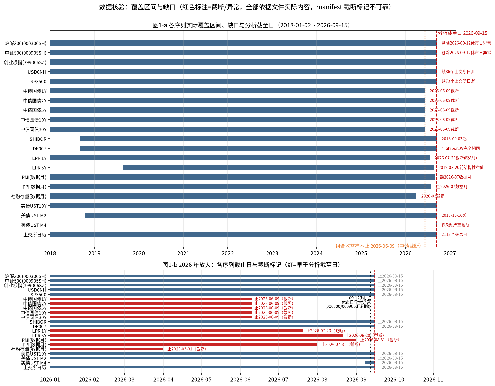
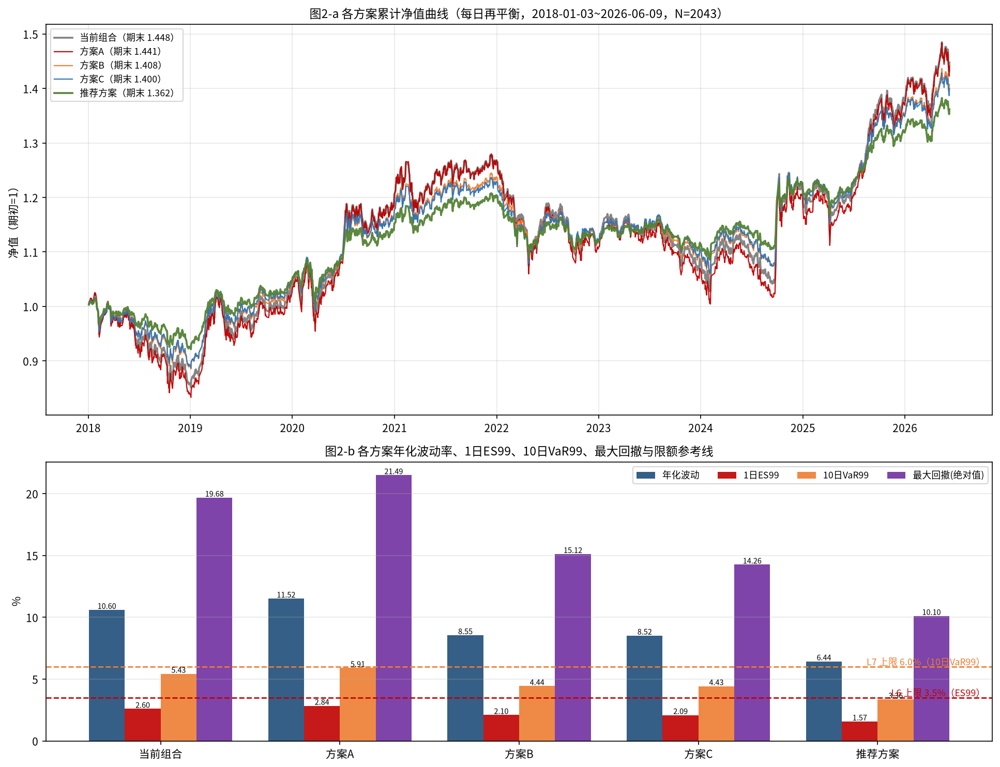
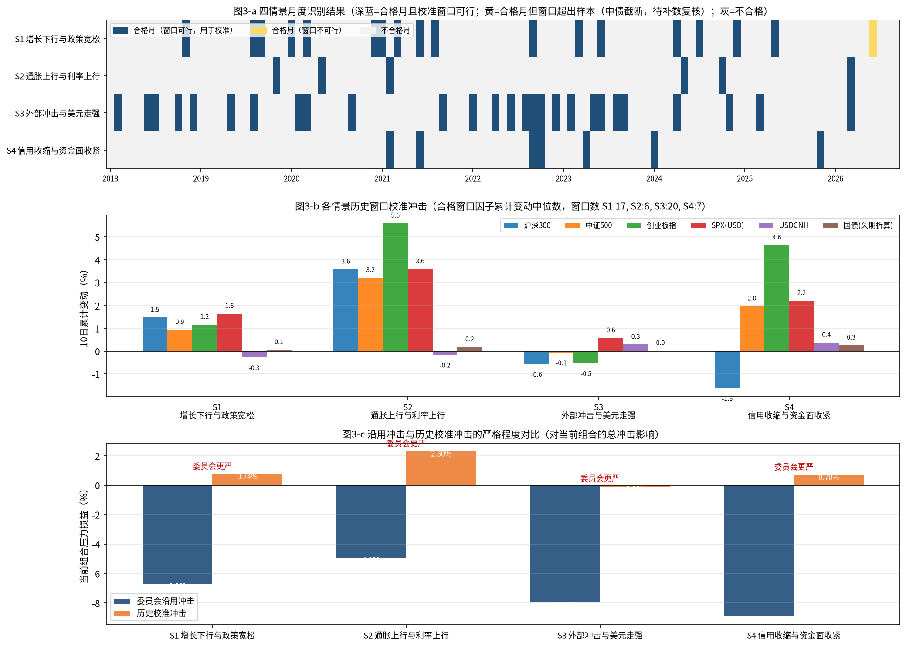
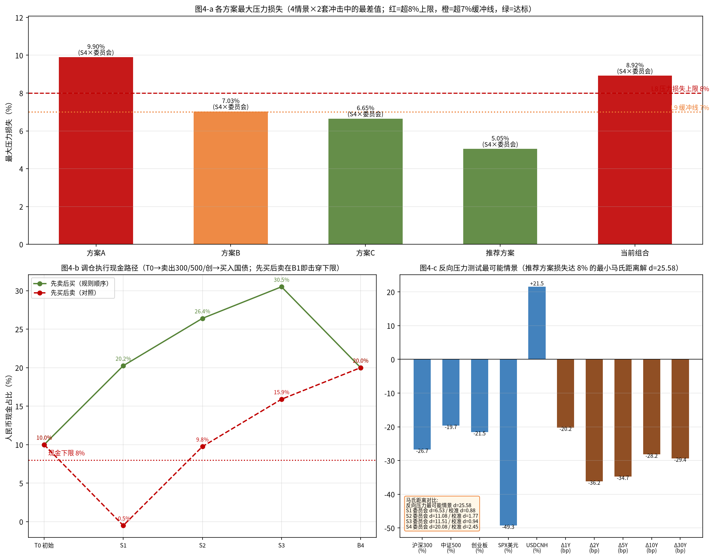
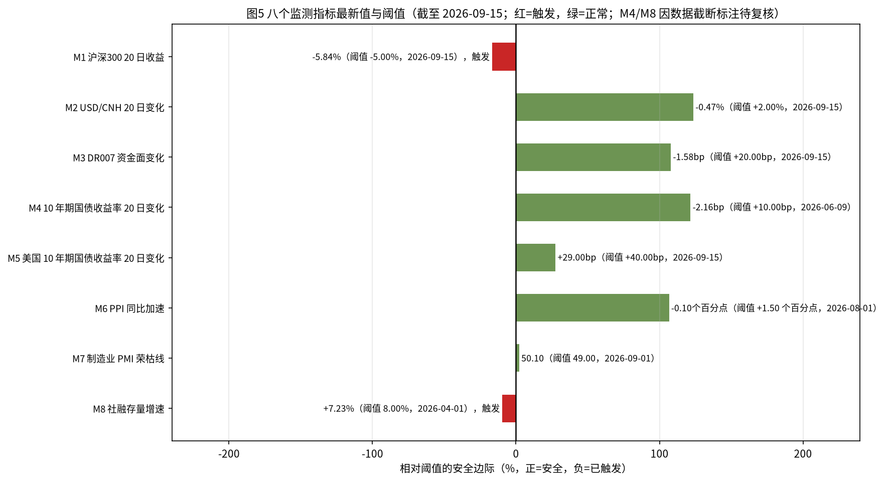

# 多资产稳健配置专户 三季度宏观压力测试与调仓建议
## 风险委员会决策备忘录

- 专户名称：多资产稳健配置专户　|　组合净值：10,000.00 万元（1 亿元）
- 分析截至日（估值日）：2026-09-15（由上交所交易日历最大日期推导）
- 备忘录出具日：2026-10-04　|　出具部门：多资产风险管理部
- 可复算代码：`FIN3-WKN-149_reproduce.py`（运行 `python3 FIN3-WKN-149_reproduce.py > results.txt` 可复现本文全部数字）
- 图表附件：`FIN3-WKN-149_charts/` 目录下 10 张 PNG（chart01–chart10）

---

### 一、结论与建议

**处置意见（一句话）：** 当前组合在情景 S4（信用收缩与资金面收紧）×委员会冲击下最大压力损失 8.92%，已突破 L8 上限（8.00%）与 L9 缓冲线（7.00%），必须调仓；三个候选方案中方案 A（最大压力损失 9.90%，超 C8/C9）、方案 B（7.03%，超 C9 缓冲线 0.03pp）、方案 C（外币敞口 30.00%，超 C5 上限 5.00pp）均不能通过九项约束检查，予以否决；**批准按"推荐方案"执行调仓**（沪深300 14.75% / 中证500 8.85% / 创业板 5.90% / 中长期国债 30.50% / 美元现金 10.00% / 标普500 QDII 10.00% / 人民币现金及货基 20.00%），其为唯一九项检查全部通过（9/9）且符合委员会构造规则的方案。

**推荐方案关键指标：**

| 指标 | 数值 | 限额/参照 |
|---|---|---|
| 最大压力损失（4 情景×2 套冲击） | 5.05%（来源：S4×委员会冲击） | ≤8.00%（L8），≤7.00%（L9 缓冲线） |
| 1 日 ES99 | 1.57% | ≤3.50%（L6） |
| 10 日 VaR99 | 3.36% | ≤6.00%（L7） |
| 单向换手率 | 20.50%（卖出合计 2,050.00 万元 / 净值 10,000.00 万元） | — |
| 年化波动率 / 最大回撤（历史样本） | 6.44% / -10.10% | 当前组合 10.60% / -19.68% |

**是否需要提请临时风险会议：需要。** 理由：(1) 当前组合最大压力损失 8.92% 已构成限额突破事件（L8/L9 双超限）；(2) 监测指标 M1（沪深300 20 日收益 -5.84%，低于 -5.00% 阈值）已触发、M8（社融存量增速 7.23%，低于 8.00% 阈值，数据截至 2026-04-01，待复核）已触发，触发数 2/8；(3) 调仓执行须按"先卖后买"顺序经临时风险会议确认后落地。建议于本备忘录出具后 5 个交易日内召开临时风险会议审议调仓与限额突破处置，并在中债收益率、PMI、社融数据补齐后复核 M4/M7/M8 三项指标状态。

*图1：各序列覆盖区间、截断点与结构性空值一览，为本备忘录样本区间的依据。*

---

### 二、数据核验与样本区间

**样本区间：** 上交所交易日历共 2,113 个交易日（2018-01-02 ~ 2026-09-15），日历中 `is_trading_day` 仅取值 1、无非交易日行。组合日收益样本区间为 **2018-01-03 ~ 2026-06-09，共 N=2,043 个交易日**；终止日由中债国债收益率五个期限序列的实际截止日 2026-06-09 决定（其后为结构性缺失，不外推、不按 0 计），权益/汇率/标普序列本身覆盖至 2026-09-15。年化因子取 244。

**逐序列覆盖、缺口与处理：**

| 序列 | 行数 | 覆盖区间 | 缺口/截断/结构性空值 | 处理方式 |
|---|---|---|---|---|
| 沪深300 (000300SH) | 2,114（剔除 1 行后 2,113） | 2018-01-02~2026-09-15 | 含 1 行休市日异常（见下）；首日 pre_close 空值 1 个 | 剔除异常行后使用；首日空值不参与收益计算 |
| 中证500 (000905SH) | 2,114（剔除 1 行后 2,113） | 2018-01-02~2026-09-15 | 同上 | 同上 |
| 创业板指 (399006SZ) | 2,113 | 2018-01-02~2026-09-15 | 无异常、无缺口 | 直接使用 |
| USD/CNH | 2,174 | 2018-01-02~2026-09-15 | 147 个非上交所日记录（境外日历） | 对齐到上交所估值日，区间内 ffill 补 86 日 |
| 标普500 (SPX) | 2,187 | 2018-01-02~2026-09-15 | 147 个非上交所日记录 | 对齐后 ffill 补 73 日 |
| Shibor (ON/1W) | 2,000 | 2018-09-03~2026-09-15 | 起始晚于样本起点 | 仅用于监测 M3 参照，缺失期不参与组合收益 |
| DR007 | 2,000 | 2018-09-03~2026-09-15 | 与 Shibor1W 在全部 2,000 个共同日期取值完全相同（相关系数 1.000000） | 疑似上游字段复制，按原样使用并于此披露 |
| 中债国债 1Y/2Y/5Y/10Y/30Y | 各 2,106 | 2018-01-02~**2026-06-09** | 2026-06-09 后截断（69 个上交所日缺失） | 截断后保持 NaN，不外推、不按 0 计；决定收益样本终止日 |
| 美债 UST 10Y | 2,176 | 2018-01-02~2026-09-15 | 147 个非上交所日 | 对齐后 ffill；用于监测 M5 |
| 美债 UST M2 / M4 | 1,978 / **6** | 2018-10-16~ / 2026-09-08~2026-09-15 | M4 仅 6 个观测 | 备用期限，观测不足不纳入核心计算 |
| LPR 1Y | 489 | 2018-01-02~2026-07-20 | 2026-07-20 后无新报价 | 月度下调判定截至 2026-07 |
| LPR 5Y | 491 | 2018-01-02~2026-08-20 | **2019-08-20 之前 406 行为结构性空值**（品种未诞生） | 保持 NaN，不填充、不按 0 计；下调判定自 2019-08 起 |
| 制造业 PMI | 103（发布月 2018-02~2026-09） | 数据月 2018-01~2026-08 | **缺数据月 2026-07** | 该月按缺失处理（判定为假），不按 0 计 |
| PPI 同比 | 103（发布月 2018-02~2026-08） | 数据月 2018-01~2026-07 | 无 | 发布月-1 映射为数据月 |
| 社融存量 | 99（发布月 2018-02~2026-04） | 数据月 2018-01~2026-03 | 2026-03 后无数据（滞后） | M8 以 2026-03 数据月值判定并标注"待复核" |

**休市日异常记录的识别与剔除：** 2026-09-12（星期六，非上交所交易日）在 000300SH 与 000905SH 中各出现 1 行记录：OHLC 四价全同（分别为 4510.1554、7580.5371）、pre_close 同值、成交额仅为前 5 日均量的 0.0190 倍与 0.0091 倍，且 399006SZ 无对应行。识别依据为"日期不在上交所交易日历 + OHLC 全同 + 成交额异常"三重条件，各剔除 1 行；剔除后两序列 pre_close 与前一交易日 close 不一致（>0.01 元）记录数为 0。

**价格对齐口径：** 所有跨市场序列（USD/CNH、SPX、UST、Shibor/DR007）先取"并集索引 + 前向填充"，再截取上交所交易日历作为估值日序列；前向填充不超过各序列自身最后观测日（不外推）；结构性空值（LPR 5Y 首值前）不参与填充。权益指数、中债收益率本身即上交所/银行间估值日序列，无需填充（ffill 补日 0）。月度宏观数据按"发布月-1 = 数据所属月"映射（文件日期为发布标记日，否则 2026-09 发布的 PMI 将成为未来数据）。

**截断标记核对：** `snapshot_data_manifest.csv` 中 27 个文件 records 与实际行数全部一致，但 `possible_truncation` 标记不可靠（仅 shibor_seg2 为 False、其余为 nan，而中债五期限实际截断于 2026-06-09），故截断判断一律以实际数据截止日为准。

**极值核验（保留为真实市场极值，不剔除）：** 沪深300 最大单日 +8.48%@2024-09-30、中证500 +10.41%@2024-09-30、创业板指 +17.25%@2024-10-08、SPX 最大单日绝对变动 11.98%、USD/CNH 1.58%；中债 1Y 最大单日 -31.0bp@2020-04-07、10Y -17.0bp@2020-02-03。上述极值与公开市场事件一致，予以保留。

---

### 三、当前组合风险画像

**当前持仓（净值 10,000.00 万元）：**

| 资产 | 权重 | 金额（万元） |
|---|---|---|
| 沪深300 | 25.00% | 2,500.00 |
| 中证500 | 15.00% | 1,500.00 |
| 创业板指 | 10.00% | 1,000.00 |
| 中长期国债组合 | 20.00% | 2,000.00 |
| 美元现金及存款 | 10.00% | 1,000.00 |
| 标普500 QDII（不对冲） | 10.00% | 1,000.00 |
| 人民币现金及货基 | 10.00% | 1,000.00 |

国债组合收益按关键期限久期贡献折算（1Y 0.1 / 2Y 0.3 / 5Y 1.2 / 10Y 3.6 / 30Y 1.8，合计久期 7.00）：日收益 = -Σ(久期贡献×该期限收益率日变动)；标普500 QDII 人民币收益按 (1+r_SPX,USD)×(1+r_USDCNH)-1 复合折算；组合日收益按权重每日再平衡加总。

**各资产袖日收益统计（2018-01-03~2026-06-09，N=2,043；收益/波动/极值/VaR/ES 单位 %）：**

| 资产袖 | 年化收益 | 年化波动 | 偏度 | 峰度 | 最差单日 | 1日VaR99 | 1日ES99 |
|---|---|---|---|---|---|---|---|
| 沪深300 | 3.72 | 18.96 | -0.09 | 4.87 | -7.88 | 3.21 | 4.55 |
| 中证500 | 5.48 | 22.01 | -0.27 | 5.83 | -9.55 | 3.92 | 5.58 |
| 创业板指 | 13.69 | 28.58 | 0.55 | 8.53 | -12.50 | 4.53 | 6.08 |
| 国债组合(久期折算) | 1.85 | 2.23 | 0.26 | 5.50 | -0.72 | 0.38 | 0.48 |
| 美元现金(汇率) | 0.59 | 4.15 | -0.06 | 4.15 | -1.57 | 0.76 | 1.01 |
| 标普500QDII(人民币复合) | 14.30 | 18.70 | -0.40 | 14.38 | -12.19 | 3.29 | 4.94 |
| 人民币现金 | 0.00 | 0.00 | 0.00 | 0.00 | 0.00 | 0.00 | 0.00 |

**相关矩阵（关键项）：** 境内三者高度相关（沪深300-中证500 0.8575、沪深300-创业板 0.8421、中证500-创业板 0.8731）；国债与境内权益负相关（-0.18~-0.23）、与标普 QDII 近零（-0.05）；美元现金（汇率）与境内权益负相关（-0.18~-0.25），提供天然分散。

**组合层面风险指标（当前组合）：** 累计净值 144.77；年化收益 4.98%；年化波动 10.60%；1 日 VaR95 0.98% / VaR99 1.79% / ES95 1.53% / ES99 2.60%；10 日 VaR99 5.43%；**最差 10 日累计 -8.48%（2020-03-06~2020-03-19）**；**最大回撤 -19.68%（高点 2021-12-13、低点 2024-02-05、修复日 2025-08-13）**；最差单日 -4.88%@2025-04-07。

**风险贡献（Euler 方差分解，合计 100%）：** 沪深300 42.16%、中证500 29.15%、创业板指 24.87%、标普500 QDII 5.23%、国债 -0.75%、美元现金 -0.66%、人民币现金 0.00%——境内权益三项合计贡献 96.18% 的组合风险，而国债与美元现金为负贡献（分散项），印证降权益、增国债的调仓方向。

*图2：a 各方案累计净值曲线；b 年化波动/1日ES99/10日VaR99/最大回撤与限额参考线，推荐方案各项均显著低于当前组合。*

*图6：资产袖相关矩阵热力图与当前组合 Euler 风险贡献占比，权益三项贡献约 96% 风险。*

---

### 四、情景识别与历史校准

**月度识别规则（rules_scenarios.csv，数据月口径）：**
- S1 增长下行与政策宽松：制造业 PMI 月值 <50 且（1Y 或 5Y LPR 当月下调），或 PMI 环比 ≤-0.5 且 10Y 国债月均值低于上月；
- S2 通胀上行与利率上行：PPI 同比高于上月 且 10Y 月均值高于上月 且权益指数当月下跌；
- S3 外部冲击与美元走强：SPX 当月收益 ≤-3% 或 USD/CNH 当月变化 ≥+1.5%；
- S4 信用收缩与资金面收紧：社融存量同比增速低于上月 且 DR007 月均值高于上月 且权益指数当月下跌。

**全部合格月份：**
- **S1（18 个）：** 2018-11, 2019-08, 2019-09, 2020-01, 2020-03, 2020-12, 2021-01, 2021-03, 2021-06, 2021-08, 2022-09, 2023-03, 2023-06, 2024-04, 2024-07, 2024-12, 2025-05, 2026-06
- **S2（6 个）：** 2019-11, 2020-05, 2021-02, 2024-05, 2024-10, 2026-03
- **S3（27 个）：** 2018-02, 2018-06, 2018-07, 2018-10, 2018-12, 2019-05, 2019-08, 2020-02, 2020-03, 2020-09, 2021-09, 2022-01, 2022-04, 2022-06, 2022-08, 2022-09, 2022-10, 2022-12, 2023-02, 2023-05, 2023-06, 2023-08, 2023-09, 2024-04, 2024-11, 2025-03, 2026-03
- **S4（7 个）：** 2021-02, 2021-06, 2022-09, 2022-10, 2023-04, 2024-01, 2025-11

**历史窗口构造（rules_windows.csv）：** 窗口 = 合格数据月次月首个上交所交易日起 10 个交易日。可构造窗口数：S1 17（2026-06 因样本截止无次月窗口）、S2 6、S3 27、S4 7。按规则优先保留"10 日组合收益全为负"的窗口——**四个情景的全负窗口数均为 0**，故按规则后半句"同类窗口按累计跌幅排序取前若干（不少于 20 个）"放宽：以累计跌幅（当前组合窗口累计收益）从小到大排序取用，S3 取前 20 个，S1/S2/S4 候选不足 20 个取全部（17/6/7 个），放宽补足事实于此披露。示例窗口：S3 数据月 2023-09 → 窗口 2023-10-09~2023-10-20（累计 -2.65%）；S4 数据月 2021-02 → 窗口 2021-03-01~2021-03-12（累计 -1.25%）。

**历史校准冲击（入选窗口内各因子 10 日累计变动的中位数；权益/SPX/FX 为 %，国债为 bp）：**

| 情景 | 沪深300 | 中证500 | 创业板 | SPX(USD) | USDCNH | 1Y | 2Y | 5Y | 10Y | 30Y |
|---|---|---|---|---|---|---|---|---|---|---|
| S1 | +1.47 | +0.93 | +1.17 | +1.64 | -0.28 | -3.38 | -2.57 | +0.55 | -0.82 | -1.35 |
| S2 | +3.58 | +3.21 | +5.60 | +3.59 | -0.17 | -3.23 | +2.41 | -0.63 | -2.51 | -4.88 |
| S3 | -0.56 | -0.07 | -0.53 | +0.58 | +0.29 | -3.13 | -1.95 | -2.88 | +0.71 | -0.00 |
| S4 | -1.63 | +1.97 | +4.64 | +2.20 | +0.38 | -6.84 | -3.10 | -4.33 | -2.97 | -4.80 |

**委员会沿用冲击（params_committee_shocks.csv；cgb_shock_bp 字段按"百分点"口径解释，+0.10 = +10bp，依据其量级 0.10~0.80 与历史校准同量级）：**

| 情景 | 境内权益 | SPX(USD) | USDCNH | 1Y | 2Y | 5Y | 10Y | 30Y |
|---|---|---|---|---|---|---|---|---|
| S1 | -12.00% | -8.00% | +2.00% | +10bp | +12bp | +10bp | +20bp | +25bp |
| S2 | -10.00% | -6.00% | +3.00% | +60bp | +50bp | +30bp | -15bp | -30bp |
| S3 | -15.00% | -18.00% | +8.00% | -30bp | -25bp | -10bp | +10bp | +20bp |
| S4 | -18.00% | -12.00% | +5.00% | +80bp | +60bp | +45bp | -45bp | -50bp |

**严格程度与曲线形态差异：** 折算为国债袖收益后，委员会冲击为 S1 -1.34%、S2 +0.51%、S3 -0.50%、S4 +1.72%，而历史校准仅 +0.06% / +0.18% / +0.02% / +0.26%——委员会冲击在权益端（-10%~-18% 对校准 -1.63%~+5.60%）与国债端均显著更严，属"假设性极端情景"而非历史重现。曲线形态上差异更大：委员会 S4 为短端大幅上行+长端下行的强烈熊平扭转（1Y +80bp / 30Y -50bp，资金收紧+避险拉久期并存），而历史 S4 窗口中位数为全期限下行（-6.84~-2.97bp）的牛市形态；委员会 S2 为熊平（短升长降），历史 S2 为短端微降、长端下行的牛陡。故两套冲击互补：委员会冲击提供保守上限，历史校准提供现实锚点。

*图3：a 月度情景识别结果；b 校准冲击与委员会冲击对比；c 两套冲击折算袖收益的严格程度对比。*

*图7：a 各情景合格月份按年分布；b 候选校准窗口散点（大号/黑边=入选校准集），全负窗口为 0 的事实可在此图直观确认。*

*图9：四个情景下委员会冲击与历史校准冲击的国债曲线形态对比，委员会 S4 的熊平扭转与历史形态方向相反。*

---

### 五、压力测试结果

**完整压力矩阵（组合损益 %，负=损失；每结果拆分为境内权益/标普500(人民币)/美元现金/国债四部分，四部分加和=合计，最大偏差 1.39e-17，浮点精度内校验通过）：**

| 方案 | 情景 | 冲击 | 境内权益 | 标普500(人民币) | 美元现金 | 国债 | 合计 |
|---|---|---|---|---|---|---|---|
| 方案A | S1 | 委员会 | -6.600 | -0.616 | +0.200 | -0.200 | -7.216 |
| 方案A | S1 | 校准 | +0.686 | +0.136 | -0.028 | +0.009 | +0.802 |
| 方案A | S2 | 委员会 | -5.500 | -0.318 | +0.300 | +0.077 | -5.441 |
| 方案A | S2 | 校准 | +2.085 | +0.341 | -0.017 | +0.027 | +2.437 |
| 方案A | S3 | 委员会 | -8.250 | -1.144 | +0.800 | -0.074 | -8.668 |
| 方案A | S3 | 校准 | -0.218 | +0.087 | +0.029 | +0.003 | -0.099 |
| 方案A | S4 | 委员会 | -9.900 | -0.760 | +0.500 | +0.258 | -9.902 |
| 方案A | S4 | 校准 | +0.315 | +0.259 | +0.038 | +0.039 | +0.651 |
| 方案B | S1 | 委员会 | -4.800 | -0.616 | +0.200 | -0.334 | -5.550 |
| 方案B | S1 | 校准 | +0.500 | +0.136 | -0.028 | +0.015 | +0.623 |
| 方案B | S2 | 委员会 | -4.000 | -0.318 | +0.300 | +0.128 | -3.891 |
| 方案B | S2 | 校准 | +1.549 | +0.341 | -0.017 | +0.045 | +1.920 |
| 方案B | S3 | 委员会 | -6.000 | -1.144 | +0.800 | -0.124 | -6.468 |
| 方案B | S3 | 校准 | -0.164 | +0.087 | +0.029 | +0.004 | -0.043 |
| 方案B | S4 | 委员会 | -7.200 | -0.760 | +0.500 | +0.430 | -7.030 |
| 方案B | S4 | 校准 | +0.281 | +0.259 | +0.038 | +0.065 | +0.643 |
| 方案C | S1 | 委员会 | -4.800 | -0.616 | +0.400 | -0.240 | -5.256 |
| 方案C | S1 | 校准 | +0.500 | +0.136 | -0.056 | +0.010 | +0.591 |
| 方案C | S2 | 委员会 | -4.000 | -0.318 | +0.600 | +0.092 | -3.626 |
| 方案C | S2 | 校准 | +1.549 | +0.341 | -0.034 | +0.033 | +1.890 |
| 方案C | S3 | 委员会 | -6.000 | -1.144 | +1.600 | -0.089 | -5.633 |
| 方案C | S3 | 校准 | -0.164 | +0.087 | +0.058 | +0.003 | -0.015 |
| 方案C | S4 | 委员会 | -7.200 | -0.760 | +1.000 | +0.310 | -6.650 |
| 方案C | S4 | 校准 | +0.281 | +0.259 | +0.076 | +0.047 | +0.663 |
| 推荐方案 | S1 | 委员会 | -3.540 | -0.616 | +0.200 | -0.407 | -4.363 |
| 推荐方案 | S1 | 校准 | +0.369 | +0.136 | -0.028 | +0.018 | +0.494 |
| 推荐方案 | S2 | 委员会 | -2.950 | -0.318 | +0.300 | +0.156 | -2.812 |
| 推荐方案 | S2 | 校准 | +1.143 | +0.341 | -0.017 | +0.055 | +1.523 |
| 推荐方案 | S3 | 委员会 | -4.425 | -1.144 | +0.800 | -0.151 | -4.920 |
| 推荐方案 | S3 | 校准 | -0.121 | +0.087 | +0.029 | +0.005 | +0.001 |
| 推荐方案 | S4 | 委员会 | -5.310 | -0.760 | +0.500 | +0.525 | -5.045 |
| 推荐方案 | S4 | 校准 | +0.207 | +0.259 | +0.038 | +0.080 | +0.584 |
| 当前组合 | S1 | 委员会 | -6.000 | -0.616 | +0.200 | -0.267 | -6.683 |
| 当前组合 | S1 | 校准 | +0.625 | +0.136 | -0.028 | +0.012 | +0.745 |
| 当前组合 | S2 | 委员会 | -5.000 | -0.318 | +0.300 | +0.102 | -4.916 |
| 当前组合 | S2 | 校准 | +1.937 | +0.341 | -0.017 | +0.036 | +2.298 |
| 当前组合 | S3 | 委员会 | -7.500 | -1.144 | +0.800 | -0.099 | -7.943 |
| 当前组合 | S3 | 校准 | -0.205 | +0.087 | +0.029 | +0.004 | -0.085 |
| 当前组合 | S4 | 委员会 | -9.000 | -0.760 | +0.500 | +0.344 | -8.916 |
| 当前组合 | S4 | 校准 | +0.351 | +0.259 | +0.038 | +0.052 | +0.700 |

**金额口径（万元，净值 10,000.00 万元；1% = 100.00 万元）：** 最大损失行示例——方案A S4×委员会：境内权益 -990.00、标普 -76.00、美元现金 +50.00、国债 +25.80，合计 **-990.20 万元**；推荐方案 S4×委员会：-531.00 / -76.00 / +50.00 / +52.46，合计 **-504.54 万元**；当前组合 S4×委员会：-900.00 / -76.00 / +50.00 / +34.40，合计 **-891.60 万元**。其余各行金额 = 百分比×100.00 万元，完整表见 `results.txt` 第 5 节。

**各方案最大压力损失及来源：**

| 方案 | 最大压力损失 | 来源情景 | 损失排序前四 |
|---|---|---|---|
| 方案A | -9.90% | S4×委员会 | S4 -9.90% / S3 -8.67% / S1 -7.22% / S2 -5.44% |
| 方案B | -7.03% | S4×委员会 | S4 -7.03% / S3 -6.47% / S1 -5.55% / S2 -3.89% |
| 方案C | -6.65% | S4×委员会 | S4 -6.65% / S3 -5.63% / S1 -5.26% / S2 -3.63% |
| 推荐方案 | -5.05% | S4×委员会 | S4 -5.05% / S3 -4.92% / S1 -4.36% / S2 -2.81% |
| 当前组合 | -8.92% | S4×委员会 | S4 -8.92% / S3 -7.94% / S1 -6.68% / S2 -4.92% |

**两套冲击严格程度比较与原因：** 全部 5 个组合的最大损失均来自"委员会冲击"，且四个情景下委员会冲击损失均远超校准冲击（校准冲击下多数组合甚至为正收益，如推荐方案 S2 校准 +1.52%）。原因有二：其一，委员会权益冲击（-10%~-18%）约为历史窗口中位数（-1.63%~+5.60%）的 3~10 倍，属极端假设；其二，历史窗口为"情景月份次月"的实际走势，含大量反弹日（全负窗口为 0），而委员会冲击为单期瞬时冲击。境内权益部分是损失主因（推荐方案 S4 中 -5.31%，占合计损失绝对值的 105%），国债部分在 S1/S3 为负贡献（利率上行亏损）、在 S2/S4 为正贡献（长端下行获利），标普(人民币)部分恒为负、美元现金部分恒为正（人民币贬值对冲）。

*图8：4 方案×4 情景×2 套冲击的损失堆叠分解，境内权益为主导贡献项，四部分加和等于合计。*

---

### 六、候选方案评估与九项约束检查

**九项约束检查结果（数值为检查口径值；√=通过，×=未通过）：**

| 检查 | 限额 | 当前组合 | 方案A | 方案B | 方案C | 推荐方案 |
|---|---|---|---|---|---|---|
| C1 权重合计 | =100%（±0.05pp） | 100.00% √ | 100.00% √ | 100.00% √ | 100.00% √ | 100.00% √ |
| C2 境内权益合计 | ≤60% | 50.00% √ | 55.00% √ | 40.00% √ | 40.00% √ | 29.50% √ |
| C3 人民币现金及货基 | [8%,20%] | 10.00% √ | 10.00% √ | 15.00% √ | 12.00% √ | 20.00% √ |
| C4 中长期国债组合 | ≥15% | 20.00% √ | 15.00% √ | 25.00% √ | 18.00% √ | 30.50% √ |
| C5 外币资产敞口 | ≤25% | 20.00% √ | 20.00% √ | 20.00% √ | **30.00% ×** | 20.00% √ |
| C6 1日ES99 | ≤3.5% | 2.60% √ | 2.84% √ | 2.10% √ | 2.09% √ | 1.57% √ |
| C7 10日VaR99 | ≤6.0% | 5.43% √ | 5.91% √ | 4.44% √ | 4.43% √ | 3.36% √ |
| C8 最大压力损失 | ≤8.0% | **8.92% ×** | **9.90% ×** | 7.03% √ | 6.65% √ | 5.05% √ |
| C9 最大压力损失缓冲线 | ≤7.0% | **8.92% ×** | **9.90% ×** | **7.03% ×** | 6.65% √ | 5.05% √ |
| **通过项数** | | **7/9** | **7/9** | **8/9** | **8/9** | **9/9** |

**未通过项及超限幅度：**
- 方案A：C8 超限 +1.90pp（9.90% vs 8.00%）、C9 超限 +2.90pp——权益合计 55% 过高，S4×委员会下境内权益单部分即 -9.90%；
- 方案B：C9 超限 +0.03pp（7.03% vs 7.00%）——虽过 C8 但未留足 1 个百分点缓冲，按 L9"拟推荐方案须留足缓冲"不可作为推荐；
- 方案C：C5 超限 +5.00pp（30.00% vs 25.00%）——美元现金 20% + 不对冲 SPX QDII 10% = 30%；
- 当前组合：C8 超限 +0.92pp、C9 超限 +1.92pp——构成限额突破事件；
- 推荐方案：无未通过项（9/9）。

**外币敞口口径核对（L5 note）：** 美元现金及存款 + 不对冲汇率的标普500 QDII 均计入外币敞口，本备忘录全部按此口径计算，**不存在漏计/误计情形**。特别提示：若误将标普500 QDII 排除在外币敞口之外，方案C 将仅计 20.00% 而"伪通过"C5——该方案的高美元现金配置叠加不对冲 QDII 使其真实外币敞口达 30.00%，是必须否决的硬性原因。

---

### 七、推荐方案与调仓执行

**推荐方案完整权重与构造依据（rules_rebalance.csv recommendation_rule）：** 在美元现金（10.00%）与标普500 QDII（10.00%）权重不变的前提下，境内权益三项按当前权重同比例缩减（缩减系数 0.59，合计减配 20.50pp）；释放资金中 10.50pp 转入中长期国债组合、10.00pp 转入人民币现金及货基。

| 资产 | 当前 | 推荐 | 变动 | 金额变动（万元） |
|---|---|---|---|---|
| 沪深300 | 25.00% | 14.75% | -10.25pp | -1,025.00（卖出） |
| 中证500 | 15.00% | 8.85% | -6.15pp | -615.00（卖出） |
| 创业板指 | 10.00% | 5.90% | -4.10pp | -410.00（卖出） |
| 中长期国债组合 | 20.00% | 30.50% | +10.50pp | +1,050.00（买入） |
| 美元现金及存款 | 10.00% | 10.00% | 0.00pp | 0.00 |
| 标普500 QDII | 10.00% | 10.00% | 0.00pp | 0.00 |
| 人民币现金及货基 | 10.00% | 20.00% | +10.00pp | +1,000.00（买入） |

构造校验：权益合计 50.00%→29.50%（减配 20.50pp），三项缩减系数均为 0.59，国债 +10.50pp、现金 +10.00pp，与规则逐字一致；卖出合计 2,050.00 万元 = 买入合计 2,050.00 万元，**单向换手率 = 2,050.00 / 10,000.00 = 20.50%**。价格基准为 2026-09-15 收盘/估值价（沪深300 4450.0400、中证500 7561.5910、创业板指 3247.9180、SPX 7585.7300、USDCNH 6.7112；中债收益率取最后可用估值日 2026-06-09：1Y 1.1817%、2Y 1.2706%、5Y 1.4483%、10Y 1.7376%、30Y 2.2200%）。

**唯一性说明（同换手率下次优组合比较）：** 在"同换手率 20.50%"的构造族内比较次优备选——备选1（国债 31.0%/现金 19.5%）：最大压力损失 5.04%、ES99 1.57%、10日VaR99 3.36%，与推荐方案差异仅 0.01pp，但其现金 19.50% 不符合规则"10 个百分点转入人民币现金及货基"（现金须至 20.00% 上限），且执行日内现金缓冲更薄；备选2（非比例减配）：ES99 1.60%、最大损失 5.05%，风险不优于推荐方案且破坏三项权益同比例缩减的规则约束。故**在同换手率可行集内推荐方案风险画像与最优解实质等价（差 ≤0.01pp），同时是满足委员会构造规则的唯一方案**。低换手率备选（缩减系数 0.65/0.70，换手 17.50%/15.00%）虽亦可通过九项检查，但最大压力损失升至 5.64%/6.13%、逼近 7% 缓冲线，且不满足规则规定的 20.50pp 减配；缩减系数网格（0.75→0.55）显示最大压力损失随减配单调下降（6.62%→4.65%），规则选定 0.59 使推荐方案对 C9 缓冲线保留 1.95pp 裕度，兼顾降风险与交易成本。

**交易清单与执行顺序（先卖出后买入；卖出资金当日可用，买入国债当日扣款）：**

| 顺序 | 方向 | 证券 | 金额（万元） | 执行后现金余额（万元 / 占比） |
|---|---|---|---|---|
| T0 | — | 初始 | — | 1,000.00 / 10.00% |
| S1 | 卖出 | 沪深300 | 1,025.00 | 2,025.00 / 20.25% |
| S2 | 卖出 | 中证500 | 615.00 | 2,640.00 / 26.40% |
| S3 | 卖出 | 创业板指 | 410.00 | 3,050.00 / 30.50% |
| B4 | 买入 | 中长期国债组合 | 1,050.00 | 2,000.00 / 20.00% |

（人民币现金及货基 +1,000.00 万元由卖出资金留存形成，不产生独立交易指令。）

**两种执行路径的现金占比与下限校验（现金下限 8%）：**
- **先卖后买（S1→S2→S3→B4）：** 现金路径 10.00% → 20.25% → 26.40% → 30.50% → 20.00%，全程 ≥8%，**未击穿下限，为唯一可行路径**；
- **先买后卖（B1 先买入国债 1,050.00 万元）：** 首步现金即降至 -50.00 万元（-0.50%），**击穿 8% 下限**，禁止采用。

**QDII 结算规则适用性：** 标普500 QDII 赎回款 T+7 到账、赎回当日不增加可用现金；本次调仓 SPX 权重不变、不涉及 QDII 赎回，该规则不适用（若后续调整 QDII 仓位须重估现金路径）。

*图4：a 各方案最大压力损失与 8% 上限线、7% 缓冲线；b 先卖后买/先买后卖两条现金路径与 8% 下限线；c 反向压力测试最可能情景因子变动。*

---

### 八、反向压力测试与监测预警

**裕度与放大倍数：** 推荐方案最大损失情景为 S4×委员会（损失 5.05%），距 L8 上限 8.00% 裕度 **2.95pp**、距 L9 缓冲线 7.00% 裕度 **1.95pp**。将 S4×委员会冲击向量整体放大 **k\* = 1.575 倍**时损失恰好触及 8.00%；放大后该冲击的马氏距离由 20.081 升至 31.646，即触及上限所需的冲击已远超历史联合分布的常见区域。

**样本内最差 10 日累计损失：** 推荐方案 **-5.73%（2020-03-06~2020-03-19）**；当前组合 -8.48%（同区间）。推荐方案在最差历史窗口下的损失亦低于 7% 缓冲线。

**反向压力测试（约束：推荐方案压力损失 = 8.00%；在 10 因子 10 日变动联合分布上求最小马氏距离解，窗口数 2,033、因子数 10）：** 最可能情景为**马氏距离 25.579**，因子组合如下（括号为历史 10 日分布 P1/中位/P99）：

| 因子 | 反向压力变动 | 历史分布参照 |
|---|---|---|
| 沪深300 累计 | -26.73% | -9.22 / -0.01 / +10.94% |
| 中证500 累计 | -19.66% | -10.45 / +0.17 / +13.40% |
| 创业板累计 | -21.55% | -12.63 / +0.30 / +16.37% |
| SPX(USD) 累计 | -49.28% | -10.56 / +0.93 / +8.32% |
| USDCNH 累计 | +21.52% | -2.14 / -0.01 / +2.74% |
| Δ1Y | -20.20bp | -32.65 / -1.41 / +34.75bp |
| Δ2Y | -36.18bp | -29.04 / -1.47 / +30.68bp |
| Δ5Y | -34.75bp | -26.83 / -1.66 / +24.45bp |
| Δ10Y | -28.19bp | -21.37 / -1.36 / +16.70bp |
| Δ30Y | -29.36bp | -19.87 / -1.10 / +17.73bp |

该情景要求权益深跌、人民币大幅贬值与全曲线利率下行（避险）同时发生，其中 SPX -49.28% 与 USDCNH +21.52% 远超历史 P99/P1 尾部，属"极不可能但致命"的组合。**各情景冲击的马氏距离**：委员会 S1 6.531 / S2 11.077 / S3 11.511 / S4 20.081；历史校准中位数向量 0.877 / 1.769 / 0.939 / 2.454；校准窗口距离中位 2.452~2.973、最小 1.141~1.756、最大 3.928~6.483。反向压力最小距离 25.579 高于全部委员会情景距离（含最严的 S4 20.081），说明**使推荐方案触及 8% 上限所需的市场组合比委员会设定的任何极端情景都更远离历史现实**，推荐方案的安全边际充分。

**监测指标（8 项，阈值/最新值/截至日/状态）：**

| 编号 | 指标 | 阈值 | 方向 | 最新值 | 数据截至 | 状态 | 触发 |
|---|---|---|---|---|---|---|---|
| M1 | 沪深300 20日收益 | -5.00% | 低于触发 | **-5.84%** | 2026-09-15 | 触发 | 是 |
| M2 | USD/CNH 20日变化 | +2.00% | 高于触发 | -0.47% | 2026-09-15 | 正常 | 否 |
| M3 | DR007 资金面变化 | +20.00bp | 高于触发 | -1.58bp | 2026-09-15 | 正常 | 否 |
| M4 | 10年期国债收益率 20日变化 | +10.00bp | 高于触发 | -2.16bp | 2026-06-09 | 正常·待复核 | 否 |
| M5 | 美国10年期国债收益率 20日变化 | +40.00bp | 高于触发 | +29.00bp | 2026-09-15 | 正常 | 否 |
| M6 | PPI 同比加速 | +1.50 个百分点 | 高于触发 | -0.10 个百分点 | 2026-08-01(数据月2026-07) | 正常 | 否 |
| M7 | 制造业 PMI 荣枯线 | 49.00 | 低于触发 | 50.10 | 2026-09-01(数据月2026-08) | 正常·待复核 | 否 |
| M8 | 社融存量增速 | 8.00% | 低于触发 | **+7.23%** | 2026-04-01(数据月2026-03) | 触发·待复核 | 是 |

触发指标数 **2/8（M1、M8）**。M1 为实时市场信号（沪深300 近 20 日累计 -5.84%），与 S1/S3 情景的前置特征吻合，支持立即降权益；M8 因社融数据滞后（最新数据月 2026-03）标注"待复核"。

**补齐数据后的重新判断安排：** (1) M4——中债收益率截断于 2026-06-09，待曲线数据补齐后重算 20 日变动并复核状态；(2) M7——PMI 缺数据月 2026-07，待该月值发布后确认荣枯线判定的连续性；(3) M8——待社融 2026-04 及以后数据月发布后复核触发是否延续；(4) 上述复核及 2026-06 数据月 S1 合格月份的窗口补算（该月因样本截止暂无次月窗口）应在数据到位后 5 个交易日内完成，由风险管理部出具复核页并入本备忘录附件；若复核后 M8 触发延续或 M4/M7 转为触发，提请临时风险会议重新评估情景权重与调仓幅度。

*图5：八项监测指标最新值对阈值的位置与触发状态，M1/M8 触发、M4/M7/M8 数据滞后待复核。*

*图10：反向压力因子解、各情景马氏距离对比与推荐方案对 8%/7% 两条线的裕度。*

---

**附件清单**
- 图表文件（10 张 PNG，位于 `FIN3-WKN-149_charts/`）：chart01 数据覆盖与缺口（第一、二章）、chart02 历史风险总览（第三章）、chart03 情景识别与校准（第四章）、chart04 方案决策与执行（第五、七章）、chart05 监测指标触发状态（第八章）、chart06 相关矩阵与风险贡献（第三章）、chart07 情景月份与窗口分布（第四章）、chart08 压力测试贡献分解（第五章）、chart09 收益率曲线冲击形态（第四、五章）、chart10 反向压力与裕度分析（第八章）；涉及限额的图（chart02、chart04、chart05、chart10）均绘有 8%/7%/3.5%/6%/8% 现金下限等限额参考线。
- 可复算代码：`FIN3-WKN-149_reproduce.py`——仅从 `input_files/` 原始快照读入，不硬编码任何结论数值；运行 `python3 FIN3-WKN-149_reproduce.py > results.txt` 可复现本文全部表格与图表。
