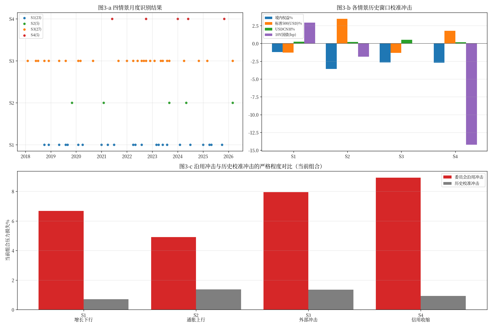
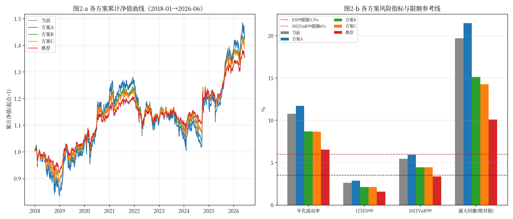
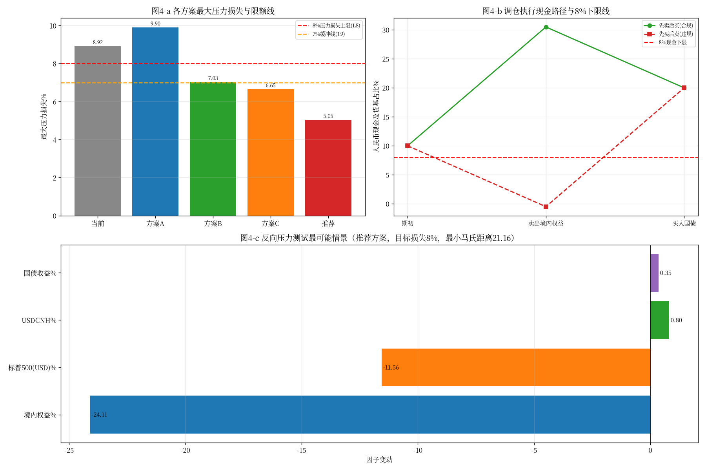
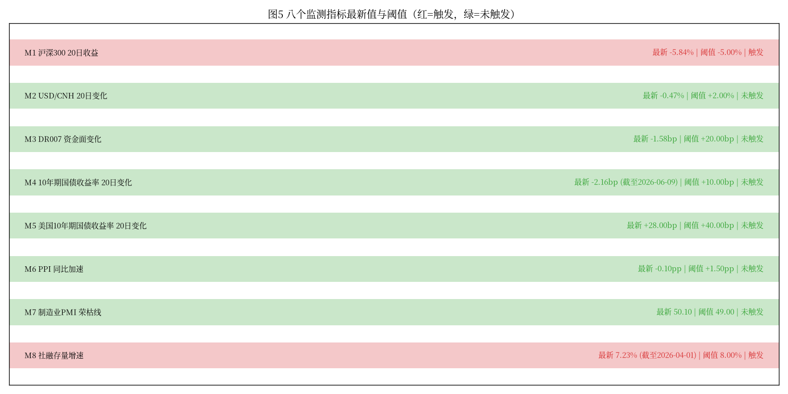
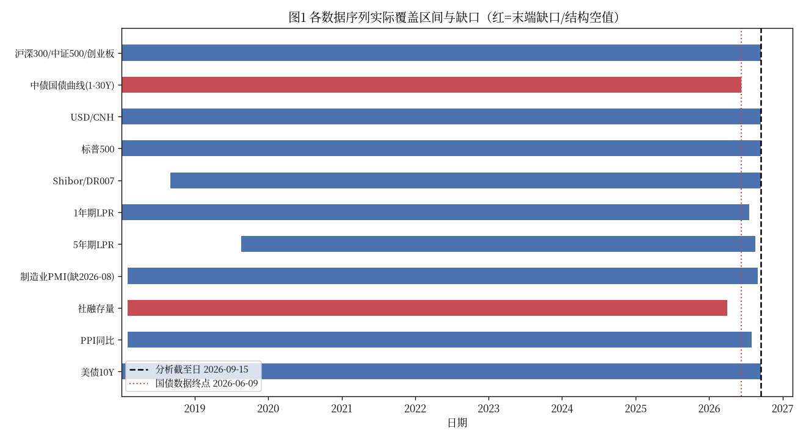

# 多资产稳健配置专户 三季度宏观压力测试与调仓建议
## 风险委员会决策备忘录

> 专户净值 10,000 万元；分析截至日 2026-09-15；金额单位：万元；百分比保留两位小数；收益率变动注明 bp 或 %。
> 全部数字可由 `FIN3-WKN-149_reproduce.py` 从 `input_files/` 原始快照复算。

---

### 一、结论与建议

- **当前组合不合规**：最大压力损失 **8.92%**（情景 S4 信用收缩、委员会沿用冲击），已击穿 8% 硬上限（L8），须调仓。
- **三个候选方案均不达标**：方案A（投资经理）最大压力损失 **9.90%**，突破 8% 上限；方案B（风险管理部）**7.03%**，突破 7% 缓冲线（L9）；方案C（宏观策略组）外币资产敞口 **30.00%**，突破 25% 上限（L5），且无一方案留足 1 个百分点缓冲。**三者均不建议直接采纳。**
- **推荐方案**（在 USD/SPX 权重各 10% 不变前提下，境内权益三项按当前权重同比例缩减系数 0.59、合计减配 20.50 个百分点，释放资金 10.50pp 转入国债、10.00pp 转入人民币现金）：
  - 最大压力损失 **5.05%**（S4/委员会），对 8% 上限留 2.95pp、对 7% 缓冲线留 1.95pp 裕度；
  - 1 日 ES99 **1.57%**（限额 3.5%）、10 日 VaR99 **3.36%**（限额 6.0%）；
  - 单向换手率 **20.50%**；九项约束**全部通过**。
- **处置意见**：否决三个候选方案，采纳推荐方案；按"先卖后买"顺序执行（见第七章），现金全程不击穿 8% 下限。
- **是否提请临时风险会议**：当前组合已超 L8 硬上限，且监测指标 M1（沪深300 20 日收益 −5.84%）、M8（社融存量增速 7.23%）已触发，**建议提请临时风险会议**审议本调仓并授权执行。

---

### 二、数据核验与样本区间

**可用样本区间与终止原因**：组合四类资产日收益的共同可得区间为 **2018-01-02 至 2026-06-09**，共 **2,044 个上交所交易日**。终止原因：中债国债收益率曲线五个关键期限（1/2/5/10/30Y）全部止于 **2026-06-09**，而国债为组合必备资产，故组合日收益序列不能延伸至分析截至日 2026-09-15；**该段（2026-06-10 至 2026-09-15）为结构性缺口，按规则不前向填充、不以 0 参与计算**（见下）。情景识别、监测指标等不依赖国债日收益的计算仍沿用至 2026-09-15。

**各序列覆盖区间、缺口与处理**（源：`snapshot_data_manifest.csv` 的 `possible_truncation` 字段不保证与实际一致，以下以文件实际内容为准）：

| 序列 | 实际覆盖 | 原始条数 | 清洗后 | 缺口 / 异常处理 |
|---|---|---|---|---|
| 沪深300 / 中证500 / 创业板 | 2018-01-02 → 2026-09-15 | 2114 / 2114 / 2113 | 2113 / 2113 / 2113 | 沪深300、中证500 各含 1 条 **2026-09-12（周六，非交易日）** 残留记录（OHLC 全等于 pre_close），已按交易日历剔除 |
| 中债国债曲线 1-30Y | 2018-01-02 → **2026-06-09** | 各 2106 | 各 2106 | **末端结构性缺口**（2026-06-10 起无数据），不填充 |
| USD/CNH | 2018-01-02 → 2026-09-15 | 2174（两段拼接） | 2113 | 含 **147 条离岸假期（境内休市）报价**，不计入 SSE 估值日；对齐 SSE 后前向填充 |
| 标普500 | 2018-01-02 → 2026-09-15 | 2187 | 2113 | 美股交易日历与 SSE 不一致，对齐 SSE 后前向填充 |
| Shibor / DR007 | 2018-09-03 → 2026-09-15 | 各 2000 | — | manifest 对 shibor_seg2 标 `possible_truncation=false` 实为完整，以实际为准；仅用于情景/监测 |
| 1 年期 LPR | 2018-01-02 → 2026-07-20 | 489 | — | 仅月度调整日有值 |
| 5 年期 LPR | **2019-08-20** → 2026-08-20 | 491（含 406 空值） | 85 | 2019-08 前无 5Y LPR 品种，为**结构性空值**，不填充、不按 0 计 |
| 制造业 PMI | 2018-02-01 → 2026-09-01 | 103 | 103 | **缺 2026-08 月**，为缺失期次，相关逐月判断跳过该月 |
| 社融存量 | 2018-02-01 → **2026-04-01** | 99 | 99 | 末端缺口，M8 以 2026-04 最新值计并标注 |
| PPI 同比 | 2018-02-01 → 2026-08-01 | 103 | 103 | 完整 |
| 美债 10Y | 2018-01-02 → 2026-09-15 | 2176 | — | 完整，仅用于 M5 |
| 美债 m2 / m4 期限 | — | 1978 / 6 | — | 非组合资产；m4 仅 6 条（2026-09-08→09-15），不参与组合计算 |

**休市日异常识别依据与剔除**：以 `snapshot_trade_calendar.csv`（2,113 个 SSE 交易日）为准，凡行情记录日期不在交易日历中即判为休市日残留；共识别并剔除沪深300、中证500 各 1 条 2026-09-12 记录（该记录 open=high=low=close=pre_close，为典型休市填充）。

**汇率对齐口径与价格对齐方法**：所有跨市场序列（USD/CNH、标普500）先对齐到上交所估值日；SSE 交易但外部市场休市的日期按**前向填充**取最近有效值；外部市场交易但 SSE 休市的记录不进入估值网格。结构性空值（5Y LPR 早期、各序列末端缺口）**不参与前向填充、不以 0 计**。

---

### 三、当前组合风险画像

**持仓、权重与金额**（源 `params_positions.csv`，净值 10,000 万元）：

| 资产 | 权重 | 金额（万元） |
|---|---|---|
| 沪深300指数基金 | 25.00% | 2,500.00 |
| 中证500指数基金 | 15.00% | 1,500.00 |
| 创业板指数基金 | 10.00% | 1,000.00 |
| 中长期国债组合 | 20.00% | 2,000.00 |
| 美元现金及存款 | 10.00% | 1,000.00 |
| 标普500 QDII基金 | 10.00% | 1,000.00 |
| 人民币现金及货基 | 10.00% | 1,000.00 |

**各资产日收益统计特征**（年化波动率；单日极值）：沪深300 19.26%（−7.88%/+8.48%）、中证500 22.37%（−9.55%/+10.41%）、创业板 29.04%（−12.50%/+17.25%）、国债（久期折算）2.26%（−0.71%/+1.13%）、美元现金 4.22%（−1.57%/+1.58%）、标普500（人民币计）19.01%（−12.19%/+9.68%）。

**相关矩阵**（日收益，样本内）：

| | 沪深300 | 中证500 | 创业板 | 国债 | 美元现金 | 标普500(CNY) |
|---|---|---|---|---|---|---|
| 沪深300 | 1.00 | 0.86 | 0.84 | −0.23 | −0.25 | 0.12 |
| 中证500 | 0.86 | 1.00 | 0.87 | −0.20 | −0.18 | 0.12 |
| 创业板 | 0.84 | 0.87 | 1.00 | −0.18 | −0.18 | 0.11 |
| 国债 | −0.23 | −0.20 | −0.18 | 1.00 | 0.11 | −0.05 |
| 美元现金 | −0.25 | −0.18 | −0.18 | 0.11 | 1.00 | 0.03 |
| 标普500(CNY) | 0.12 | 0.12 | 0.11 | −0.05 | 0.03 | 1.00 |

境内权益三项高度正相关（0.84–0.87）；国债、美元现金对境内权益为负相关，具对冲价值。

> 图2（历史风险总览）：图2-a 为五方案累计净值曲线，图2-b 为各方案年化波动率、1 日 ES99、10 日 VaR99 与最大回撤柱状对比并叠加 ES99（3.5%）/VaR99（6.0%）限额线；推荐方案各项风险指标最低。

**组合层面风险指标**（当前组合，样本 2018-01-02→2026-06-09）：

| 指标 | 数值 |
|---|---|
| 年化波动率 | 10.77% |
| 1 日 VaR95 / VaR99 | 0.98% / 1.79% |
| 1 日 ES95 / ES99 | 1.53% / 2.60% |
| 10 日 VaR99 | 5.43% |
| 10 日最大累计损失 | −8.48%（2020-03-06 → 2020-03-19） |
| 最大回撤 | −19.68%（2021-12-13 → 2024-02-05，样本内未完全修复） |
| 最差单日损失 | −4.88% |

**各资产对组合风险贡献占比**（边际风险贡献法）：沪深300 **42.2%**、中证500 **29.1%**、创业板 **24.9%**、标普500（CNY）**5.2%**、国债 **−0.7%**、美元现金 **−0.7%**。境内权益合计贡献约 **96%**，是风险的绝对主导来源，故调仓应以压降境内权益为主。

---

### 四、情景识别与历史校准

**四情景月度识别规则与合格月份数**（规则源 `rules_scenarios.csv`，识别区间 2018-02 → 2026-09）：

| 情景 | 识别规则（摘要） | 合格月份数 |
|---|---|---|
| S1 增长下行与政策宽松 | PMI<50 且 LPR 下调，或 PMI 环比降≥0.5 且 10Y 月均降 | 23 |
| S2 通胀上行与利率上行 | PPI 同比升 且 10Y 月均升 且 权益当月跌 | 5 |
| S3 外部冲击与美元走强 | 标普500 当月≤−3% 或 USD/CNH 当月≥+1.5% | 27 |
| S4 信用收缩与资金面收紧 | 社融增速降 且 DR007 月均升 且 权益当月跌 | 5 |

**历史窗口构造与合格窗口**（规则源 `rules_windows.csv`）：窗口起点为合格月份**次月第一个 SSE 交易日**，长度 **10 个 SSE 交易日**；窗口内按当前组合权重每日再平衡的**累计收益为负**即合格；合格窗口须完整落在国债数据可得区间（≤2026-06-09）。合格窗口数：**S1=6、S2=3、S3=8、S4=1**。各情景跌幅最大窗口：S1 2024-08-01→08-14（−2.65%）、S2 2023-10-09→10-20（−2.65%）、S3 2023-10-09→10-20（−2.65%）、S4 2021-07-01→07-14（−0.00%，为唯一合格窗口，累计收益约为 0 的临界负值）。

**历史校准冲击**（全部合格窗口内各风险因子 10 日累计变动的**中位数**）：

| 情景 | 境内权益 | 标普500(USD) | USD/CNH | 国债曲线 bp（1Y/2Y/5Y/10Y/30Y） |
|---|---|---|---|---|
| S1 | −1.20% | −1.29% | +0.25% | +4.8/+1.1/+2.6/+2.9/−0.9 |
| S2 | −3.57% | +3.47% | +0.21% | +3.7/+10.0/−0.5/−1.8/−4.8 |
| S3 | −2.66% | −1.32% | +0.53% | −1.7/−2.5/+3.0/0.0/−0.8 |
| S4 | −2.70% | +1.79% | +0.19% | −15.1/−14.9/−17.2/−14.2/−14.2 |

**校准冲击与委员会沿用冲击的差异**（见图3-c）：
- **严格程度**：委员会沿用冲击在所有情景上均显著更严厉。以当前组合计，委员会冲击下 S1/S2/S3/S4 损失为 6.68%/4.92%/7.94%/8.92%，而历史校准冲击仅 0.70%/1.37%/1.36%/0.93%。原因：委员会冲击为**尾部整段情景**假设（如 S4 境内权益 −18%），而历史校准取合格窗口**中位数**（10 日），幅度自然温和；且国债数据止于 2026-06-09 使近期窗口不可用，样本偏历史。
- **曲线形态**：委员会 S2/S4 为**熊平/倒挂**（短端大升、长端下行，如 S4 1Y+0.80%、30Y−0.50%），历史校准 S4 则为五期限整体**下行**（全曲线 −14~−17bp），方向相反——反映历史上信用收缩期往往伴随避险买债、收益率下行，与委员会"资金紧→短端利率飙升"的前瞻假设存在结构性差异。委员会冲击更保守，用于约束判定更稳健。

> 图3（情景识别与校准）：图3-a 为四情景逐月识别结果散点，图3-b 为各情景历史窗口校准冲击（权益/美股/汇率及 10Y bp），图3-c 为委员会沿用冲击与历史校准冲击在当前组合上的压力损失对比，直观显示沿用冲击更严格。

---

### 五、压力测试结果

对 **4 候选方案 + 当前组合 + 推荐方案**，各在 **4 情景 × 2 套冲击**下测算，损益按**境内权益 / 标普500（人民币计，复合折算）/ 美元现金 / 国债（关键期限久期折算）**四部分拆分，四部分之和等于组合损益。完整结果（委员会冲击，占净值 %，括号内为四部分：权益/标普/美元/国债）：

| 方案 | S1 | S2 | S3 | S4（最严） |
|---|---|---|---|---|
| 当前 | −6.68 (−6.00/−0.62/+0.20/−0.27) | −4.92 (−5.00/−0.32/+0.30/+0.10) | −7.94 (−7.50/−1.14/+0.80/−0.10) | **−8.92** (−9.00/−0.76/+0.50/+0.34) |
| 方案A | −7.22 | −5.44 | −8.67 | **−9.90** (−9.90/−0.76/+0.50/+0.26) |
| 方案B | −5.55 | −3.89 | −6.47 | **−7.03** (−7.20/−0.76/+0.50/+0.43) |
| 方案C | −5.26 | −3.63 | −5.63 | **−6.65** (−7.20/−0.76/+1.00/+0.31) |
| 推荐 | −4.36 | −2.81 | −4.92 | **−5.05** (−5.31/−0.76/+0.50/+0.52) |

历史校准冲击下全部结果均较温和（当前组合 S1–S4 为 −0.70/−1.37/−1.36/−0.93%；推荐方案 −0.47/−0.62/−0.82/−0.26%），完整数值见 `FIN3-WKN-149_results.json` 的 `stress` 字段。

**各方案最大压力损失及来源情景**（均来自 **S4 信用收缩 / 委员会冲击**）：当前 **8.92%**、方案A **9.90%**、方案B **7.03%**、方案C **6.65%**、推荐 **5.05%**。

**两套冲击严格程度比较与原因**：所有情景下**委员会沿用冲击一致严于历史校准冲击**（见第四章与图3-c）。核心原因：委员会冲击刻画的是整段尾部情景的极端位移，而历史校准为合格窗口 10 日累计变动的中位数，属于"典型回撤"而非"尾部"；叠加国债序列止于 2026-06-09 导致近两年多个候选窗口（尤其 2025 年后）无法纳入校准，样本代表性受限。故**约束判定以委员会冲击为准更稳健**，本备忘录的达标结论均基于委员会冲击的最大压力损失。

---

### 六、候选方案评估与九项约束检查

逐条检查结果（✓通过 / ✗未通过；外币敞口 = 美元现金及存款 + 不对冲汇率的标普500 QDII，按 `params_limits.csv` L5 口径）：

| 检查 | 限额 | 当前 | 方案A | 方案B | 方案C | 推荐 |
|---|---|---|---|---|---|---|
| C1 权重合计=100% | =100% | ✓100.00 | ✓100.00 | ✓100.00 | ✓100.00 | ✓100.00 |
| C2 权益类≤60% | ≤60% | ✓50.00 | ✓55.00 | ✓40.00 | ✓40.00 | ✓29.50 |
| C3 人民币现金∈[8,20]% | [8,20] | ✓10.00 | ✓10.00 | ✓15.00 | ✓12.00 | ✓20.00 |
| C4 国债≥15% | ≥15% | ✓20.00 | ✓15.00 | ✓25.00 | ✓18.00 | ✓30.50 |
| C5 外币敞口≤25% | ≤25% | ✓20.00 | ✓20.00 | ✓20.00 | **✗30.00（+5.00pp）** | ✓20.00 |
| C6 1日 ES99≤3.5% | ≤3.5% | ✓2.60 | ✓2.84 | ✓2.10 | ✓2.09 | ✓1.57 |
| C7 10日 VaR99≤6% | ≤6% | ✓5.43 | ✓5.91 | ✓4.44 | ✓4.43 | ✓3.36 |
| C8 最大压力损失≤8% | ≤8% | **✗8.92（+0.92pp）** | **✗9.90（+1.90pp）** | ✓7.03 | ✓6.65 | ✓5.05 |
| C9 最大压力损失≤7%（缓冲） | ≤7% | ✗8.92（+1.92pp） | ✗9.90（+2.90pp） | **✗7.03（+0.03pp）** | ✓6.65 | ✓5.05 |

**未通过项汇总**：
- **当前组合**：C8（+0.92pp）、C9（+1.92pp）——压力损失超 8% 硬上限，必须调仓。
- **方案A**（投资经理）：C8（+1.90pp）、C9（+2.90pp）——权益敞口最高（55%），S4 损失 9.90%，最不达标。
- **方案B**（风险管理部）：C9（+0.03pp）——C8（8% 硬线）通过但 7.03% 未达 7% 缓冲线，不满足拟推荐方案的缓冲要求。
- **方案C**（宏观策略组）：C5（+5.00pp）——美元现金提至 20% 叠加标普500 QDII 10%，外币敞口 30% 超限。

**关于标普500 QDII 的外币敞口判定**：按 L5 口径，**不对冲汇率的标普500 QDII 必须计入外币敞口**。四方案 USD/SPX 均为 10%+10%，推荐方案同；唯方案C 将美元现金提至 20%，使外币敞口达 30%。本检查**未将标普500 QDII 漏计外币敞口**（若漏计，方案C 外币敞口将被误算为 20% 而"通过"，属误判）；也未将其重复误计入权益类 L2（L2 明确不含标普500 QDII）。推荐方案外币敞口 = 10%+10% = 20.00%，合规。

> 图4-a 为各方案最大压力损失柱状图，叠加 8% 压力损失上限线与 7% 缓冲线：方案A/当前超 8% 线，方案B 处于 7–8% 之间，方案C 与推荐方案在 7% 线下，推荐方案裕度最大。

---

### 七、推荐方案与调仓执行

**推荐方案完整权重**（与 `params_holdings.csv` 的 `weight_recommended` 逐项一致）：

| 资产 | 当前 | 推荐 | 变动 | 金额变动（万元） |
|---|---|---|---|---|
| 沪深300指数基金 | 25.00% | 14.75% | −10.25pp | −1,025.00 |
| 中证500指数基金 | 15.00% | 8.85% | −6.15pp | −615.00 |
| 创业板指数基金 | 10.00% | 5.90% | −4.10pp | −410.00 |
| 中长期国债组合 | 20.00% | 30.50% | +10.50pp | +1,050.00 |
| 美元现金及存款 | 10.00% | 10.00% | 0 | 0 |
| 标普500 QDII基金 | 10.00% | 10.00% | 0 | 0 |
| 人民币现金及货基 | 10.00% | 20.00% | +10.00pp | +1,000.00 |

**构造依据**（源 `rules_rebalance.csv` 的 `recommendation_rule`）：
1. 风险贡献显示境内权益占组合风险约 96%（第三章），故压降权益为唯一有效降风险路径；
2. 保持美元现金与标普500 QDII 各 10% 不变（外币敞口锁定 20%，满足 C5 且不触发汇率敞口上限）；
3. 境内权益三项按**当前权重同比例缩减**（缩减系数 0.59，即 25%/15%/10% → 14.75%/8.85%/5.90%），合计减配 **20.50pp**，保持权益内部结构不变；
4. 释放的 20.50pp 中，**10.50pp 增配国债**（30.50%，强化负相关对冲、满足 C4）、**10.00pp 增配人民币现金**（提至 20% 上限，最大化流动性缓冲、满足 C3）。

**唯一性说明（同换手率下的次优比较）**：固定单向换手率 20.50%（即权益减配 20.50pp，k=0.59），释放资金在国债/人民币现金间的分配存在一个可行区间——共 **21 个可行分配点全部通过九检查**，最大压力损失在 4.95%–5.05% 间微幅变化。推荐方案（人民币现金 20.00% / 国债 30.50%）是该区间内**将人民币现金顶到 20% 上限的唯一角点解**，流动性缓冲最大、且与委员会构造规则（10.5/10.0 分配）唯一对应；其余分配点为次优（流动性缓冲更低而压力损失并不更优）。
- 补充说明：若放开"同比例缩减 + 双向增配"的构造约束，纯换手最小化可得 **9.75pp** 的减配方案（全部转入国债），其最大压力损失 **6.99%**，仅距 7% 缓冲线 0.01pp、几无裕度；在"稳健配置"目标与 1pp 缓冲精神下予以排除，故仍以 20.50pp 的推荐方案为准。

**交易清单与执行顺序**（按 `rules_rebalance.csv`：先卖出后买入；卖出资金当日可用；买入国债当日扣款；QDII 不动）：

| 顺序 | 证券 | 方向 | 金额（万元） |
|---|---|---|---|
| 1 | 沪深300指数基金 | 卖出 | 1,025.00 |
| 2 | 中证500指数基金 | 卖出 | 615.00 |
| 3 | 创业板指数基金 | 卖出 | 410.00 |
| 4 | 中长期国债组合 | 买入 | 1,050.00 |
| — | 人民币现金及货基 | （沉淀） | +1,000.00 |

单向换手率 = 卖出合计 2,050.00 / 10,000 = **20.50%**。

**两种执行路径的现金占比与是否击穿 8% 下限**（见图4-b）：
- **先卖后买（推荐，合规）**：期初 10.00% → 卖出境内权益后 30.50% → 买入国债 1,050 后 **20.00%**。全程最低 10.00%，**不击穿** 8% 下限。
- **先买后卖（对照，违规）**：期初 10.00% → 先买国债 1,050 → 现金降至 **−0.50%**（−50 万元），**击穿** 8% 下限且透支。故必须按"先卖后买"执行。
- 注：标普500 QDII 本次不交易；若涉及 QDII 赎回，须计入 T+7 到账、赎回当日不增加可用现金，本方案无此影响。

---

### 八、反向压力测试与监测预警

**推荐方案在最大损失情景下的裕度与放大倍数**：最大压力损失 5.05%（S4/委员会），距 8% 硬上限裕度 **2.95pp**；若损失要达到 8% 上限，需当前最严冲击**放大约 1.59 倍**（8.00 / 5.05）。

**样本内最差 10 日累计损失**（推荐方案）：**−5.73%**，区间 **2020-03-06 → 2020-03-19**（2020 年全球疫情冲击期）。

**反向压力测试（最可能情景）**：以推荐方案损失恰达 8% 上限为约束，在日频风险因子协方差结构下求最小马氏距离情景（闭式解 x\* = μ + λ·Σa / aᵀΣa）：
- 最可能因子组合：境内权益 **−24.11%**、标普500(USD) **−11.56%**、USD/CNH **+0.81%**、国债收益 **+0.35%**；
- **最小马氏距离 = 21.16**（以日频因子标准差计，相当于极罕见的多标准差联合位移）。
- 约束条件：aᵀx = −8%，其中敏感度向量 a = [权益合计权重, SPX 权重, SPX+USD 权重, 国债权重]。

**沿用冲击与历史校准窗口的马氏距离对比**（投影到四因子，S4 最严情景）：委员会沿用冲击 **23.45**、历史校准窗口 **7.52**。委员会冲击距历史分布更远（更极端、更保守），历史校准冲击则贴近常见回撤——再次印证沿用冲击的审慎性。

**八个监测指标（截至 2026-09-15）**：

| 指标 | 阈值 | 最新值 | 状态 |
|---|---|---|---|
| M1 沪深300 20日收益 | 低于 −5.00% | **−5.84%** | **触发** |
| M2 USD/CNH 20日变化 | 高于 +2.00% | −0.47% | 未触发 |
| M3 DR007 资金面变化 | 高于 +20.00bp | −1.58bp | 未触发 |
| M4 10Y国债 20日变化 | 高于 +10.00bp | −2.16bp（截至 2026-06-09） | 未触发 |
| M5 美债10Y 20日变化 | 高于 +40.00bp | +28.00bp | 未触发 |
| M6 PPI同比加速 | 高于 +1.50pp | −0.10pp | 未触发 |
| M7 制造业PMI | 低于 49.00 | 50.10 | 未触发 |
| M8 社融存量增速 | 低于 8.00% | **7.23%（截至 2026-04-01）** | **触发** |

**触发解读**：M1 触发（近 20 日沪深300 跌 5.84%）反映境内权益短期承压，与推荐方案压降权益方向一致；M8 触发（社融增速 7.23% 低于 8%）指向信用扩张放缓，正对应最严情景 S4，支持增配国债与现金的调仓。其余指标未触发。

**补齐数据后的重新判断安排**：
- **国债曲线**（止于 2026-06-09）与 **社融存量**（止于 2026-04-01）存在末端缺口，M4、M8 及组合日收益窗口均受影响。待数据补齐至 2026-09-15 后，须**重新测算组合风险指标、刷新 M4/M8，并复核 S4 情景的历史校准窗口**（可能纳入 2025 年后窗口，改变校准冲击形态）。
- **制造业 PMI** 缺 2026-08 月，补齐后复核 S1/S4 的 8 月识别结果。
- 在数据补齐前，约束达标结论以委员会沿用冲击为准（更保守），本次推荐方案在此口径下留有 2.95pp 裕度，判断稳健。

> 图1 为各数据序列实际覆盖区间与缺口（红色标注末端缺口/结构性空值）及分析截至日；图5 为八个监测指标最新值与阈值对照，红色为已触发（M1、M8）。

---

**附件清单**
- 图表：`FIN3-WKN-149_charts/` 下 5 张 PNG（数据覆盖、历史风险、情景识别与校准、方案决策与执行、监测触发），均含中文标注与限额参考线。
- 可复算代码：`FIN3-WKN-149_reproduce.py`（从 `input_files/` 读入，无硬编码结论）。
- 结果数据：`FIN3-WKN-149_results.json`、监测表 `FIN3-WKN-149_monitor_filled.csv`。
