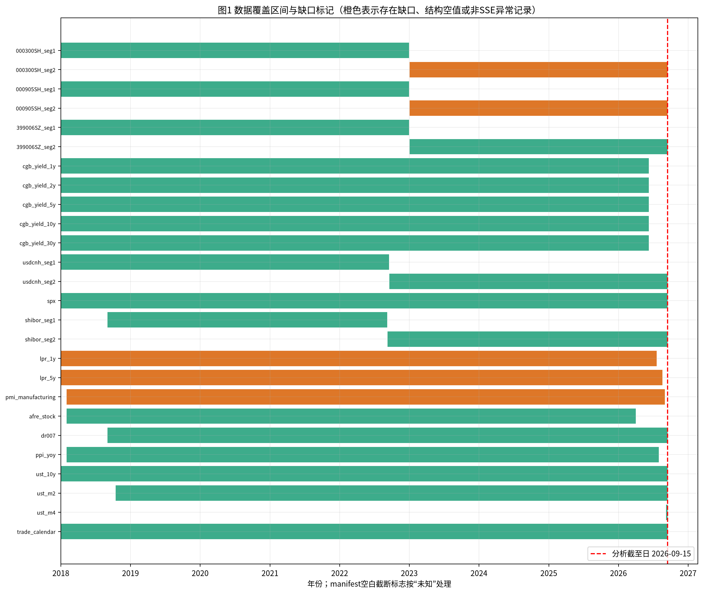
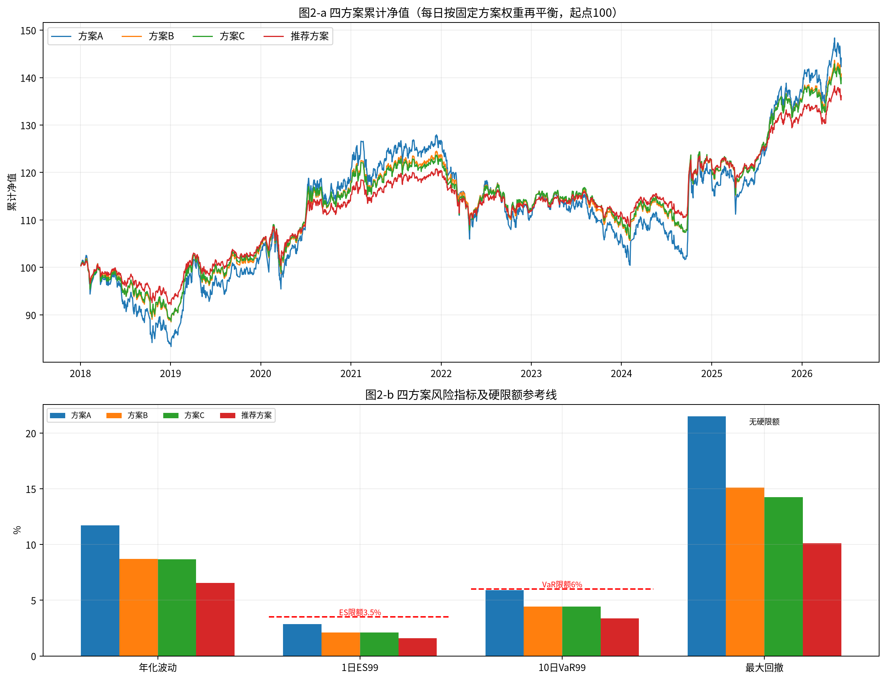
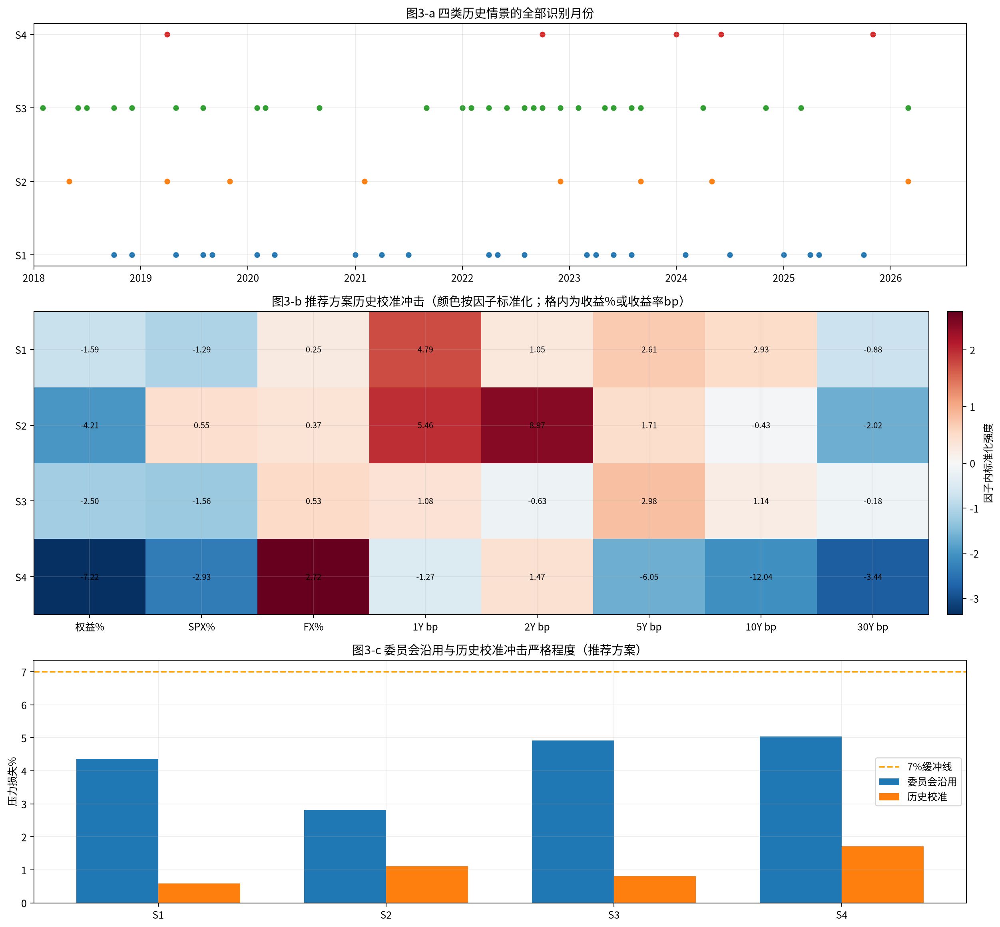
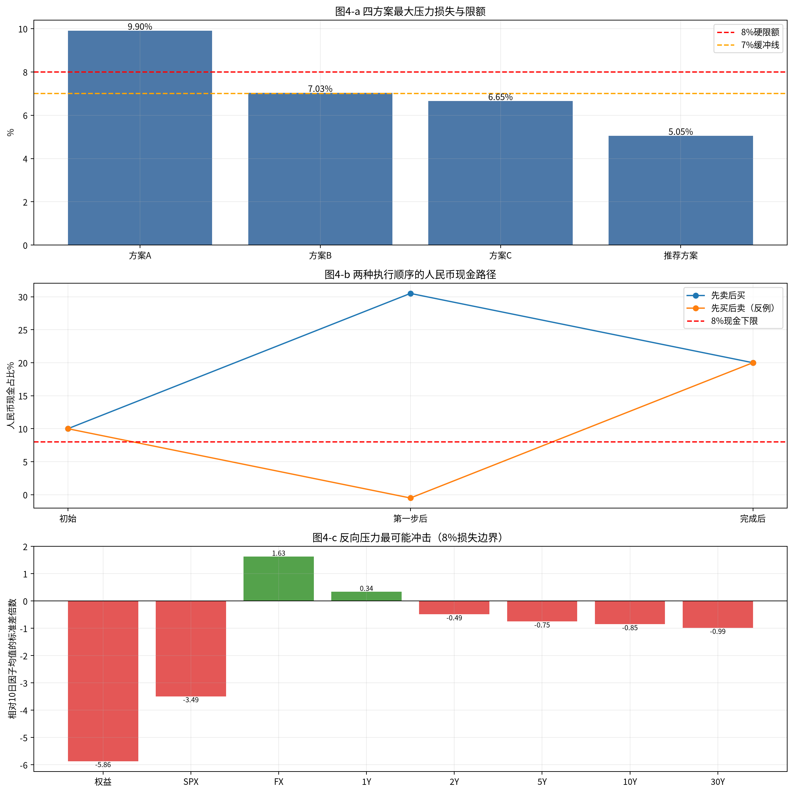
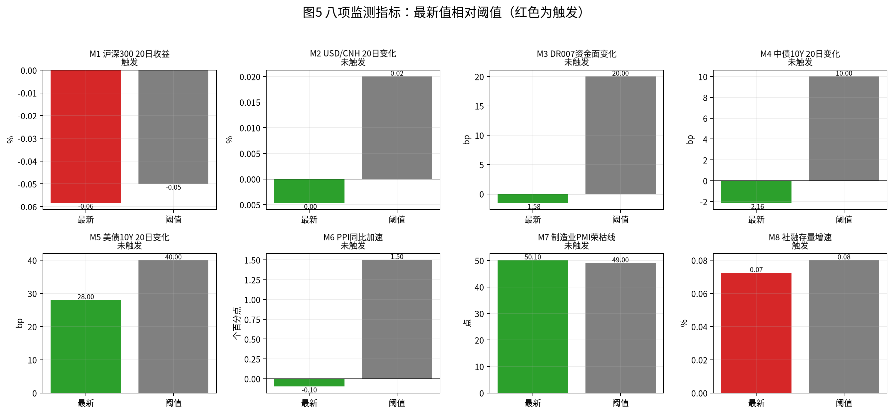

# FIN3-WKN-149 多资产专户三季度宏观压力测试与调仓建议
## 风险委员会决策备忘录

**分析截至日：2026-09-15；金额单位：万元；组合净值：10000.00。**

### 一、结论与建议

当前组合用于风险画像，不纳入四方案硬约束比较。方案A、方案B、方案C的未通过项分别为L8、L9、L9、L5；推荐方案九项约束全部通过，建议采用推荐方案。推荐方案最大压力损失5.05%（S4/委员会沿用）、1日ES99为1.57%、10日VaR99为3.36%、单向换手率20.50%。触发M1、M8；建议提请临时风险会议。

### 二、数据核验与样本区间

脚本首先完成文件存在性、manifest行数/起止日、日期唯一性、异常日、空值及交叉源一致性检查，再进入计算。完整风险样本为2018-01-02~2026-06-09，共2044个价格估值日、2043个简单收益日；终止原因是五条中债国债关键期限曲线均止于2026-06-09。数据序列逐项核验如下（分段文件保留各自实际范围与行数；manifest的possible_truncation空白严格记为“未知”，不当作False）：

| 文件/逻辑序列 | 实际范围 | 实际行数 | 缺口/结构空值处理 | manifest截断标志 |
|---|---|---|---|---|
| snapshot_000300SH_seg1.csv | 2018-01-02~2022-12-30 | 1215 | pre_close首行空1 | 未知（空白） |
| snapshot_000300SH_seg2.csv | 2023-01-03~2026-09-15 | 899 | 非SSE日:2026-09-12 | 未知（空白） |
| snapshot_000905SH_seg1.csv | 2018-01-02~2022-12-30 | 1215 | pre_close首行空1 | 未知（空白） |
| snapshot_000905SH_seg2.csv | 2023-01-03~2026-09-15 | 899 | 非SSE日:2026-09-12 | 未知（空白） |
| snapshot_399006SZ_seg1.csv | 2018-01-02~2022-12-30 | 1215 | pre_close首行空1 | 未知（空白） |
| snapshot_399006SZ_seg2.csv | 2023-01-03~2026-09-15 | 898 |  | 未知（空白） |
| snapshot_cgb_yield_1y.csv | 2018-01-02~2026-06-09 | 2106 | SSE主轴缺0；非SSE观测62条剔除 | 未知（空白） |
| snapshot_cgb_yield_2y.csv | 2018-01-02~2026-06-09 | 2106 | SSE主轴缺0；非SSE观测62条剔除 | 未知（空白） |
| snapshot_cgb_yield_5y.csv | 2018-01-02~2026-06-09 | 2106 | SSE主轴缺0；非SSE观测62条剔除 | 未知（空白） |
| snapshot_cgb_yield_10y.csv | 2018-01-02~2026-06-09 | 2106 | SSE主轴缺0；非SSE观测62条剔除 | 未知（空白） |
| snapshot_cgb_yield_30y.csv | 2018-01-02~2026-06-09 | 2106 | SSE主轴缺0；非SSE观测62条剔除 | 未知（空白） |
| snapshot_usdcnh_seg1.csv | 2018-01-02~2022-09-16 | 1176 | 源市场日历；对齐SSE时仅向前填充 | 未知（空白） |
| snapshot_usdcnh_seg2.csv | 2022-09-19~2026-09-15 | 998 | 源市场日历；对齐SSE时仅向前填充 | 未知（空白） |
| snapshot_spx.csv | 2018-01-02~2026-09-15 | 2187 | 源市场日历；对齐SSE时仅向前填充 | 未知（空白） |
| snapshot_shibor_seg1.csv | 2018-09-03~2022-09-08 | 1000 | 原始值无空 | 未知（空白） |
| snapshot_shibor_seg2.csv | 2022-09-09~2026-09-15 | 1000 | 原始值无空 | False |
| snapshot_lpr_1y.csv | 2018-01-02~2026-07-20 | 489 | 缺月:2024-11 | 未知（空白） |
| snapshot_lpr_5y.csv | 2018-01-02~2026-08-20 | 491 | 发布前结构空值406（至2019-08-20前不填） | 未知（空白） |
| snapshot_pmi_manufacturing.csv | 2018-02-01~2026-09-01 | 103 | 缺月:2026-08 | 未知（空白） |
| snapshot_afre_stock.csv | 2018-02-01~2026-04-01 | 99 | 月序列无缺月 | 未知（空白） |
| snapshot_dr007.csv | 2018-09-03~2026-09-15 | 2000 | 原始值无空 | 未知（空白） |
| snapshot_ppi_yoy.csv | 2018-02-01~2026-08-01 | 103 | 月序列无缺月 | 未知（空白） |
| snapshot_ust_10y.csv | 2018-01-02~2026-09-15 | 2176 | 源市场日历；对齐SSE时仅向前填充 | 未知（空白） |
| snapshot_ust_m2.csv | 2018-10-16~2026-09-15 | 1978 | 源市场日历；对齐SSE时仅向前填充 | 未知（空白） |
| snapshot_ust_m4.csv | 2026-09-08~2026-09-15 | 6 | 源市场日历；对齐SSE时仅向前填充 | 未知（空白） |
| snapshot_trade_calendar.csv | 2018-01-02~2026-09-15 | 2113 | SSE主轴完整 | 未知（空白） |

沪深300和中证500各识别并剔除2026-09-12周六记录，依据是该日不在SSE交易日历；创业板无此异常。境外SPX、USD/CNH和监测所用UST10Y先对齐SSE估值日，只用当日或更早观测进行past-only forward-fill，再计算收益或端点变化；不作向后填充。结构空值不填：5Y LPR在正式发布前为空，pre_close首行空值不参与收益计算；PMI缺2026-08、1Y LPR缺2024-11，月度规则不跨月填充。UST m2与m4重叠期发现6个冲突观测，二者不用于核心计算；SHIBOR 1W与DR007在重叠源文件中完全一致，按原始文件保留、不擅自修改。社融、PPI、PMI和LPR均有发布滞后，结论按各自实际截至日。

图1说明：橙色标示存在缺口、结构空值或非SSE异常记录的序列，绿色为未发现上述问题的覆盖区间，红色虚线为分析截至日。

### 三、当前组合风险画像

当前持仓：

| 资产 | 当前权重 | 金额（万元） |
|---|---|---|
| 沪深300指数基金 | 25.00% | 2500.00 |
| 中证500指数基金 | 15.00% | 1500.00 |
| 创业板指数基金 | 10.00% | 1000.00 |
| 中长期国债组合 | 20.00% | 2000.00 |
| 美元现金及存款 | 10.00% | 1000.00 |
| 标普500 QDII基金 | 10.00% | 1000.00 |
| 人民币现金及货基 | 10.00% | 1000.00 |

资产收益统计（CGB日收益严格按 `-Σ(各关键期限久期贡献×收益率日变动十进制)`，SPX人民币收益为 `(1+r_spx_usd)(1+r_fx)-1`，美元现金人民币收益为FX收益，人民币现金收益为0）：

| 资产 | 日均收益 | 日波动 | 年化波动 | 最差单日 |
|---|---|---|---|---|
| 沪深300 | 0.02% | 1.21% | 19.26% | -7.88% |
| 中证500 | 0.02% | 1.41% | 22.37% | -9.55% |
| 创业板 | 0.06% | 1.83% | 29.04% | -12.50% |
| 中长期国债 | 0.01% | 0.14% | 2.26% | -0.71% |
| 美元现金 | 0.00% | 0.27% | 4.22% | -1.57% |
| 标普500 QDII | 0.06% | 1.20% | 19.01% | -12.19% |
| 人民币现金 | 0.00% | 0.00% | 0.00% | 0.00% |

相关矩阵：

| 资产 | 沪深300 | 中证500 | 创业板 | 中长期国债 | 美元现金 | 标普500 QDII | 人民币现金 |
|---|---|---|---|---|---|---|---|
| 沪深300 | 1.0 | 0.858 | 0.842 | -0.232 | -0.249 | 0.121 | nan |
| 中证500 | 0.858 | 1.0 | 0.873 | -0.205 | -0.184 | 0.121 | nan |
| 创业板 | 0.842 | 0.873 | 1.0 | -0.177 | -0.183 | 0.109 | nan |
| 中长期国债 | -0.232 | -0.205 | -0.177 | 1.0 | 0.114 | -0.051 | nan |
| 美元现金 | -0.249 | -0.184 | -0.183 | 0.114 | 1.0 | 0.031 | nan |
| 标普500 QDII | 0.121 | 0.121 | 0.109 | -0.051 | 0.031 | 1.0 | nan |
| 人民币现金 | nan | nan | nan | nan | nan | nan | nan |

组合指标：

| 指标 | 当前组合 |
|---|---|
| 日均收益 | 0.02% |
| 日波动 | 0.68% |
| 年化波动 | 10.77% |
| 1日VaR95 | 0.98% |
| 1日VaR99 | 1.79% |
| 1日ES95 | 1.53% |
| 1日ES99 | 2.60% |
| 10日VaR99 | 5.43% |
| 10日最大累计损失 | 8.48%（2020-03-06~2020-03-19） |
| 最大回撤 | 19.68%（峰值2021-12-13、谷值2024-02-05、修复2025-08-13） |
| 最差单日损失 | 4.88%（2025-04-07） |

风险贡献采用协方差边际波动贡献 `w_i(Σw)_i/(w'Σw)`，允许负贡献（负值表示协方差对组合波动有对冲作用）：

| 资产 | 风险贡献 |
|---|---|
| 沪深300 | 42.16% |
| 中证500 | 29.15% |
| 创业板 | 24.87% |
| 中长期国债 | -0.75% |
| 美元现金 | -0.66% |
| 标普500 QDII | 5.23% |
| 人民币现金 | 0.00% |

风险口径：风险样本以SSE估值日为主轴；简单收益；历史VaR表示正损失，1日分位数使用 `np.quantile(method='linear')`，ES为损失大于等于VaR的均值；10日指标使用重叠的10个交易日日收益复合；年化波动按√252；最大回撤从每日复合净值计算。图2说明：四方案均按固定权重每日再平衡后复合，风险柱状图同时展示ES99和10日VaR99硬限额，最大回撤明确无硬限额。

### 四、情景识别与历史校准

“权益指数”由当前境内权益内部权重归一化为沪深300/中证500/创业板=50%/30%/20%，按日再平衡，其月收益由月内日收益复合；S3中的SPX和USD/CNH月变化按各自源市场观测计算，避免中外休市错位改变月度识别；中债10Y与DR007取月均；LPR取月末最后有效值且只比较连续日历月；宏观月序列不填缺月。四类情景及全部合格月份：

| 编号 | 情景 | 识别规则 | 全部合格月份 |
|---|---|---|---|
| S1 | 增长下行与政策宽松 | 制造业PMI 月值 < 50 且 (1 年期 LPR 或 5 年期 LPR 当月下调)，或 制造业PMI 较上月下行 >= 0.5 且 10 年期国债收益率月均值低于上月 | 2018-10、2018-12、2019-05、2019-08、2019-09、2020-02、2020-04、2021-01、2021-04、2021-07、2022-04、2022-05、2022-08、2023-03、2023-04、2023-06、2023-08、2024-02、2024-07、2025-01、2025-04、2025-05、2025-10 |
| S2 | 通胀上行与利率上行 | PPI 当月同比高于上月 且 10 年期国债收益率月均值高于上月 且 权益指数当月下跌 | 2018-05、2019-04、2019-11、2021-02、2022-12、2023-09、2024-05、2026-03 |
| S3 | 外部冲击与美元走强 | 标普500 当月收益率 <= -3% 或 USD/CNH 当月变化 >= +1.5% | 2018-02、2018-06、2018-07、2018-10、2018-12、2019-05、2019-08、2020-02、2020-03、2020-09、2021-09、2022-01、2022-02、2022-04、2022-06、2022-08、2022-09、2022-10、2022-12、2023-02、2023-05、2023-06、2023-08、2023-09、2024-04、2024-11、2025-03、2026-03 |
| S4 | 信用收缩与资金面收紧 | 社会融资规模存量同比增速低于上月 且 DR007 月均值高于上月 且 权益指数当月下跌 | 2019-04、2022-10、2024-01、2024-06、2025-11 |

历史窗口从合格月次月首个SSE交易日的当日收益起算，连续取10个交易日日收益（含首日前一交易日收盘至首日收盘的收益），必须完整落在共同样本；各方案以每日再平衡组合10日累计收益<0筛选，并按累计收益从低到高排列（最大跌幅在前），全部合格窗口用于校准，无窗口则全因子冲击为0：

| 方案 | 情景 | 合格窗口数 | 全部合格窗口 |
|---|---|---|---|
| 方案A | S1 | 6 | 2024-08-01~2024-08-14(-2.83%)；2020-03-02~2020-03-13(-1.05%)；2022-09-01~2022-09-15(-0.86%)；2023-09-01~2023-09-14(-0.75%)；2025-11-03~2025-11-14(-0.73%)；2023-05-04~2023-05-17(-0.65%) |
| 方案A | S2 | 5 | 2019-05-06~2019-05-17(-3.58%)；2023-10-09~2023-10-20(-2.87%)；2021-03-01~2021-03-12(-1.38%)；2018-06-01~2018-06-14(-0.88%)；2024-06-03~2024-06-17(-0.23%) |
| 方案A | S3 | 9 | 2022-03-01~2022-03-14(-5.17%)；2023-10-09~2023-10-20(-2.87%)；2025-04-01~2025-04-15(-2.36%)；2018-08-01~2018-08-14(-1.66%)；2023-03-01~2023-03-14(-1.64%)；2022-07-01~2022-07-14(-1.20%)；2020-03-02~2020-03-13(-1.05%)；2022-09-01~2022-09-15(-0.86%)；2023-09-01~2023-09-14(-0.75%) |
| 方案A | S4 | 1 | 2019-05-06~2019-05-17(-3.58%) |
| 方案B | S1 | 6 | 2024-08-01~2024-08-14(-2.21%)；2020-03-02~2020-03-13(-0.91%)；2022-09-01~2022-09-15(-0.67%)；2023-09-01~2023-09-14(-0.64%)；2025-11-03~2025-11-14(-0.61%)；2023-05-04~2023-05-17(-0.34%) |
| 方案B | S2 | 4 | 2019-05-06~2019-05-17(-2.48%)；2023-10-09~2023-10-20(-2.17%)；2021-03-01~2021-03-12(-0.89%)；2018-06-01~2018-06-14(-0.63%) |
| 方案B | S3 | 9 | 2022-03-01~2022-03-14(-3.89%)；2023-10-09~2023-10-20(-2.17%)；2025-04-01~2025-04-15(-1.64%)；2023-03-01~2023-03-14(-1.25%)；2018-08-01~2018-08-14(-1.18%)；2020-03-02~2020-03-13(-0.91%)；2022-07-01~2022-07-14(-0.75%)；2022-09-01~2022-09-15(-0.67%)；2023-09-01~2023-09-14(-0.64%) |
| 方案B | S4 | 1 | 2019-05-06~2019-05-17(-2.48%) |
| 方案C | S1 | 6 | 2024-08-01~2024-08-14(-2.31%)；2020-03-02~2020-03-13(-0.90%)；2025-11-03~2025-11-14(-0.63%)；2023-09-01~2023-09-14(-0.59%)；2022-09-01~2022-09-15(-0.51%)；2023-05-04~2023-05-17(-0.24%) |
| 方案C | S2 | 4 | 2019-05-06~2019-05-17(-2.25%)；2023-10-09~2023-10-20(-2.14%)；2021-03-01~2021-03-12(-0.85%)；2018-06-01~2018-06-14(-0.63%) |
| 方案C | S3 | 9 | 2022-03-01~2022-03-14(-3.80%)；2023-10-09~2023-10-20(-2.14%)；2025-04-01~2025-04-15(-1.64%)；2023-03-01~2023-03-14(-1.36%)；2018-08-01~2018-08-14(-1.04%)；2020-03-02~2020-03-13(-0.90%)；2022-07-01~2022-07-14(-0.68%)；2023-09-01~2023-09-14(-0.59%)；2022-09-01~2022-09-15(-0.51%) |
| 方案C | S4 | 1 | 2019-05-06~2019-05-17(-2.25%) |
| 推荐方案 | S1 | 6 | 2024-08-01~2024-08-14(-1.75%)；2020-03-02~2020-03-13(-0.79%)；2025-11-03~2025-11-14(-0.52%)；2023-09-01~2023-09-14(-0.50%)；2022-09-01~2022-09-15(-0.47%)；2023-05-04~2023-05-17(-0.14%) |
| 推荐方案 | S2 | 4 | 2019-05-06~2019-05-17(-1.69%)；2023-10-09~2023-10-20(-1.67%)；2021-03-01~2021-03-12(-0.52%)；2018-06-01~2018-06-14(-0.42%) |
| 推荐方案 | S3 | 10 | 2022-03-01~2022-03-14(-2.94%)；2023-10-09~2023-10-20(-1.67%)；2025-04-01~2025-04-15(-1.11%)；2023-03-01~2023-03-14(-0.97%)；2018-08-01~2018-08-14(-0.85%)；2020-03-02~2020-03-13(-0.79%)；2023-09-01~2023-09-14(-0.50%)；2022-07-01~2022-07-14(-0.48%)；2022-09-01~2022-09-15(-0.47%)；2022-02-07~2022-02-18(-0.04%) |
| 推荐方案 | S4 | 1 | 2019-05-06~2019-05-17(-1.69%) |

各方案—情景校准冲击为全部合格窗口的因子10日累计变动中位数；境内权益使用上述统一指数，SPX为美元收益，FX为USD/CNH收益，五个CGB因子为端点收益率百分点变动：

| 方案 | 情景 | 境内权益 | SPX美元 | FX | CGB1Y | CGB2Y | CGB5Y | CGB10Y | CGB30Y |
|---|---|---|---|---|---|---|---|---|---|
| 方案A | S1 | -1.59% | -1.29% | 0.25% | 4.79bp | 1.05bp | 2.61bp | 2.93bp | -0.88bp |
| 方案A | S2 | -3.52% | 2.85% | 0.21% | 3.71bp | 7.98bp | -0.51bp | -1.85bp | -3.44bp |
| 方案A | S3 | -2.54% | -1.36% | 0.80% | -0.57bp | -0.79bp | 1.15bp | -0.73bp | -0.60bp |
| 方案A | S4 | -7.22% | -2.93% | 2.72% | -1.27bp | 1.47bp | -6.05bp | -12.04bp | -3.44bp |
| 方案B | S1 | -1.59% | -1.29% | 0.25% | 4.79bp | 1.05bp | 2.61bp | 2.93bp | -0.88bp |
| 方案B | S2 | -4.21% | 0.55% | 0.37% | 5.46bp | 8.97bp | 1.71bp | -0.43bp | -2.02bp |
| 方案B | S3 | -2.54% | -1.36% | 0.80% | -0.57bp | -0.79bp | 1.15bp | -0.73bp | -0.60bp |
| 方案B | S4 | -7.22% | -2.93% | 2.72% | -1.27bp | 1.47bp | -6.05bp | -12.04bp | -3.44bp |
| 方案C | S1 | -1.59% | -1.29% | 0.25% | 4.79bp | 1.05bp | 2.61bp | 2.93bp | -0.88bp |
| 方案C | S2 | -4.21% | 0.55% | 0.37% | 5.46bp | 8.97bp | 1.71bp | -0.43bp | -2.02bp |
| 方案C | S3 | -2.54% | -1.36% | 0.80% | -0.57bp | -0.79bp | 1.15bp | -0.73bp | -0.60bp |
| 方案C | S4 | -7.22% | -2.93% | 2.72% | -1.27bp | 1.47bp | -6.05bp | -12.04bp | -3.44bp |
| 推荐方案 | S1 | -1.59% | -1.29% | 0.25% | 4.79bp | 1.05bp | 2.61bp | 2.93bp | -0.88bp |
| 推荐方案 | S2 | -4.21% | 0.55% | 0.37% | 5.46bp | 8.97bp | 1.71bp | -0.43bp | -2.02bp |
| 推荐方案 | S3 | -2.50% | -1.56% | 0.53% | 1.08bp | -0.63bp | 2.98bp | 1.14bp | -0.18bp |
| 推荐方案 | S4 | -7.22% | -2.93% | 2.72% | -1.27bp | 1.47bp | -6.05bp | -12.04bp | -3.44bp |

图3说明：上图列出全部情景月份，中图给出推荐方案的历史校准冲击，下图直接比较推荐方案在委员会沿用冲击和历史校准冲击下的压力损失严格程度。

### 五、压力测试结果

委员会CGB字符串中的+0.10按百分点（+10bp）解释，债券压力收益为 `-Σ(duration×shock/100)`；SPX人民币冲击保留SPX×FX交互项；美元现金贡献为权重×FX；人民币现金贡献为0；境内贡献为三项境内权益权重合计×统一冲击。历史校准冲击按方案相关窗口计算。以下为完整4×4×2=32行，程序已逐行断言四项贡献之和等于总损益：

| 方案 | 情景编号 | 情景 | 冲击套系 | 境内权益贡献 | 标普500人民币贡献 | 美元现金贡献 | 国债贡献 | 总损益 | 压力损失 |
|---|---|---|---|---|---|---|---|---|---|
| 方案A | S1 | 增长下行与政策宽松 | 委员会沿用 | -6.60% | -0.62% | 0.20% | -0.20% | -7.22% | 7.22% |
| 方案A | S1 | 增长下行与政策宽松 | 历史校准 | -0.87% | -0.10% | 0.03% | -0.02% | -0.97% | 0.97% |
| 方案A | S2 | 通胀上行与利率上行 | 委员会沿用 | -5.50% | -0.32% | 0.30% | 0.08% | -5.44% | 5.44% |
| 方案A | S2 | 通胀上行与利率上行 | 历史校准 | -1.94% | 0.31% | 0.02% | 0.02% | -1.59% | 1.59% |
| 方案A | S3 | 外部冲击与美元走强 | 委员会沿用 | -8.25% | -1.14% | 0.80% | -0.07% | -8.67% | 8.67% |
| 方案A | S3 | 外部冲击与美元走强 | 历史校准 | -1.40% | -0.06% | 0.08% | 0.00% | -1.37% | 1.37% |
| 方案A | S4 | 信用收缩与资金面收紧 | 委员会沿用 | -9.90% | -0.76% | 0.50% | 0.26% | -9.90% | 9.90% |
| 方案A | S4 | 信用收缩与资金面收紧 | 历史校准 | -3.97% | -0.03% | 0.27% | 0.08% | -3.64% | 3.64% |
| 方案B | S1 | 增长下行与政策宽松 | 委员会沿用 | -4.80% | -0.62% | 0.20% | -0.33% | -5.55% | 5.55% |
| 方案B | S1 | 增长下行与政策宽松 | 历史校准 | -0.64% | -0.10% | 0.03% | -0.03% | -0.75% | 0.75% |
| 方案B | S2 | 通胀上行与利率上行 | 委员会沿用 | -4.00% | -0.32% | 0.30% | 0.13% | -3.89% | 3.89% |
| 方案B | S2 | 通胀上行与利率上行 | 历史校准 | -1.68% | 0.09% | 0.04% | -0.00% | -1.55% | 1.55% |
| 方案B | S3 | 外部冲击与美元走强 | 委员会沿用 | -6.00% | -1.14% | 0.80% | -0.12% | -6.47% | 6.47% |
| 方案B | S3 | 外部冲击与美元走强 | 历史校准 | -1.02% | -0.06% | 0.08% | 0.01% | -0.98% | 0.98% |
| 方案B | S4 | 信用收缩与资金面收紧 | 委员会沿用 | -7.20% | -0.76% | 0.50% | 0.43% | -7.03% | 7.03% |
| 方案B | S4 | 信用收缩与资金面收紧 | 历史校准 | -2.89% | -0.03% | 0.27% | 0.14% | -2.50% | 2.50% |
| 方案C | S1 | 增长下行与政策宽松 | 委员会沿用 | -4.80% | -0.62% | 0.40% | -0.24% | -5.26% | 5.26% |
| 方案C | S1 | 增长下行与政策宽松 | 历史校准 | -0.64% | -0.10% | 0.05% | -0.02% | -0.71% | 0.71% |
| 方案C | S2 | 通胀上行与利率上行 | 委员会沿用 | -4.00% | -0.32% | 0.60% | 0.09% | -3.63% | 3.63% |
| 方案C | S2 | 通胀上行与利率上行 | 历史校准 | -1.68% | 0.09% | 0.07% | -0.00% | -1.52% | 1.52% |
| 方案C | S3 | 外部冲击与美元走强 | 委员会沿用 | -6.00% | -1.14% | 1.60% | -0.09% | -5.63% | 5.63% |
| 方案C | S3 | 外部冲击与美元走强 | 历史校准 | -1.02% | -0.06% | 0.16% | 0.00% | -0.91% | 0.91% |
| 方案C | S4 | 信用收缩与资金面收紧 | 委员会沿用 | -7.20% | -0.76% | 1.00% | 0.31% | -6.65% | 6.65% |
| 方案C | S4 | 信用收缩与资金面收紧 | 历史校准 | -2.89% | -0.03% | 0.54% | 0.10% | -2.27% | 2.27% |
| 推荐方案 | S1 | 增长下行与政策宽松 | 委员会沿用 | -3.54% | -0.62% | 0.20% | -0.41% | -4.36% | 4.36% |
| 推荐方案 | S1 | 增长下行与政策宽松 | 历史校准 | -0.47% | -0.10% | 0.03% | -0.04% | -0.59% | 0.59% |
| 推荐方案 | S2 | 通胀上行与利率上行 | 委员会沿用 | -2.95% | -0.32% | 0.30% | 0.16% | -2.81% | 2.81% |
| 推荐方案 | S2 | 通胀上行与利率上行 | 历史校准 | -1.24% | 0.09% | 0.04% | -0.00% | -1.11% | 1.11% |
| 推荐方案 | S3 | 外部冲击与美元走强 | 委员会沿用 | -4.42% | -1.14% | 0.80% | -0.15% | -4.92% | 4.92% |
| 推荐方案 | S3 | 外部冲击与美元走强 | 历史校准 | -0.74% | -0.10% | 0.05% | -0.02% | -0.81% | 0.81% |
| 推荐方案 | S4 | 信用收缩与资金面收紧 | 委员会沿用 | -5.31% | -0.76% | 0.50% | 0.52% | -5.05% | 5.05% |
| 推荐方案 | S4 | 信用收缩与资金面收紧 | 历史校准 | -2.13% | -0.03% | 0.27% | 0.17% | -1.71% | 1.71% |

各方案最大压力损失来源：

| 方案 | 情景编号 | 情景 | 冲击套系 | 压力损失 |
|---|---|---|---|---|
| 推荐方案 | S4 | 信用收缩与资金面收紧 | 委员会沿用 | 5.05% |
| 方案A | S4 | 信用收缩与资金面收紧 | 委员会沿用 | 9.90% |
| 方案B | S4 | 信用收缩与资金面收紧 | 委员会沿用 | 7.03% |
| 方案C | S4 | 信用收缩与资金面收紧 | 委员会沿用 | 6.65% |

推荐方案逐情景严格程度：

| 情景 | 委员会损失 | 历史校准损失 | 更严格套系 |
|---|---|---|---|
| S1 | 4.36% | 0.59% | 委员会沿用 |
| S2 | 2.81% | 1.11% | 委员会沿用 |
| S3 | 4.92% | 0.81% | 委员会沿用 |
| S4 | 5.05% | 1.71% | 委员会沿用 |

严格程度差异来自两套冲击的权益/汇率幅度与国债曲线形态共同作用；不能仅按单一因子的绝对值判断。图4-a说明：最大压力损失同时与8%硬限额及7%缓冲线比较。

### 六、候选方案评估与九项约束检查

四方案九项检查共36行；L1使用0.05个百分点容差，L5明确等于美元现金加未对冲SPX，L8/L9均基于各方案32格中的最大压力损失，百分比超限按百分点报告：

| 方案 | 约束 | 指标 | 实际值 | 阈值 | 结论 | 超限幅度 |
|---|---|---|---|---|---|---|
| 方案A | L1 | 权重合计 | 100.00% | 100.00%（容差±0.05个百分点） | 通过 | 0.00个百分点 |
| 方案A | L2 | 权益类资产合计 | 55.00% | ≤60.00% | 通过 | 0.00个百分点 |
| 方案A | L3 | 人民币现金及货基 | 10.00% | 8.00%~20.00% | 通过 | 0.00个百分点 |
| 方案A | L4 | 中长期国债组合 | 15.00% | ≥15.00% | 通过 | 0.00个百分点 |
| 方案A | L5 | 外币资产敞口 | 20.00% | ≤25.00% | 通过 | 0.00个百分点 |
| 方案A | L6 | 1 日 ES99 | 2.84% | ≤3.50% | 通过 | 0.00个百分点 |
| 方案A | L7 | 10 日 VaR99 | 5.91% | ≤6.00% | 通过 | 0.00个百分点 |
| 方案A | L8 | 最大压力损失 | 9.90% | ≤8.00% | 未通过 | 1.90个百分点 |
| 方案A | L9 | 最大压力损失（缓冲线） | 9.90% | ≤7.00% | 未通过 | 2.90个百分点 |
| 方案B | L1 | 权重合计 | 100.00% | 100.00%（容差±0.05个百分点） | 通过 | 0.00个百分点 |
| 方案B | L2 | 权益类资产合计 | 40.00% | ≤60.00% | 通过 | 0.00个百分点 |
| 方案B | L3 | 人民币现金及货基 | 15.00% | 8.00%~20.00% | 通过 | 0.00个百分点 |
| 方案B | L4 | 中长期国债组合 | 25.00% | ≥15.00% | 通过 | 0.00个百分点 |
| 方案B | L5 | 外币资产敞口 | 20.00% | ≤25.00% | 通过 | 0.00个百分点 |
| 方案B | L6 | 1 日 ES99 | 2.10% | ≤3.50% | 通过 | 0.00个百分点 |
| 方案B | L7 | 10 日 VaR99 | 4.44% | ≤6.00% | 通过 | 0.00个百分点 |
| 方案B | L8 | 最大压力损失 | 7.03% | ≤8.00% | 通过 | 0.00个百分点 |
| 方案B | L9 | 最大压力损失（缓冲线） | 7.03% | ≤7.00% | 未通过 | 0.03个百分点 |
| 方案C | L1 | 权重合计 | 100.00% | 100.00%（容差±0.05个百分点） | 通过 | 0.00个百分点 |
| 方案C | L2 | 权益类资产合计 | 40.00% | ≤60.00% | 通过 | 0.00个百分点 |
| 方案C | L3 | 人民币现金及货基 | 12.00% | 8.00%~20.00% | 通过 | 0.00个百分点 |
| 方案C | L4 | 中长期国债组合 | 18.00% | ≥15.00% | 通过 | 0.00个百分点 |
| 方案C | L5 | 外币资产敞口 | 30.00% | ≤25.00% | 未通过 | 5.00个百分点 |
| 方案C | L6 | 1 日 ES99 | 2.09% | ≤3.50% | 通过 | 0.00个百分点 |
| 方案C | L7 | 10 日 VaR99 | 4.43% | ≤6.00% | 通过 | 0.00个百分点 |
| 方案C | L8 | 最大压力损失 | 6.65% | ≤8.00% | 通过 | 0.00个百分点 |
| 方案C | L9 | 最大压力损失（缓冲线） | 6.65% | ≤7.00% | 通过 | 0.00个百分点 |
| 推荐方案 | L1 | 权重合计 | 100.00% | 100.00%（容差±0.05个百分点） | 通过 | 0.00个百分点 |
| 推荐方案 | L2 | 权益类资产合计 | 29.50% | ≤60.00% | 通过 | 0.00个百分点 |
| 推荐方案 | L3 | 人民币现金及货基 | 20.00% | 8.00%~20.00% | 通过 | 0.00个百分点 |
| 推荐方案 | L4 | 中长期国债组合 | 30.50% | ≥15.00% | 通过 | 0.00个百分点 |
| 推荐方案 | L5 | 外币资产敞口 | 20.00% | ≤25.00% | 通过 | 0.00个百分点 |
| 推荐方案 | L6 | 1 日 ES99 | 1.57% | ≤3.50% | 通过 | 0.00个百分点 |
| 推荐方案 | L7 | 10 日 VaR99 | 3.36% | ≤6.00% | 通过 | 0.00个百分点 |
| 推荐方案 | L8 | 最大压力损失 | 5.05% | ≤8.00% | 通过 | 0.00个百分点 |
| 推荐方案 | L9 | 最大压力损失（缓冲线） | 5.05% | ≤7.00% | 通过 | 0.00个百分点 |

未发现把SPX QDII漏计外币敞口的情况；所有方案均按 `USD现金+SPX` 计算L5。

### 七、推荐方案与调仓执行

推荐权重直接读取params_holdings的weight_recommended，并校验rules_rebalance：

| 资产 | 推荐权重 |
|---|---|
| 沪深300 | 14.75% |
| 中证500 | 8.85% |
| 创业板 | 5.90% |
| 中长期国债 | 30.50% |
| 美元现金 | 10.00% |
| 标普500 QDII | 10.00% |
| 人民币现金 | 20.00% |

规则锁定美元现金和SPX各10%，境内三项按当前内部比例同比缩减；释放20.50个百分点中10.50个百分点转入国债、10.00个百分点转入人民币现金。因此在线性等式组约束下只有一组解，这不是虚构的全空间优化；同换手率下不存在第二组可比较。A/B/C的实际单向换手率与不通过项为：

| 方案 | 单向换手率 | 未通过项 |
|---|---|---|
| 方案A | 6.00% | L8、L9 |
| 方案B | 10.00% | L9 |
| 方案C | 12.00% | L5 |

完整交易清单：

| 证券/资产 | 方向 | 交易金额（万元） |
|---|---|---|
| 沪深300指数基金 | 卖出 | 1025.00 |
| 中证500指数基金 | 卖出 | 615.00 |
| 创业板指数基金 | 卖出 | 410.00 |
| 中长期国债组合 | 买入/增加 | 1050.00 |
| 美元现金及存款 | 不变 | 0.00 |
| 标普500 QDII基金 | 不变 | 0.00 |
| 人民币现金及货基 | 买入/增加 | 1000.00 |

执行顺序为先卖三只境内权益，卖出资金当日可用，再买国债；人民币现金路径为10.00%→30.50%→20.00%，全程不低于8%。反例先买国债则为10.00%→-0.50%→20.00%，中间击穿8%下限。卖出合计2050.00万元，单向换手率=卖出合计/净值=20.50%。图4-b展示两种路径及8%现金下限。

### 八、反向压力测试与监测预警

推荐方案最大压力损失距8%限额尚有2.95个百分点裕度；若沿该最大压力损失格的组合损失同比放大，达到8%的倍数为1.59倍。按与历史风险指标一致的固定权重每日再平衡口径，共同样本中最差10日累计损失为5.73%，区间2020-03-06~2020-03-19。

反向压力使用共同样本的重叠10日风险因子向量 `[统一境内权益收益, SPX美元收益, FX收益, 1Y/2Y/5Y/10Y/30Y百分点变动]` 估计均值和协方差；以推荐方案收益精确保留SPX×FX交互和久期项，在组合收益=-8%的约束下用KKT牛顿法求最小马氏距离。最可能冲击如下，最小马氏距离为6.103：

| 风险因子 | 反向冲击 |
|---|---|
| 境内权益 | -24.64% |
| SPX美元 | -11.67% |
| USD/CNH | 1.48% |
| CGB1Y | 2.81bp |
| CGB2Y | -6.32bp |
| CGB5Y | -8.00bp |
| CGB10Y | -7.10bp |
| CGB30Y | -8.05bp |

委员会沿用及推荐方案历史校准冲击相对同一10日因子分布的马氏距离：

| 情景 | 冲击套系 | 马氏距离 |
|---|---|---|
| S1 | 委员会沿用 | 6.158 |
| S1 | 历史校准 | 1.398 |
| S2 | 委员会沿用 | 11.016 |
| S2 | 历史校准 | 1.964 |
| S3 | 委员会沿用 | 11.457 |
| S3 | 历史校准 | 1.260 |
| S4 | 委员会沿用 | 19.981 |
| S4 | 历史校准 | 4.521 |

八项监测：M1/M2使用最近20个SSE区间（21个价格点）复合/端点；M3为最近20日均值减此前60日均值；M4按中债10Y实际最新2026-06-09向前20个SSE区间；M5直接使用美国10年期国债收益率源市场最近20个交易区间；M6比较最新PPI与三个日历月前；M7为最新PMI；M8由社融存量计算最新同比。

| 编号 | 指标 | 最新值 | 阈值 | 方向 | 截至日 | 状态 |
|---|---|---|---|---|---|---|
| M1 | 沪深300 20日收益 | -5.84% | -5.00% | 低于阈值触发 | 2026-09-15 | 触发 |
| M2 | USD/CNH 20日变化 | -0.47% | 2.00% | 高于阈值触发 | 2026-09-15 | 未触发 |
| M3 | DR007资金面变化 | -1.58bp | 20.00bp | 高于阈值触发 | 2026-09-15 | 未触发 |
| M4 | 中债10Y 20日变化 | -2.16bp | 10.00bp | 高于阈值触发 | 2026-06-09 | 未触发 |
| M5 | 美债10Y 20日变化 | 28.00bp | 40.00bp | 高于阈值触发 | 2026-09-15 | 未触发 |
| M6 | PPI同比加速 | -0.10个百分点 | 1.50个百分点 | 高于阈值触发 | 2026-08-01 | 未触发 |
| M7 | 制造业PMI荣枯线 | 50.10点 | 49.00点 | 低于阈值触发 | 2026-09-01 | 未触发 |
| M8 | 社融存量增速 | 7.23% | 8.00% | 低于阈值触发 | 2026-04-01 | 触发 |

图4-c说明：反向压力冲击按各因子的历史10日标准差展示；图5说明：八个小面板保留各自单位，红色表示触发、绿色表示未触发。

宏观月频与中债数据存在发布滞后；待PMI 2026-08、LPR1Y 2024-11若获权威补数，以及CGB 2026-06-09后曲线更新后，应重跑同一脚本重新判断。

---

**附件清单**（以用户最新明确要求为准，替代模板“不少于10图”的旧要求）：

- 五张复合图：`FIN3-WKN-149_charts/FIN3-WKN-149_chart01_数据覆盖与缺口.png`、`FIN3-WKN-149_chart02_历史风险总览.png`、`FIN3-WKN-149_chart03_情景识别与校准.png`、`FIN3-WKN-149_chart04_方案决策与执行.png`、`FIN3-WKN-149_chart05_监测指标触发状态.png`；
- 可复算代码：`FIN3-WKN-149_reproduce.py`。
