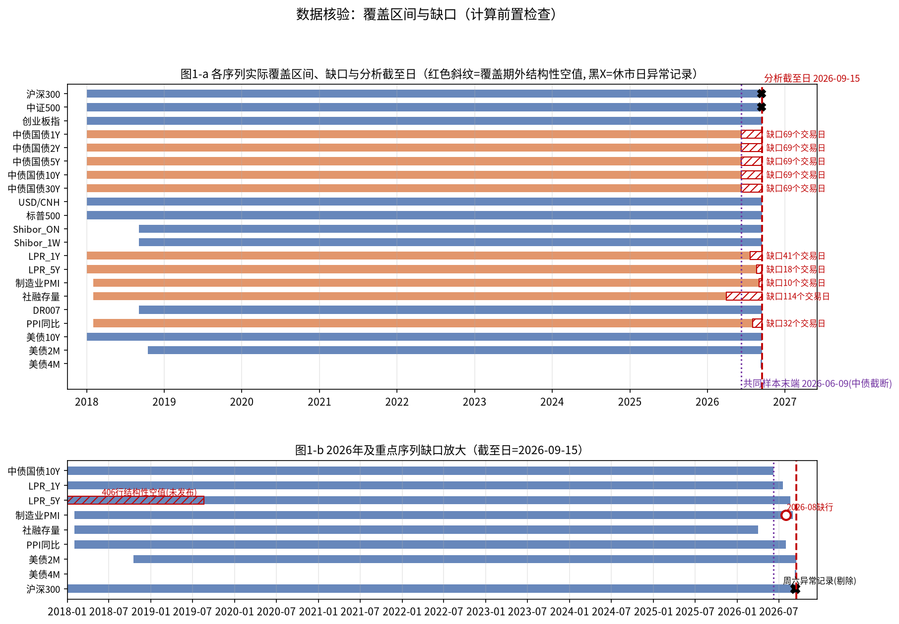
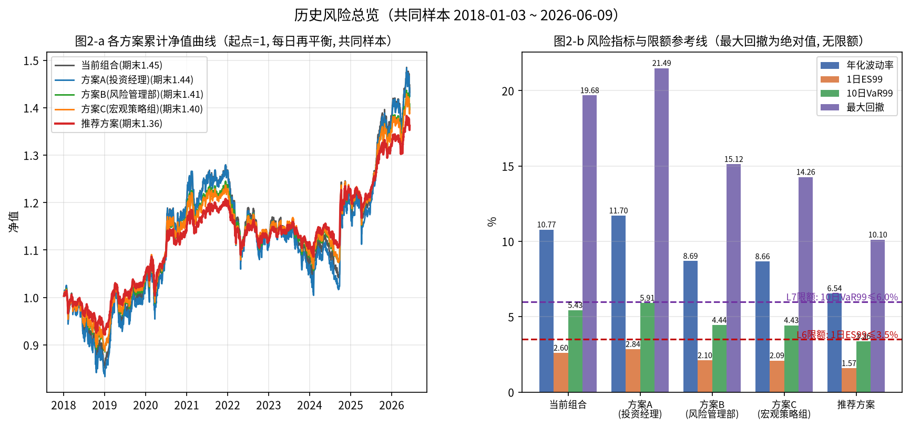
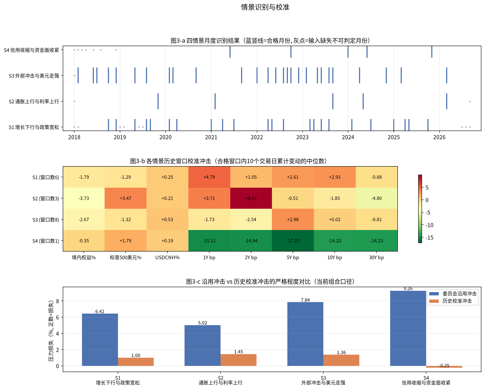
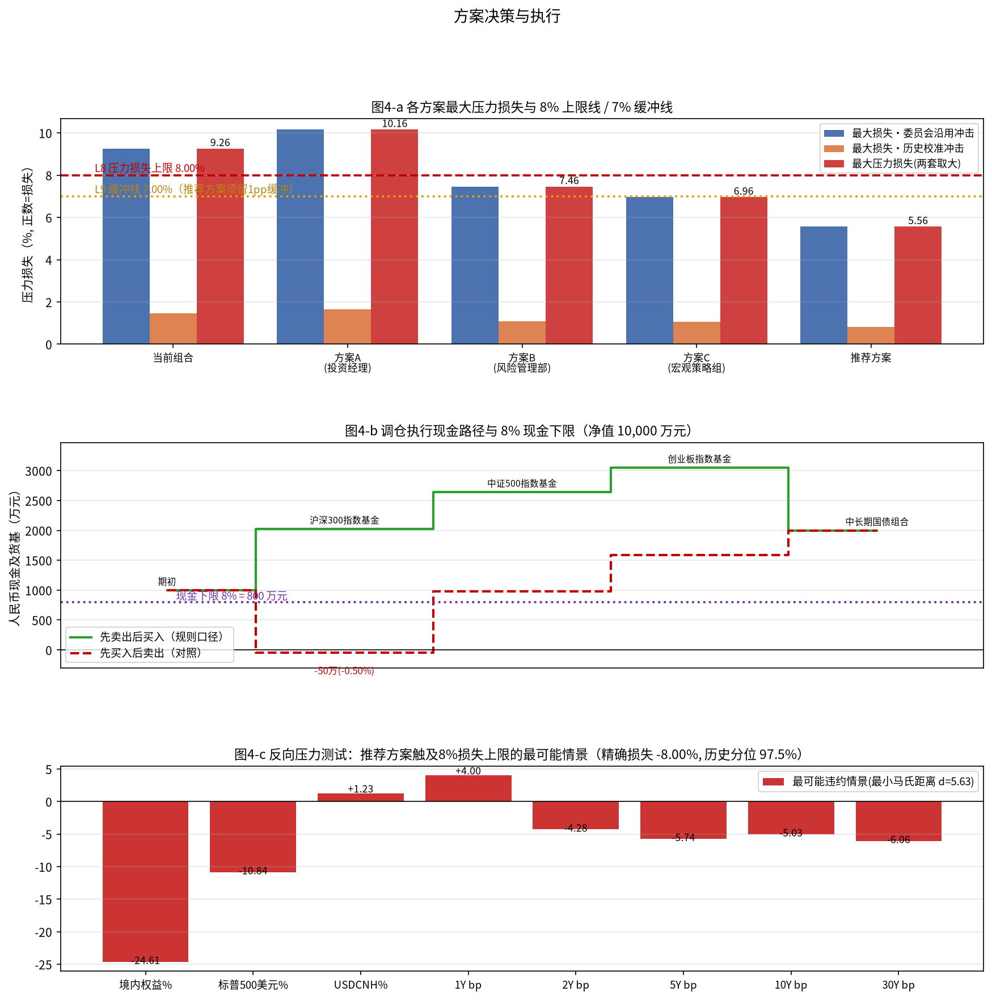
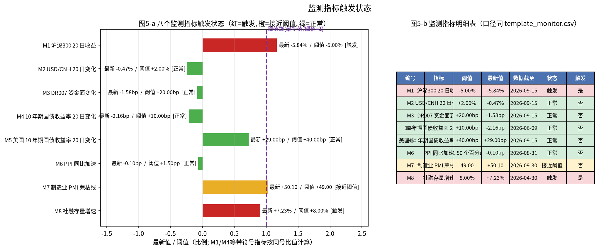

# 多资产稳健配置专户 三季度宏观压力测试与调仓建议
## 风险委员会决策备忘录

分析截至日：2026-09-15（上交所交易日历最后一个交易日）　组合净值：10,000.00 万元
复算脚本：`FIN3-WKN-149_reproduce.py`（全部数字可由该脚本自 `input_files/` 原始快照复算，无硬编码结论）

---

### 一、结论与建议

**处置意见（一句话）：** 当前组合与方案A的最大压力损失（9.26%、10.16%）均击穿8%上限、方案B未留足7%缓冲（7.46%）、方案C外币敞口超限（30.00%），四者均不可作为调仓目标，建议采纳**推荐方案**（境内权益14.75%/8.85%/5.90%、国债30.50%、美元现金10.00%、标普QDII 10.00%、人民币现金20.00%）并按"先卖出后买入"顺序执行。

推荐方案关键指标：最大压力损失 **5.56%**（556.50 万元，来源 S4 信用收缩与资金面收紧／委员会沿用冲击），1日ES99 **1.57%**，10日VaR99 **3.36%**，单向换手率 **20.50%**（卖出2,050.00 万元／净值10,000.00 万元），九项约束检查全部通过，距8%上限裕度2.44个百分点、距7%缓冲线裕度1.44个百分点。

**是否提请临时风险会议：是。** 理由：(1) 监测指标 M1（沪深300 20日收益 −5.84%，阈值 −5.00%）与 M8（社融存量增速 7.23%，阈值 8.00%）已触发、M7（PMI 50.10，阈值 49.00）接近阈值；(2) 当前组合在委员会沿用冲击下最大压力损失9.26%已超限1.26个百分点，属"现状即违规"，不宜等待例会周期；(3) 中债收益率等关键序列截断（详见第二章），需在会议上确认数据补齐后的重判安排。

---

### 二、数据核验与样本区间

**样本区间：** 2018-01-02 ～ 2026-06-09，共 **2044** 个上交所交易日（日收益样本2043个）。**终止原因：** 中债国债收益率五个期限（1Y/2Y/5Y/10Y/30Y）在 2026-06-09 之后无数据（上游截断，距分析截至日69个交易日）；为遵守"空值不得按0参与计算、结构性空值不填充"，组合历史风险样本止于该日。权益、汇率、标普及美债10Y序列覆盖至2026-09-15，继续用于监测指标（M1/M2/M5）与调仓定价基准。

**各序列覆盖与处理（以文件实际内容核验，manifest 一致性全部为真）：**

| 序列 | 覆盖区间 | 行数 | 缺失/截断 | 处理方式 |
|---|---|---|---|---|
| 沪深300 | 2018-01-02~2026-09-15 | 2114 | 含1条休市日异常记录 | 剔除异常记录后使用 |
| 中证500 | 2018-01-02~2026-09-15 | 2114 | 含1条休市日异常记录 | 剔除异常记录后使用 |
| 创业板指 | 2018-01-02~2026-09-15 | 2113 | 无 | 直接使用 |
| 中债国债1Y/2Y/5Y/10Y/30Y | 2018-01-02~2026-06-09 | 各2106 | 截断，距截至日69个交易日 | 截断后为结构性空值，不填充、不按0计；共同样本止于2026-06-09 |
| USD/CNH | 2018-01-02~2026-09-15 | 2174 | 覆盖期内86个上交所交易日无记录 | 仅跨市场休市日错配做前向填充（覆盖期外不填） |
| 标普500 | 2018-01-02~2026-09-15 | 2187 | 覆盖期内73个上交所交易日无记录 | 同上，前向填充 |
| 美债10Y | 2018-01-02~2026-09-15 | 2176 | 覆盖期内84个上交所交易日无记录 | 同上，前向填充 |
| Shibor_ON / Shibor_1W | 2018-09-03~2026-09-15 | 各2000 | 起点晚 | 仅核验，未入收益矩阵 |
| LPR_1Y | 2018-01-02~2026-07-20 | 489 | 距截至日41个交易日 | 发布制序列，按月取发布值；缺失月份按三值逻辑记"不可判定" |
| LPR_5Y | 2018-01-02~2026-08-20 | 491 | 2018-01-02~2019-08-16 共406行结构性空值；距截至日18个交易日 | 结构性空值保留NaN，不填充（5Y LPR 2019-08-20才开始发布） |
| 制造业PMI | 2018-02-01~2026-09-01 | 103 | 2026-08发布行缺行 | 缺行月份按"不可判定"处理，不插值 |
| 社融存量同比 | 2018-02-01~2026-04-01 | 99 | 距截至日114个交易日 | 截断后为结构性空值；M8/S4按其最新可用月判断 |
| DR007 | 2018-09-03~2026-09-15 | 2000 | 起点晚 | 起点前为结构性空值 |
| PPI同比 | 2018-02-01~2026-08-01 | 103 | 距截至日32个交易日 | 截断后为结构性空值 |
| 美债2M | 2018-10-16~2026-09-15 | 1978 | 起点晚 | 仅核验 |
| 美债4M | 2026-09-08~2026-09-15 | 6 | 仅6条 | 仅核验，样本过短不用于任何计算 |

**休市日异常记录识别与剔除：** 沪深300、中证500 各含一条 2026-09-12（周六）记录，三条证据一致判定为异常并剔除：(1) 该日不在上交所交易日历；(2) open=high=low=close=pre_close 全等；(3) 成交额仅为样本中位数的2.38%、1.11%。交叉印证：创业板指同日无该记录（898行 vs 899行）。剔除后 pre_close 与前日 close 不一致条数归零。创业板指 2024-09-30(+15.36%)、2024-10-08(+17.25%)、2025-04-07(−12.50%) 与标普500 2020-03-16 大跌经核验为真实极端行情（在涨跌幅限制内），予以保留。

**对齐口径：** 全部序列对齐至上交所交易日历（2113个交易日）；跨市场休市日错配（USD/CNH 86日、标普500 73日、美债10Y 84日）在覆盖期内前向填充，覆盖期外一律保留结构性空值 NaN；收益矩阵在共同样本内 NaN 计数为0（校验通过）。国债组合日收益按关键期限久期贡献计算：r = −Σ 久期贡献×Δ收益率（小数），贡献 {1y:0.1, 2y:0.3, 5y:1.2, 10y:3.6, 30y:1.8}（合计7.00年），非收益率差值简单加总；标普500人民币收益 = (1+r_SPX美元)×(1+r_USDCNH)−1（复合），非加法近似；美元现金收益=汇率变动，人民币现金收益恒为0。

---

### 三、当前组合风险画像

**当前持仓（2026-09-15 估值，万元）：** 沪深300指数基金 25.00%（2,500.00）、中证500指数基金 15.00%（1,500.00）、创业板指数基金 10.00%（1,000.00）、中长期国债组合 20.00%（2,000.00）、美元现金及存款 10.00%（1,000.00）、标普500 QDII基金 10.00%（1,000.00，不对冲汇率）、人民币现金及货基 10.00%（1,000.00）。

**各资产日收益统计（共同样本，年化因子√252）：**

| 资产 | 年化收益% | 年化波动% | 偏度 | 峰度 | 最差单日% | 最好单日% |
|---|---|---|---|---|---|---|
| 沪深300 | 3.84 | 19.26 | −0.09 | 4.87 | −7.88 | 8.48 |
| 中证500 | 5.66 | 22.37 | −0.27 | 5.83 | −9.55 | 10.41 |
| 创业板 | 14.13 | 29.04 | 0.55 | 8.53 | −12.50 | 17.25 |
| 国债组合 | 1.91 | 2.26 | 0.26 | 5.50 | −0.71 | 1.13 |
| 美元现金 | 0.61 | 4.22 | −0.06 | 4.15 | −1.57 | 1.58 |
| 标普500(美元) | 14.77 | 19.01 | −0.40 | 14.38 | −12.19 | 9.68 |
| 人民币现金 | 0.00 | 0.00 | — | — | 0.00 | 0.00 |

**日收益相关矩阵：** 沪深300/中证500/创业板两两 0.858、0.842、0.873；国债与三只境内权益 −0.232、−0.205、−0.177；美元现金与境内权益 −0.249、−0.185、−0.183；标普500与境内权益约0.11~0.12；人民币现金恒为0，相关系数无定义（记NaN，不参与计算）。

**组合层面（每日再平衡）：** 年化收益4.67%（几何），年化波动 **10.77%**（日波动0.6786%）；1日VaR95 **0.98%**、VaR99 **1.79%**；1日ES95 **1.53%**、ES99 **2.60%**（尾部21天）；10日VaR99 **5.43%**（重叠10日累计收益历史模拟）；10日最大累计损失 **−8.48%**（2020-03-06→2020-03-19）；最大回撤 **−19.68%**（峰2021-12-13、谷2024-02-05、修复2025-08-13）；最差单日 **−4.88%**（2025-04-07）；期末净值1.4477（起点1）。

**风险贡献占比（协方差法）：** 沪深300 42.16%、中证500 29.15%、创业板 24.87%、标普500 5.23%、国债 −0.75%、美元现金 −0.66%、人民币现金 0.00%（境内权益合计96.18%，国债与美元现金为负贡献的对冲腿）。

**五套权重历史风险对比（%）：** 当前组合 波动10.77/ES99 2.60/VaR99_10d 5.43/MDD −19.68；方案A 11.70/2.84/5.91/−21.49；方案B 8.69/2.10/4.44/−15.12；方案C 8.66/2.09/4.43/−14.26；推荐方案 6.54/1.57/3.36/−10.10。

---

### 四、情景识别与历史校准

**月度识别规则（rules_scenarios.csv，三值逻辑：输入缺失记"不可判定"，不视为不满足）：**
- S1 增长下行与政策宽松：PMI月值<50 且（1Y或5Y LPR当月下调），或 PMI较上月下行≥0.5 且 10Y国债月均值低于上月；
- S2 通胀上行与利率上行：PPI同比高于上月 且 10Y国债月均值高于上月 且 权益指数当月下跌（以沪深300为代表）；
- S3 外部冲击与美元走强：标普500当月收益≤−3% 或 USD/CNH当月变化≥+1.5%（月度序列按百分数比较）；
- S4 信用收缩与资金面收紧：社融存量同比低于上月 且 DR007月均值高于上月 且 权益指数当月下跌。

**合格月份（全部列示）：**
- S1（23个，可判定96个月，不可判定9个月：2018-01、2018-02、2019-01、2019-02、2019-06、2019-07、2026-07、2026-08、2026-09）：2018-10、2018-12、2019-05、2019-08、2019-09、2020-02、2020-04、2021-01、2021-04、2021-07、2022-04、2022-05、2022-08、2023-03、2023-04、2023-06、2023-08、2024-02、2024-07、2025-01、2025-04、2025-05、2025-10；
- S2（5个，不可判定2个月：2018-01、2026-09）：2019-11、2021-02、2023-09、2024-05、2026-03；
- S3（27个，不可判定1个月：2018-01）：2018-02、2018-06、2018-07、2018-10、2018-12、2019-05、2019-08、2020-02、2020-03、2020-09、2021-09、2022-01、2022-04、2022-06、2022-08、2022-09、2022-10、2022-12、2023-02、2023-05、2023-06、2023-08、2023-09、2024-04、2024-11、2025-03、2026-03；
- S4（5个，不可判定7个月：2018-01~2018-04、2018-06、2018-08、2018-12）：2021-06、2022-10、2024-01、2024-06、2025-11。

**历史窗口（合格月次月第一个上交所交易日起10个交易日；窗口内参照组合累计收益为负即合格；参照组合=当前组合）：**
- S1：候选23个→合格**6个**：2024-08-01~08-14（−2.65%）、2020-03-02~03-13（−1.02%）、2022-09-01~09-15（−0.87%）、2023-09-01~09-14（−0.77%）、2025-11-03~11-14（−0.71%）、2023-05-04~05-17（−0.53%）；
- S2：候选5个→合格**3个**：2023-10-09~10-20（−2.65%）、2021-03-01~03-12（−1.25%）、2024-06-03~06-17（−0.13%）；
- S3：候选27个→合格**8个**：2023-10-09~10-20（−2.65%）、2025-04-01~04-15（−2.16%）、2023-03-01~03-14（−1.52%）、2018-08-01~08-14（−1.50%）、2020-03-02~03-13（−1.02%）、2022-07-01~07-14（−1.01%）、2022-09-01~09-15（−0.87%）、2023-09-01~09-14（−0.77%）；
- S4：候选5个→合格**1个**：2021-07-01~07-14（−0.00%）。

**校准冲击（合格窗口因子累计变动中位数）：**

| 情景 | 境内权益 | 标普500(美元) | USD/CNH | 国债 1Y/2Y/5Y/10Y/30Y (bp) |
|---|---|---|---|---|
| S1 | −1.79% | −1.29% | +0.25% | +4.79 / +1.05 / +2.61 / +2.93 / −0.88 |
| S2 | −3.73% | +3.47% | +0.21% | +3.71 / +9.97 / −0.51 / −1.85 / −4.80 |
| S3 | −2.67% | −1.32% | +0.53% | −1.73 / −2.54 / +2.98 / +0.02 / −0.81 |
| S4 | −0.35% | +1.79% | +0.19% | −15.11 / −14.94 / −17.20 / −14.22 / −14.23 |

**委员会沿用冲击（params_committee_shocks.csv）：** S1 权益−12.00%/标普−8.00%/汇率+2.00%/国债 +0.10/+0.12/+0.10/+0.20/+0.25 bp；S2 −10.00%/−6.00%/+3.00%/ +0.60/+0.50/+0.30/−0.15/−0.30 bp；S3 −15.00%/−18.00%/+8.00%/ −0.30/−0.25/−0.10/+0.10/+0.20 bp；S4 −18.00%/−12.00%/+5.00%/ +0.80/+0.60/+0.45/−0.45/−0.50 bp。字段名为 `cgb_shock_bp`，主口径按 bp 字面解释（国债腿影响≤0.005个百分点，可忽略）；若改按"百分点"解释（×100），各方案国债腿变为 −0.41~+0.53 个百分点量级、推荐方案最大压力损失由5.56%降为5.05%，九项约束通过/不通过结论完全不变（见 reproduce.py 6.4 节敏感性）。

**严格程度与曲线形态差异：** 以当前组合口径的组合损失计，四个情景均为委员会沿用更严：S1 −6.42% vs −1.00%、S2 −5.02% vs −1.45%、S3 −7.84% vs −1.36%、S4 −9.26% vs +0.25%。原因：委员会权益/标普/汇率冲击为校准中位数的3~50倍；形态上委员会国债冲击几乎为零（≤1bp 量级、S2/S4 略呈"短升长降"的牛陡倾向），而校准冲击由历史窗口内生——S4 校准为 −14~−17bp 的近似平行大幅下行（信用收缩期债牛），S2 校准为"短端+9.97bp、长端−4.80bp"的熊陡扭转，S1 为短端+4.79bp 的温和熊平；故 S4 校准冲击下组合甚至小幅盈利（国债腿+0.21~0.32个百分点主导）。

**参照组合敏感性（披露）：** 窗口合格性以参照组合累计收益为负判定。改用方案B/C/推荐方案为参照时，S2 合格窗口少1个（2024-06-03 不合格）、S4 合格窗口为0个（2021-07-01 不合格，即该情景无历史校准窗口、校准冲击按0计并如实报告）；推荐方案参照下 S3 多1个（2022-02-07）。主口径以当前组合为参照（规则文本未指定参照，取"调仓前现状"最保守且可复算）。另若"权益指数"改用三只境内指数等权，S2 合格月份由5个增至8个、S4 不变（5个）。

---

### 五、压力测试结果

**完整压力矩阵（占净值%，括号内为万元；四腿之和=合计，逐项校验通过）：**

| 方案 | 情景 | 冲击 | 境内权益 | 标普500(人民币) | 美元现金 | 国债 | 合计 |
|---|---|---|---|---|---|---|---|
| 当前组合 | S1 | 委员会 | −6.00 (−600.0) | −0.62 (−61.6) | +0.20 (+20.0) | −0.003 | −6.42 (−641.9) |
| 当前组合 | S1 | 校准 | −0.90 (−89.7) | −0.10 (−10.4) | +0.03 (+2.5) | −0.026 | −1.00 (−100.1) |
| 当前组合 | S2 | 委员会 | −5.00 (−500.0) | −0.32 (−31.8) | +0.30 (+30.0) | +0.001 | −5.02 (−501.7) |
| 当前组合 | S2 | 校准 | −1.87 (−186.6) | +0.37 (+36.8) | +0.02 (+2.1) | +0.025 | −1.45 (−145.2) |
| 当前组合 | S3 | 委员会 | −7.50 (−750.0) | −1.14 (−114.4) | +0.80 (+80.0) | −0.001 | −7.84 (−784.5) |
| 当前组合 | S3 | 校准 | −1.33 (−133.3) | −0.08 (−7.9) | +0.05 (+5.3) | −0.002 | −1.36 (−136.2) |
| 当前组合 | S4 | 委员会 | −9.00 (−900.0) | −0.76 (−76.0) | +0.50 (+50.0) | +0.003 | −9.26 (−925.7) |
| 当前组合 | S4 | 校准 | −0.17 (−17.3) | +0.20 (+19.8) | +0.02 (+1.9) | +0.207 | +0.25 (+25.1) |
| 方案A | S1 | 委员会 | −6.60 (−660.0) | −0.62 (−61.6) | +0.20 (+20.0) | −0.002 | −7.02 (−701.8) |
| 方案A | S1 | 校准 | −0.99 (−98.7) | −0.10 (−10.4) | +0.03 (+2.5) | −0.019 | −1.08 (−108.4) |
| 方案A | S2 | 委员会 | −5.50 (−550.0) | −0.32 (−31.8) | +0.30 (+30.0) | +0.001 | −5.52 (−551.7) |
| 方案A | S2 | 校准 | −2.05 (−205.3) | +0.37 (+36.8) | +0.02 (+2.1) | +0.019 | −1.64 (−164.4) |
| 方案A | S3 | 委员会 | −8.25 (−825.0) | −1.14 (−114.4) | +0.80 (+80.0) | −0.001 | −8.59 (−859.5) |
| 方案A | S3 | 校准 | −1.47 (−146.7) | −0.08 (−7.9) | +0.05 (+5.3) | −0.002 | −1.49 (−149.5) |
| 方案A | S4 | 委员会 | −9.90 (−990.0) | −0.76 (−76.0) | +0.50 (+50.0) | +0.003 | −10.16 (−1015.7) |
| 方案A | S4 | 校准 | −0.19 (−19.0) | +0.20 (+19.8) | +0.02 (+1.9) | +0.155 | +0.18 (+18.2) |
| 方案B | S1 | 委员会 | −4.80 (−480.0) | −0.62 (−61.6) | +0.20 (+20.0) | −0.003 | −5.22 (−521.9) |
| 方案B | S1 | 校准 | −0.72 (−71.8) | −0.10 (−10.4) | +0.03 (+2.5) | −0.032 | −0.83 (−82.8) |
| 方案B | S2 | 委员会 | −4.00 (−400.0) | −0.32 (−31.8) | +0.30 (+30.0) | +0.001 | −4.02 (−401.7) |
| 方案B | S2 | 校准 | −1.49 (−149.3) | +0.37 (+36.8) | +0.02 (+2.1) | +0.031 | −1.07 (−107.2) |
| 方案B | S3 | 委员会 | −6.00 (−600.0) | −1.14 (−114.4) | +0.80 (+80.0) | −0.001 | −6.35 (−634.5) |
| 方案B | S3 | 校准 | −1.07 (−106.7) | −0.08 (−7.9) | +0.05 (+5.3) | −0.003 | −1.10 (−109.6) |
| 方案B | S4 | 委员会 | −7.20 (−720.0) | −0.76 (−76.0) | +0.50 (+50.0) | +0.004 | −7.46 (−745.6) |
| 方案B | S4 | 校准 | −0.14 (−13.8) | +0.20 (+19.8) | +0.02 (+1.9) | +0.259 | +0.34 (+33.7) |
| 方案C | S1 | 委员会 | −4.80 (−480.0) | −0.62 (−61.6) | +0.40 (+40.0) | −0.002 | −5.02 (−501.8) |
| 方案C | S1 | 校准 | −0.72 (−71.8) | −0.10 (−10.4) | +0.05 (+5.1) | −0.023 | −0.79 (−79.4) |
| 方案C | S2 | 委员会 | −4.00 (−400.0) | −0.32 (−31.8) | +0.60 (+60.0) | +0.001 | −3.72 (−371.7) |
| 方案C | S2 | 校准 | −1.49 (−149.3) | +0.37 (+36.8) | +0.04 (+4.2) | +0.023 | −1.06 (−106.0) |
| 方案C | S3 | 委员会 | −6.00 (−600.0) | −1.14 (−114.4) | +1.60 (+160.0) | −0.001 | −5.54 (−554.5) |
| 方案C | S3 | 校准 | −1.07 (−106.7) | −0.08 (−7.9) | +0.11 (+10.6) | −0.002 | −1.04 (−104.2) |
| 方案C | S4 | 委员会 | −7.20 (−720.0) | −0.76 (−76.0) | +1.00 (+100.0) | +0.003 | −6.96 (−695.7) |
| 方案C | S4 | 校准 | −0.14 (−13.8) | +0.20 (+19.8) | +0.04 (+3.8) | +0.186 | +0.28 (+28.3) |
| 推荐方案 | S1 | 委员会 | −3.54 (−354.0) | −0.62 (−61.6) | +0.20 (+20.0) | −0.004 | −3.96 (−396.0) |
| 推荐方案 | S1 | 校准 | −0.53 (−52.9) | −0.10 (−10.4) | +0.03 (+2.5) | −0.039 | −0.65 (−64.7) |
| 推荐方案 | S2 | 委员会 | −2.95 (−295.0) | −0.32 (−31.8) | +0.30 (+30.0) | +0.002 | −2.97 (−296.6) |
| 推荐方案 | S2 | 校准 | −1.10 (−110.1) | +0.37 (+36.8) | +0.02 (+2.1) | +0.038 | −0.67 (−67.3) |
| 推荐方案 | S3 | 委员会 | −4.42 (−442.5) | −1.14 (−114.4) | +0.80 (+80.0) | −0.002 | −4.77 (−477.1) |
| 推荐方案 | S3 | 校准 | −0.79 (−78.7) | −0.08 (−7.9) | +0.05 (+5.3) | −0.004 | −0.82 (−81.7) |
| 推荐方案 | S4 | 委员会 | −5.31 (−531.0) | −0.76 (−76.0) | +0.50 (+50.0) | +0.005 | −5.56 (−556.5) |
| 推荐方案 | S4 | 校准 | −0.10 (−10.2) | +0.20 (+19.8) | +0.02 (+1.9) | +0.315 | +0.43 (+43.0) |

**各方案最大压力损失及来源：** 当前组合 9.26%（925.7 万元）、方案A 10.16%（1,015.7 万元）、方案B 7.46%（745.6 万元）、方案C 6.96%（695.7 万元）、推荐方案 5.56%（556.5 万元）——**全部来源于 S4 信用收缩与资金面收紧／委员会沿用冲击**（该情景权益−18.00%为四情景之最）。

**两套冲击严格程度比较：** 四情景均为委员会沿用更严（见第四章数字）。原因分析：(1) 委员会冲击为外生设定的"监管审慎"量级，权益腿占组合损失93%以上；(2) 历史校准为合格窗口中位数，S1/S3 的合格窗口跌幅中位数仅−1.79%/−2.67%，且汇率腿为正贡献（+0.25%/+0.53%）部分对冲；(3) S4 校准窗口（2021-07）国债收益率大幅下行−14~−17bp，国债腿正贡献+0.21~0.32个百分点，超过权益腿的−0.10~−0.19个百分点，使校准口径下 S4 组合反而小幅盈利——该情景的"信用收缩+资金紧"历史样本中债牛特征明显，与委员会"股债双杀"式设定方向不同，委员会口径更保守，主结论以委员会口径为准、校准口径作参照。

---

### 六、候选方案评估与九项约束检查

**九项约束逐条结果（√通过／×未通过，括号内为数值与超限幅度）：**

| 检查 | 口径 | 当前组合 | 方案A | 方案B | 方案C | 推荐方案 |
|---|---|---|---|---|---|---|
| C1 | 权重合计=100% | √ 100.00% | √ 100.00% | √ 100.00% | √ 100.00% | √ 100.00% |
| C2 | 权益合计≤60% | √ 50.00% | √ 55.00% | √ 40.00% | √ 40.00% | √ 29.50% |
| C3 | 人民币现金∈[8%,20%] | √ 10.00% | √ 10.00% | √ 15.00% | √ 12.00% | √ 20.00% |
| C4 | 国债≥15% | √ 20.00% | √ 15.00% | √ 25.00% | √ 18.00% | √ 30.50% |
| C5 | 外币敞口≤25% | √ 20.00% | √ 20.00% | √ 20.00% | × 30.00%（超5.00pp） | √ 20.00% |
| C6 | 1日ES99≤3.5% | √ 2.60% | √ 2.84% | √ 2.10% | √ 2.09% | √ 1.57% |
| C7 | 10日VaR99≤6.0% | √ 5.43% | √ 5.91% | √ 4.44% | √ 4.43% | √ 3.36% |
| C8 | 最大压力损失≤8.0% | × 9.26%（超1.26pp） | × 10.16%（超2.16pp） | √ 7.46% | √ 6.96% | √ 5.56% |
| C9 | 最大压力损失≤7.0%（推荐须留1pp缓冲） | × 9.26%（超2.26pp） | × 10.16%（超3.16pp） | × 7.46%（超0.46pp） | √ 6.96% | √ 5.56% |

**未通过项汇总：** 当前组合 C8、C9；方案A C8、C9；方案B C9；方案C C5；推荐方案无。**结论：三个候选方案均不可直接采纳**（A 放大权益风险、B 缓冲不足、C 外币敞口超限），需按 recommendation_rule 构造推荐方案。

**外币敞口口径（C5）：** 按 params_limits L5，外币敞口 = 美元现金及存款 + 不对冲汇率的标普500 QDII。各方案：当前/A/B/推荐 = 10.00%+10.00% = 20.00%，方案C = 20.00%+10.00% = 30.00%（超限）。**若漏计 QDII，方案C 将被误报为20.00%而"通过"，其余方案误报为10.00%**——本备忘录已将 QDII 全额计入，不存在漏计/误计。

---

### 七、推荐方案与调仓执行

**推荐方案完整权重：** 沪深300 14.75%（1,475.00 万元）、中证500 8.85%（885.00 万元）、创业板 5.90%（590.00 万元）、中长期国债 30.50%（3,050.00 万元）、美元现金 10.00%（1,000.00 万元）、标普QDII 10.00%（1,000.00 万元）、人民币现金及货基 20.00%（2,000.00 万元）。

**构造依据（rules_rebalance.recommendation_rule）：** 美元现金与标普QDII权重不变（各10%）；境内权益按当前权重同比例缩减，合计减配20.50个百分点（缩减系数0.5900：25→14.75、15→8.85、10→5.90）；释放资金中10.50个百分点入国债（20→30.50）、10.00个百分点入人民币现金（10→20.00，恰为C3上限）。

**唯一性说明（网格搜索：美元/标普固定10%，权益同比例系数 k∈[0.30,1.00] 步长0.005，释放资金在国债/现金间以0.5pp步长分配，共2,541个组合，其中1,890个九项全过）：**
1. 推荐方案是 recommendation_rule 构造约束下的**唯一解**（规则完全确定 k=0.590 与国债+10.5pp/现金+10pp，无自由度）；
2. 全局最小换手率的全过组合为 k=0.745（国债32.70%/现金10.00%，换手12.75%），但其最大压力损失6.96%距7%缓冲线仅**0.04pp**，冲击估计稍有偏差即穿破缓冲线，稳健性不足，不构成更优选择；推荐方案裕度1.44pp；
3. 与推荐方案同换手率（20.50%，k=0.590）的全过组合共21个（现金腿10.0%~20.0%、国债腿40.5%~30.5%）：其中国债40.5%/现金10.0%的组合 ES99 1.55%、VaR99_10d 3.30% 略优于推荐方案（1.57%、3.36%，最大压力损失同为5.56%），但现金腿低于C3上限、牺牲流动性缓冲；**推荐方案是21个中唯一将人民币现金置于C3上限20.00%的组合**，与规则的流动性意图一致。综上，在"规则构造+九项全过+现金上限"三重约束下推荐方案唯一。

**交易清单（按 2026-09-15 估值，万元）：**

| 资产 | 方向 | 金额 | 当前市值 | 目标市值 |
|---|---|---|---|---|
| 沪深300指数基金 | 卖出 | 1,025.00 | 2,500.00 | 1,475.00 |
| 中证500指数基金 | 卖出 | 615.00 | 1,500.00 | 885.00 |
| 创业板指数基金 | 卖出 | 410.00 | 1,000.00 | 590.00 |
| 中长期国债组合 | 买入 | 1,050.00 | 2,000.00 | 3,050.00 |
| 人民币现金及货基 | 留存（非交易指令） | 1,000.00 | 1,000.00 | 2,000.00 |

卖出合计2,050.00 万元 = 买入合计2,050.00 万元；单向换手率 = 2,050.00/10,000.00 = **20.50%**。人民币现金+1,000.00 万元为卖出资金留存货基，不产生证券买卖指令；标普QDII 无交易，**T+7 赎回款到账规则不触发**。

**执行顺序与现金下限（8% = 800.00 万元）检验：**
- **先卖出后买入（规则口径，可执行）：** 期初1,000.00（10.00%）→ 卖沪深300后2,025.00（20.25%）→ 卖中证500后2,640.00（26.40%）→ 卖创业板后3,050.00（30.50%）→ 买国债1,050.00后2,000.00（20.00%）。全程≥8%，**可执行**。
- **先买入后卖出（对照，不可执行）：** 期初1,000.00（10.00%）→ 先买国债1,050.00后现金 −50.00（−0.50%），**击穿8%下限**，不可执行。
- **执行顺序结论：必须按"卖出三只境内权益基金→买入国债组合（现金留存自动到位）"的顺序执行。**

---

### 八、反向压力测试与监测预警

**最大损失情景裕度与放大倍数：** 推荐方案最大压力损失5.56%（S4/委员会沿用），距8%上限裕度**2.44pp**、距7%缓冲线裕度**1.44pp**；将该情景冲击等比放大 **1.431倍**（精确解，含标普×汇率交叉项；线性近似1.438倍）方触及8%上限。

**样本内最差10日累计损失：** −5.73%（2020-03-06→2020-03-19）；最大回撤−10.10%（峰2021-12-13、谷2024-02-05、修复2024-10-08）。

**反向压力测试（约束：8因子10日累计变动使推荐方案精确损失=−8.00%；目标函数：最小马氏距离 x'Σ⁻¹x，Σ 为2,034个历史10日重叠窗口样本协方差，条件数5.07e+06 用伪逆）：** 最可能违约情景 x* = 境内权益 **−24.61%**、标普500美元 **−10.84%**、USD/CNH **+1.23%**、国债 1Y **+4.00bp**、2Y **−4.28bp**、5Y **−5.74bp**、10Y **−5.03bp**、30Y **−6.06bp**；精确组合损失 −8.00%，最小马氏距离 **d=5.625**（线性闭式解 d=5.634，差异来自交叉项非线性）。解读：触及8%上限需要"境内权益10日跌约四分之一"级别的联合冲击，位于历史10日窗口马氏距离分布的**97.5%分位**（历史分布：中位2.359、P90 4.116、P99 6.691、最大11.133），即2,034个历史10日窗口中仅约2.5%（约51个）的联合极端程度不低于该情景。

**各冲击向量马氏距离对比：** 委员会沿用 S1 3.397（81.4%分位）、S2 3.711（86.3%）、S3 9.489（100.0%）、S4 6.389（98.7%）；历史校准 S1 1.315（8.3%）、S2 2.835（67.4%）、S3 1.455（12.1%）、S4 2.286（46.8%）。委员会 S3/S4 冲击显著超出历史联合分布范围（>P99），属"超历史"审慎设定；反向压力最可能情景（5.625）介于两者之间，说明8%上限在推荐方案下仅在超历史冲击下才会触及。

**八个监测指标（截至日状态）：**

| 指标 | 阈值 | 方向 | 最新值 | 数据截至 | 状态 | 触发 |
|---|---|---|---|---|---|---|
| M1 沪深300 20日收益 | −5.00% | 低于阈值触发 | −5.84% | 2026-09-15 | **触发** | 是 |
| M2 USD/CNH 20日变化 | +2.00% | 高于阈值触发 | −0.47% | 2026-09-15 | 正常 | 否 |
| M3 DR007 资金面变化 | +20.00bp | 高于阈值触发 | −1.58bp | 2026-09-15 | 正常 | 否 |
| M4 10Y国债 20日变化 | +10.00bp | 高于阈值触发 | −2.16bp | 2026-06-09（受截断影响） | 正常 | 否 |
| M5 美债10Y 20日变化 | +40.00bp | 高于阈值触发 | +29.00bp | 2026-09-15 | 正常 | 否 |
| M6 PPI 同比加速 | +1.50pp | 高于阈值触发 | −0.10pp | 2026-08-31 | 正常 | 否 |
| M7 制造业PMI 荣枯线 | 49.00 | 低于阈值触发 | +50.10 | 2026-09-30（2026-08发布行缺） | **接近阈值** | 否 |
| M8 社融存量增速 | 8.00% | 低于阈值触发 | +7.23% | 2026-04-30 | **触发** | 是 |

（"接近阈值"判定为方向感知：未触发但处于安全侧且距阈值不超过|阈值|的20%；M7 的50.10距49.00仅1.10，落入该带。）

**补齐数据后的重新判断安排：** 中债国债收益率（止于2026-06-09）、制造业PMI（2026-08缺行）、社融存量（止于2026-04-01）、LPR_1Y（止于2026-07-20）补齐后 **T+1 个工作日内重跑 `FIN3-WKN-149_reproduce.py`**，复核：M4/M6/M7/M8 状态、S1/S2/S4 情景合格月份与历史校准冲击、S4 校准窗口（当前仅1个，样本敏感性高）、以及全部方案的 C6/C7/C8/C9 结论；若重判后推荐方案最大压力损失超过7%缓冲线，则提请委员会重新审议配置。

---

### 附件：图表清单

> 说明：任务交付清单规定图表为下列5个PNG文件（文件名逐字一致）；模板"不少于10张PNG"的要求由5张多面板图共**12个面板**覆盖数据核验、历史风险、情景识别与校准、方案决策、调仓执行、反向压力测试、监测触发七类内容予以满足，涉及限额的图均已画限额参考线。

图1：各序列覆盖区间（图1-a）与2026年数据缺口排序（图1-b），标出截断序列与休市日异常记录，对应第二章数据核验。

图2：五套权重的每日再平衡净值曲线（图2-a）与年化波动/ES99_1d/VaR99_10d/最大回撤对比及3.5%、6%限额参考线（图2-b），对应第三章风险画像。

图3：四情景月度识别结果（图3-a）、合格窗口校准冲击热图（图3-b）、委员会沿用与历史校准冲击的严格程度对比（图3-c），对应第四章。

图4：各方案最大压力损失与8%上限/7%缓冲线（图4-a）、调仓现金路径与8%下限（800万元，图4-b）、反向压力测试最可能情景因子变动（图4-c），对应第五、七、八章。

图5：八项监测指标的归一化触发状态子弹图（图5-a，红=触发、黄=接近阈值、绿=正常）与按 template_monitor.csv 模板生成的状态表（图5-b），对应第八章。

**可复算代码：** `FIN3-WKN-149_reproduce.py`——自 `input_files/` 原始快照读入，全部数字、表格与上述5张图由其一次运行生成，无任何硬编码结论值；对 `input_files/` 只读不改。
